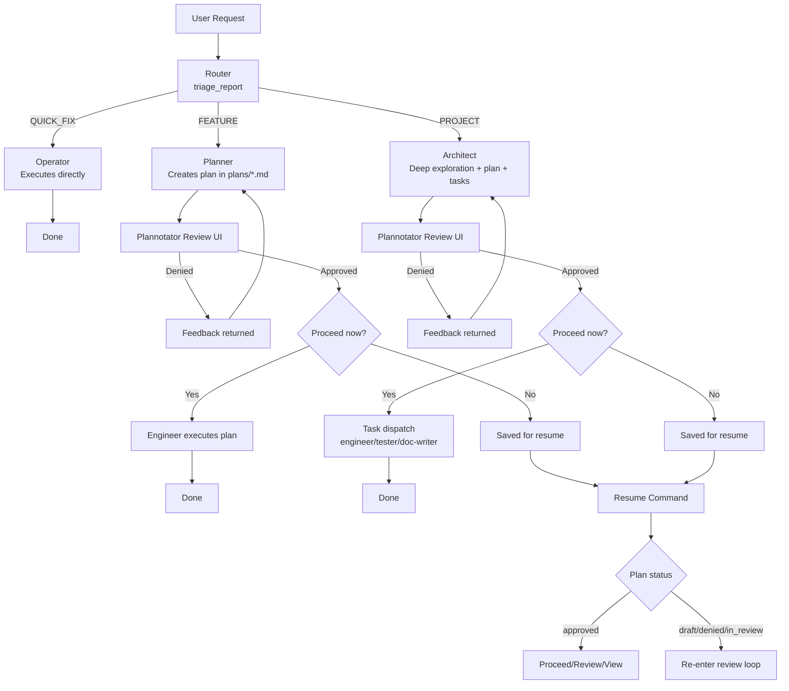

<p align="center"></p>

**Harns** is an opinionated, **plan-by-default coding harness** built on top of Pi agents.

It routes incoming requests through triage, creates reviewable plans for non-trivial work, runs an interactive
Plannotator approval loop, and then executes approved work with specialized agents.

## Why Harns

- **Plan-first by default** for medium/large requests
- **Explicit triage** (`QUICK_FIX`, `FEATURE`, `PROJECT`)
- **Human-in-the-loop review** before execution
- **Multi-agent execution** for project-scale plans
- **Resume support** for saved/paused plans

---

## High-Level Flow



---

## Agent Catalog

Bundled agent definitions live in [`src/agent-definitions/`](src/agent-definitions/).

| Agent      | Purpose                                                              | Prompt                                               |
| ---------- | -------------------------------------------------------------------- | ---------------------------------------------------- |
| Router     | Classifies incoming requests and emits structured triage data.       | [router.md](src/agent-definitions/router.md)         |
| Operator   | Executes small, low-risk `QUICK_FIX` tasks directly.                 | [operator.md](src/agent-definitions/operator.md)     |
| Planner    | Produces iterative, execution-ready plans for `FEATURE` requests.    | [planner.md](src/agent-definitions/planner.md)       |
| Architect  | Produces deeper, project-scale plans (including task decomposition). | [architect.md](src/agent-definitions/architect.md)   |
| Engineer   | Implements approved plans or assigned tasks in code.                 | [engineer.md](src/agent-definitions/engineer.md)     |
| Tester     | Writes/updates tests for approved changes.                           | [tester.md](src/agent-definitions/tester.md)         |
| Doc Writer | Creates or updates technical documentation artifacts.                | [doc-writer.md](src/agent-definitions/doc-writer.md) |

### Agent Overrides (`.hns/agents`)

You can override bundled agent definitions with markdown files in:

- Home: `~/.hns/agents/<agent>.md`
- Project-local: `<repo>/.hns/agents/<agent>.md`

Precedence (highest to lowest):

1. Local (`<repo>/.hns/agents`)
2. Home (`~/.hns/agents`)
3. Bundled (`src/agent-definitions`)

Merge behavior:

- Frontmatter scalar fields (`name`, `model`, `description`, etc.) override by precedence.
- `tools` arrays are merged (union + dedupe), so higher layers can add tools without removing defaults.
- Prompt body appends by default across layers.
- If a layer sets `promptOverride: true`, lower-layer prompt content is discarded and replaced from that layer onward.

---

## Runtime & Dependencies

- End-user runtime: **Standalone `har` binary** (no Deno required)
- Contributor/dev runtime: **Deno**
- Core libraries:
  - `@mariozechner/pi-coding-agent`
  - `@mariozechner/pi-ai`
  - `@mariozechner/pi-agent-core`
- Plan review integration:
  - `@gandazgul/plannotator-pi-extension-compiled` (npm package)
- Memory layer:
  - **Mnemosyne** (integrated persistent memory)

---

## Installation

### macOS / Linux (recommended)

```bash
curl -fsSL https://raw.githubusercontent.com/<owner>/harns/main/install.sh | bash
```

If your fork/repo name differs, set `HAR_REPO`:

```bash
curl -fsSL https://raw.githubusercontent.com/<owner>/<repo>/main/install.sh | HAR_REPO=<owner>/<repo> bash
```

Then verify:

```bash
har --help
```

### Source-run (contributors)

1. Install Deno: https://docs.deno.com/runtime/getting_started/installation/

2. Cache deps:

```bash
deno cache src/cli.js
```

3. Run from source:

```bash
deno run -A src/cli.js --help
```

---

## Usage

### Run a new request (default router command)

```bash
har "your request here"
```

Equivalent explicit form:

```bash
har router "your request here"
```

Examples:

```bash
har "fix typo in README"
har router "add JWT auth to API"
har "refactor data layer and add migration plan"
```

### Show help

```bash
har --help
har help
har help resume
har resume --help
```

### Resume a saved plan

By plan name:

```bash
har resume integrate-mnemosyne
```

By path:

```bash
har resume plans/integrate-mnemosyne.md
```

### List saved plans

```bash
har plans
```

### Optimize memory

```bash
har sleep
```

---

## Deno Tasks

Defined in [`deno.json`](deno.json):

```bash
deno task cli "your request"
deno task resume <plan-name>
deno task check
deno task compile
```

---

## Plan Files & Status

Plans are stored in [`plans/`](plans/) as markdown files with YAML front matter.

Common statuses:

- `draft`
- `in_review`
- `approved`
- `denied`

Harns updates these statuses during the review loop and resume flow.

---

## Project Structure

```text
.
├── .hns/agents/             # Optional project-local agent overrides
├── plans/                   # Generated/saved plan files
├── src/
│   ├── agent-definitions/   # Bundled default agent markdown definitions
│   ├── cli.js               # CLI entrypoint + command dispatch
│   ├── constants.js         # Shared CLI/runtime constants
│   ├── cmd/
│   │   ├── registry.js      # Command registry
│   │   ├── _shared/         # Shared command/workflow helpers
│   │   ├── help/            # Global/per-command help command
│   │   ├── plans/           # List plans command
│   │   ├── resume/          # Resume command
│   │   └── router/          # Default request routing command
│   ├── plan-store.js        # Plan persistence/front matter utilities
│   └── tools/
│       ├── triage-report.js # Router structured triage tool
│       └── submit-plan.js   # In-process Plannotator review integration
├── deno.json
└── README.md
```

---

## Troubleshooting

### Plan review UI does not open

- Confirm `src/tools/submit-plan.js` can resolve:
  - `@gandazgul/plannotator-pi-extension-compiled/server`
  - `@gandazgul/plannotator-pi-extension-compiled/assets`
- Verify you are on a version where the package exports `plannotatorHtml`.

### Resume can’t find your plan

- Use `har plans` to list available plan names.
- Use `plans/<name>.md` path form if needed.
- Don’t prefix with `@plans/...`; use `plans/...`.

### Agent behavior looks off

- Installed binaries use bundled defaults from `src/agent-definitions/`.
- Check for overrides in `~/.hns/agents/` and `<repo>/.hns/agents/`.
- For source runs, inspect/edit the relevant bundled prompt in `src/agent-definitions/` (or provide an override) and
  re-run.

---

## Contributing

1. Create a branch
2. Make focused changes
3. Run:

```bash
deno task check
```

4. Open a PR with:
   - summary
   - affected flow (`QUICK_FIX`/`FEATURE`/`PROJECT`)
   - test/verification notes

---

## License

Add your license here (e.g. MIT) if/when this repository is public.
