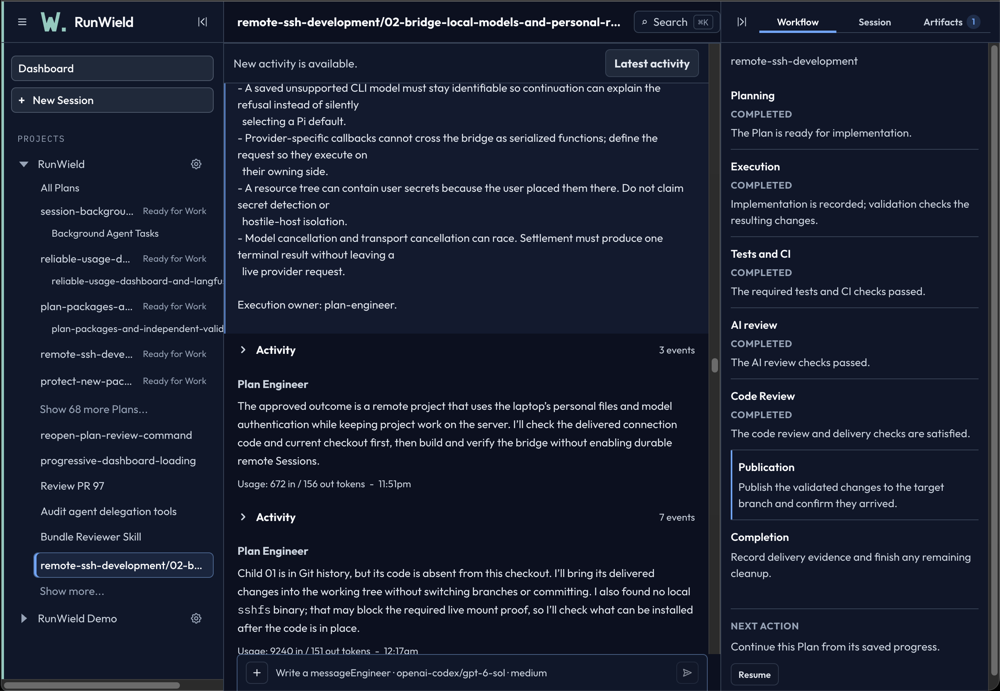
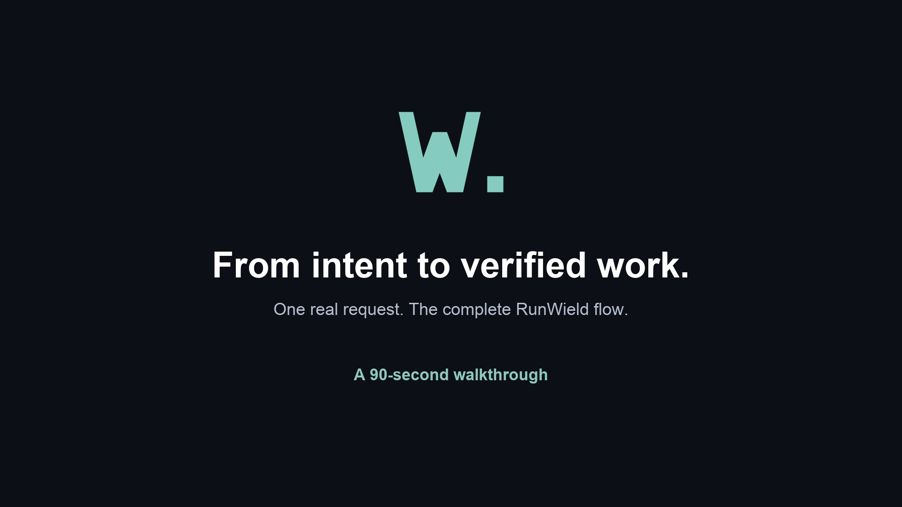
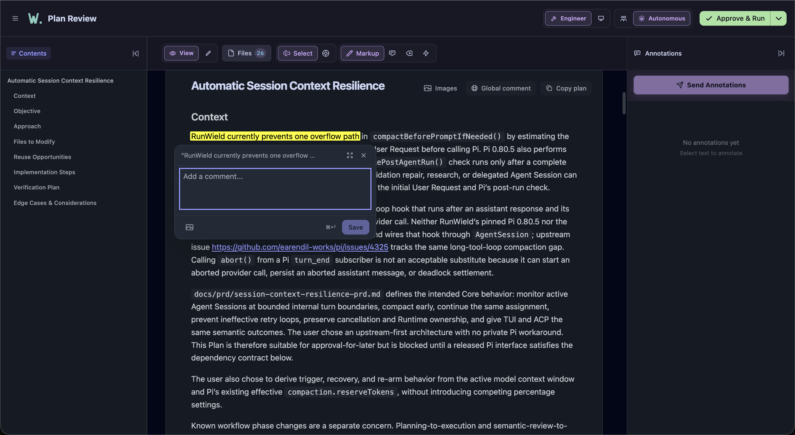
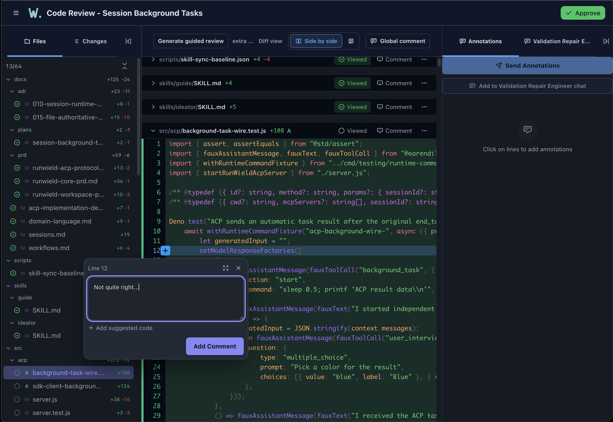
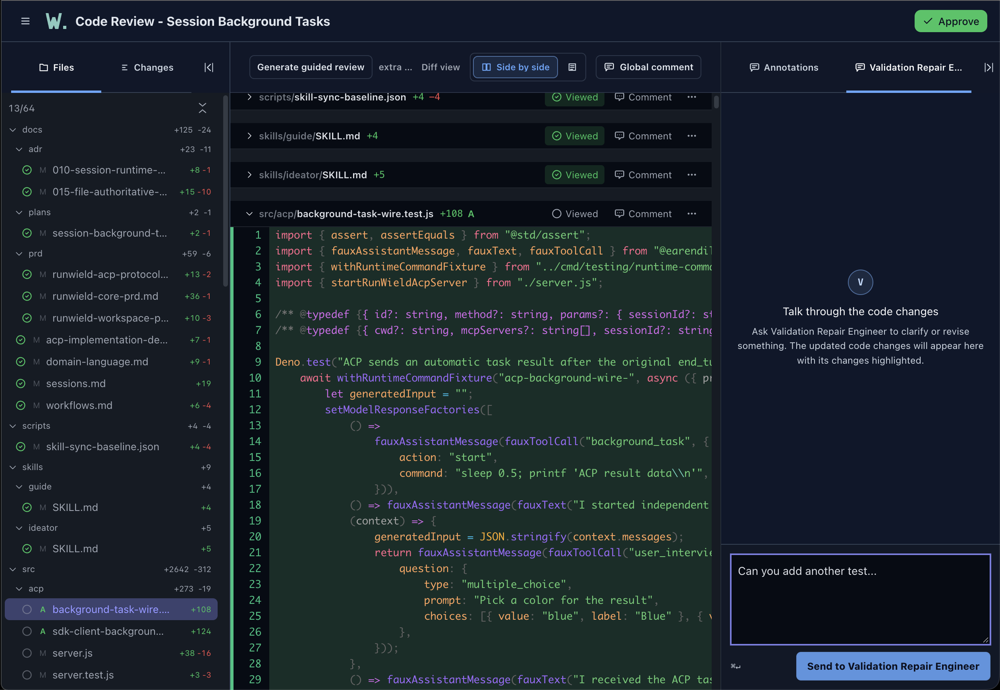

<p align="center"></p>

# RunWield

**Review what the AI plans to do before it touches your code. Then prove it did it.**

Millions of developers now spend their days reviewing code they didn't write, from AI agents that never explained what
they were building. RunWield fixes that. It's a senior tech lead in a box: it reads your repo, writes a plan you approve
before any code changes, has specialized agents build it, and won't call the work done until CI and a separate reviewer
confirm it matches the plan. Every decision is recorded, so the next change starts from what your team already learned.
The core is free, runs locally, and it works with any model.

Ceremony scales with risk: quick fixes stay quick, and only risky work gets a plan. Big implementations get an expert
architect review and a series of plans to implement in manageable chunks.

```text
ideate -> plan -> execute -> record -> use records to plan better
```

<p align="center"></p>

[](https://youtu.be/IHplUpFZIuU)

[Website](https://runwield.dev) · [Install](#install-in-30-seconds) · [How it works](#the-problem) ·
[Documentation](https://docs.runwield.dev)

<p align="right"><br /><sub>Oh, hello.</sub></p>

---

## Install in 30 seconds

```bash
curl -fsSL https://raw.githubusercontent.com/gandazgul/runwield/main/install.sh | bash
```

Then, from your project root:

```bash
wld
```

First run asks you to connect a model — a subscription login or your own API key. RunWield works with any provider. Then
run `/init` once to let it explore the repo and build project context, and just say what you want:

```text
> fix the failing parser test
```

macOS and Linux, installs to `~/.local/bin`, no root required.

For setup details, including model provider authentication, runtime helpers, and running from source, see the
[Quickstart Guide](docs/quickstart.md).

> **I'm looking for five developers to try RunWield on one real, non-trivial change.** I'll personally help you get
> running, fix anything that blocks you within a day, and give you a direct say in the roadmap.
> [Try it with me →](https://runwield.dev/#beta)

---

## The problem

Most coding harnesses optimize for getting an agent typing as fast as possible. Chat, and hope.

So the expensive part is never the typing. It's the moment you're staring at a 40-file diff, trying to reverse-engineer
what the model _thought_ it was building, and deciding whether to spend an hour reviewing it or an afternoon redoing it.
You never got to say "no, not like that" while it was still cheap. And when you finally merge, everything you learned
along the way evaporates — the next session starts from zero and makes a version of the same mistake.

### What RunWield does differently

**1. You review intent, not just diffs.** For anything non-trivial, a Planner agent writes a plan before an Engineer
writes code. You review it in a real browser UI — inline comments, revisions, approval — not by squinting at a wall of
chat. Redirecting a plan costs a sentence. Redirecting a finished branch costs a day.

<p align="center"></p>

**2. Ceremony scales with risk.** Every request is triaged into one of six intents, and only the expensive ones get the
expensive treatment:

| Your request                            | What happens                                                                                                               |
| --------------------------------------- | -------------------------------------------------------------------------------------------------------------------------- |
| "how does auth work here?"              | **Inquiry** — Guide just answers. No plan, no ceremony.                                                                    |
| "should we move to event sourcing?"     | **Ideation** — Ideator researches, interviews you, produces a PRD.                                                         |
| "bump the deps and update the lockfile" | **Operation** — Operator does it directly. No code implementation.                                                         |
| "fix the failing parser test"           | **Quick fix** — Engineer implements, then CI has to pass.                                                                  |
| "add SSO to the admin panel"            | **Planned Change** — bug, feature, or refactor. Planner writes a plan → you approve → Engineer executes → full validation. |
| "migrate the billing system"            | **Project** — Architect designs an Epic, Slicer decomposes it with you into shippable Planned Changes.                     |

How much ceremony the work gets is tracked separately from what kind of work it is. A gnarly bug that needs a real plan
is still recorded as a bug fix, not quietly relabeled a feature.

**3. "Done" is proven, not asserted.** This is the part most harnesses skip. When an Engineer says it's finished,
RunWield doesn't believe it:

- **Mechanical validation** runs your project's real CI. Failures go back to the Engineer for bounded repair attempts,
  not an apology.
- **Semantic review** then runs in narrowing rounds — two full plan-vs-diff reviews, then verification-only passes.
  Findings are tracked in a Review Issue Ledger across rounds and repaired by a separate agent working in _fresh
  context_, so nothing gets rationalized away by the model that wrote it.
- **Merge proof.** Plan work runs in a linked git worktree, and the plan is only marked `verified` after Git itself
  confirms the sealed implementation commit reached your target branch. Not because an agent said so.

**4. Your project remembers.** Every finished plan produces a Work Record — what changed, why, what was rejected along
the way. Combined with searchable project memory, PRDs, and ADRs, the next planning session starts from what you already
learned instead of from an empty context window.

### Compared to other Software Factories

Most agent tools are organized around tickets and chat sessions. They help teams run many agents and manage context.
RunWield is organized around the Plan and its lifecycle. It decides:

- Which work needs a Plan.
- Which Plan was approved.
- Whether approval also authorized execution.
- Which session owns the Plan.
- Which worktree and baseline belong to it.
- Whether implementation matches the approved intent.
- Whether validation and repair completed.
- Whether the exact validated result reached the target branch.
- Whether recovery is still necessary.
- Which final outcome becomes durable planning memory.

They expose rich session history. RunWield deliberately treats raw conversations as private working space and makes
Plans, PRDs, ADRs, and Work Records the durable knowledge layer. All of the artifacts stay in your repo as plain
markdown, so you can grep, diff, and version them like any other source file. RunWield will never encrypt or convert
those files to keep you trapped. Any other harnesses or coding tools can still make use of them.

### What a Planned Change actually looks like

You type `wld "add rate limiting to the public API"`. Then:

1. **Router** classifies it as a **Planned Change** and hands off to Planner.
2. **Planner** investigates the repo and writes a plan to `docs/plans/`.
3. **You review it** in the browser — comment, request changes, approve. Iterate as many times as you want. Nothing has
   touched your code yet.
4. **Engineer** executes the approved plan in an isolated git worktree.
5. **CI runs.** Failures get bounded repair attempts.
6. **Reviewer** compares the final diff against the plan _you_ approved, over multiple narrowing rounds, with findings
   carried in a ledger until they're resolved.
7. **You review the code** in the browser — comment on lines, or ask the Engineer to change something. Your feedback
   goes back through repair and validation, and you see the updated diff before approving. This step is optional.
8. **Merge-back is verified by Git**, and the plan flips to `verified`.
9. **A Manual QA checklist and a Work Record** are generated automatically, so the reasoning survives the PR.

Every one of those steps is a place you can interrupt, redirect, or stop. That's the whole idea.

<p align="center"></p>

<p align="center"></p>

### Is it for you?

**Yes, if** you work on codebases where a bad change is expensive, you want to steer before code exists instead of
after, and you're tired of "done!" meaning "the model stopped typing."

Probably not if you mostly write one-shots or quick scripts where a quick chat with Claude is enough.

---

## Try it with me

I'm looking for **five developers** to run RunWield on one real, non-trivial change — not a toy repo, not a demo.

In exchange: I'll personally help you get set up, fix whatever blocks you, and you get a direct line into what gets
built next.

> [Try it with me →](https://runwield.dev/#beta)

---

## Under the hood

<p align="right"><br /><sub>Just reading along.</sub></p>

RunWield is built on [Pi](https://pi.dev) and ships as a single compiled binary.

- **CLI + TUI** — Deno, pure JavaScript with JSDoc typing -> Moving to TypeScript.
- **Plan review** — a browser UI powered by [Plannotator](https://plannotator.ai).
- **Code intelligence** — [Cymbal](https://github.com/1broseidon/cymbal).
- **Memory** — [Mnemoteca](https://github.com/gandazgul/mnemoteca) for project and global memory.
- **Workspace UI** — Astro + React, local-first (binds to `127.0.0.1` with a per-server token by default).
- **Extensible** — layered agent definitions, prompt templates, skills, and themes, overridable per project or per user.
- **ACP-compatible**, so external clients can drive sessions.

The agent roster:

| Agent             | Purpose                                                                                                |
| ----------------- | ------------------------------------------------------------------------------------------------------ |
| Router            | Default triage. Classifies the request and routes it.                                                  |
| Guide             | Answers questions and explains the codebase. Cites your durable artifacts instead of making things up. |
| Ideator           | Researches and sharpens fuzzy ideas into a PRD. (Inspired by Grill Me from Matt Pocock)                |
| Operator          | Direct repository and environment work, no code implementation.                                        |
| Planner           | Writes reviewable plans for Planned Changes.                                                           |
| Architect         | Designs larger projects as Epics.                                                                      |
| Slicer            | Decomposes an approved Epic into shippable child Planned Changes.                                      |
| Engineer          | Implements approved plans and bounded quick fixes.                                                     |
| Frontend Engineer | Implements browser UI work, autonomously or via pair programming checkpoints.                          |
| Reviewer          | Compares the final diff against the original plan.                                                     |
| Recorder          | Writes the durable Work Record after completion.                                                       |

Everything RunWield owns lives under `~/.wld/` (sessions, settings, global instructions, overrides). Everything about
_your project_ stays in your repo as plain markdown: `docs/plans/`, `.wld/`, `docs/domain-language.md`. No lock-in, no
database, all greppable.

**Documentation:** [public manual](https://docs.runwield.dev) · [usage](https://docs.runwield.dev/usage/) ·
[plans and workflows](https://docs.runwield.dev/workflows/) · [settings](docs/settings.md) ·
[customization](docs/customization.md) · [collaboration](docs/collaboration.md) ·
[troubleshooting](docs/troubleshooting.md)

### Contributing

```bash
deno task cli "your request"   # run from source
deno task ci                   # check, lint, format, tests
deno task compile              # build the binary
```

Branch, keep changes focused, run `deno task ci`, and open a PR with a summary and validation notes. See
[contributing](docs/contributing.md) and [releasing](docs/releasing.md).

---

## Acknowledgements

RunWield builds on and learns from these projects and authors:

- [Pi](https://github.com/earendil-works/pi) (`pi.dev`) for the agent runtime and terminal foundation.
- [Vercel's agent-browser](https://github.com/vercel-labs/agent-browser) for browser-driven UI/UX verification.
- [Plannotator](https://github.com/backnotprop/plannotator) for artifact review and annotation surfaces.
- [1broseidon](https://github.com/1broseidon) for [Cymbal](https://github.com/1broseidon/cymbal) and
  [Ketch](https://github.com/1broseidon/ketch).
- [Matt Pocock's skills](https://github.com/mattpocock/skills) for the adapted diagnose, architecture, prototype,
  research, merge-conflict, TDD, and skill-writing Skill packages. And the inspiration for the plan workflow.
- [Anthropic's skills](https://github.com/anthropics/skills) for the frontend framework Skill inspiration.

---

## License

RunWield is **source-available and free to use**, but it is not open source yet.

You may install, run, inspect, and use RunWield for personal, internal, or commercial work. You may also submit issues
and pull requests.

You may not distribute modified versions, publish derivative works, rebrand RunWield, or offer it as a competing product
or service without prior written permission.

RunWield includes third-party dependencies, including Pi and Plannotator-related packages, which remain under their own
license terms.

See [LICENSE](LICENSE).
