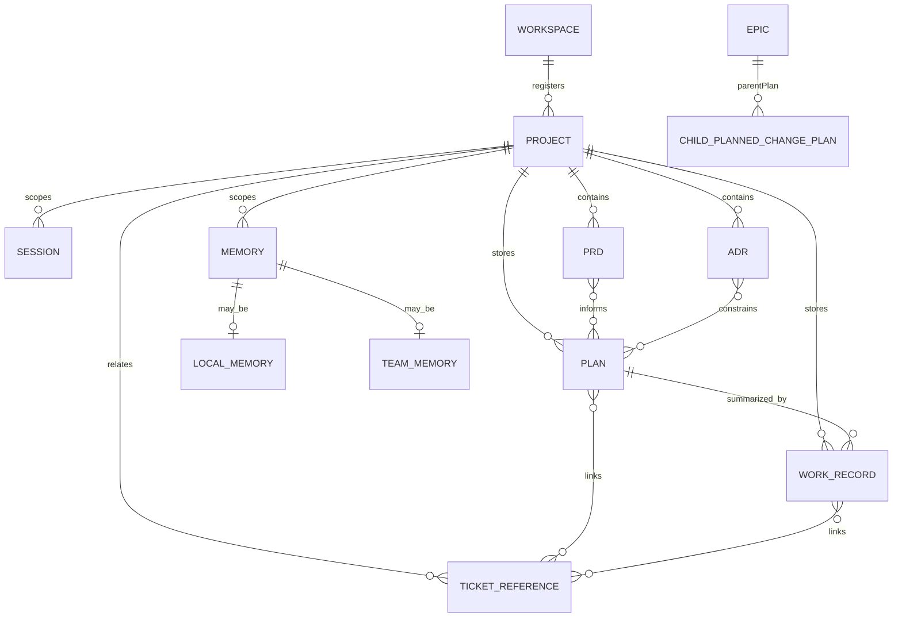
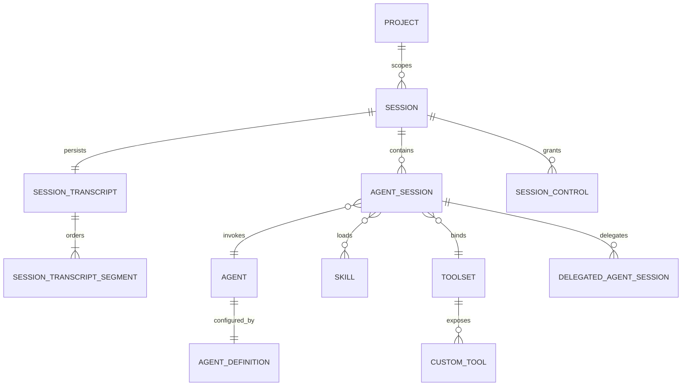
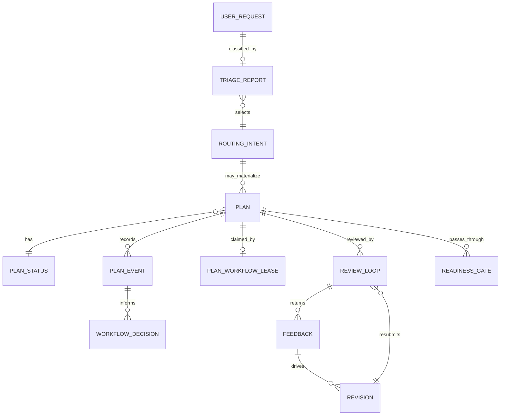
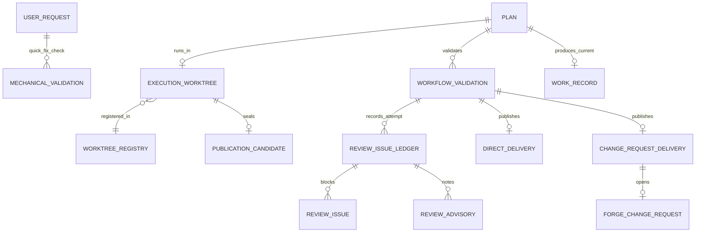

# RunWield Entity Model

This document is the entity-model companion to [`architecture.md`](architecture.md). The architecture document maps
control flow, dependency direction, runtime boundaries, and source guides; this document maps durable entities,
transient workflow objects, adapter projections, and storage authorities.

## How to read this

These diagrams are conceptual entity relationships, not database schemas. Cardinality describes the domain relationship
that engineers should preserve, not a required table shape or serialization format. Entity names follow
[`docs/domain-language.md`](domain-language.md); diagram identifiers use underscores only so Mermaid renders
predictably.

## Project and artifact model

- **Identity:** `Project`, `Session`, `Plan`, `Work Record`, and `Ticket Reference` are durable user- or project-facing
  entities. A `Plan` also carries a durable `planId`; an Epic is a `PROJECT` Plan, and a child `PLANNED_CHANGE` Plan
  points to its Epic through `parentPlan`.
- **Ownership:** The repository owns Plans, PRDs, ADRs, Work Records, and source code. Workspace registers Projects and
  projects artifacts into browser surfaces, but Workspace labels and cards are not authoritative project knowledge.
- **Lifecycle:** Plans participate in Plan Lifecycle. PRDs, ADRs, Work Records, Memories, and Ticket References inform
  planning and navigation but do not participate in Plan Lifecycle. Every project `Memory` is either a `Local Memory` or
  a `Team Memory`; the diagram uses two optional subtype edges because Mermaid ER diagrams cannot express that either/or
  constraint directly.
- **Work Record cardinality:** A `Plan` accumulates zero or more `Work Records` over its lifetime, which is why this
  diagram shows `summarized_by` as one-to-many. At most one of them is the current retrievable record; the rest are
  superseded or archived. The execution diagram below shows that single current record as `produces_current`. The two
  edges describe the same relation at different points in time, not a contradiction.
- **Source-of-truth caveats:** A `Team Memory` is a project `Memory` whose canonical human-readable text is versioned in
  the repository and whose local Mnemoteca copies are derived from that trusted text; it is not a container that
  includes other Memories. A `Ticket Reference` is a structured URL relation only. RunWield does not copy, own, or
  synchronize external Ticket content, status, or lifecycle.

## Session and Agent model

- **Identity:** A `Session` is the stable user-facing thread in one Project. The in-process Runtime session ID, Pi
  Session Manager ID, and ACP protocol ID are scoped handles around that durable thread and must not be treated as the
  same identity.
- **Ownership:** Session transcript storage owns private raw message and event history. `HostedSession` owns live
  mutable state while the process is running; adapters only hold opaque Runtime IDs and render Runtime events.
- **Lifecycle:** An `Agent Session` is one invocation context inside a Session. Delegated Agent Sessions are disposable,
  context-isolated children whose result returns to the parent Agent Session.
- **Source-of-truth caveats:** Session Transcripts are private Session history. They are not Work Records, shared
  project knowledge, or default cross-Session Agent retrieval material.

## Plan workflow model

- **Identity:** `User Request`, `Triage Report`, `Feedback`, `Revision`, `Workflow Decision`, and `Readiness Gate` are
  workflow/context-scoped records or decisions, not long-lived project knowledge by themselves. The durable entity is
  the Plan file and its front matter.
- **Ownership:** Router owns the Triage Report. Planner or Architect owns Plan drafting. Plan Lifecycle owns Plan Status
  transitions from recorded Plan Events. Plannotator supplies review decisions and Feedback.
- **Lifecycle:** `PLANNED_CHANGE` and `PROJECT` are the Plan-producing classifications. Legacy `FEATURE` classification
  input normalizes to `PLANNED_CHANGE`; `FEATURE` remains a Work Kind value when describing the nature of work.
- **Source-of-truth caveats:** `Workflow Decision` tells callers what to do next without directly changing Plan Status.
  Durable status changes come from Plan Events applied through Plan Lifecycle.

## Execution, validation, and delivery model

- **Identity:** An Execution Worktree has local filesystem, branch, baseline, and registry identity, but the Plan
  remains the durable workflow identity. A Publication Candidate is the exact locally validated revision intended for
  delivery.
- **Ownership:** The Plan file owns recovery pointers in front matter. The worktree registry owns local operational
  records under a lock. Git owns branches, commits, merges, and target-ref proof.
- **Lifecycle:** Mechanical Validation is the no-Plan `QUICK_FIX` path. Workflow Validation is the Plan path and can use
  semantic review, repair loops, optional human code review, and delivery.
- **Source-of-truth caveats:** `Review Issue Ledger`, Review Issues, Review Advisories, validation command output, and
  runtime events are attempt-scoped evidence. A Forge Change Request is provider-owned delivery/navigation state;
  RunWield records delivery evidence but does not own the Forge lifecycle.

## Persistence and authority

| Entity or concept          | Stable identity                               | Source of truth or storage                                       | Lifecycle authority                              | Projection/cache notes                                                                |
| -------------------------- | --------------------------------------------- | ---------------------------------------------------------------- | ------------------------------------------------ | ------------------------------------------------------------------------------------- |
| Workspace                  | Workspace registration record                 | Workspace state outside repo-local Plan truth                    | Workspace application                            | Browser surfaces project repository artifacts; not canonical for Plans or code.       |
| Project                    | Trusted repository or directory path          | User registration plus repository/directory                      | User and Workspace registration                  | Adapter project labels are projections.                                               |
| Session                    | Durable user-facing Session thread            | `~/.wld/sessions/<encoded-project-root>/` transcript storage     | SessionRuntime and Pi SessionManager             | Runtime and ACP IDs are scoped handles, not canonical project artifact IDs.           |
| Session Transcript         | Pi Session Manager ID and ordered entries     | `~/.wld/sessions/`                                               | Pi SessionManager guarded by RunWield load rules | Private history; not Work Record or shared project memory.                            |
| Session Transcript Segment | Ordered segment within a Session              | Session transcript storage                                       | Session runtime/coordination layer               | Supplies isolated model-history context while preserving continuous Session history.  |
| Agent Session              | Invocation context                            | Live Pi `AgentSession`; transcript entries after persistence     | Agent Handler and HostedSession                  | Execution/context-scoped; rebuilt or disposed as workflow changes.                    |
| Agent Definition           | Agent definition filename/name                | Bundled, home, and project agent definition Markdown             | Agent catalog and protected tool policy          | Layered configuration; display names are presentation values.                         |
| Skill                      | Skill package path/name                       | Bundled, home, project, or external-compatible skill directories | Skill catalog and invoking Agent policy          | Loaded instructions, not a workflow owner.                                            |
| Toolset and Custom Tool    | Effective tool names and call IDs             | Agent definition/tool registry plus runtime custom tool binding  | Tool registry and Agent Session binding          | Tool call events are runtime evidence, not durable project knowledge by default.      |
| User Request               | Submitted natural-language request            | Session transcript                                               | Active Session/Router turn                       | May materialize into a Plan, operation, answer, or no-plan quick fix.                 |
| Triage Report              | Current-turn structured Router result         | Session transcript/tool result and workflow context marker       | Router and Agent Handler                         | Classification snapshot; later artifacts carry durable state.                         |
| Routing Intent             | Canonical enum value                          | Triage Report and Plan front matter when materialized            | Router/workflow normalization                    | Legacy `FEATURE` normalizes to `PLANNED_CHANGE`.                                      |
| Plan                       | `docs/plans/**/*.md` path and `planId`        | Repository Markdown with YAML Front Matter                       | Plan store and Plan Lifecycle                    | Workspace Plan Board cards are projections over Plan files.                           |
| Epic                       | PROJECT Plan identity                         | Repository Plan Markdown                                         | Plan Lifecycle and Slicer                        | Container for decomposition; not directly executed.                                   |
| Child PLANNED_CHANGE Plan  | Child Plan identity plus `parentPlan`         | Repository Plan Markdown                                         | Plan Lifecycle                                   | Executes and validates independently from its Epic.                                   |
| Plan Status                | `status` front matter                         | Plan Markdown                                                    | Plan Lifecycle                                   | Board movement must record lifecycle events, not edit status directly.                |
| Plan Event                 | Named lifecycle fact                          | Plan write path/front matter history where represented           | Plan Lifecycle callers                           | Events drive status; Workflow Decisions do not.                                       |
| Plan Workflow Lease        | Project and Plan claim                        | Durable workflow coordination storage where implemented          | Workflow coordination layer                      | Distinct from Session Control and worktree registry locks.                            |
| Feedback and Revision      | Review-loop occurrence                        | Plan review interaction/transcript and rewritten Plan            | Plannotator plus Planner/Architect               | Feedback drives revisions; final Plan remains canonical.                              |
| Readiness Gate             | Approval-to-ready lifecycle step              | Plan Lifecycle transition evidence                               | Plan Lifecycle                                   | `PLANNED_CHANGE` reaches Ready For Work; PROJECT reaches Ready For Decomposition.     |
| Workflow Decision          | Semantic next-step instruction                | Live workflow result                                             | Workflow orchestrator                            | Ephemeral; does not mutate durable status by itself.                                  |
| Execution Worktree         | `worktreeId`, path, branch, baseline          | Git worktree plus Plan front matter pointers                     | Worktree service and workflow execution          | Local execution context; not a replacement Plan store.                                |
| Worktree Registry          | Registry entry ID                             | `<project>/.wld/worktrees.json` under lock                       | Worktree registry service                        | Local operational state ignored by Git.                                               |
| Publication Candidate      | Sealed commit/revision                        | Git commit/branch evidence                                       | Workflow Validation delivery logic               | Exact validated revision intended for publication.                                    |
| Mechanical Validation      | Validation attempt                            | Command output and runtime attempt evidence                      | QUICK_FIX validation loop                        | No Plan lifecycle, semantic review, or worktree registry mutation.                    |
| Workflow Validation        | Validation attempt for a Plan                 | Validation output, Plan metadata, Git evidence                   | Workflow validation service                      | Promotes to verified only after required checks and delivery succeed.                 |
| Direct Delivery            | Delivery mode selection                       | Git/local target proof and Plan delivery evidence                | Workflow validation publication                  | Local delivery mode; not a separate external review object.                           |
| Change Request Delivery    | Delivery mode selection                       | Publication evidence plus Forge provider relation                | Workflow validation publication and Forge        | Explicit delivery mode; Forge still owns review and merge lifecycle.                  |
| Review Issue Ledger        | Attempt ledger identity                       | Validation attempt context                                       | Reviewer loop                                    | Temporary per-attempt record; not durable planning memory.                            |
| Work Record                | Work Record Markdown path                     | Repository-local Markdown                                        | Recorder and human review/status conventions     | Durable planning memory; not a transcript or Review Issue Ledger.                     |
| Memory                     | Mnemoteca memory ID/scope                     | Mnemoteca project or global store                                | Memory tools and user/project preferences        | Every project Memory is either Local Memory or Team Memory; not Plan lifecycle truth. |
| Local Memory               | Mnemoteca memory ID/scope                     | Owner's local Mnemoteca collection                               | Memory tools and user/project preferences        | Project Memory retained locally unless promoted through Team Memory workflow.         |
| Team Memory                | Canonical repository text plus derived copies | Repository Team Memory text and local Mnemoteca copies           | Trusted Branch and memory reconciliation policy  | Memory subtype and shared retrieval aid; not a container of Memories.                 |
| Ticket Reference           | Required external Ticket URL relation         | Plan or Work Record structured relation                          | RunWield artifact writer                         | Navigation/provenance only; external source owns Ticket lifecycle.                    |
| Forge Change Request       | Forge provider PR/MR identity                 | Forge provider                                                   | Forge                                            | Delivery/navigation relation only; RunWield records local delivery evidence.          |
| PRD                        | Markdown artifact path                        | Repository documentation                                         | Product/documentation owners                     | Informs multiple Plans; no Plan Lifecycle status.                                     |
| ADR                        | Markdown artifact path                        | Repository documentation                                         | Architecture/documentation owners                | Constrains design; no Plan Lifecycle status.                                          |

[Mnemoteca]: https://github.com/gandazgul/mnemoteca
