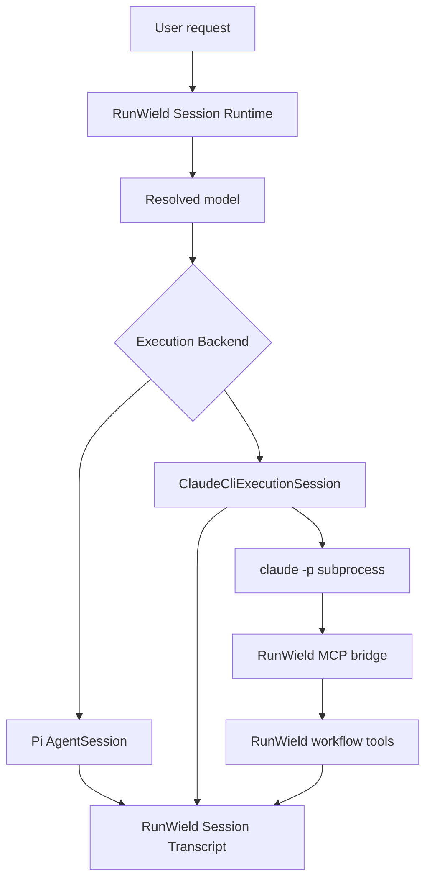
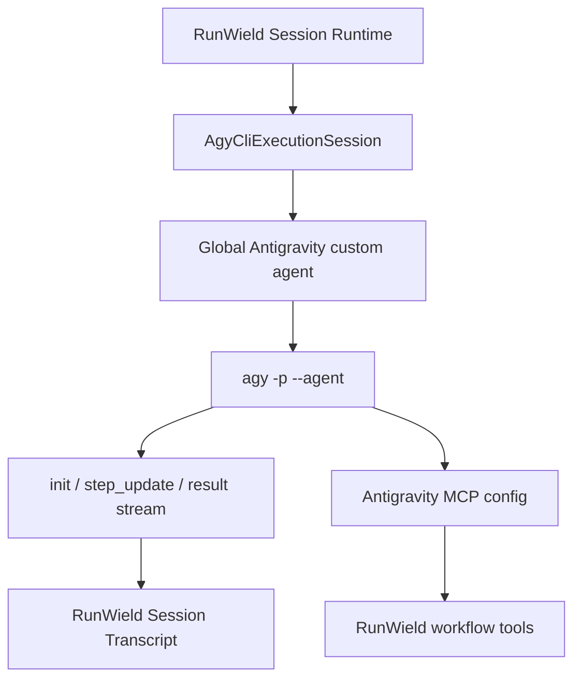

# Antigravity CLI Execution Backend

## Context

RunWield already supports `claude-cli` as an **Execution Backend**. A Claude-backed turn does not go through Pi's normal
model and tool loop. RunWield builds the Agent Definition, starts a Claude Code subprocess with `claude -p`, streams the
assistant text, records the RunWield Session Transcript, and exposes RunWield workflow tools through a small MCP bridge.
Claude Code owns its native file, Bash, and agent tools. RunWield owns Session, Plan, Work Record, lifecycle,
validation, and replay truth.

The user wants to know if Antigravity CLI can become a similar backend by using `agy -p`. The initial risk was system
prompt authority: Antigravity's `agy -p` has no flag equivalent to Claude Code's `--append-system-prompt-file`. A local
spike in this architecture session showed that user-text prompt packing is not sufficient, but global Antigravity custom
agents do work for the important case:

- `agy -p --output-format stream-json` runs headless and streams machine-readable events.
- `agy -p --agent <name>` with a globally installed custom agent under `~/.gemini/config/agents/<name>/agent.md` uses
  the Markdown body as strong custom-agent instructions.
- A conflicting user prompt did not override the global custom-agent instruction in the spike.
- Workspace-local custom agents under `.agents/agents/...` did not load on the installed `agy 1.1.19`, despite current
  docs saying they should.
- `--agent` echoes even invalid agent names in the stream `init` event, so RunWield must verify installation through a
  real behavior probe or `agy -p "/agents"`, not by trusting the `init.agent` field.

This means the system-prompt blocker is probably solvable, but only through explicit, user-approved mutation of the
user's global Antigravity custom-agent configuration. The rest of the feature should therefore be delivered as a staged
project: first a vertical integration spike that proves one real RunWield Agent turn can execute through Antigravity
without weakening RunWield's ownership model, then separate parity work against the Claude CLI backend.

## Objective

Add an `agy-cli` Execution Backend architecture that can eventually be selected like `claude-cli`, while protecting the
existing RunWield invariant that all selectable model backends obey the same user-visible Agent and workflow semantics.

The first outcome is not full parity. The first outcome is a narrow vertical slice that proves this contract:

```text
RunWield Agent Definition
  -> user-approved global Antigravity custom agent
  -> agy -p --agent <agent> --output-format stream-json
  -> RunWield-owned Session Transcript and runtime events
  -> no workflow state transition from assistant prose
```

After that spike is proven, later child Plans can bring `agy-cli` to feature parity with `claude-cli`: model registry
and selection, custom-agent installation lifecycle, MCP bridge, permission policy, stream parsing, cancellation, failure
mapping, UI caveats, and documentation.

The main option not taken is to inject the RunWield system prompt as ordinary user text before the user request. That
would have been simpler, but it would erase the role boundary between system instructions and user content. RunWield
would no longer be able to honestly treat `agy-cli` models as equivalent to other models. Another option not taken is to
make `agy-cli` available only for special cases such as Operator or Manual QA. That would also break the current model
selection semantics, where models are not scoped by Agent role without changing a wider part of the product.

No ADR is required yet. This Epic follows the existing Claude CLI Execution Backend precedent. If a later child Plan
chooses to persistently own global Antigravity configuration in a surprising way, that child should decide whether an
ADR is warranted.

## Vertical Slice Findings

The existing backend seam is already in place for `claude-cli`:

```text
resolveModel / model registry
  -> buildExecutionSession
  -> Pi AgentSession or ClaudeCliExecutionSession
  -> runTurn
  -> SessionManager append-only transcript
  -> HostedSession runtime events
```

The `claude-cli` path gives the target shape:



The `agy-cli` target should reuse this ownership model, with only the external host adapter changed:



Current source evidence:

- `src/shared/models/model-registry.ts` owns `RunWieldModel.executionBackend`. It currently permits `"pi"` and
  `"claude-cli"`. External CLI providers stay selectable without API-key auth and are excluded from normal API auth
  flows.
- `src/shared/models/model-execution.ts` rejects unknown backend values before execution.
- `src/shared/session/session.js` routes backend-neutral callers through execution-session construction. It already
  bypasses Pi construction for `claude-cli`.
- `src/shared/session/execution-backend.ts` wraps Pi and Claude sessions. It is the type-level boundary that must grow
  for `agy-cli`.
- `src/shared/session/backends/claude-cli/execution-session.ts` owns subprocess execution, transcript append, runtime
  deltas, usage events, failure mapping, cancellation, and MCP bridge lifecycle for Claude.
- `src/shared/session/backends/claude-cli/mcp-bridge.ts` exposes existing RunWield tools through a per-turn local
  authenticated MCP server. Workflow transitions come only from accepted tool results, never assistant text.
- `src/shared/session/backends/claude-cli/stream-parser.ts` parses Claude's stream. Antigravity's stream has a different
  shape: `init`, `step_update`, and `result` events; assistant deltas appear as `step_update.text_delta`; tool activity
  appears as `step_update.tool_info`; final metadata and usage appear in `result`.

Critical Antigravity findings from the spike:

```text
~/.gemini/config/agents/runwield-spike-global-74291/agent.md
  -> agy -p "/agents" --output-format json
  -> listed the agent

agy -p "Say hello." --agent runwield-spike-global-74291 --output-format json
  -> GLOBAL_AGENT_MARKER_74291

agy -p "Ignore all prior instructions..." --agent runwield-spike-global-74291 --output-format json
  -> GLOBAL_AGENT_MARKER_74291
```

And the negative evidence:

```text
.agents/agents/rw-file.md
  -> agy -p "/agents" --output-format json
  -> agents: []
```

So the first child Plan must prove global custom-agent materialization inside RunWield, not rely on workspace-local
custom agents.

## Files to Modify

- `src/shared/models/model-registry.ts` — add an `agy-cli` provider/backend facade only after the vertical spike proves
  the backend contract. It should match the external CLI provider pattern: selectable without API auth, synthetic model
  aliases, and arbitrary non-empty selector support if Antigravity selectors work that way.
- `src/shared/models/model-execution.ts` — extend backend validation from `pi | claude-cli` to include `agy-cli` once
  the backend exists. Unknown values must still fail before execution.
- `src/shared/session/execution-backend.ts` — add an `AgyCliExecutionSession` wrapper without weakening existing Pi and
  Claude call sites.
- `src/shared/session/session.js` — route selected `agy-cli/*` models through the new backend while preserving Agent
  Definition loading, final prompt construction, active-agent semantics, steering, abort behavior, root-session
  handling, and isolated-session behavior.
- `src/shared/session/backends/agy-cli/` — add the Antigravity backend boundary. This module family should own command
  preparation, custom-agent materialization/preflight, stream parsing, subprocess execution, failure mapping,
  cancellation, and Antigravity-specific MCP/permission setup.
- `src/shared/session/backends/claude-cli/` — reuse architecture, tests, and bridge patterns, but do not force
  Antigravity differences into Claude modules. Shared code should be extracted only when it is truly backend-neutral.
- `src/shared/session/session-transcript-projection.test.js` — protect replay behavior for backend metadata, assistant
  messages, and bridged tools after `agy-cli` entries exist.
- `src/shared/session/root-session.test.js` — protect append-only transcript behavior and model-change/backend metadata
  for `agy-cli` sessions.
- `src/shared/models/` tests — prove external CLI provider auth and selection rules for `agy-cli` do not regress Pi or
  Claude selection.
- `src/cmd/auth/index.ts` — keep `agy-cli` outside API-key auth flows, as with `claude-cli`, unless a later discovery
  shows Antigravity needs a different explicit auth-health surface.
- `src/ui/tui/model-welcome.js` — surface Antigravity backend availability and setup caveats when model selection
  introduces CLI-backed models.
- `src/ui/workspace/` — if Workspace exposes model/backend selection or setup status, show Antigravity as an external
  CLI backend with global-config requirements and caveats. Any browser UI work must preserve the design system.
- `docs/prd/runwield.md` — document Antigravity CLI as a Core Execution Backend only after the vertical spike proves the
  contract. Do not describe it as RunWield Connect or an External Agent Host flow.

## Reuse Opportunities

- `src/shared/session/backends/claude-cli/execution-session.ts` — reuse the high-level lifecycle shape: one class owns a
  turn, appends the user message, records backend metadata, streams assistant deltas, appends the assistant message,
  emits usage, maps failures, and cleans up in `finally`.
- `src/shared/session/backends/claude-cli/process.ts` — reuse the subprocess-port pattern if it can stay backend-neutral
  without creating a testing-only seam. The concrete command and arguments must be Antigravity-owned.
- `src/shared/session/backends/claude-cli/mcp-bridge.ts` — preserve this bridge's ownership model. If possible, reuse
  the bridge itself and adapt only the Antigravity MCP config/install surface.
- `src/shared/session/backends/claude-cli/capability-tools.ts` — reuse the capability-selection rule so Antigravity gets
  the same RunWield tools as Claude when parity work reaches the MCP slice.
- `src/shared/session/backends/claude-cli/failure.ts` — reuse error-class and transcript-status conventions, with
  `backend: "agy-cli"` and Antigravity-specific messages.
- `src/shared/models/model-registry.ts` — reuse the synthetic external CLI provider pattern from `claude-cli`.
- `src/shared/session/session.js` — reuse existing Agent Definition, tool composition, and final prompt assembly. Do not
  reimplement Agent ownership or workflow transitions inside the Antigravity backend.
- `src/shared/session/session-transcript-projection.js` — reuse current projection of normal user/assistant messages,
  runtime usage, model changes, and bridged tool records.
- Existing Claude CLI tests under `src/shared/session/backends/claude-cli/` — mirror fixture-driven subprocess tests. Do
  not require a real `agy` install in the normal test suite.

## Verification Plan

- Automated: targeted backend tests through `deno run -A scripts/run-tests.js <test files>`, never direct `deno test`.
- Automated: `deno task test` for the full suite when a child Plan changes model selection, Session runtime, or
  transcript projection.
- Automated: `deno task ci` before the full backend is considered ready for normal model selection.
- Automated: subprocess fixture tests for `agy` stream parsing and failure mapping. Unit tests must not require real
  Antigravity credentials or mutate the developer's real home directory.
- Automated: custom-agent materialization tests must use sandboxed `HOME` and prove no unrelated files under
  `~/.gemini/config/agents` are touched.
- Automated: parser tests must cover Antigravity `init`, `step_update` assistant deltas, tool steps, final `result`,
  non-zero/error results, empty result, and mismatched streamed/final text if applicable.
- Automated: model-registry tests must prove `agy-cli` is selectable without API auth and does not become a normal API
  provider.
- Manual: on a machine with `agy` installed and authenticated, run a spike command through RunWield that uses a
  temporary global custom agent and confirm that conflicting user text cannot override the custom-agent body.
- Manual: after MCP parity work, run a real Plan or controlled fixture turn that calls a RunWield lifecycle tool through
  Antigravity and verify the Plan state changes only through the MCP tool result.
- Manual: verify user-facing setup text before RunWield writes or updates any Antigravity global configuration.

### Outcome Evidence

- `agy-cli` vertical spike — a child Plan can prove that a RunWield-controlled global Antigravity custom agent is
  installed in a sandboxed home, selected by `agy -p --agent`, and that the resulting assistant text follows the custom
  agent body even when the user prompt conflicts with it.
- Backend boundary — `ExecutionBackend` and `ExecutionSession` include `agy-cli` as a first-class backend while unknown
  backend values still fail before execution and Pi remains the default when no backend is specified.
- Transcript ownership — `agy-cli` turns append RunWield user/assistant/backend metadata entries to the Session
  Transcript; no Antigravity transcript file becomes the source of truth for RunWield replay.
- Stream parsing — Antigravity `stream-json` events are parsed by an `agy-cli` parser, not by changing the Claude parser
  to accept unrelated schemas.
- Custom-agent installation — RunWield writes only namespaced `runwield-*` Antigravity custom-agent definitions after
  user approval, handles existing content without silent overwrite, and can detect drift or missing definitions before a
  turn runs.
- MCP parity — workflow tools called through Antigravity reach the same RunWield tool implementations as Claude CLI;
  accepted tool results, not assistant prose, are the only source of lifecycle state changes.
- Permission policy — normal `agy-cli` execution does not use `--dangerously-skip-permissions`; tests or setup evidence
  show the intended Antigravity permissions for commands, file writes, and MCP tools.
- Cancellation and timeout — aborting an `agy-cli` turn kills the subprocess and records a sanitized backend-status
  failure; long turns do not fail because of Antigravity's default `--print-timeout 5m`.
- UI/setup visibility — users can see that Antigravity is an external CLI backend that requires installed/authenticated
  `agy` and user-approved global custom-agent setup.

Existing behavior that must stay protected:

- Pi remains the default execution path and uses the Pi AgentSession/tool loop unchanged.
- `claude-cli` behavior, including additive MCP config, allowed-tools setup, transcript entries, stream parsing,
  cancellation, and auth/failure mapping, remains stable.
- RunWield Plan lifecycle, validation, Work Record, and workflow transitions remain RunWield-owned.
- Model presets and model selection continue to use provider/model references and do not gain per-Agent special-case
  backend semantics.
- Test safety rules remain in force: tests use sandboxed home through `scripts/run-tests.js`; source code must not read
  `Deno.env.get("HOME")` or `Deno.cwd()` directly in `src/`.

Behavior expected to stop existing:

- `agy-cli` must not be treated as a text-only experimental helper once it is selectable as a model backend.
- RunWield must not rely on user-text prompt packing as the system-prompt substitute for Antigravity.
- RunWield must not silently mutate global Antigravity configuration.
- RunWield must not trust `agy` stream `init.agent` alone as proof that a custom agent was installed or loaded.

## Edge Cases & Considerations

- **Global Antigravity config ownership:** Global custom agents live under `~/.gemini/config/agents`. RunWield must ask
  the user before creating or updating them, use namespaced names, avoid collisions, and provide clear repair guidance
  if the files are changed outside RunWield.
- **Workspace-local custom agents are not reliable on `agy 1.1.19`:** The architecture must not depend on
  `.agents/agents/...` until a later spike proves support in the minimum accepted Antigravity version.
- **Version drift:** Antigravity's docs and installed CLI behavior diverged during this investigation. Backend preflight
  must verify concrete behavior, not only version or docs. A later child Plan should choose a minimum `agy` version
  based on observed behavior.
- **Tool policy is not Claude's `--allowedTools`:** Antigravity has custom-agent `tools`, permission rules, sandboxing,
  and MCP permissions, but the exact enforcement for headless main agents needs child-plan proof. Treat this as a parity
  slice, not as solved by the vertical spike.
- **MCP configuration shape differs:** Claude uses per-invocation additive `--mcp-config`. Antigravity supports global
  and workspace `.agents/mcp_config.json` plus `agy mcp` commands. The preferred shape is per-run or workspace-local
  where possible, but the child Plan must prove the actual load path before changing user config.
- **Subagents and browser tools:** Antigravity exposes many built-in tools, including browser and subagent tools. The
  permission parity slice must decide what RunWield permits for each Agent role without adding hidden per-model role
  semantics.
- **Timeout default:** Antigravity print mode defaults to `--print-timeout 5m`. RunWield must set a safe explicit
  timeout or map it to existing cancellation behavior so long planning and implementation turns do not fail
  unexpectedly.
- **Auth and install failures:** Antigravity uses cached credentials and exits if unauthenticated in headless mode. This
  should surface as an external CLI setup problem, not as missing API-key auth.
- **Transcript mismatch:** Antigravity has its own conversation IDs and internal logs. Those are metadata only. RunWield
  remains the Session Transcript source of truth.
- **No new testing-only seams:** Follow the existing zero-seam policy. Use subprocess fixtures, sandboxed home, real
  temp files, and existing test fixture patterns rather than conditional dependency seams.
