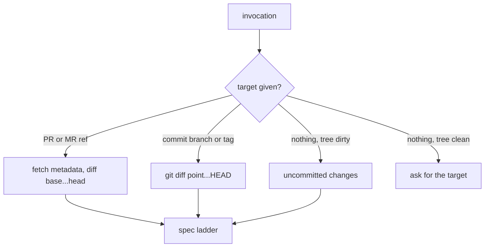

# Publish a `review` Skill for Pull Requests and Arbitrary Diffs

## Context

Two review documents exist, and neither one does the whole job.

`src/agent-definitions/subagent-definitions/reviewer-prompt.md` holds the judgment discipline that makes a review
useful: approve by default, separate blocking issues from advisories, cite a requirement plus a file and hunk for every
finding, and a long list of things that must never cause a rejection. It cannot run outside this product. It reads the
diff through `review_diff`, judges against an Approved Plan, and ends by calling `review_complete`.

A `review` skill installed in the user's home directory holds the useful shape: anchor on a fixed point, then run a
**Standards** axis (does this follow the project's documented conventions?) and a **Spec** axis (does this implement
what was asked?) as separate passes, reported side by side so neither masks the other. It has no judgment discipline, no
pull-request support, and it references `docs/agents/issue-tracker.md` and a `/setup-matt-pocock-skills` command that
belong to an unrelated skill pack.

This Plan produces one published skill that combines them and adds pull-request support, installable by any project
through `npx skills@latest add gandazgul/runwield` alongside `ideator` and `guide`.

No PRD capability owns the installable skills surface, and no glossary change is needed. `docs/domain-language.md`
already defines **Forge** and **Forge Change Request** ("called a pull request by GitHub and a merge request by
GitLab"), and its **Skill** entry already says "instruction package", which admits more than one file. The published
skill is written for projects that have never heard of this product, so it says "pull request" and "merge request" in
plain English rather than using those internal terms.

## Objective

Publish `skills/review/` as a four-file skill that reviews a pull request, a fixed point, or the working tree along two
axes with the workflow reviewer's judgment discipline, and that can leave line and summary comments on a GitHub pull
request or a GitLab merge request.

Extend the skill publishing check so a published skill may have no owning Agent Definition, and so every Markdown file
in a published skill directory is hash-tracked and scanned for product-specific wording.

`src/agent-definitions/subagent-definitions/reviewer-prompt.md` does not change. Its lifecycle stays plan-anchored.

## Approach

### Why the publishing check must change first

`scripts/check-skill-sync.ts` does three jobs, and two of them break on this skill.

`findSkillSyncDrift` keys the baseline on `pair.source`, so an entry with no Agent Definition cannot be recorded at all.
The merged skill has no source: it drops the Plan, `review_diff`, and `review_complete`, and adds two axes and comment
posting, so it is not a generic port of the reviewer prompt. Pairing them anyway would fail CI every time the workflow
reviewer is tuned, and demand an edit to a public document that has no matching concept.

The leak scan and the hash both read exactly one file, `pair.skill`. Three of the four new files are not SKILL.md, and
`findUnpublishedSkills` only looks for SKILL.md, so today a product tool name in `skills/review/github.md` ships to
strangers with CI green.

The fix: key the baseline on `skill`, make `source` optional, and discover support files from disk rather than from the
baseline, so a file added and never registered is still scanned and still reported as drift.

```text
deno task skills:sync:check
  for each published skill entry
    collectPublishedSkillFiles(rootPath, entry.skill)   <-- new; walks the skill directory
      -> [SKILL.md, pull-requests.md, github.md, gitlab.md]
    findProjectSpecificLeaks(each file)                  <-- now every file, not just SKILL.md
    hash(each file) vs entry.supportFiles                <-- added / removed / changed all report drift
  findUnpublishedSkills(...)                             <-- unchanged
```

Discovering from disk rather than trusting the baseline list is the point. An explicit hand-maintained `files` array
would leave the same hole one level up: a forgotten entry would be an unscanned file.

### How the skill finds what to review

Two independent questions: which diff, and which spec.



The spec ladder stops at the first hit:

1. A spec path or URL passed with the invocation.
2. A plan, spec, or PRD document linked from the pull request description — read that document.
3. An issue referenced in the description or in the commit messages — fetch it.
4. The pull request description plus its comments, taken together as the spec.
5. A plan, PRD, or spec file under `docs/`, `specs/`, or `.scratch/` that matches the branch name.
6. Ask the user where the spec is.
7. The user says there is none — free-form review. The Standards axis still runs; the Spec axis reports "no spec
   available" and the report says so rather than inventing requirements.

### The two axes, and the discipline they share

Both axes run as sub-agents in parallel when the host supports them, as sequential passes when it does not. Each gets
the diff, its own sources, and the shared discipline ported from the reviewer prompt:

- Approve by default. A finding needs a named requirement or standard **and** the changed code that fails it. "This
  could be better" is not a finding.
- **Review Issues** block: a missing or wrongly implemented requirement, a correctness defect, a regression, a security
  defect introduced by the change. Each cites its requirement and its file and hunk.
- **Review Advisories** never block: code smells, maintainability notes, genuine ambiguity in the spec. Accumulated
  advisories never add up to a rejection.
- Style and formatter preferences are neither, and go unreported.
- Out of scope: verification procedures and whether commands were run, spec or ticket lifecycle metadata, proof that a
  test was executed, formatter-only churn, files the spec did not mention unless the edit creates a real defect, and
  anything past the spec.

The reviewer prompt's injection-seam bullet ports, at lower aggression. A seam that lets a test or a caller swap out
code the product owns is a defect a model introduces in any repository — an optional dependency bag, a test-only branch,
a `deps ? fake : real` fallback, an injectable persistence, lifecycle, or lock collaborator. Naming a wrapper a "port"
does not make it one; a port describes a genuine external capability such as a subprocess, the network, a clock, or a
remote service.

What changes for a general audience is the verdict, not the observation:

- Default to an **advisory** on the Standards axis. Say what the seam lets a caller replace, and what a test using it
  would stop proving.
- It **blocks** when the project documents a seam or dependency-injection policy that the change violates, or when the
  seam lets a test pass while the behavior under test is never executed. A test that green-lights a stub is a
  correctness defect, not a matter of taste.

Downgrading to an advisory by default is the whole adjustment. A project with no written policy gets the observation
without a rejection it never asked for.

The aggregation rule from the home-directory skill survives unchanged: report the axes under separate headings, do not
merge or rerank them.

### Turning findings into pull-request comments

`skills/review/pull-requests.md` owns the policy and applies only when the target is a pull request. It carries no
vendor commands; it names the two command files instead.

- Host discovery: read the host from the pull request URL, else from the `origin` remote, else ask.
- A finding anchored to a file and a line that the diff actually contains becomes a **line comment**.
- Everything else becomes part of the **summary body**: the per-axis rollup, a missing requirement that has no single
  line, scope creep spanning files, and the verdict.
- Every comment is drafted first and submitted in one batch, so a twelve-finding review is one notification.
- Blocking issues map to "request changes". No blocking issues maps to a plain comment. **Never approve** — approval is
  the user's to give, not an agent's.
- Ask the user before submitting. A pull request is shared, and posting is not quietly undoable.

`skills/review/github.md` and `skills/review/gitlab.md` hold the commands. The GitHub file exists because `gh pr review`
has no line-comment flag (verified against `gh` 2.100.0): line comments require one
`gh api --method POST
repos/{owner}/{repo}/pulls/{n}/reviews` call carrying `body`, `event`, and a `comments[]` array of
`{path, line, side, body}`. The GitLab file covers `glab` for metadata and diff, notes for the summary, and the
discussions API with a `position` object for line comments.

## Expected Change Surface

Guidance, not an allowlist. Verify the real footprint during implementation and change whatever the steps need. Stop and
report only if discovery changes approved intent.

- `skills/review/SKILL.md` — new. Front matter matching `ideator` and `guide` (`name`, `description`,
  `license: MIT; complete terms in ../LICENSE`), target resolution, the spec ladder, the two axes, the shared judgment
  discipline, aggregation, and a pointer to `pull-requests.md`.
- `skills/review/pull-requests.md` — new. Host discovery, line-versus-summary mapping, batching, verdict mapping,
  confirm before submit. Points at the two command files.
- `skills/review/github.md` — new. `gh` commands for metadata, diff, batched review with line comments, standalone
  comment.
- `skills/review/gitlab.md` — new. `glab` and GitLab REST equivalents.
- `skills/README.md` — the table gains a `review` row, and the document explains that a published skill may have no
  owning Agent Definition and that every Markdown file in a skill directory is tracked and scanned.
- `scripts/check-skill-sync.ts` — optional `source`, baseline keyed on `skill`, support-file discovery, hashing, and
  leak scanning.
- `scripts/check-skill-sync.test.ts` — coverage for the new behavior.
- `scripts/skill-sync-baseline.json` — regenerated; gains the `review` entry and `supportFiles` on every entry.

No domain-language file changes. The terms this work needs are already defined, and the published skill deliberately
avoids them.

## Reuse Opportunities

- `src/agent-definitions/subagent-definitions/reviewer-prompt.md` — the source of the judgment discipline: approve by
  default, blocking versus advisory, evidence requirements, out-of-scope list, and the injection-seam bullet with its
  list of seam shapes. Port the wording; strip the Plan, `review_diff`, and `review_complete`.
- `~/.agents/skills/review/SKILL.md` — the source of the two-axis structure, the sub-agent briefs, and the aggregation
  rule. Strip `docs/agents/issue-tracker.md` and `/setup-matt-pocock-skills`.
- `skills/ideator/SKILL.md` and `skills/guide/SKILL.md` — the front matter shape and the voice of a published skill.
- `scripts/check-skill-sync.ts` — `findProjectSpecificLeaks`, `isInternalSkill`, and `discoverSkillsInContainers` are
  reused as they are; only drift and the file set change.

## Implementation Steps

### Publishing check

- `scripts/check-skill-sync.ts` exports a `PublishedSkill` type whose `source` and `sourceHash` are optional and whose
  `supportFiles` is an array of `{ path, hash }`. The name `SkillSyncPair` no longer appears in the file: an entry with
  one side is not a pair.
- `findSkillSyncDrift` matches recorded entries to current entries by `skill`, not by `source`, and an entry with no
  `source` produces no source drift instead of throwing or being skipped.
- `findSkillSyncDrift` reports a support file whose hash changed, a support file on disk that the baseline does not
  record, and a baseline support file missing from disk. `formatDrift` names the offending path in each case and tells
  the reader to run `deno task skills:sync:update` after reviewing it.
- `scripts/check-skill-sync.ts` exports `collectPublishedSkillFiles(rootPath, skillPath)`, which returns the SKILL.md
  followed by every other Markdown file in that skill's directory, read from disk.
- The `import.meta.main` block uses `collectPublishedSkillFiles` for both the leak scan and the hashing, so a Markdown
  file added to a published skill directory is scanned on the first run after it appears, without a baseline edit.
- `deno task skills:sync:update` regenerates `scripts/skill-sync-baseline.json` with `supportFiles` populated for every
  entry, and `deno task skills:sync:check` then passes.

### The skill

- `skills/review/SKILL.md` exists with front matter carrying `name: review`, a `description` that names pull requests, a
  fixed point, and the working tree as targets, and `license: MIT; complete terms in ../LICENSE`.
- `skills/review/SKILL.md` resolves a target from a pull request reference, a commit, branch, or tag, or the working
  tree, and asks when the invocation names none and the tree is clean.
- `skills/review/SKILL.md` states the spec ladder as seven ordered sources ending in an explicit free-form fallback, and
  states that under the fallback the Spec axis reports "no spec available" rather than inferring requirements.
- `skills/review/SKILL.md` instructs the reader to run the Standards axis and the Spec axis in parallel sub-agents where
  the host has them and as sequential passes where it does not, gives a brief for each axis, and reports them under
  separate headings without merging or reranking.
- `skills/review/SKILL.md` carries the judgment discipline: approve by default, Review Issues block and Review
  Advisories do not, every issue names its requirement and cites a file and hunk, accumulated advisories never become a
  rejection, style and formatter preferences go unreported, and the out-of-scope list covers verification procedures,
  lifecycle metadata, test-execution proof, formatter-only churn, unmentioned files, and anything past the spec.
- `skills/review/SKILL.md` instructs the Standards axis to scan production changes for a seam that lets a test or a
  caller replace code the project owns, names the shapes to look for (optional dependency bag, test-only branch,
  `deps ? fake : real` fallback, injectable persistence, lifecycle, or lock collaborator), and states that a genuine
  port describes an external capability such as a subprocess, the network, a clock, or a remote service.
- `skills/review/SKILL.md` states that a seam finding is an advisory by default and blocks only when it violates a seam
  or dependency-injection policy the project documents, or when it lets a test pass without executing the behavior under
  test. The rule must not be written so that any seam is automatically blocking.
- `skills/review/SKILL.md` contains no `review_diff`, no `review_complete`, no `docs/agents/issue-tracker.md`, and no
  `/setup-matt-pocock-skills`.
- `skills/review/SKILL.md` directs the reader to `pull-requests.md` when, and only when, the target is a pull request,
  and contains no `gh` or `glab` command.
- `skills/review/pull-requests.md` states host discovery from the pull request URL, then the `origin` remote, then the
  user; the rule that a finding anchored to a line present in the diff becomes a line comment while everything else
  joins the summary body; that comments are batched into a single submission; that blocking issues request changes, a
  clean review posts a plain comment, and the skill never approves; and that the user confirms before anything is
  submitted. It references `github.md` and `gitlab.md` and contains no vendor command itself.
- `skills/review/github.md` gives working `gh` commands for reading pull request metadata, body, and comments, reading
  the diff, posting a batched review whose `comments[]` array carries `path`, `line`, `side`, and `body` through
  `gh api --method POST repos/{owner}/{repo}/pulls/{n}/reviews`, and posting a standalone comment. It records that
  `gh pr review` cannot attach line comments, and says what to do when a target line is outside the diff.
- `skills/review/gitlab.md` gives the `glab` equivalents for metadata, diff, a summary note, and line comments through
  the merge request discussions API with a `position` object, naming the fields each call needs and how to obtain the
  SHAs. Every endpoint in it is checked against current GitLab REST documentation during implementation, and any command
  that could not be executed locally is marked as documentation-verified — `glab` is not installed on this machine.
- No file under `skills/review/` trips `findProjectSpecificLeaks`: no product name, no `wld`, no agent handoff, no
  product tool name, no prompt template variable.

### Registration

- `scripts/skill-sync-baseline.json` contains an entry for `skills/review/SKILL.md` with no `source`, and its
  `supportFiles` lists `pull-requests.md`, `github.md`, and `gitlab.md` with current hashes.
- `skills/README.md`'s table lists `review` alongside `ideator` and `guide`, showing that it has no owning Agent
  Definition, and the document explains both that a published skill may stand alone and that every Markdown file in a
  skill directory is hashed and leak-scanned.

### Tests

- `scripts/check-skill-sync.test.ts` covers, against `findSkillSyncDrift`: an entry with no `source` and an unchanged
  SKILL.md reports no drift; a support file whose hash moved reports drift naming that file; a support file on disk and
  absent from the baseline reports drift; a baseline support file missing from disk reports drift.
- `scripts/check-skill-sync.test.ts` asserts that `collectPublishedSkillFiles` run against the real repository and
  `skills/review/SKILL.md` returns all four files, so the leak scan cannot silently narrow back to SKILL.md alone.
- `scripts/check-skill-sync.test.ts` asserts that `findProjectSpecificLeaks` reports a leak in content taken from a
  support-file path, not only from a SKILL.md path.

## Approval Confirmation

No `supersedes` Work Record IDs are proposed.

## Verification Plan

**Automated**

- `deno run -A scripts/run-tests.js scripts/check-skill-sync.test.ts` — all tests pass, including the new ones.
- `deno task skills:sync:check` — passes and reports three published skills.
- `deno task ci` — passes, covering `seams:check`. This change adds no seam: the checker reads the real filesystem and
  the real `skills/` directory, with no injected reader.

**The check that proves the check**

A green suite proves nothing here on its own, because the failure this work exists to prevent is a leak in a support
file. Confirm the new wiring by hand:

1. Temporarily append a line naming this product to `skills/review/github.md`.
2. `deno task skills:sync:check` fails, and the message names `skills/review/github.md` and the leaked term.
3. Revert the line and confirm the check passes again.

Before the `scripts/check-skill-sync.ts` change, that same temporary edit leaves the check green. That difference is the
evidence.

Then confirm drift detection is real: add an empty `skills/review/scratch.md`, run the check, and confirm it fails
naming an unrecorded support file. Delete it and confirm the check passes.

**Manual**

- Non-pull-request path: invoke the skill against a fixed point in this repository, for example `HEAD~3`. It resolves
  the diff, climbs the spec ladder, reaches the "ask the user" rung because no spec is linked, and on being told there
  is none, produces a Standards report plus a Spec section that says no spec is available. It must not invent
  requirements.
- Seam verdict: review a diff that introduces an optional dependency bag or a `deps ? fake : real` fallback in a project
  with no documented seam policy. The skill reports it, and reports it as an **advisory**. A blocking verdict here means
  the rule ported at full aggression and needs softening; silence means it did not port at all.
- Pull-request path, read-only: point the skill at a real GitHub pull request. It discovers the host, fetches the
  description and comments, follows any linked plan, and produces the two-axis report together with the exact `gh api`
  call it intends to submit, including the `comments[]` array. Confirm it asks before posting. Do not submit.
- Confirm every `gh` command in `skills/review/github.md` runs against a real pull request in read-only form, and that
  the posting command's shape matches the GitHub REST documentation for creating a review.
- Install check: `npx skills@latest add gandazgul/runwield` offers exactly `ideator`, `guide`, and `review`, and the
  installed `review` carries all four files.

**Behavior that must survive**

The existing `scripts/check-skill-sync.test.ts` cases for `ideator` and `guide` drift, `findProjectSpecificLeaks`,
`isInternalSkill`, and `findUnpublishedSkills` all still hold. They will need their fixtures updated for the renamed
type and the new `supportFiles` field — update them against the new shape. Do not delete a case that stops compiling;
every one of them still describes behavior this checker must keep. No existing behavior is expected to stop existing.

## Edge Cases & Considerations

- **`glab` is not installed on this machine.** The GitLab file cannot be executed end to end during implementation.
  Verify it against current GitLab REST documentation and mark it as documentation-verified rather than claiming a live
  run. GitLab's batched-review equivalent is its draft notes API; confirm the current endpoints rather than assuming
  they mirror GitHub's pending review.
- **Line comments only land on lines in the diff.** Both hosts reject a comment anchored outside it. The rule is already
  in the steps: such a finding moves to the summary body. Verify the GitHub file says what the failure looks like so a
  partial post is not mistaken for a complete one.
- **The home-directory skill will shadow the published one.** `~/.agents/skills/review/` stays on this machine and keeps
  its name. This Plan does not touch files outside the repository. Removing or renaming it after the published skill
  installs cleanly is the user's call.
- **Assumption, stated for review: the user confirms before anything is posted to a pull request.** The interview answer
  covered host discovery but not this. Posting to a shared pull request notifies reviewers and is not quietly undoable,
  so the default is to ask. Changing it later is one line in `pull-requests.md`.
- **Assumption, stated for review: the skill never approves a pull request.** It requests changes or comments. Approval
  carries authority an agent should not spend on the user's behalf.
- **Four files is the ceiling.** The skill body must stay readable on its own; the three support files are loaded when
  the target and host make them relevant. Resist moving axis briefs or judgment discipline out of `SKILL.md` — they
  apply to every target, and a reader who never opens a support file must still have the whole review method.
