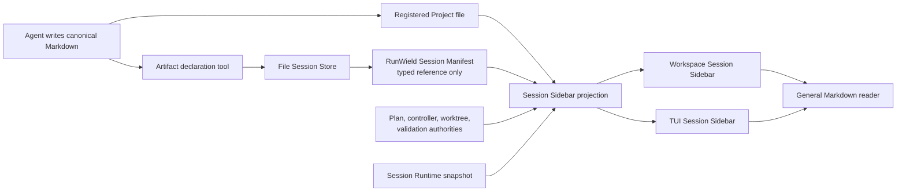

# Shared Session Sidebar and Artifact Review

## Context

RunWield already has the product intent for a Workflow Rail in `docs/prd/workflow-rail-prd.md`, and the Workspace
Session screen PRD includes a selected-Session rendering. The current implementation is split and incomplete: Workspace
has a coarse active-Plan progress panel, while the terminal user interface (TUI) retains a persistent validation panel
above the composer. The executable Workspace Session MVP Plan explicitly defers the complete Workflow Rail. Neither
existing Plan defines a HumanLayer-like artifact tab or a durable Session-to-artifact catalog.

The desired product is broader and more useful than a rail that exists only during planned work. Every persisted
RunWield Session should have one secondary surface with **Workflow**, **Session**, and **Artifacts** tabs. Workflow is
selected while multi-step work is active; Session is the useful idle default; Artifacts remains available whenever the
Session has produced durable output. A new unsubmitted Session remains visually quiet and need not show an empty
sidebar.

The artifact model follows RunWield's existing authority boundaries. Canonical Markdown remains in the registered
Project. The umbrella RunWield Session Manifest, not an individual Pi Session Transcript Segment and not Workspace
SQLite, records which meaningful artifacts belong to the Session. Plans, PRDs, ADRs, Work Records, Epic Artifacts, and
other deliberately registered Markdown can therefore remain discoverable across Pi segment rollover without mining
arbitrary transcript paths or URLs.

The first child Plan delivers the Session Sidebar, artifact registration, and read-only viewing. The second child adds
an optional authored-document review loop for Ideator PRDs and Architect ADRs. It depends on the first child's manifest
contract and generalized Markdown reader.

## Objective

Make RunWield's controlled workflow and durable output continuously legible from both TUI and Workspace while preserving
one set of underlying authorities:

- the Session Manifest owns stable Session-to-artifact references but never owns document bodies or document lifecycle;
- a consumer-neutral projection supplies Workflow, Session, and Artifact facts to both presentation surfaces;
- TUI and Workspace render the same sidebar concepts with layouts suited to terminal and browser constraints;
- ambient validation state moves out of the TUI's full-width validation panel and into Workflow, while blocking choices
  remain next to the composer;
- meaningful Markdown is registered explicitly and opens through one generalized read-only artifact viewer;
- Ideator and Architect can offer review for a completed PRD or ADR without forcing review, borrowing Plan review's
  feedback ergonomics without borrowing Plan approval, readiness, or execution semantics.

The main option set aside is a transcript-derived “files mentioned or touched” browser. It would require heuristics to
guess meaning and ownership, expose incidental or sensitive paths, and make the Session catalog disagree with canonical
Project artifacts.

## Vertical Slice Findings

The existing system already has the required authority boundaries but not the joining contract:

- `src/shared/session/file-session-store-types.ts` defines the file-authoritative Session Manifest. It currently owns
  identity, display name, activation, committed generation, and ordered transcript segments, but no artifact relations.
- `src/shared/session/file-session-storage.ts` already writes the manifest atomically and mirrors recovery descriptors.
  Artifact mutation must travel through the File Session Store under the Session Writer Lock so every durable copy stays
  consistent.
- `src/shared/session/session-transcript-manifest.ts` projects all Pi transcript segments belonging to one RunWield
  Session. The artifact catalog belongs beside that lineage, not inside one segment.
- `src/ui/workspace/islands/SessionSurface.jsx` currently derives four coarse Plan stages and renders Session and Plan
  metadata only when an active Plan exists. It cannot honestly supply owner, reason, next action, or artifact facts.
- `src/ui/workspace/server/owner-plan-progress.ts` already joins canonical Plan, controller, worktree, validation, and
  activation evidence. It is a useful source for a consumer-neutral active-workflow projection, but the presentation
  island must stop inventing missing states.
- `src/ui/tui/chat-view.ts` allocates a vertical `validationPanelContainer` above the active interaction and composer.
  `src/ui/tui/api.js` owns its transient rendering. This is the panel the Workflow tab replaces for ambient state.
- `src/ui/workspace/react/ArtifactReadSurface.tsx` and `src/ui/review/review-launcher.ts` already render canonical Plan
  and Work Record Markdown with front matter, table of contents, notices, images, and read-only content. Their closed
  `plan | work-record` type is the main limitation; the body renderer is already suitable for other trusted Markdown.
- `src/tools/plan-written.ts` proves that a declaration tool can validate an authored artifact and cooperate with a live
  Hosted Session. PRDs and ADRs currently use generic Markdown write tools and have no durable completion or Session
  registration event.

## Expected Change Surface

The boundaries this Epic is expected to touch. This list is guidance, not an allowlist: each child Plan verifies the
real footprint during implementation and changes whatever its Implementation Steps need. Discovery that changes approved
intent — another subsystem joins the Epic, public behavior or architecture shifts, migration risk grows — comes back to
the user, not to the file list.

- `src/shared/session/file-session-store-types.ts`, `file-session-store.ts`, `file-session-storage.ts`, and recovery
  tests — add a typed, version-compatible Session artifact reference and locked, atomic, idempotent registration/read
  operations without putting Markdown bodies in Session state.
- New focused modules under `src/shared/session/` — own artifact validation/projection and the combined consumer-neutral
  Session Sidebar projection; presentation code consumes this contract rather than joining authorities independently.
- `src/shared/workflow/` and `src/ui/workspace/server/owner-plan-progress.ts` — expose existing canonical workflow facts
  needed for current stage, owner, subject, explanation, next action, attention, and evidence without moving lifecycle
  decisions into the sidebar.
- `src/tools/`, Agent toolsets, and `src/agent-definitions/` — add explicit Markdown artifact declaration for eligible
  Agents and later offer optional PRD/ADR review after successful registration.
- `src/ui/tui/` — add a responsive, collapsible, keyboard-operable Session Sidebar; move ambient validation progress
  into Workflow and retain blocking interaction controls near the composer.
- `src/ui/workspace/islands/SessionSurface.jsx` and focused components under `src/ui/workspace/components/` — replace
  the coarse conditional Plan panel with the persistent tabbed Session Sidebar and responsive drawer behavior.
- Workspace owner routes and Session continuation services — return sanitized sidebar projections and canonical Markdown
  destinations under existing Project and owner checks.
- `src/ui/workspace/react/ArtifactReadSurface.tsx`, review types, and `src/ui/review/review-launcher.ts` — generalize
  the read-only viewer and then reuse its Markdown presentation in an optional authored-artifact review mode.
- `docs/prd/workflow-rail-prd.md` and `docs/prd/runwield-workspace-session-screen.md` — align the product contract with
  a persistent Session Sidebar and explicit artifact catalog instead of a workflow-only rail.
- `docs/design-system.md` and the shared browser design-system layer — document only the sidebar tabs, stage treatment,
  artifact rows, responsive panel, and document-review patterns that implementation makes real.
- `docs/domain-language.md` — define Session Artifact, Session Artifact Catalog, Session Sidebar, and Authored Artifact
  Review when the children make those terms true; retire the Workflow Rail proposal as the umbrella presentation term.

## Reuse Opportunities

- File Session Store locking, atomic manifest writes, and recovery descriptors — keep the Session catalog file-only and
  recoverable without Workspace SQLite.
- Aggregate Transcript Projection and Runtime snapshots — reuse committed Session identity, configuration, usage, and
  active-workflow evidence without scraping rendered transcript text.
- `owner-plan-progress.ts` and canonical workflow owners — reuse evidence hydration while expanding the result into a
  consumer-neutral projection.
- `ArtifactReadSurface`, Plannotator `Viewer`, `SidebarContainer`, and existing artifact routes — reuse Markdown
  parsing, front matter, image-base handling, notices, and document outline.
- `plan_written` validation and review-conversation patterns — reuse safe path checks, retry/idempotency principles, and
  feedback delivery while keeping non-Plan artifacts out of Plan Lifecycle.
- RunWield browser primitives, `--rw-*` tokens, theme bridge, Session composer, and responsive Workspace shell — extend
  the current design language rather than introducing a separate HumanLayer visual system.

## Verification Plan

- Each child runs focused File Session Store, Runtime projection, TUI API/component, Workspace Session, artifact reader,
  tool, and Agent prompt suites through `scripts/run-tests.js`, never `deno test` directly.
- Each child runs `deno task seams:check` and `deno task ci`; browser work also runs `deno task workspace:check`,
  `deno task workspace:test`, and `deno task workspace:build`.
- Manual headed-browser verification runs from `deno task workspace:dev` at `http://127.0.0.1:5173` and covers active,
  idle, artifact-rich, artifact-empty, busy-other-surface, degraded, and narrow-screen Sessions.
- Manual TUI verification covers wide, narrow, collapsed, active-validation, blocking-interaction, and artifact-opening
  states without hiding the live transcript or composer.

### Outcome Evidence

- **Persistent shared Session Sidebar** — the same fixture Session produces equivalent Workflow, Session, and Artifacts
  facts in TUI and Workspace; active work selects Workflow, idle work selects Session, and a persisted Session with
  artifacts keeps Artifacts available even when no workflow is active.
- **One workflow projection** — TUI and Workspace tests consume one consumer-neutral projection. Removing canonical
  Plan, controller, worktree, validation, or Runtime evidence causes an explicit unknown/degraded fact rather than a
  guessed stage, owner, or action.
- **Manifest-owned artifact relations** — after a successful declaration, closing and reopening every RunWield surface
  returns the same typed artifact reference from `manifest.json`; deleting Workspace SQLite does not remove it; deleting
  or moving the canonical file produces an unavailable artifact state rather than cached Markdown.
- **Explicit catalog membership** — an eligible declared Markdown file appears once after duplicate declaration, while
  arbitrary files and URLs mentioned in transcript text never appear without registration.
- **Canonical general reader** — Plan, PRD, ADR, Work Record, Epic Artifact, and generic report fixtures render their
  current canonical Markdown through the same read-only surface with correct labels, notices, outline, and safe paths.
- **Optional authored review** — a PRD or ADR is registered before the user chooses; **Keep without review** ends
  without feedback or lifecycle mutation, while **Review now** can return annotated feedback for revision and later
  acceptance. Neither result creates Plan Events, Plan Status, readiness, execution policy, or a duplicate artifact row.
- **Validation presentation migration** — ambient validation remains visible in Workflow while the old full-width TUI
  validation panel no longer renders; retry, recovery, approval, Pair checkpoint, and destructive confirmations remain
  blocking interactions next to the composer.

Existing behavior that must remain protected: Session Writer Lock and Session Control enforcement, atomic generation and
segment rollover, file-only Core operation, Workspace Project authorization and path sanitization, Plan review and
approval, code review, Work Record status notices, validation and recovery authority, draft preservation, and responsive
conversation-first Session layout.

Behavior expected to stop existing: the workflow-only rule for the secondary Session surface, the TUI's persistent
full-width ambient validation panel, Workspace's component-local four-stage approximation presented as the complete
workflow, and the Plan/Work-Record-only limitation of the read-only Markdown renderer.

## Edge Cases & Considerations

- Older manifests have no artifact array. Readers treat that as an empty catalog, and the first locked write upgrades
  the manifest without rewriting transcript evidence or minting a new Session.
- Registration is path-safe, Project-relative, Markdown-only, and idempotent by normalized artifact kind and canonical
  relative path. Symlink escape, wrong Project, missing file, directory, unsupported kind, and mismatched canonical
  location fail without changing the manifest.
- The canonical file may later be renamed, archived, superseded, or deleted. The catalog retains the historical relation
  but readers re-resolve current authority and show precise unavailable, archived, or superseded state.
- The manifest stores small metadata only: stable artifact ID, kind, normalized Project-relative path, title,
  registration time, registering Agent, and source segment when available. It does not store Markdown, annotations,
  review conversations, validation status, or copied Plan/Work Record fields.
- Registration requires the Session Writer Lock. Read-only Workspace observers can list and open registered artifacts
  but cannot mutate the catalog.
- TUI artifact selection opens the Workspace-styled canonical reader. If no persistent Workspace page is available, the
  existing local read-surface launcher supplies a short-lived browser page rather than failing or printing raw Markdown.
- The sidebar is ambient presentation, not a new action authority. Safe links may navigate to established review,
  recovery, or artifact surfaces; lifecycle mutations continue through their existing guarded routes.
- PRD/ADR review acceptance records only that the user finished this review interaction. It is not a document lifecycle
  status and cannot imply correctness, approval for implementation, or Plan readiness.
