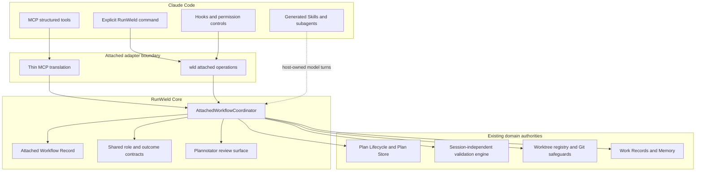
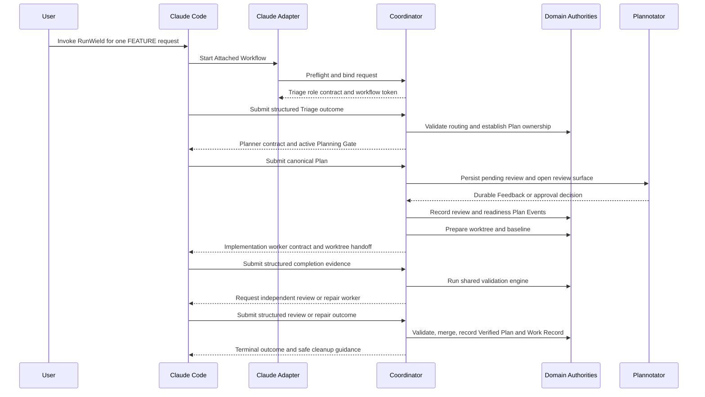
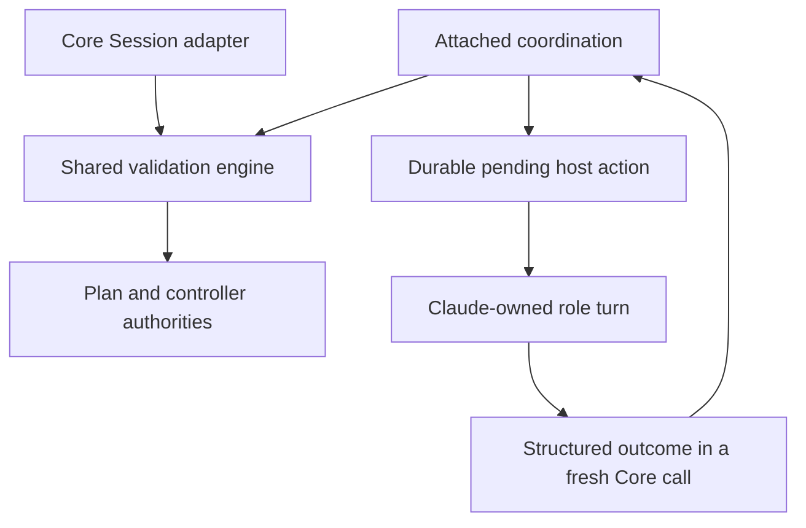

# RunWield Connect for Claude Code: FEATURE Preview

## Context

[RunWield Connect](../prd/runwield-connect-prd.md) defines the plugin ecosystem in which an External Agent Host owns the
conversation, model access, and every agent turn while RunWield owns durable workflow truth. **Attached mode** remains
the internal architecture and **Attached Workflow** the per-request domain term. This Epic covers only the first release
stage: the complete first-party RunWield Connect for Claude Code FEATURE Preview journey. Claude stable support and
later Codex, OpenCode, and Pi plugins will be planned as subsequent Epics using evidence from this vertical slice.

The Preview must prove that a user can install the Claude adapter, explicitly invoke RunWield for one FEATURE-sized User
Request in an otherwise uninitialized trusted Git repository, plan and review without implementation edits, execute in a
RunWield-owned worktree, pass the canonical Workflow Validation and merge safeguards, recover from supported process
loss, produce a Work Record and eligible memory outcome, then continue using Claude Code normally outside Attached
Workflows. Every model call in that journey remains Claude Code-owned. RunWield must not create a hidden Pi Agent
Session, require separate model credentials, or import the Claude conversation transcript.

The validation-engine extraction prerequisite is delivered. The approved
[August 5 Work Record](../work-records/2026-08-05-session-independent-workflow-validation-engine-extracted-from-validation-ts.md)
records its verification and explicitly identifies this Epic as able to proceed. Current
`src/shared/workflow/validation.ts` composes `validation-engine.ts` with `validation-session-adapter.ts` for Core
Sessions. Attached coordination must consume the existing engine rather than extract or copy validation policy again.

Extraction does not establish Connect readiness. The runtime interface still awaits Agent turns and user interactions.
This Epic must make pending host actions, accepted outcomes, and fresh-process continuation durable while preserving the
shared engine's sequencing and gates. This is remaining Connect integration work, not an uncompleted extraction
prerequisite. The historical Work Record is delivery evidence; current source remains the implementation baseline.

[ADR-014](../adr/014-attached-workflow-coordination-boundary.md) records the accepted boundary: an
`AttachedWorkflowCoordinator` is a sibling runtime to `SessionRuntime`. Short-lived `wld attached ...` commands are the
canonical Core boundary, and Model Context Protocol (MCP) is a thin model-facing adapter over those same operations. The
existing TUI, Agent Client Protocol (ACP), and SessionRuntime paths remain RunWield-executed Session surfaces and do not
become Attached Mode dependencies.

This control direction is the defining Connect boundary. If RunWield owns the Session and invokes Claude through
`claude -p`, Claude is a Core Execution Backend alongside Pi; that capability is not Connect and has no separate product
mode name.

### Capability ownership and acceptance mapping

All Attached capabilities below are target outcomes. Existing Core authorities are the reuse baseline; this Epic does
not claim an adapter has shipped. Each eventual child must update the owning capability and its scenarios when its
behavior changes, retaining unmet outcomes as target scope and fixing affected references. Shared behavior keeps one PRD
owner. The complete Preview journey is an integrated Epic outcome, not evidence supplied by one child alone.

| Epic outcome                                                                                  | Owning capability and acceptance scenarios                                                                                                                                                                                                                                                                                                                            | Required reconciliation when delivered                                                                                                                                                 |
| --------------------------------------------------------------------------------------------- | --------------------------------------------------------------------------------------------------------------------------------------------------------------------------------------------------------------------------------------------------------------------------------------------------------------------------------------------------------------------- | -------------------------------------------------------------------------------------------------------------------------------------------------------------------------------------- |
| Explicit activation; ordinary Claude use and unrelated conversations stay unaffected          | [Connect: Explicit per-request activation](../prd/runwield-connect-prd.md#explicit-per-request-activation): inactive installation, one-request activation, disable/uninstall                                                                                                                                                                                          | Record the supported activation and inactive behavior; keep later host adapters as targets.                                                                                            |
| Every model call remains Claude-owned, including independent workers                          | [Connect: Host-owned reasoning](../prd/runwield-connect-prd.md#host-owned-reasoning): complete change and isolated-worker scenarios                                                                                                                                                                                                                                   | Document the tested host-owned role dispatch and any unsupported worker capability.                                                                                                    |
| Canonical Plan submission, Feedback, reviewed-revision approval, and lifecycle outcomes       | [Connect: Shared Plan and verification outcomes](../prd/runwield-connect-prd.md#shared-plan-and-verification-outcomes); [Core: Plan review](../prd/runwield-core-prd.md#plan-review) and [Plan lifecycle](../prd/runwield-core-prd.md#plan-lifecycle): structured approval, missing evidence, validation versus delivery                                              | Update Connect's supported review journey; keep approval and lifecycle rules authoritative in Core. Preserve manual acceptance as distinct from automated verification.                |
| RunWield-owned implementation worktree and unchanged invoking checkout                        | [Connect: Isolated implementation](../prd/runwield-connect-prd.md#isolated-implementation): approved worktree handoff and explicit fallback scenarios                                                                                                                                                                                                                 | Describe the tested handoff and disclosed fallback; preserve Core isolation and recovery rules.                                                                                        |
| Shared CI, independent Semantic Review, repair, optional human review, and proven publication | [Core: Execution, validation, and recovery](../prd/runwield-core-prd.md#execution-validation-and-recovery), [Semantic review and repair](../prd/runwield-core-prd.md#semantic-review-and-repair); [Connect: Shared Plan and verification outcomes](../prd/runwield-connect-prd.md#shared-plan-and-verification-outcomes): missing checks and unsupported verification | Update shared requirements in Core only where behavior changes. Connect identifies supported host continuation; local validation never claims publication.                             |
| Structured Work Records and eligible memory without transcript ingestion                      | [Connect: Artifact privacy and records](../prd/runwield-connect-prd.md#artifact-privacy-and-records); [Core: Work records](../prd/runwield-core-prd.md#work-records) and [Project context and initialization](../prd/runwield-core-prd.md#project-context-and-initialization): attached recording and ordinary-conversation exclusion                                 | Preserve Core record/memory ownership and document the tested privacy boundary in Connect.                                                                                             |
| Lazy setup and continuation after host, Core, or review-process loss                          | [Connect: Lazy project setup and recovery](../prd/runwield-connect-prd.md#lazy-project-setup-and-recovery); [Core: Execution, validation, and recovery](../prd/runwield-core-prd.md#execution-validation-and-recovery): uninitialized repository, interruption, uncertain external effects                                                                            | Prove automatic repair of internal state and preserve work. Ask only for unresolved external prerequisites or consequential user choices; turn cancellation does not abandon delivery. |
| Honest version support, installation, update, disablement, and first-class Connect use        | [Connect: Compatibility and honest availability](../prd/runwield-connect-prd.md#compatibility-and-honest-availability) and [First-class Connect use](../prd/runwield-connect-prd.md#first-class-connect-use): tested support, limits, model ownership, permanent host use                                                                                             | Update tested Preview availability and host guides without implying stable or later-host support.                                                                                      |
| Complete installation-to-publication journey and post-workflow ordinary Claude use            | [Connect: End-to-End Preview Acceptance Journey](../prd/runwield-connect-prd.md#end-to-end-preview-acceptance-journey) and [Preview Acceptance](../prd/runwield-connect-prd.md#preview-acceptance)                                                                                                                                                                    | Reconcile the combined journey only after integrated evidence covers review, isolation, validation, publication, records, interruption recovery, and disablement.                      |

## Objective

Deliver a capability-disclosed RunWield Connect for Claude Code FEATURE Preview that completes the PRD's full
planned-work journey without weakening existing Plan Lifecycle or verification semantics.

Reuse the sibling-runtime boundary accepted in ADR-014. Making Attached another SessionRuntime adapter would require
representing a conversation Core does not own or substituting Core-owned model turns. Copying validation into a Claude
plugin would create a second authority. The chosen boundary adds durable host-action coordination but keeps changes to
shared workflow policy in the existing Core owners.

The Preview preserves Core Session, ACP, isolation, validation, publication, and record behavior. It adds explicit host
activation, host-owned role dispatch, and durable Attached continuation. It does not remove existing Core behavior.
Later adapters and stable Claude support remain outside this Epic. Claude owns the lifetime of the local MCP server.
That server hosts Attached coordination and browser review while Claude is open; closing Claude stops `wld` too. No
independent daemon or operating-system service is required.

### Target architecture

The dependency direction protects the product promise: Claude Code can ask Core to advance work, but only RunWield's
domain authorities can decide whether a Plan is approved, ready, implemented, validated, merged, or Verified.
`SessionRuntime` is deliberately absent from the Attached path.

### Host-owned process lifetime

Claude launches the configured local MCP server and keeps it alive across tool calls. The MCP server owns the lifetime
of the Attached coordinator and Plannotator/Workspace review servers. CLI calls and MCP requests reach the same Core
operations; MCP does not need to launch a fresh CLI subprocess for each request. Its transport layer still contains no
Plan Lifecycle, validation, worktree, or recovery policy.

Closing Claude stops the MCP server and its owned review processes, including their browser endpoints. A stopped host
does not imply approval, successful validation, publication, or abandonment. Plans, accepted decisions, pending actions,
and recovery evidence remain durable. A later explicit Connect activation can restore the workflow and reopen pending
review from canonical state; review need not remain available while Claude is closed.

### Ownership and persistence

- **Attached Workflow Record** — owns the binding between one explicit host request and one Attached Workflow, the
  adapter/Core versions and capability snapshot, the current pending external action, operation idempotency keys, and
  recovery checkpoints. It references the active Plan and worktree records but never copies their status or evidence. It
  is durable project-local RunWield state so a new Core process can resume safely.
- **Plan Lifecycle and Plan Store** — remain the only authorities for canonical Plan content, Plan Events, Plan Status,
  approval, readiness, and verification. Attached operations must call the same transition services as Core Session
  workflows.
- **Consequential-work ownership** — must recognize the Attached Workflow without introducing a host-owned lifecycle.
  Reuse controller revision checks and existing transition/registry protections; coordinate ownership so two host turns
  cannot advance the same pending action. Host session identifiers are binding evidence, not authority. The current
  glossary does not define a Plan Workflow Lease; do not assume an archived lease proposal is implemented.
- **Worktree Registry and Git** — retain ownership of worktree identity, path, baseline, registry status, physical Git
  state, merge-back, and cleanup. Claude workers operate in a handed-off RunWield worktree and never create a competing
  worktree lifecycle.
- **Session-independent validation engine** — owns the shared Mechanical Validation, local continuous integration (CI),
  Semantic Code Review convergence, repair, optional human review, and publication sequencing. The coordinator supplies
  or requests host turns through its external-action protocol; it does not reimplement validation policy. The
  [validation authority matrix](../validation-authority.md#authority-matrix) owns the current division of Plan,
  controller, review, worktree, and publication facts. Attached records reference these authorities rather than copy
  their checkpoints or receipts. [ADR-016](../adr/016-proof-bearing-publication-state-machine.md) governs publication
  evidence, restart reconciliation, and cleanup; a successful validation result alone does not prove delivery.
- **Compatibility Matrix** — owns tested capability claims for supported Claude Code and adapter/Core version ranges.
  Preview preflight uses this versioned data and fails before relying on an unsupported hook, worker, permission, or
  worktree capability.
- **Generated Claude assets** — are projections of canonical layered RunWield agent definitions and Skills. They carry a
  version stamp and may be regenerated or removed; they never become the source of role policy.

### Coordination contract

Every canonical CLI operation accepts a typed envelope containing the Attached Workflow identity, canonical Project root
evidence, host and adapter version evidence, an operation id for safe retries, the expected workflow checkpoint
revision, and one structured payload. Mutating operations use an expected-revision check (compare-and-swap, or CAS) so
two host turns cannot silently overwrite each other. Responses return the committed revision, durable state summary,
next required action, applicable role-contract reference, pending interaction or review information, and explicit
recovery actions when an outcome is uncertain.

Before a Core call exits to await Claude or a user, the pending action must have a durable identity and refer to the
applicable reviewed Plan revision, candidate/worktree, role contract, and workflow revision. A fresh process accepts an
outcome only for that issued action and its current evidence. Repeated submission returns the recorded result without
repeating effects; a delayed result cannot advance a superseded action. The shared engine remains the owner of which
phase follows. Core-owned tool implementations must not be serialized as host-action contracts.

The operation families cover activation and capability preflight, Triage submission, Plan submission and review,
readiness and execution preparation, implementation completion, validation/review/repair outcomes, status and recovery,
cancellation/closure, and optional project initialization. Exact command spelling is adapter-facing, not a second user
lifecycle command suite; the primary user action remains the host-native equivalent of `/runwield <request>`.

MCP tools expose the same typed operations to Claude's model within the host-owned server process. They may validate
protocol framing and translate errors, but they call the coordinator surface and contain no Plan, worktree, validation,
or recovery decisions. Deterministic hooks invoke the CLI directly because Planning Gate enforcement and host lifecycle
callbacks must not depend on the model choosing to call a tool.

### Critical control flow

The host-visible conversation coordinates progress, but Core validates every outcome against artifacts and current
state. A model claim such as "implementation complete" cannot advance a Plan without the expected worktree, diff,
baseline, lifecycle position, and completion contract.

### Claude-specific adapter behavior

- Installation presents the integration as **RunWield Connect for Claude Code**, uses Claude Code's first-party plugin
  mechanism, and obtains or verifies a compatible local RunWield Core without asking for model credentials or a RunWield
  account.
- Activation is per request. Hooks, role context, and mutation restrictions are inert unless their host session is bound
  to a live Attached Workflow.
- The Planning Gate uses Claude's deterministic pre-tool permission/hook controls to deny edits and mutating command
  paths during planning, with baseline/working-tree inspection as defense in depth. The capability matrix discloses any
  path the tested host version cannot observe; the adapter may not describe prompt instructions as a hard gate.
- Canonical role prompts and Skills are materialized from local Core's effective layered assets. Install/update obtains
  the bundled baseline; activation must also respect the current project's and user's overrides. Preflight rejects stale
  materializations rather than running an older copied prompt against a newer contract.
- Fresh Claude-hosted subagents provide implementation, independent Semantic Code Review, repair, re-verification, and
  bounded recording contexts where independence affects trust. The invoking conversation remains the user-facing
  coordinator; no RunWield process invokes `claude -p` or another model process for Attached work.
- Plan and human code review reuse Plannotator. Because Core is process-per-call, review decisions and waiting reasons
  must be durable and pollable rather than existing only in an in-process `waitForDecision()` promise. Persist the
  actual reviewed semantic revision so an old browser approval cannot approve meaningful content changes;
  formatting-only normalization preserves approval. The MCP server owns the review process lifetime, and closing Claude
  closes its review endpoints. Durable decisions survive termination without requiring browser availability after host
  closure.
- Disabling or uninstalling the adapter leaves Plans, Work Records, worktree recovery evidence, and Attached Workflow
  checkpoints intact. It removes generated host assets and restores ordinary Claude behavior; recovery remains available
  after reinstalling a compatible adapter.

## Vertical Slice Findings

- `src/shared/workflow/plan-lifecycle.js` and `state-transition.ts` already centralize Plan Events and guarded Plan
  Status transitions. This is the authority the coordinator must call rather than a Claude-specific lifecycle.
- `src/plan-store.js`, `src/shared/worktree.js`, `worktree-registry.js`, review-ledger logic, merge verification, and
  Work Record generation are largely session-independent and reusable.
- `src/shared/workflow/orchestrator.ts`, `workflow.js`, `engineer-runner.ts`, and `planning-agent.ts` drive
  Pi/HostedSession turns directly and interpret protected tool results as orchestration signals. Retrofitting Attached
  state into these modules would create fake Hosted Sessions or contaminate SessionRuntime with a conversation it does
  not own.
- `src/shared/workflow/validation.ts` now composes the shared engine with `validation-session-adapter.ts`. The engine
  reloads canonical checkpoints across phase calls. `validation-ports.ts` still exposes awaited Agent turns and user
  interactions, and semantic review has process-local turn management. Durable host-action suspension and outcome
  resumption remain to be established without copying engine policy.
- `src/shared/workflow/validation-semantic.ts` constructs a review-diff tool through `review-diff-tool.js`, whose
  implementation imports Pi packages. Direct-import checks alone do not prove an Attached execution path is independent
  of SessionRuntime or serializable across calls. Host-specific executable tool materialization belongs at the adapter
  boundary; shared inspection and review semantics remain Core-owned.
- `src/shared/session/agent-assets.ts` exposes bundled role assets without requiring a Session. It is a reusable
  baseline, not by itself the resolver of effective project/home/bundled policy. Generated assets must preserve existing
  layered customization and avoid independent copies of role policy.
- `src/ui/review/review-launcher.ts` exposes Plannotator through the Workspace review server. In
  `src/ui/workspace/server.js`, `startReviewWorkspaceServer()` starts a server in the calling process and returns an
  in-memory decision promise. Durable reviewed-revision decisions and browser-process ownership must both be covered.
- ADR-010 makes TUI and ACP sibling adapters over SessionRuntime. Attached is not another such adapter because the
  External Agent Host executes the model turns. ADR-014 preserves ADR-010's dependency direction by introducing a
  sibling runtime over shared domain authorities instead.
- The [Claude CLI backend Work Record](../work-records/2026-08-06-claude-cli-execution-backend-completed.md) and current
  `src/shared/session/backends/claude-cli/` describe Core invoking Claude as an Execution Backend. Connect reverses that
  control direction: Claude Code is the External Agent Host. Protocol utilities may converge, but this Epic must not
  depend on that backend or reuse its model-execution ownership.

The reusable validation path and the new handoff meet at the existing engine:

This map describes the target Attached path alongside the current Session path; it does not claim host continuation is
implemented.

## Expected Change Surface

Existing paths below are evidence-backed reuse areas. `src/cmd/attached/`, `src/shared/attached/`, and
`src/attached/claude/` are proposed additions. This is architectural guidance, not an exhaustive file allowlist or a
child decomposition. If discovery changes approved scope or ownership, return that decision to the user.

- `src/cmd/attached/` — add the thin CLI composition layer for canonical Attached operations, structured JSON results,
  exit semantics, and user-facing diagnostics; command handlers delegate immediately to shared coordination services.
- `src/shared/attached/` — own the host-neutral coordinator, Attached Workflow Record/store, typed operation and outcome
  contracts, expected-revision/idempotency policy, capability matrix, next-action decisions, recovery classification,
  and architectural boundary tests. The host-owned MCP server hosts these capabilities and manages its review servers;
  shutdown closes owned resources without ending the durable delivery workflow.
- `src/shared/workflow/` — consume the existing session-independent validation engine and establish durable host-action
  suspension/resumption; centralize Triage, completion, review, and repair schemas currently implicit in Pi tool results
  so both carriers use one semantic contract. This Epic must not recreate validation sequencing here or in the adapter.
- `src/tools/` — make existing Core Session protected tools consume the same structured outcome contracts where needed
  to prevent semantic drift; tools remain Session carriers, not sources of workflow policy.
- `src/shared/session/agent-assets.ts` and related asset-resolution modules — expose the canonical layered role/Skill
  inputs and version evidence needed for host-native materialization without creating an Attached dependency on
  SessionRuntime.
- `src/shared/workflow/plan-lifecycle.js`, `state-transition.ts`, and `controller-registry.ts` — coordinate Attached
  ownership while preserving revision checks, transition guards, and existing durable authorities.
- `src/shared/worktree.js`, `src/shared/worktree-registry.js`, and execution-context services — support a host worker
  handoff and recovery packet without transferring worktree lifecycle ownership to Claude.
- `src/ui/review/review-launcher.ts` and `src/ui/workspace/` review endpoints — persist pending plan/code review
  decisions, waiting reasons, and resumable review identifiers for process-per-call coordination while preserving the
  existing Plannotator experience.
- `src/attached/claude/` — package the RunWield Connect for Claude Code plugin manifest, command/Skill/subagent
  templates, hooks, MCP transport adapter, asset materializer, install/update/disable/uninstall integration, and
  black-box host fixtures. Domain decisions are forbidden from this adapter area.
- `README.md`, `docs/`, and `docs/prd/runwield-connect-prd.md` — document Preview installation, explicit activation,
  capability limits, permissions, privacy, review, recovery, update/disable/uninstall, and the Connect/Core/Workspace
  product family without implying untested host parity.
- `docs/prd/runwield-core-prd.md` — update shared capability scenarios only where delivered shared behavior changes,
  keeping Connect-specific requirements in Connect and preserving the capability ownership mapping above.
- `docs/domain-language.md` — add agreed coordinator/record terms and ownership relationships in the implementation
  change that makes them true, without treating generated assets or compatibility projections as authorities.

## Reuse Opportunities

- `src/shared/workflow/plan-lifecycle.js` and `src/shared/workflow/state-transition.ts` — reuse canonical Plan Event
  guards, atomic transition behavior, locks, recovery actions, and Verified semantics.
- `src/plan-store.js` — reuse canonical Plan parsing, atomic writes, front-matter normalization, and project-root
  resolution.
- `src/shared/git-port.ts`, `src/shared/worktree.js`, and `src/shared/worktree-registry.js` — reuse real Git operations,
  baseline evidence, execution isolation, merge safeguards, and recovery records.
- `src/shared/workflow/validation-engine.ts` plus `validation-local-ci.ts`, `review-ledger.ts`, delivery hierarchy, and
  merge-verification modules — reuse one validation policy and evidence model across runtimes.
- `src/shared/session/agent-assets.ts` and layered resource resolution — reuse canonical project/home/bundled precedence
  when materializing Claude-native assets.
- `src/ui/review/review-launcher.ts` and Workspace review endpoints — reuse Plannotator instead of building a
  Claude-only approval or code-review product.
- `src/shared/work-records/` and existing memory candidate flows — synthesize durable knowledge from canonical evidence
  without transcript ingestion.
- `src/shared/runtime-preflight.ts`, process-liveness helpers, and existing structured CLI conventions — reuse local
  dependency diagnostics and safe process-loss reporting where their contracts fit.

## Verification Plan

- Automated: every Attached child Plan runs targeted tests through `deno run -A scripts/run-tests.js <test paths>`; the
  integrated Epic gate is `deno task ci`. Never run `deno test` directly.
- Automated: black-box Claude adapter coverage runs against each declared Preview-compatible Claude Code version and
  records the tested capability matrix. Test fixtures must verify hook inactivity outside Attached Workflows, Planning
  Gate denial, structured MCP/CLI parity, subagent role isolation, worktree handoff, cancellation, stale-version
  preflight, and disable/uninstall behavior.
- Automated: interruption suites terminate the Core process after durable planning/review checkpoints and after
  execution/validation side effects, then resume from a fresh process. Tests prove automatic reconciliation of internal
  effects and distinguish safely retryable operations from unresolved external uncertainty requiring a user decision.
- Automated: architecture tests enforce that Attached coordination modules do not import Pi AgentSession,
  SessionRuntime, TUI, ACP, or Claude adapter modules; MCP and Claude packaging modules cannot import Plan Lifecycle,
  worktree, or validation internals except through the coordinator operation surface.
- Manual: on a supported Claude Code version, install from the documented flow in an uninitialized trusted Git
  repository and complete the PRD's full 16-step FEATURE Preview journey, including Plannotator Feedback/resubmission,
  independent review/repair, optional human review when configured, merge-back, Work Record creation, and two
  process-loss recoveries.
- Manual: verify host-visible installation, update, compatibility, disable, and uninstall surfaces consistently use
  **RunWield Connect for Claude Code**, while logs and developer diagnostics may use the internal attached-mode terms.
- Manual: issue ordinary Claude Code prompts before activation, during a different host conversation, and after terminal
  closure/disablement; verify no RunWield role prompt, restriction, inspection, or state change applies.
- Manual: where review work alters visible Plannotator/Workspace behavior, use headed browser verification against
  `docs/design-system.md` and the existing shared design-system implementation.
- Expected: no Core process contacts a model provider or invokes a Claude/Pi model process; only host-originated turns
  produce planning, implementation, review, repair, and recording outcomes.

### Outcome Evidence

- **One shared validation policy** — Attached calls the existing validation engine consumed by the Core Session adapter;
  Attached code contains no copied review-round, repair-limit, human-review, or publication-gating policy.
- **Host waits survive Core exit** — before requesting a host-owned review, repair, interaction, or recording action,
  Core saves its pending identity and relevant Plan/candidate revision. A fresh process accepts the matching outcome
  once and resumes the shared phase. Duplicate and delayed outcomes cannot repeat effects or advance superseded work.
  Host contracts do not depend on serializing Pi tool objects or process-local reviewer handles.
- **Attached is a true sibling runtime** — `src/shared/attached/` has no imports from Pi AgentSession packages,
  `src/shared/session/session-runtime.ts`, `src/acp/`, or `src/ui/tui/`; transitive execution paths do not construct a
  HostedSession or execute a Core-owned model turn. SessionRuntime and ACP have no imports from Attached modules.
- **The CLI is canonical and MCP is translation-only** — every MCP tool maps to a typed coordinator operation also
  reachable through `wld attached`; MCP/Claude adapter modules contain no direct Plan Status mutation, validation,
  worktree registry, merge, or Work Record logic.
- **Core never makes an Attached model call** — integration instrumentation observes no provider network call and no
  Claude/Pi model subprocess started by Core across planning, implementation, review, repair, and recording; each role
  result is traceable to the External Agent Host adapter.
- **Inactive installation is a no-op** — black-box tests show that a normal Claude request without an active workflow
  receives no RunWield context injection, tool denial, repository inspection, or Attached state mutation.
- **Role policy cannot silently drift** — installed Claude Skills/subagents are generated from the effective canonical
  RunWield assets, carry matching Core/contract versions, and preflight fails with an actionable update path after
  either side becomes stale.
- **Planning blocks implementation mutation** — supported-version black-box tests deny editing and mutating command
  paths while the Attached Workflow awaits approval/readiness, and post-turn Git inspection detects baseline changes;
  the Preview capability matrix names any path that cannot be proven observable.
- **One workflow has one consequential owner** — two Claude sessions racing the same workflow or Plan cannot both commit
  an operation; expected-revision and canonical ownership checks reconcile or reject stale work rather than overwriting
  state. A host session identifier alone cannot claim lifecycle authority.
- **Structured host claims cannot skip guards** — fabricated completion, review-pass, repair, CI, or merge claims fail
  when the expected Plan Event position, worktree, diff, validation evidence, review ledger, or Git result is absent.
- **Verified has one meaning** — the Attached FEATURE journey reaches `verified` only after approval/readiness,
  RunWield-owned worktree execution, Mechanical Validation, configured CI, independent Semantic Code Review and bounded
  repairs, optional human review, and safeguarded merge-back have committed through the canonical Plan Lifecycle.
- **Recovery is durable and honest** — killing host or Core at one planning/review checkpoint and one
  execution/validation checkpoint lets a fresh process reconcile available evidence, automatically repair internal
  bookkeeping, and continue safely. Only unresolved external uncertainty or a consequential user choice asks for input.
  No blind replay or silent lifecycle advancement occurs; cancellation and retry limits preserve continuation.
- **Review remains canonical** — Plan Feedback, approval, and human code-review decisions are persisted by the existing
  Plannotator/Workspace surface as structured outcomes and survive review-server or CLI-process loss. Approval is bound
  to the actual reviewed semantic revision; meaningful content changes reject stale approval while formatting-only
  normalization preserves it. After explicit reactivation, the MCP server makes pending review available again without
  fabricating an approval.
- **Claude owns process lifetime** — the MCP server stays alive across tool calls and hosts Attached coordination and
  browser review. Closing Claude stops the server and its owned review endpoints; no independent service remains.
  Durable workflow state survives, and later activation restores it without replaying accepted decisions or treating
  shutdown as abandonment.
- **Execution isolation remains RunWield-owned** — the implementation worker's path, baseline, registry identity, merge
  candidate, publication result, and cleanup decision all resolve through the existing worktree authorities; no
  Claude-created parallel registry or lifecycle exists.
- **No transcript is imported** — Attached persistent state, Plans, review evidence, Work Records, memory candidates,
  and telemetry contain only the explicit request and typed workflow evidence; black-box fixtures can include sentinel
  host conversation text that never appears in RunWield artifacts or indexes.
- **Lazy onboarding works** — the first FEATURE request succeeds in an uninitialized trusted Git repository while
  previewing material repository-local changes and creating only the state and canonical artifacts required by that
  workflow; richer `/runwield:init` behavior remains optional.
- **Disablement preserves recovery** — disabling or uninstalling generated Claude assets restores ordinary host behavior
  without deleting canonical Plans, Work Records, worktree registry entries, or Attached recovery checkpoints.
- **The full Preview promise is black-box proven** — the linked Connect Preview acceptance journey and capability
  scenarios are covered by one repeatable supported-version test from installation through Verified Plan, Work
  Record/memory outcome, interruption recovery, and post-workflow ordinary Claude behavior; passing unit tests without
  this journey is insufficient release evidence.

Existing behavior that must remain protected after every child lands:

- Core TUI/Workspace Sessions continue to use SessionRuntime, existing transcript segmentation, interaction/event
  semantics, routing, planning, execution, validation, and recovery behavior.
- ACP remains a client of RunWield-executed Sessions and preserves ADR-010's dependency direction.
- Existing Plan statuses, Plan Events, readiness rules, validation convergence, worktree publication safeguards, and
  Work Record provenance retain their current meaning.
- Existing layered agent customization continues to resolve project-local, then home, then bundled assets.
- `deno task ci`, the seam ratchet, architecture boundaries, and sandboxed test rules remain green.

Behavior expected to stop existing:

- No existing Core Session, ACP, Plan Lifecycle, or validation behavior is intentionally removed by this Epic.
- Within the new Attached path, prompt-only planning enforcement, copied role prompts, host-prose lifecycle transitions,
  in-memory-only review waits, and adapter-owned Plan/worktree/validation state must never exist as accepted behavior.

### Integration Notes

Left by the reviewers of individual children for the integration review. These are places to look, not requirements.

<!-- runwield:integration-notes:start child="attached-mode-claude-feature-preview/01-activate-and-resume-an-attached-workflow" -->

**attached-mode-claude-feature-preview/01-activate-and-resume-an-attached-workflow**

- Once later children add states, confirm that `nextActionFor` gives every new state an explicit next action. Today any
  state other than `triaging` (with a pending action) or `awaiting_planning` falls through to
  `return_to_host`/`unsupported_in_preview`. A `triaging` record with a null `pendingAction` falls through the same way.
  (src/shared/attached/coordinator.ts nextActionFor; children 02-06)
- When child 02 adds the Plan reference and controller-registry ownership, confirm that it extends
  `AttachedWorkflowRecord` (schemaVersion 1), `PendingTriageAction.role`, and the strict `parse*Input` allowlists. It
  must keep revision CAS and operationId replay for the new operations and must not add carrier-side checks.
  (src/shared/attached/record-store.ts, operations.ts; child 02)
- Confirm the no-home fallback path (`.wld/internal/attached/` inside the primary checkout) is reconciled with child
  02's managed .gitignore setup preview. Without a home directory, activation writes into the repository before that
  preview. (src/shared/attached/record-store.ts locateAttachedWorkflows; child 02)

<!-- runwield:integration-notes:end child="attached-mode-claude-feature-preview/01-activate-and-resume-an-attached-workflow" -->

<!-- runwield:integration-notes:start child="attached-mode-claude-feature-preview/02-plan-one-feature-request-inside-claude-code" -->

**attached-mode-claude-feature-preview/02-plan-one-feature-request-inside-claude-code**

- Plan review must read current Plan state, because users can run a submitted Plan with wld before Attached review
  starts. (Child 03; src/shared/attached/coordinator.ts planWritten and the stored Plan reference.)

<!-- runwield:integration-notes:end child="attached-mode-claude-feature-preview/02-plan-one-feature-request-inside-claude-code" -->

<!-- runwield:integration-notes:start child="attached-mode-claude-feature-preview/05a-run-workflow-validation-without-a-core-session" -->

**attached-mode-claude-feature-preview/05a-run-workflow-validation-without-a-core-session**

- Child 05's MCP `review_diff` must record coverage spans with `getDiffCoverage` over the exact `fullDiff`/`repairDiff`
  strings in the reviewer request. It must pass them back unchanged in `resume.coverage` with the request's `identity`.
  Spans for any other diff text, scope, or path are rejected as incomplete or mismatched.
  (src/shared/workflow/review-diff.ts, validation-host-state.ts validateHostReviewerResume, child 05 coordinator/MCP)
- Child 05 must route every `task_completed` resume through `continueHostTurnValidation` with the repair request's full
  identity (attemptId, generation, repairGeneration). Child 05 must not call `recordValidationRepairCompletion` directly
  while a validation owner is live, because it now throws when another owner is alive. (validation-supervisor.ts
  continueValidationAttempt / recordValidationRepairCompletion, child 05 coordinator)
- Child 06 must extend `continueHostTurnValidation` past `awaiting_delivery`. The engine currently short-circuits the
  delivery phase whenever `args.hostTurn` is set (validation-engine.ts runValidationPhase). (validation-engine.ts,
  child 06)

<!-- runwield:integration-notes:end child="attached-mode-claude-feature-preview/05a-run-workflow-validation-without-a-core-session" -->

## Edge Cases & Considerations

- **Extraction versus Attached readiness** — extraction is complete, but a synchronous runtime interface is not proof of
  durable host continuation. Preserve shared sequencing while establishing saved host actions and fresh-process outcome
  acceptance; do not add an Attached-only loop or temporary policy copy.
- **Host/Core/asset version skew** — preflight must fail before activation with exact update or regeneration guidance;
  it must not discover incompatibility after a Plan or worktree transition.
- **Two host conversations in one Project** — workflow tokens, host-session evidence, expected revisions, and canonical
  Plan/controller ownership protections prevent split-brain while unrelated ordinary conversations remain untouched.
- **Unstable host session identity** — treat host identifiers as evidence, not as durable truth by themselves. Recovery
  must rebind through Core-owned workflow identity and explicit user confirmation rather than matching transcript text.
- **Unobservable mutation paths** — capability preflight must disclose them and either use an existing explicit fallback
  or refuse the Preview journey. Post-turn inspection is defense in depth, not proof that a hard pre-tool gate existed.
- **Dirty or nonstandard repositories** — preserve the existing Git/non-Git consent and worktree safety semantics.
  RunWield Connect must not silently clean, stash, reset, or relocate host work.
- **Worktree handoff failure** — prefer a fresh Claude subagent started in the RunWield worktree. Use only an existing
  explicit in-place consent path when its reduced recovery assurance is disclosed and the Preview's declared capability
  allows it; do not let Claude create an independent worktree.
- **Process death around side effects** — operations that may have started a subprocess, changed files, opened review,
  created a worktree, or attempted merge publication must journal intent and evidence. Uncertain effects require
  evidence reconciliation rather than blind replay. Automatically repair internal state; ask only for unresolved
  external uncertainty or a consequential user choice, preserving the recoverable workflow.
- **Review-server loss or port conflict** — durable review identity and decisions must permit restart on another local
  port without changing Plan authority or losing Feedback.
- **Host cancellation, quota exhaustion, or worker failure** — checkpoint the waiting reason and preserve recovery
  metadata. A stopped host turn is not completion and does not release consequential ownership silently.
- **Malicious or malformed structured outcomes** — validate schemas, canonicalize Project/worktree paths, bound payload
  size, reject transcript-shaped blobs, and never interpolate host text into shell commands.
- **Privacy-safe metrics** — capture operation outcomes, timing, capability fallbacks, recovery, and verification state;
  exclude prompts, transcripts, source content, secrets, and sensitive paths.
- **Update, disable, and uninstall during active work** — generated assets may be removed, but Core-owned workflow and
  worktree evidence remains. Reinstallation must either resume compatibly or explain why an older workflow requires a
  specific adapter/Core version.
- **Future host portability** — the coordinator contract remains host-neutral, but this Epic must not generalize Claude
  assumptions into false Codex/OpenCode/Pi claims. Later adapters begin with their own tested capability matrices and
  Preview Epics.
- **Host shutdown and review lifetime** — Claude owns MCP startup and shutdown. MCP owns coordination and review server
  resources; do not detach an independent daemon or keep review alive after Claude closes. An interrupted shutdown may
  leave an uncertain operation, so later activation reconciles durable evidence rather than assuming it completed.
  Process shutdown preserves recoverable work and never becomes an implicit user abandonment decision.
- **Preview compatibility** — freeze supported Claude versions and experimental capabilities from black-box evidence; a
  host API listed in documentation is not sufficient release proof.
- **Proposed domain language** — `Attached Workflow Coordinator`, `Attached Workflow Record`, `Role Contract`, and
  `Compatibility Matrix` are target-state terms. The implementation change establishing each concept must update
  `docs/domain-language.md`; until then, the current glossary remains implemented truth.
