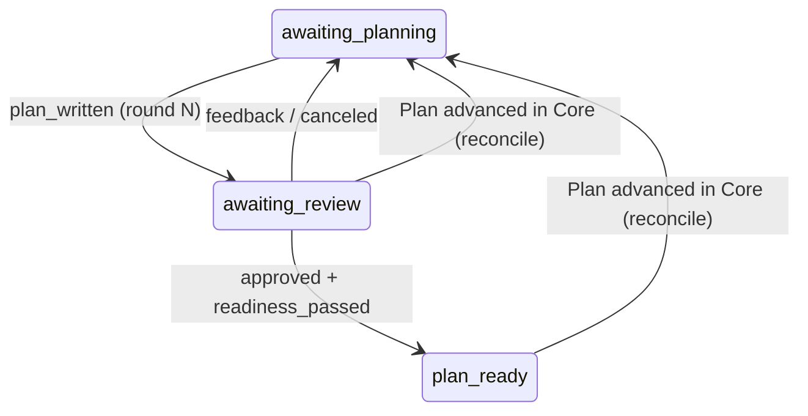

# Review and approve Plans through durable Plannotator decisions

## Context

Child 02 delivers `plan_written`: Claude submits a Plan and the Attached Workflow Record stops at `plan_submitted` with
no pending action. Nothing opens a review.

Core review today is process-local: the Session runtime opens the Plannotator browser surface and waits on an in-process
promise (`waitForDecision`); the browser POST resolves that promise; only then does `applySharedPlanReviewDecision`
record the canonical `review_feedback` / `review_approved` Plan Events. If the waiting process dies, the decision is
lost. [ADR-014](../../adr/014-attached-workflow-coordination-boundary.md) already names the fix: durable pending-review
decisions plus status polling, never the promise alone.

Owning capabilities:

- [Connect: Shared Plan and verification outcomes](../../prd/runwield-connect-prd.md#shared-plan-and-verification-outcomes)
  — browser Feedback returns to the same attached planning flow; approval is recorded through Core; structured outcomes,
  not chat prose.
- [Connect: First-class Connect use](../../prd/runwield-connect-prd.md#first-class-connect-use) — the user stays in
  Claude Code. No Connect journey may require the `wld` CLI or TUI (user-confirmed decision; the CLI subcommands stay
  internal development carriers).
- [Connect: Lazy project setup and recovery](../../prd/runwield-connect-prd.md#lazy-project-setup-and-recovery) —
  review-process loss is recoverable; a closed browser tab or a dead MCP server is not abandonment.
- [Core: Plan review](../../prd/runwield-core-prd.md#plan-review) and
  [Plan lifecycle](../../prd/runwield-core-prd.md#plan-lifecycle) keep approval and readiness authority unchanged.

## Objective

After `plan_written`, the Plannotator review opens from the MCP server. The user can give Feedback, Claude revises and
resubmits into the next review round, and approval applies to the actual reviewed semantic revision and passes the
canonical readiness gate (`readiness_passed` → `ready_for_work`, child 04's input). Every decision is durable before the
browser is acknowledged. A fresh process restores a pending review or returns an already-applied decision without
inventing approval or repeating transitions — all through Claude Code and the browser, never the CLI or TUI.

## Approach

The record becomes the review authority; the promise stays only as Core's local waiter.

```text
Claude: plan_written (MCP)
  coordinator: awaiting_planning -> awaiting_review
    review { round, actionId, planRevision, waitingReason } persisted BEFORE any browser opens
  MCP server hosts the Plannotator surface, opens the browser
  result += review { url, round, guidance }        # carrier-appended, like instructions
Claude polls status

browser decision POST
  route -> durable sink -> coordinator applyAttachedReviewDecision
    applySharedPlanReviewDecision     # canonical Plan Events, unchanged semantics
    feedback  -> awaiting_planning + pending planner action (feedback, image paths)
    approved  -> + recordPlanEvent("readiness_passed") -> plan_ready
    canceled  -> awaiting_planning + pending planner action (cancel note)
  record transaction committed, THEN the browser gets { ok: true }
```



**The durable sink.** `startPlanReviewSurface` and the workspace app beneath it gain an optional `onDecision` handler.
In `resolveFromRequest` (review-handlers.js), a present sink is awaited after the decision is built and before
`resolveReviewDecision` / `{ ok: true }`; a sink rejection returns the same 409 error shape as a stale sequence decision
so the browser offers reload. Without a sink, behavior is byte-identical to today — that is the Core path, protected.

**Restoration, through Claude only.** A new plugin command `/runwield:plan-review` (matching child 02's
`/runwield:request` naming) tells Claude to call `status`. `status` gains an optional `workflowId`: omitted, it resolves
the project's most recent non-closed workflow, so a fresh Claude conversation with no workflowId in context still finds
it. When a result shows a pending review this process does not host, the MCP server hosts it (new port), opens the
browser, and appends the URL. Durable state is unchanged by rehosting. Set aside: a `wld attached review` CLI subcommand
— rejected by the First-class Connect decision; the CLI stays read-only.

**Racing and staleness.** The durable round arbitrates: a decision for a superseded round is rejected; a repeat of the
applied round returns the saved outcome (idempotent); a decision against a meaningfully changed Plan is rejected by the
existing `reviewSourceStillMatches` semantics, while formatting-only rewrites still approve. If the Plan moved past
review in Core (the user reviewed via `wld`), no attached review opens; the record reconciles to the Plan's actual
position instead of looping.

## Expected Change Surface

The boundaries this change is expected to touch. This list is guidance, not an allowlist: verify the real footprint
during implementation and change whatever the Implementation Steps need, including files not named here. Stop and report
only when discovery changes approved intent — the change reaches another subsystem, public behavior or architecture
shifts, migration or compatibility risk grows, or the Verification Plan no longer proves the objective.

```diff
 src/shared/attached/
+├── review-host.ts                     # hosts/restores the surface; durable onDecision sink wiring
 ├── coordinator.ts                     # awaiting_review/plan_ready, review rounds, decision application, reconcile
 ├── operations.ts                      # status workflowId optional; review fields in the view
 ├── record-store.ts                    # review field on the record; latest non-closed workflow lookup
 └── attached-test-fixture.ts           # review-round helpers
 src/attached/claude/
+├── plugin/commands/plan-review.md     # /runwield:plan-review
+└── review-carrier.ts?                 # ensure-hosting + URL append (mcp.ts stays thin)
 src/ui/review/review-launcher.ts       # optional onDecision threaded to the workspace app
 src/ui/review/plan-review.ts           # extract shared payload composition for both callers
 src/ui/workspace/server.js             # pass the sink into createReviewWorkspaceApp
 src/ui/workspace/routes/api/review-handlers.js  # await the sink before ack
 docs/domain-language.md                # Attached Review Round
 docs/prd/runwield-connect-prd.md       # delivered review journey + host-only restoration
 docs/adr/014-attached-workflow-coordination-boundary.md  # delivered durable-review consequence
```

Not touched: `applySharedPlanReviewDecision` and `reviewSourceStillMatches` (reused unchanged), the Core TUI review path
(`runtime-interaction-adapter.js`), `src/tools/plan-written.ts`, and Plan Events beyond what the shared action already
records. `docs/prd/runwield-core-prd.md` needs no requirement change; check its references only.

## Reuse Opportunities

- `applySharedPlanReviewDecision` and `reviewSourceStillMatches` (`src/shared/workflow/plan-review-actions.ts`) —
  canonical decision application and reviewed-content protection, unchanged.
- `startPlanReviewSurface`, `beginReviewRound`, and the `activePlanReviewConversations` reuse
  (`src/ui/review/review-launcher.ts`) — same browser page across rounds when the process survived.
- `submitPlanForReview` steps 1–3 (`src/ui/review/plan-review.ts`) — extract the payload composition (load,
  `assertSharedPlanWriteAllowed`, front-matter + triage-meta injection) into one helper both the TUI adapter and
  `review-host.ts` call.
- `isAnsweredPlanReview` (`src/shared/workflow/plan-review-recovery.js`) and `loadReviewFeedbackImages` — decision
  validation and feedback image paths.
- `recordPlanEvent` readiness step from `plan-executor.ts` — the same `readiness_passed` recording Core performs after
  approval.
- Child 01/02 machinery — `transactAttachedWorkflowRecord`, `checkWorkflowOperation`, `accept`, instruction attachment
  in `runAttachedOperation`, `installProcessExitCleanup` / `stopActiveReviewSurfaces`.

## Implementation Steps

1. `AttachedWorkflowState` is `"triaging" | "awaiting_planning" | "awaiting_review" | "plan_ready" | "closed"`. The
   record gains
   `review: { round, actionId, planRevision, waitingReason, status: "pending" | "applied", outcome? } | null`. An
   accepted `plan_written` writes state `awaiting_review` with `review.round = (previous round ?? 0) + 1`, a fresh
   `actionId`, `planRevision` = the Plan revision after the front-matter write, and `waitingReason: "user_decision"` —
   all before any carrier opens a browser. No record is written into `plan_submitted` anymore; existing `plan_submitted`
   records from child 02 testing get no migration (unused preview, child 02 precedent).
2. `coordinator.ts` exports `openAttachedReviewRound(projectRoot, workflowId)`. It requires state `awaiting_review` with
   `review.status === "pending"`, reloads the Plan, persists the Plan's _current_ revision as `review.planRevision`
   (what the browser will actually see — this is the "actual reviewed revision" on both first open and restore), and
   returns the payload basis: `planName`, Plan markdown, attrs, and triage meta from `record.triageOutcome`. When the
   Plan's status is not reviewable, it performs the reconciliation of step 10 instead and returns no payload.
3. `startPlanReviewSurface` accepts an optional `onDecision` sink, threaded through `workspaceServer` /
   `startReviewWorkspaceServer` / `createReviewWorkspaceApp` into `resolveFromRequest`. With a sink present, the route
   awaits it after building the decision (and after sequence checks) and before `resolveReviewDecision` and the
   `{ ok: true }` response; a sink rejection returns the existing stale-review 409 JSON so the browser offers reload.
   With no sink, every response is byte-identical to today.
4. `src/shared/attached/review-host.ts` exports the hosting functions used by the MCP carrier:
   `ensureReviewHosted(
   projectRoot, workflow)` calls `openAttachedReviewRound`, composes the browser payload through
   the helper extracted from `submitPlanForReview` (with `agentLabel: "Claude"` and no conversation events), starts the
   surface with `onDecision` routed to `applyAttachedReviewDecision`, and opens the browser. A hosted surface is keyed
   by `workflowId`; a resubmission reuses the live page through `beginReviewRound` instead of a new server. Hosting
   registers with the existing process-exit cleanup so surfaces stop when the MCP process exits.
5. `coordinator.ts` exports `applyAttachedReviewDecision(projectRoot, workflowId, round, decision)`:
   - A decision whose round is already `applied` returns the saved `outcome` unchanged (idempotent repeat).
   - A decision for any other round, or a record not in `awaiting_review`, is rejected `action_superseded`.
   - The decision is validated with `isAnsweredPlanReview`; `canceled` / `exit` close the round into `awaiting_planning`
     with a pending planner action whose note says the user canceled the browser review (user-confirmed decision).
   - Feedback: `applySharedPlanReviewDecision` records `review_feedback`; the record moves to `awaiting_planning` with a
     pending planner action carrying the feedback text and feedback image paths (`loadReviewFeedbackImages`).
   - Approval: `applySharedPlanReviewDecision` records `review_approved`, then `recordPlanEvent("readiness_passed")`
     makes the Plan `ready_for_work`; the record moves to `plan_ready` with no pending action.
   - The Plan-store writes happen first; the record transaction (which marks `review.status = "applied"` with the
     outcome) commits before the sink returns. A sink rejection (stale content, invalid policy) leaves the record
     unchanged with the round still pending.
6. `viewOf` exposes the review summary (`round`, `status`, `outcome`) and, for `awaiting_review`, `nextAction` is
   `{ kind: "review", round, planName }`; for `plan_ready` it is `{ kind: "plan_ready", planName }` with guidance that
   execution is a later Preview step (honest availability — child 04 adds the execution action). The post-feedback
   pending planner action exposes the feedback text and image paths so a polling `status` returns everything Claude
   needs without another call.
7. `parseStatusInput` makes `workflowId` optional; when omitted, the record store resolves the project root's most
   recent non-closed workflow by `updatedAt`. The MCP tool schema and CLI usage text for `status` match. All other
   operation names and schemas are unchanged — the decision application is browser-side, not an MCP tool.
8. The MCP carrier (`src/attached/claude/mcp.ts`, with the hosting logic in `review-host.ts`): after a `plan_written` or
   `status` result whose workflow has `review.status === "pending"`, it ensures the surface is hosted (hosting opens the
   browser; already-hosted returns the live URL) and appends `review: { url, round, guidance }` to the result, where
   `guidance` tells Claude to poll `status` and act on the outcome. When the stdio transport closes (Claude exits), all
   hosted surfaces stop; no daemon survives. The `plan_written` result keeps instruction attachment behavior from
   child 02.
9. `plan_written` from the post-feedback `awaiting_planning` (new planner `actionId`) accepts and opens round N+1.
   `plan_written` while `awaiting_review` is rejected `action_superseded` with a message saying a review is pending.
10. Reconciliation: `openAttachedReviewRound` and the `awaiting_review` view check the Plan's current status. When the
    Plan moved past review in Core, no review opens and the record reconciles to the Plan's actual position:
    approved-family statuses → `plan_ready`; `feedback` → `awaiting_planning` with a planner note to read the Plan
    Events; later statuses → closure with reason `plan_advanced_in_core` and an honest message. The view reports the
    reconciled position without writing; `openAttachedReviewRound` persists it. This also covers a death between the
    Plan-store writes and the record transaction in step 5.
11. The attached review payload carries `agentLabel` only — no host conversation events and no transcript content. The
    review URL token remains the existing random-token mechanism; nothing in the URL or saved review state exposes host
    conversation data.
12. `src/attached/claude/plugin/commands/plan-review.md` provides `/runwield:plan-review`: call `status` (with this
    conversation's `workflowId` when known, omitted otherwise) and follow the result — a pending review reopens in the
    browser; report honestly when none is pending. No step directs the user to the `wld` CLI or TUI.
13. `docs/domain-language.md` defines **Attached Review Round** (the durable pending-review identity — round, actionId,
    actual reviewed revision, waiting reason — on the Attached Workflow Record; _Avoid_: review promise, session-scoped
    review) and its relationship to Core Plan review authority. The Connect PRD's shared-outcomes scope note and
    First-class Connect use describe the delivered review journey and host-only restoration, keeping verification,
    execution, and publication target scope. ADR-014's process-lifetime consequence states the delivered mechanism
    (durable rounds, MCP-hosted surface, status rehosting) instead of the requirement. Core PRD references are checked
    and unchanged.

## Verification Plan

- Automated:
  `deno run -A scripts/run-tests.js src/shared/attached/ src/attached/claude/ src/cmd/attached/
  src/ui/review/review-launcher.test.ts src/ui/review/plan-review.test.ts
  src/ui/workspace/plan-review-decision-route.test.ts src/shared/workflow/plan-review-actions.test.ts
  src/shared/workflow/plan-review-recovery.test.js`.
- Durability (coordinator/review tests over the real record store and a real Git fixture):
  - Persist-before-open: after `plan_written`, the record on disk shows `awaiting_review` with round, actionId,
    planRevision, and waiting reason — before any surface exists. This fails if the review identity lives only in
    process memory.
  - Decision-before-ack: the browser route's `{ ok: true }` is observable only after the record shows
    `review.status === "applied"`. A sink rejection produces the 409 shape and leaves the record pending.
  - Fresh-process restore: stop the hosted surface, call `openAttachedReviewRound` + hosting again (new port), and
    submit the decision; it applies to the same round. This fails against an in-memory-only implementation.
  - Retrieve-after-loss: apply a decision, then call only `status` from a fresh entry point; the outcome (feedback text
    and image paths, or `plan_ready` + `ready_for_work`) is returned without repeating any transition.
  - Duplicate callback: the same round's decision repeated returns the saved outcome; the Plan file bytes do not change.
  - Staleness: a meaningful Plan edit during review rejects the decision and the record stays pending; a formatting-only
    rewrite still approves (mirrors `plan-review.test.ts` semantics through the attached sink).
  - Cancel: a canceled/exit decision returns to `awaiting_planning` with the cancel note; the Plan stays `draft`.
  - Readiness: approval records `review_approved` then `readiness_passed` and the Plan is `ready_for_work`; approval
    after the Plan advanced in Core reconciles instead of double-transitioning.
  - `status` without `workflowId` returns the project's most recent non-closed workflow.
- MCP (`src/attached/claude/mcp.test.ts`): the tool list is still exactly `activate`, `triage_report`, `status`,
  `plan_written`; a `plan_written` result carries `review.url` and round; a `status` result for a pending review carries
  the URL; transport close stops hosted surfaces.
- Route (`plan-review-decision-route.test.ts`): with a sink, the decision reaches the sink before acknowledgment;
  without a sink, existing Core assertions pass unchanged.
- Headed browser (pair): with `claude --plugin-dir src/attached/claude/plugin`, run `/runwield <request>` through
  planning; then (1) submit Feedback in the browser, watch Claude receive it via `status`, revise, and resubmit into the
  same browser page; (2) approve and confirm the Plan is `ready_for_work` and the record is `plan_ready`; (3) kill the
  MCP server while a review is pending, restart Claude, run `/runwield:plan-review` in a fresh conversation, and confirm
  the review reopens on a new port with the old endpoint dead and no decision fabricated.
- UI baseline: `deno task workspace:dev` serves `http://127.0.0.1:5173/dev/plan-review` with HMR; the fixture is not
  proof of durable Attached behavior — verify the production review flow too. Any visible change uses
  `docs/design-system.md` tokens and primitives.
- Protected behavior: Core TUI review (`plan-review.test.ts`, `runtime-interaction-adapter` tests,
  `plan-review-actions.test.ts`, `plan-review-recovery.test.js`, the Core cases of `plan-review-decision-route.test.ts`)
  passes unchanged; child 01/02 coordinator, CLI, and MCP tests pass. Behavior expected to stop existing: the
  `plan_submitted` state and its `nextAction` (child 02 assertions updated to `awaiting_review`); nothing else is
  removed.
- Docs: the glossary, Connect PRD scope notes, and ADR-014 describe delivered review/recovery behavior and do not claim
  execution, validation, publication, or code review.

## Edge Cases & Considerations

- A closed browser tab is not abandonment: the record stays `awaiting_review`; the hosted surface's URL still serves,
  and `/runwield:plan-review` re-opens the browser.
- Two live surfaces (restored while the old process still runs) arbitrate through the durable round: the first applied
  decision wins; the second is rejected or returns the saved outcome.
- Reviewer direct edits in the browser (`decision.plan`) flow through the canonical path unchanged, including the
  do-not-apply-twice guidance for the next Planner turn.
- Port conflict on restore is ordinary: the new surface binds a free port; identity, not the port, arbitrates.
- The primary change is durable review coordination, not browser redesign. If substantial visual scope emerges, Planner
  should assign that work to Frontend Engineer with headed verification.
- Assumption: `plan_ready`'s `nextAction` is a descriptive marker; child 04 replaces it with the real pending execution
  action. Reviewable, no user-visible claim is made.
