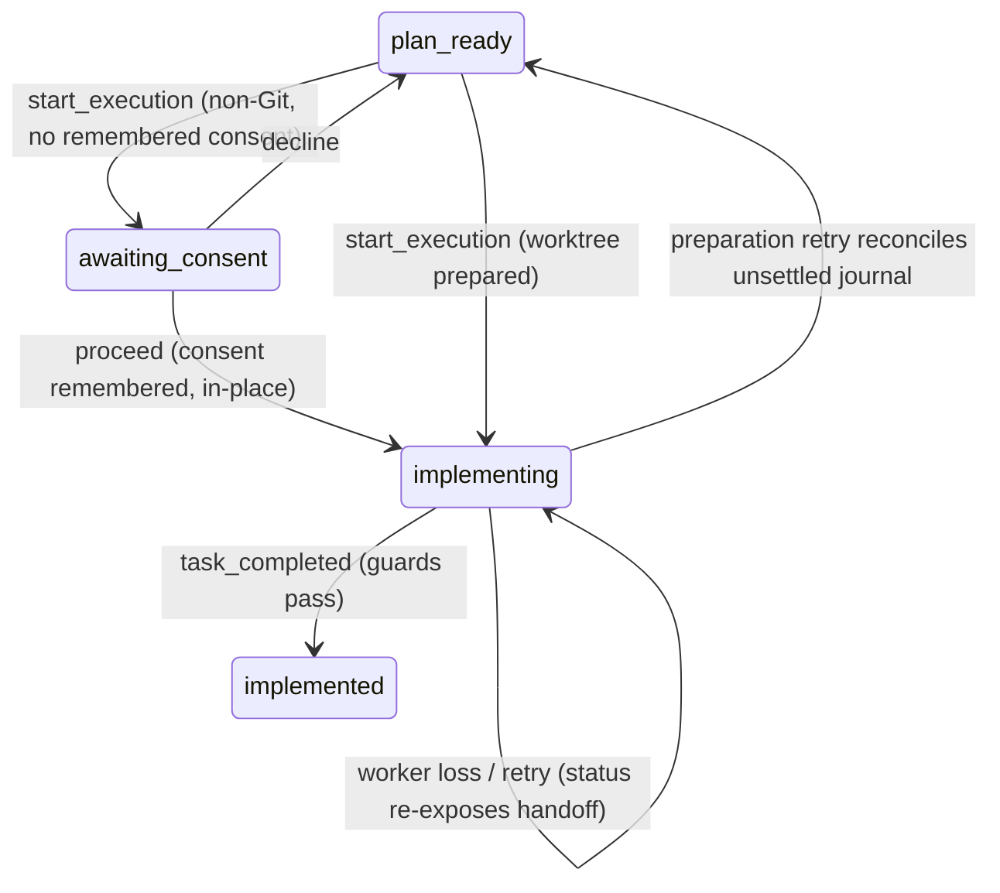

# Implement approved Plans in RunWield worktrees

## Context

Child 03 delivers durable Plannotator review: approval applies the canonical `readiness_passed` event and leaves the
Attached Workflow Record at `plan_ready` with the Plan at `ready_for_work`. The plugin currently tells Claude "execution
handoff is a later Preview step." Nothing implements an approved Plan.

The owning Connect capability is [Isolated implementation](../../prd/runwield-connect-prd.md#isolated-implementation):
planned FEATURE execution stays isolated in a RunWield-owned worktree, the invoking host conversation supervises a
host-native implementation worker in that worktree, all worker model calls come from the host, and no external host
creates a competing worktree lifecycle. Recovery follows
[Lazy project setup and recovery](../../prd/runwield-connect-prd.md#lazy-project-setup-and-recovery); every model call
stays host-owned under [Host-owned reasoning](../../prd/runwield-connect-prd.md#host-owned-reasoning). Core keeps
[execution, validation, and recovery](../../prd/runwield-core-prd.md#execution-validation-and-recovery) authority;
validation and publication are children 05 and 06.

Codebase evidence (verified this session):

- `finalizePlanImplementation` (`src/shared/workflow/implementation-checkpoint.ts`) is already effectively Session-free:
  it takes a durable `ActiveExecutionWorkflow`-shaped data object, guards lifecycle position, Plan identity and
  revision, restores a missing worktree Plan from the recorded baseline, records `implementation_finished` (→
  `implemented`), checkpoints the worktree diff, and marks the registry entry completed. `hostedSession` is optional and
  only drives an optional acknowledgment.
- `startActiveExecutionWorkflow` (`src/shared/workflow/execution-start.ts`) owns the preparation policy — worktree
  create/reuse, baseline capture, registry settle, Plan materialization, `execution_started` event, rollback ordering —
  and is Session-bound in only three places: the `emit*` progress events (already tolerate `undefined`), the non-Git
  consent interaction (already substitutable through the required `ExecutionStartPorts` members), and the in-memory
  `hostedSession.getActiveExecutionWorkflow()` cache used to preserve a baseline when re-entering a continuing worktree.
- The worktree registry enforces the one-live-attempt invariant (`assertNoDuplicateNonterminalAttempt`): any dispatch
  path through `createWorktreeGitArtifacts`/`settleWorktreeAttempt` inherits the "no competing worktree lifecycle"
  guarantee automatically.
- Core's engineer completion tool is `task_completed` (`src/tools/task-completed.ts`) with a bullet-point `message`
  report contract.

User decisions made in this planning session:

1. **Execution starts automatically after approval.** When `status` (or a `plan_written` result) reports `plan_ready`,
   Claude immediately calls the execution-start operation and dispatches the worker — no separate user confirmation
   round. The result discloses what was created (worktree path, branch, RunWield-owned `.gitignore` block) so Claude
   reports it while dispatching.
2. **Non-Git consent is asked in Claude.** A CC plugin can trigger a user question: the coordinator returns a durable
   pending-consent action and the plugin instructions tell Claude to ask the user in plain text, then resubmit with the
   answer. No silent in-place execution.
3. **The coordinating conversation submits completion.** The worker subagent returns its report to the main Claude
   conversation, which calls the completion operation. The worker is a pure Claude subagent with no RunWield MCP
   dependency.

> [!WARNING]
> **Reuse RunWield's tool names — do not rename matching tools**
>
> Where an Attached MCP operation has the same semantics as an existing RunWield tool, it uses that tool's exact name
> and payload field names. The completion operation is `task_completed` with a `message` payload — never
> `implementation_complete` or a renamed equivalent. `triage_report` and `plan_written` already follow this rule. Only
> genuinely new operations get new names (`start_execution` has no Core tool counterpart; Core starts execution through
> `wld load-plan` and the Session flow).

## Objective

An approved `ready_for_work` Plan is handed to a fresh Claude-hosted implementation worker operating in a RunWield-owned
worktree. After the worker returns, the coordinating conversation submits `task_completed`, and Core accepts completion
only against the issued action and canonical execution evidence: the Plan advances to `implemented` through the same
guards Core Sessions use. The invoking checkout is preserved (except the disclosed RunWield-owned `.gitignore` block),
and interrupted preparation or worker execution remains recoverable in a fresh process.

## Approach

The Attached record gains an execution phase mirroring the Plan's own lifecycle, and the two new coordinator operations
delegate to the existing Core machinery rather than re-encoding its policy.

```text
plan_ready (Plan: ready_for_work)
  start_execution ── shared preparation (startActiveExecutionWorkflow, Session-optional)
  │                  worktree create/reuse · baseline · registry settle · execution_started
  ├─ non-Git, no consent → awaiting_consent (durable question; Claude asks; proceed/decline)
  └─ Git ───────────────→ implementing + record.execution (worktree evidence) + pending engineer action
                            Claude dispatches a fresh subagent in the worktree (host-owned model calls)
  task_completed (actionId + message report)
  │              guards: record state/revision/action · live registry entry matches record.execution
  │                      · worktree Plan identity/revision · finalizePlanImplementation
  └─────────────→ implemented (Plan: implemented, registry: completed) — validation is child 05
```



**Session-optional preparation.** `startActiveExecutionWorkflow` keeps one preparation policy for both carriers. The
Session path stays byte-identical; the Attached path calls the same function with `hostedSession` omitted:

- `hostedSession` becomes optional; the hard `if (!hostedSession) throw` guard is removed. The Session-only calls
  (`setWorkflowExecutionContext`, `recordPlanAssociation`, `setActiveExecutionWorkflow`) are already `?.`-guarded and
  stay no-ops without a Session.
- A `cwd` input replaces `hostedSession.cwd` (both carriers resolve the primary checkout root through
  `resolvePrimaryCheckoutRoot`).
- An `existingExecution` input replaces the `hostedSession.getActiveExecutionWorkflow()` cache lookup: the Session path
  passes its cached workflow; the Attached path passes the execution context stored in the Attached Workflow Record, so
  baseline preservation on re-entry works identically.
- The Attached `ExecutionStartPorts` instance passes the real imports for every member; its `confirmNonGit` member is
  never reached because non-Git consent is collected (and remembered through `rememberNonGitExecutionConsent`) before
  the domain preparation runs.

**Durable conversational consent.** For a non-Git project without remembered consent, `start_execution` writes a
pending-consent action and returns a `consent` next action with the disclosure text (in-place execution edits the
current checkout directly and skips worktree isolation/recovery). Claude asks the user in plain text and resubmits
`start_execution` with `actionId` and `consent: "proceed" | "decline"`. This reuses the Core consent memory
(`rememberNonGitExecutionConsent`) so a later Core or Attached run sees the same remembered decision.

**Completion through Core guards.** The `task_completed` coordinator operation validates the record position, then
rebuilds the `ActiveExecutionWorkflow`-shaped execution context from `record.execution` plus the stored triage metadata
and calls `finalizePlanImplementation`. All completion policy — status guard, Plan identity/revision CAS,
`implementation_finished` event, worktree checkpoint, registry completion — stays in the Core module. The report
contract (bullet-point engineer `message`) is extracted once and consumed by both `src/tools/task-completed.ts` and the
Attached parser, so the two carriers cannot drift.

**Worker dispatch stays in Claude.** The plugin instructions tell Claude to dispatch a fresh subagent (Claude Code's
Task tool) with the returned implementer role instructions, the worktree path, and the Plan name. RunWield starts no
Claude/Pi model process and never touches the Claude CLI execution backend on the Attached path. The worker edits only
the handed-off worktree; the invoking checkout is never edited, cleaned, stashed, reset, or relocated by RunWield or the
worker instructions.

## Expected Change Surface

The boundaries this change is expected to touch. This list is guidance, not an allowlist: verify the real footprint
during implementation and change whatever the Implementation Steps need, including files not named here. Stop and report
only when discovery changes approved intent — the change reaches another subsystem, public behavior or architecture
shifts, migration or compatibility risk grows, or the Verification Plan no longer proves the objective.

- `src/shared/workflow/execution-start.ts` — `startActiveExecutionWorkflow` becomes Session-optional (`cwd`,
  `existingExecution` inputs); preparation policy itself unchanged.
- `src/shared/workflow/implementation-checkpoint.ts` — reused as the completion authority; changes only if typing or
  export needs force them (its `hostedSession` stays optional and unused by Attached).
- `src/shared/workflow/` shared report contract module (new, e.g. `implementation-report.ts`) — the engineer completion
  `message` contract extracted from `src/tools/task-completed.ts`.
- `src/tools/task-completed.ts` — consumes the shared report contract; Session behavior unchanged.
- `src/shared/attached/operations.ts` — `start_execution` and `task_completed` descriptors, new states
  (`awaiting_consent`, `implementing`, `implemented`), next-action kinds (`consent`, `implementation`, `implemented`),
  record `execution`/`pendingConsent` fields, payload schemas.
- `src/shared/attached/coordinator.ts` — the two new operations, `nextActionFor`/`reconcilePlanPosition` extensions for
  the execution states, `withRoleInstructions` extended to the implementer role.
- `src/shared/attached/record-store.ts` — record shape additions (nullable `execution`, `pendingConsent`); schema
  version handling for old records without the new fields.
- `src/shared/attached/role-instructions.ts` — engineer role addendum (work only in the handed-off worktree, follow the
  Plan, return a bullet-point report, no RunWield lifecycle calls from the worker).
- `src/attached/claude/mcp.ts` — no new hosting (execution has no browser surface); operation list is automatic.
- `src/attached/claude/plugin/commands/` — `request.md` step 5 becomes the automatic handoff and completion flow plus
  the non-Git consent question; new `implement.md` (`/runwield:implement`) restores an implementing workflow and
  re-dispatches the worker; `plan-review.md` plan_ready branch points to `start_execution`.
- `src/shared/workflow/architecture-boundary.test.ts` (or a sibling attached boundary test following its pattern) — the
  import-graph rule that keeps preparation and completion policy in the shared wrappers.
- `docs/prd/runwield-connect-prd.md` —
  [Isolated implementation](../../prd/runwield-connect-prd.md#isolated-implementation) capability updated to the
  delivered tested behavior;
  [Lazy project setup and recovery](../../prd/runwield-connect-prd.md#lazy-project-setup-and-recovery) references
  extended to execution interruption.
- `docs/prd/runwield-core-prd.md` — only if the shared extraction observably changes Core behavior (it must not).
- `docs/domain-language.md` — the execution handoff term this change makes true (see Implementation Steps).
- `docs/plans/attached-mode-claude-feature-preview/manual-qa.md` — child 04 checklist.

## Reuse Opportunities

- `startActiveExecutionWorkflow` and `ExecutionStartPorts` — one preparation policy for Session and Attached carriers.
- `finalizePlanImplementation` — the guarded implementation completion; already Session-free.
- `createWorktreeGitArtifacts`, `settleWorktreeAttempt`, `findReusableWorktree`, `captureWorktreeTree`,
  `checkpointExecutionWorktree` (`src/shared/worktree.js`) and the registry (`src/shared/worktree-registry.js`) —
  authoritative worktree identity, baseline, and the one-live-attempt invariant.
- `runExecutionPreparationTransition` / `runImplementationCheckpointTransition` and `healSettledTransitionRecords`
  (`src/shared/workflow/state-transition.ts`, `transition-recovery.ts`) — journaling, rollback, and interrupted-setup
  reconciliation.
- `rememberNonGitExecutionConsent` / `hasNonGitExecutionConsent` (`src/shared/non-git-execution-consent.ts`) — the
  existing explicit in-place consent memory.
- `resolveAttachedRoleInstructions` layered resolution — the implementer role instructions resolve exactly like Router
  and Planner today.
- Child 01 durable action protocol and child 03 reviewed-revision readiness — safe execution eligibility and the
  `plan_ready` input this child consumes.

## Implementation Steps

1. `src/shared/workflow/execution-start.ts` exports `startActiveExecutionWorkflow` with `hostedSession` optional, a
   `cwd` input, and an `existingExecution` input that replaces the Session cache lookup; the Session callers
   (`plan-executor.ts`, `agent-handler.ts`, `src/cmd/load-plan/plan-execution.ts`, and the `workflow.js` facade) pass
   their cached workflow and session cwd so their behavior is unchanged, and the existing Session tests
   (`workflow.test.js`, `execution-progress.test.ts`) pass without modification.
2. `src/shared/workflow/` owns one engineer completion report contract (new module, e.g. `implementation-report.ts`):
   the bullet-point `message` description, length bounds, and normalization now live there;
   `src/tools/task-completed.ts` imports it and its tool description and validation are unchanged in behavior, and the
   Attached `task_completed` parser enforces the same contract.
3. `src/shared/attached/operations.ts` defines the `start_execution` operation (envelope: workflow id, expected
   revision, operation id, evidence; payload: `{}` from `plan_ready`, or `{ actionId, consent: "proceed" | "decline" }`
   from `awaiting_consent`) and the `task_completed` operation (payload: `{ actionId, message }` using the shared report
   contract), plus the new states, next-action kinds, and the nullable `execution` and `pendingConsent` record fields.
   Old records without the new fields load as `execution: null`, `pendingConsent: null`.
4. `src/shared/attached/coordinator.ts` implements `startExecution`: from `plan_ready` it reconciles the Plan position,
   requires `ready_for_work`, and for a Git project calls `startActiveExecutionWorkflow` (Session-optional, ports
   constructed from the real imports) with `existingExecution` from the record; on success it persists
   `record.execution` (action id, execution mode, worktree id/path/branch/base branch, baseline tree, Plan revision) and
   moves the record to `implementing` with a pending engineer action whose role follows the Plan's `executionAgent`
   (`engineer` or `frontend-engineer`), and the result's next action is the handoff (worktree path, Plan name, role,
   contract version) with resolved role instructions.
5. `startExecution` handles the non-Git path: without remembered consent it persists `pendingConsent` (action id,
   `non_git_in_place` kind, disclosure text) and moves the record to `awaiting_consent` with a `consent` next action
   carrying the question; on `proceed` it calls `rememberNonGitExecutionConsent("featurePlan", projectRoot)` and runs
   the same shared preparation, which takes the existing in-place branch (`executionMode: "non_git_in_place"`,
   `executionCwd` = project root); on `decline` it returns the record to `plan_ready`. A repeat `start_execution` while
   the record is `implementing` is rejected with guidance to use `status`.
6. `src/shared/attached/coordinator.ts` implements `taskCompleted`: it requires state `implementing`, the matching
   pending action, and the revision CAS; it checks the live worktree registry entry against `record.execution` (worktree
   id, path, branch) and the worktree Plan's `planId` before calling `finalizePlanImplementation` with the execution
   context rebuilt from `record.execution` and the stored triage metadata; on success the record moves to `implemented`
   with no pending action and an `implemented` next action that reports validation as the next Preview step (child 05
   target scope). Accepted operations replay their saved result; superseded actions, stale revisions, and completions
   against a changed or missing worktree/Plan are rejected.
7. `reconcilePlanPosition` covers the execution states: a Plan at `in_progress` keeps `implementing`, `implemented`
   keeps `implemented`, and validation-or-later statuses close the record as advanced in Core (validation itself is
   child 05); a Plan reset to `draft`/`feedback` returns the record to `awaiting_planning` under the existing
   core-feedback semantics.
8. `withRoleInstructions` resolves implementer role instructions for the `implementation` next action, and
   `src/shared/attached/role-instructions.ts` adds the engineer addendum: operate only in the handed-off worktree (or,
   with recorded consent, the current checkout), follow the Plan file materialized there, make no RunWield lifecycle
   calls, never edit the invoking checkout, and return a bullet-point completion report to the coordinating
   conversation.
9. Interruption recovery holds without new machinery: a `start_execution` retry after death during preparation
   reconciles through the existing transition journal (`healSettledTransitionRecords` inside the shared preparation),
   and `status` on an `implementing` record re-exposes the handoff (worktree path, Plan name, role instructions) so a
   fresh Claude conversation re-dispatches a worker into the same worktree; the registry's one-live-attempt invariant
   refuses any second live worktree for the Plan.
10. `src/attached/claude/plugin/commands/request.md` step 5 becomes: on `plan_ready`, immediately call
    `start_execution`, report the created worktree and any `.gitignore` block change, dispatch a fresh subagent with the
    returned role instructions and worktree path, and on its return call `task_completed` with the worker's bullet-point
    report; for a `consent` next action, ask the user the disclosure question in plain text and resubmit with the
    answer. A new `implement.md` command (`/runwield:implement`) restores an implementing workflow from `status` and
    re-dispatches the worker, and `plan-review.md`'s `plan_ready` branch points to `start_execution`.
11. The owning PRD capability [Isolated implementation](../../prd/runwield-connect-prd.md#isolated-implementation)
    describes the delivered tested behavior (automatic handoff after approval, RunWield-owned worktree, preserved
    invoking checkout with the disclosed `.gitignore` block, conversational non-Git consent with reduced-recovery
    disclosure, structured `task_completed` acceptance), keeping later-host adapters and any untested fallback as
    targets; the lazy-setup/recovery references cover execution interruption; `docs/domain-language.md` gains the
    execution handoff term (suggested: **Attached Execution Handoff** — the durable handoff of a RunWield-owned worktree
    and implementer role instructions to a host worker; avoid: worker session, host worktree) with its relationships,
    and `manual-qa.md` gains the child 04 checklist.
12. An import-graph boundary test (extending `src/shared/workflow/architecture-boundary.test.ts` or a sibling following
    its pattern) holds: the attached execution modules import and invoke `startActiveExecutionWorkflow` and
    `finalizePlanImplementation`, and no file under `src/shared/attached/` imports the worktree internals
    (`createWorktreeGitArtifacts`, `settleWorktreeAttempt`, `findReusableWorktree`, `captureWorktreeTree`,
    `checkpointExecutionWorktree`, `updateWorktreeRegistryEntry`) or records `execution_started` /
    `implementation_finished` Plan Events directly — preparation and completion policy stays in the shared wrappers.
    Child 03's `readiness_passed` event recording is unaffected.

## Verification Plan

- Automated: run
  `deno run -A scripts/run-tests.js src/shared/attached/ src/attached/claude/ src/shared/workflow/workflow.test.js src/shared/workflow/execution-progress.test.ts src/shared/workflow/implementation-checkpoint-completion.test.ts src/shared/workflow/architecture-boundary.test.ts src/shared/workflow/authority-continuation.integration.test.ts src/shared/workflow/plan-location.integration.test.ts src/shared/worktree-registry.test.js src/tools/`.
- Automated (new focused tests, real Git fixtures via `defineGitFixture` and real validation project roots; no new
  injection seam): `start_execution` from `plan_ready` creates a registered worktree with a captured baseline, records
  `execution_started` (Plan → `in_progress`), materializes the Plan in the worktree, and leaves the invoking checkout
  unchanged except the RunWield-owned `.gitignore` block; `task_completed` advances the Plan to `implemented`, commits
  the worktree checkpoint, and marks the registry entry completed — through `finalizePlanImplementation`, asserted by
  observing the canonical Plan Events and registry state, not by string-matching coordinator output.
- Automated (rejection matrix): execution before approval/readiness is rejected; a stale expected revision, a superseded
  action id, a completion against a wrong or missing worktree, a completion after the worktree Plan changed, a duplicate
  `task_completed` (replays the saved result, advances nothing twice), and a plain-prose completion with no matching
  operation are all rejected without advancing the record or the Plan.
- Automated (interruption): seed a genuine unsettled execution-preparation journal entry (real journal format) and
  verify a fresh `start_execution` heals it (unsettled set empty afterward) before reusing the worktree; with the record
  `implementing`, verify a fresh `status` re-exposes the handoff and a re-dispatch path reuses the same worktree
  (registry one-live-attempt guard pins this); verify the duplicate-live-attempt registry rejection still holds when a
  second execution is attempted for the same Plan.
- Automated (boundary): the Attached execution path constructs no `HostedSession`/`AgentSession` and starts no
  `claude`/Pi model subprocess (import-isolation and command-spawn assertions on `src/shared/attached/` and
  `src/attached/claude/`); the non-Git consent path persists the question durably and a fresh process re-reads it.
- Automated (shared-guard edges only the wrappers cover): after `start_execution`, rewrite the worktree Plan's status to
  one `finalizePlanImplementation` rejects (for example `awaiting_review`) while `record.execution` still matches —
  `task_completed` is rejected; delete the worktree Plan file with `baselineTree` recorded — `task_completed` still
  completes by restoring the Plan from the recorded baseline. A local re-encode of the completion primitives cannot pass
  both.
- Protected behavior that must still pass afterwards: all existing Session execution tests (`workflow.test.js`,
  `execution-progress.test.ts`, `implementation-checkpoint-completion.test.ts`), worktree registry/creation guards, and
  the child 01–03 Attached suites. No existing test is expected to stop passing; if one must change, the behavior it
  pinned is Core Session presentation, not policy, and the change must be justified in the implementation.
- Black-box: on each declared supported Claude Code version, load the plugin, approve a small Plan, and let Claude
  automatically start execution, dispatch the worker subagent into the worktree, and submit `task_completed`; compare
  the invoking checkout before/after and inspect the canonical registry and Git state. Deferral for model quota requires
  the user's explicit approval in the implementation session (child 02 precedent); an engineer's self-recorded deferral
  is not sufficient — automated fixtures must still cover the guards.
- Expected: completion advances only through the shared guards and does not claim validation or `Verified`; the
  `implemented` next action names validation as the next Preview step; PRD capability, domain-language, and manual-QA
  updates land in the same change; `deno task seams:check` stays green.

## Edge Cases & Considerations

- Target-branch movement and dirty invoking files retain the existing Core safety behavior (worktrees are created from
  refs; `prepareTargetBranchRef` and the preparation guards are unchanged).
- Worker exit, quota loss, or a prose "done" is not a completion contract; only the structured `task_completed`
  operation against the issued action advances the Plan.
- Delayed `task_completed` results after superseded actions or changed work are rejected by the revision CAS and the
  registry/Plan evidence checks; a replayed operation id returns the saved result without repeating effects.
- The `.gitignore` block added to the invoking checkout is RunWield-owned, idempotent, and disclosed in the handoff
  result; nothing else in the invoking checkout changes.
- Non-Git in-place execution proceeds only with explicit conversational consent (remembered through the existing Core
  consent memory) and discloses the reduced recovery assurance; refusal returns the workflow to `plan_ready`.
- Host cancellation (closing Claude, stopping the worker) preserves the worktree and the `implementing` record; nothing
  is treated as abandonment, and `/runwield:implement` restores the handoff.
- This child leaves a valid implemented candidate awaiting shared validation; it must not simulate a passed validation
  or publication step (children 05/06).
- Open assumption: the exact `record.execution` field set is the engineer's to finalize as long as it rebuilds the
  `ActiveExecutionWorkflow` context `finalizePlanImplementation` requires and survives fresh-process loads.
