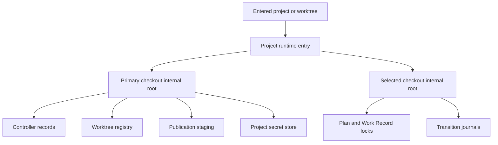

# Consolidate Project Runtime State Under `.wld/internal/`

## Context

RunWield Core stores user-derived project configuration and machine-owned runtime state together under `.wld/`. Users
can commit `.wld/settings.json`, local Agents, Skills, and prompts. RunWield also writes controller records, Plan locks,
transition journals, worktree registry files, publication staging, recovery reports, operation locks, debug data, and
project collaboration secrets there.

The runtime files currently need many `.gitignore` entries. The repository's own `.gitignore` shows both an older list
and a generated managed block. Each new runtime path must also be added to path classification, staging exclusions, and
publication protection. Some active runtime locks, such as the Work Record supersession locks, are not in the current
owned-path list at all. Other names, such as `plan-backups/` and `debug/`, are reserved owned paths with no current
production writer. The result is noisy and can fail open when a new machine-owned file is added.

Version 0.10.0 will make `.wld/internal/` the only current project-runtime root. It is a one-way breaking migration.
User-derived project files stay outside this root and remain trackable. ADR-017 records this decision.

## Objective

Establish one observable ownership boundary: all project-local machine-owned state is below `.wld/internal/`, and all
current runtime readers and writers reach it through shared path definitions. The generated `.gitignore` contract has
one entry, `.wld/internal/`, while `.wld/settings.json`, Agents, Skills, and prompts remain ordinary repository content.

Preserve the established controller and worktree authority model while correcting inconsistent path selection.
Controller records and the worktree registry remain primary-owned. Publication staging, registry migration reports, and
project secrets become explicitly primary-owned instead of relying on the supplied working directory. Plan document,
transition, and Work Record supersession locks and journals remain tied to their selected checkout. Home-directory state
remains outside this migration.

Version 0.10.0 automatically adopts inactive legacy state before project use. It stops without changing files if an
unfinished publication or repair checkout exists, if old and new authorities conflict, or if a live legacy writer is
evident. Downgrade and concurrent use with an older RunWield process are unsupported after adoption.

The main option not taken is automatic migration of active publication recovery. That would give a smoother upgrade but
would require moving a saved Git clone and rewriting its absolute registry paths as one recoverable operation. A process
stop between those effects could hide validated unpublished work, so the rare active-recovery upgrade must stop instead.

## Vertical Slice Findings

The current `.wld` path is not one authority. Callers must retain their existing checkout selection after the directory
change:



Representative primary-shared flow:

```text
Session or Plan command
  enter project runtime
  migrate or verify layout
  resolve primary checkout
  read controller record and worktree registry
  continue execution or recovery
```

Representative selected-document flow:

```text
Plan save in execution worktree
  enter project runtime
  resolve selected checkout internal root
  acquire Plan lock
  write Plan and transition journal
```

`getRunWieldRuntimeDir()` currently supplies Plan locks, transition journals, controller records, publication staging,
and Work Record supersession locks. `getWorktreeRegistryPath()` and collaboration secrets bypass it and construct their
own `.wld` paths. `resolveWorktreeParent()` also has a project-local fallback. The new design needs named primary-shared
and selected-checkout path resolvers; changing one generic helper without preserving these distinctions would move an
authority to the wrong checkout.

The worktree registry stores publication records with absolute `executionCwd`, `publicationRoot`, and optional repair
paths. Publication recovery reads those paths and Git evidence after restart. Migration must inspect this registry
before moving any state. Any publication record that has not reached cleanup blocks the migration. Normal active
execution is safe to adopt because its linked worktree remains at its recorded path; only the registry and controller
locations change.

There is no existing entry point common to all project surfaces. TUI and Agent Client Protocol sessions enter through
Session Runtime, while direct Plan and collaboration commands bypass it. A shared project-runtime entry operation must
therefore be called by each surface before its first normal runtime-store access. Runtime stores must either depend on a
successfully resolved layout context or invoke the same guard before filesystem input/output; a caller cannot bypass a
migration refusal by calling a lower-level registry, controller, lock, journal, publication, or secret function.
Migration must not run for help, version, or a new empty TUI before its first submitted message.

## Expected Change Surface

- `src/shared/project-runtime-layout.ts` — new application-owned module for the versioned layout, named primary-shared
  and selected-checkout paths, migration lock and marker manifest, preflight, one-way adoption, interruption recovery,
  and conflict results. The primary marker records which registered or later-entered selected checkout roots have been
  adopted. The exact filename can follow source conventions, but one module must own this interface.
- `src/constants.js` — define the internal directory name and keep test sandbox resolution behavior without making the
  generic project `.wld` directory itself the runtime root.
- `src/shared/runwield-owned-paths.ts` — make `.wld/internal/` the current owned boundary, retain a separate bounded
  list of legacy hazards for migration and Git safety, and reconcile `.gitignore` to one canonical managed entry.
- `src/shared/worktree-registry.js` — resolve registry, lock, temporary write, and migration-report paths through the
  primary internal root. Registry access must pass the layout guard before choosing an authority.
- `src/shared/workflow/controller-registry.ts` — keep primary-checkout ownership and move controller records below the
  internal root without changing revision, file-lock, or atomic-write guarantees.
- `src/plan-store.js`, `src/shared/workflow/state-transition.ts`, and `src/shared/work-records/supersession.ts` — keep
  selected-checkout ownership for Plan, transition, and Work Record locks and journals while placing every machine-owned
  artifact below the internal root.
- `src/shared/workflow/publication-machine.ts` and `src/shared/isolated-publication.ts` — create new publication staging
  below the primary internal root, preserve proof-bearing publication phases, and expose unfinished publication or
  repair state to migration preflight without translating it.
- `src/shared/worktree.js` — retain the normal `~/.wld/worktrees/` location; move only the no-home project fallback
  below `.wld/internal/`. Dirty-path filtering, checkpoint staging, tracked-runtime cleanup, and merge protection must
  use the current and legacy-safety classifiers correctly.
- `src/shared/collaboration/secrets.js` and Plan collaboration commands — move only project-local secrets to the primary
  internal root. Keep global `~/.wld/collaboration-secrets.json` unchanged. Preserve restrictive permissions and prevent
  two writable secret stores.
- Session Runtime, Agent Client Protocol adapters, Init, direct Plan commands, and collaboration commands — enter the
  project layout before first project-state access. They share one migration implementation and preserve deferred empty
  TUI startup.
- Plan Doctor and recovery messages — report blocked migration, legacy/new conflicts, broad `.wld/` ignore rules,
  tracked legacy files, committed secrets, stale locks, and unsupported old-writer activity without deleting uncertain
  state.
- Architecture, lifecycle, validation-authority, collaboration, troubleshooting, and release-facing documentation —
  describe the new paths, the 0.10.0 breaking boundary, the active-publication upgrade stop, and user cleanup for
  tracked legacy files. ADR-005 and ADR-016 retain their decisions but must name the new canonical locations.
- Tests and golden scenarios around path ownership, linked worktrees, publication recovery, Plan Doctor, Init,
  collaboration, staging, and TUI/Agent Client Protocol startup — use the target layout and prove migration behavior
  with real filesystem and Git fixtures.

## Reuse Opportunities

- `src/shared/primary-checkout.ts` — retain the existing primary-checkout resolution rule instead of adding
  repository-root discovery or changing nested invocation behavior.
- `src/shared/runwield-owned-paths.ts` — retain the managed-block replacement and dirty-path classification roles, but
  split current ownership from legacy safety so old paths cannot remain normal write targets.
- `src/shared/worktree-registry.js` — reuse registry serialization, atomic rename, directory sync, lock recovery, and
  ambiguity handling. Layout migration must not introduce a second registry update protocol.
- `src/shared/workflow/controller-registry.ts` — reuse operating-system file locking, revision checks, atomic writes,
  and directory sync for controller authority.
- `src/shared/workflow/publication-machine.ts` — use its publication phase and cleanup evidence to decide whether
  migration is safe. Do not infer safety from Plan status or directory names.
- `src/shared/collaboration/secrets.js` — retain atomic secret writes and restrictive file modes while routing the
  project-local path through the shared layout owner.
- Existing real-Git fixtures, `defineGitFixture`, worktree publication failure matrices, and process-global test locks —
  prove migration and staging behavior without adding dependency-injection seams.

No new library, datastore, service, or protocol is required. The existing filesystem, Git evidence, atomic-write
patterns, and lock mechanisms are sufficient and avoid a new long-term dependency for a one-time layout transition.

## Verification Plan

- Automated: run focused path, migration, migration process-stop matrix, worktree-registry, controller, transition,
  collaboration-secret, Plan Doctor, worktree-isolation, publication failure-matrix, Session Runtime, Agent Client
  Protocol, Init, and golden TUI tests with `deno task test` or `deno run -A scripts/run-tests.js <paths>`.
- Automated: run `deno task seams:check` to prove no test-only injection boundary was introduced.
- Automated: run `deno task ci` as the full type, format, lint, test, architecture-policy, and build gate.
- Manual: in a disposable Git project with legacy inactive runtime state and custom `.gitignore` content, start 0.10.0,
  confirm one migration, inspect retained settings/Skills/prompts, and confirm a second start makes no filesystem
  changes.
- Manual: in a disposable project with a saved unfinished publication conflict, start 0.10.0 and confirm it stops before
  moving or editing any runtime file and gives pre-0.10.0 recovery guidance.
- Manual: invoke from both the primary checkout and a linked execution worktree. Confirm primary-shared state has one
  authority and selected-document locks and journals stay with the selected checkout.

### Outcome Evidence

- **Single ignored runtime boundary** — the generated managed block contains exactly `.wld/internal/`; exact obsolete
  RunWield entries are absent after reconciliation; unrelated `.gitignore` lines remain byte-equivalent except for
  necessary newline normalization around the managed block.
- **Trackable project configuration** — `.wld/settings.json`, `.wld/agents/**`, `.wld/skills/**`, and `.wld/prompts/**`
  are not matched by the current runtime classifier or generated ignore block, and a real Git fixture can stage them
  while `.wld/internal/**` stays ignored.
- **No current legacy writers** — production source contains no direct constructor or write target for the known
  pre-0.10.0 project runtime paths. References to those paths are limited to the legacy migration/safety catalog,
  diagnostics, tests, and historical documentation.
- **Complete runtime containment** — controller records, worktree registry files and temporary writes, publication
  staging, Plan and Work Record locks, transition journals, recovery reports, debug output, fallback worktrees, and
  project collaboration secrets are observably created only below an applicable `.wld/internal/` root.
- **Authority preservation** — linked-worktree fixtures prove controller records, registry data, publication state, and
  project secrets resolve to the primary checkout, while selected-document locks and journals resolve to the selected
  checkout. No operation creates a second authoritative registry, controller record, or secret store.
- **Safe one-way adoption** — an inactive legacy fixture migrates once, writes a supported layout marker manifest,
  preserves data content and permissions, removes live legacy stores, and is byte-stable on a second project entry. A
  multi-process fixture terminates migration after each filesystem effect; every restart either reaches those same final
  bytes or refuses while every source and destination byte remains recoverable. A newer marker is rejected without
  mutation.
- **Recovery protection** — every valid non-cleaned publication phase, saved `failure.repairRoot`, malformed or
  unreadable legacy registry, and publication record with unsupported shape makes migration fail before directory
  creation, rename, marker, or `.gitignore` write. Registry bytes, controller bytes, publication checkout path, Git
  refs, and `.gitignore` remain unchanged after refusal. A concurrency fixture proves the legacy registry lock stays
  held from preflight through durable marker commit and retirement of legacy authoritative data, then is released before
  its own obsolete lock file is retired.
- **Conflict protection** — independently populated old and new authorities, locks proven live by their own protocols,
  any tracked current or legacy runtime authority, tracked collaboration secrets, symlinks at the internal root or a
  legacy authority path, and unsupported old-writer state produce explicit non-destructive outcomes rather than merge,
  overwrite, deletion, checkpoint, or publication. Real-path fixtures prove migration never reads or writes runtime
  bytes outside the applicable checkout. A persistent but unlocked controller lock inode does not counterfeit a live
  writer.
- **Surface coverage** — TUI first-message activation, Session load, Agent Client Protocol new/load, Init, direct Plan
  commands, Plan Doctor, and collaboration commands all reach the same versioned project-entry operation before normal
  runtime-store access. Direct low-level attempts to read or mutate the registry, controller, locks, journals,
  publication staging, or project secret store cannot perform filesystem input/output after migration refusal. Help,
  version, and an unsubmitted empty TUI do not create `.wld/internal/` or migration files.
- **Publication and staging isolation** — real-Git checkpoint and publication tests cover runtime paths that are
  untracked, tracked, staged, intent-to-add, renamed, and deleted. Current internal state and recognized legacy hazards
  cannot enter implementation or publication commits; tracked runtime authorities cause the explicit migration or
  publication refusal rather than relying on `.gitignore`. User-derived `.wld` files remain eligible repository changes.

Existing behavior that must remain protected: Plan Markdown remains the human lifecycle authority; controller and
registry revisions remain compare-and-set and lock-protected; publication phases remain monotonic and based on Git
proof; execution stays isolated in worktrees; project settings keep primary-checkout behavior; project secrets keep
restrictive permissions; global `~/.wld` state and normal home-based worktrees do not move; user `.gitignore` content is
preserved; and new empty TUI sessions do not write before the first message.

Behavior expected to stop existing: current RunWield code no longer reads or writes machine-owned project state directly
under `.wld/`; project collaboration no longer appends its own ignore entry; generated ignore blocks no longer enumerate
runtime paths; a new runtime capability no longer needs a new `.gitignore` line; and 0.10.0 does not continue when
active legacy publication recovery would need path translation.

## Edge Cases & Considerations

- A 0.9 process can recreate legacy state after migration. Downgrade and mixed-version use are unsupported; 0.10.0 must
  detect the legacy state and stop rather than choose an authority.
- Migration must acquire the legacy registry lock before moving registry state so another compatible pre-cutover writer
  cannot mutate it during adoption. Other live legacy operation locks also block migration. Stale lock handling must use
  existing age and process rules rather than unconditional deletion.
- Migration needs a durable phase record or equivalent recoverable protocol. A process stop after moving a leaf but
  before writing the final layout marker must resume deterministically and must not classify the partial destination as
  an independent conflicting authority.
- Cross-device rename assumptions must not be implicit. Project `.wld` moves should stay on one filesystem; any fallback
  copy protocol must write, sync, verify, and only then retire the source.
- Migration must reject a symlink at `.wld/internal/` or at any legacy authority path. It must not follow a lexical path
  outside the applicable primary or selected checkout while inspecting, moving, or writing runtime state.
- Legacy transition journals can exist in execution worktrees as well as the primary checkout. Migration entry and Plan
  Doctor must use registered execution locations when checking selected-checkout state.
- Work Record supersession locks are currently machine-owned but absent from the Git ownership list. The target boundary
  must include them automatically because all descendants of `.wld/internal/` are owned.
- Existing tracked runtime files remain tracked until the repository records their deletion. Migration must stop and
  report the exact paths so the user can remove them from the index and record that cleanup. Checkpoint and publication
  must not silently include their contents, renames, or deletions as feature work.
- If Git already tracks a project collaboration secret, moving it does not remove it from history. Migration must stop,
  identify the exposure, and explain that capability rotation and repository-history remediation can be required.
- A user-authored `.wld/` ignore rule hides trackable configuration. Reconciliation warns but does not remove the broad
  rule without user authority.
- Test sandbox routing through `WLD_TEST_SANDBOX_HOME` must retain separate lock namespaces while reflecting the
  internal layout. Tests must continue to use sandboxed `HOME` and the repository test runner.
- The primary layout marker is project runtime state under the primary checkout's `.wld/internal/`. It records the
  selected checkout roots adopted with the project. Registered roots are included before initial commit; a later-entered
  root is adopted and added under the same project lock. Its version describes the storage layout, not the installed
  RunWield package version.
