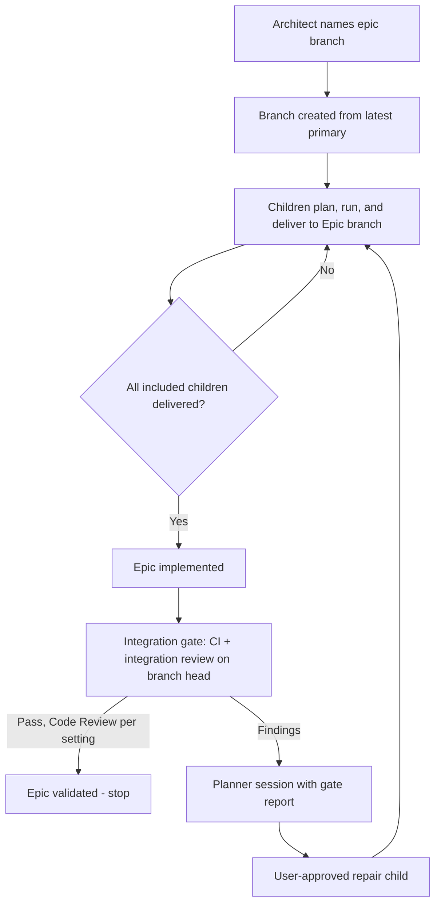

# Epic Branches and Integration Gate

## Context

Working an Epic in slices is harder than it should be. Three problems show up on every Epic:

- **Branches are manual.** Architect records `targetBranch` only when the user names one (`architect.md`). Without it,
  children deliver straight to the primary branch and partial work reaches `main` before the capability is complete.
- **Epic success is inferred from child statuses.** `advanceParentEpicWhenAllChildrenVerified` in
  `src/shared/workflow/plan-lifecycle.js` advances the parent when every child reaches a terminal status. Nothing checks
  the assembled result, and a validated child whose publication is still pending counts as done.
- **Every child is held to the release bar.** Each child must look finished on its own, so intermediate states that a
  later child completes read as defects.

This Plan was the Epic assembly child of
[Plan Packages and Independent Validation](plan-packages-and-independent-validation.md). The owner split it out to ship
first, so the Plan Packages Epic itself runs on the new flow. It uses today's machinery only: no Plan Packages, no
`validation.md`, no Validator. Plan Packages later upgrades the integration gate's checks to Validator running the Epic
contract.

Owner decisions:

- Every Epic starts and ends on its own branch, created from the latest primary branch when the Epic starts. Architect
  names it automatically; Slicer children inherit it. A missing branch never fails a start.
- A child lands on the Epic branch after CI passes and AI review checks that the child's own work is correct. Work the
  Epic assigns to a later child is not a finding. Code Review is still offered per the user's `codereview` setting
  (`none`, `ask`, `always`).
- When the children are delivered, an integration gate reviews and validates the whole Epic before it is marked
  `validated`. The gate also respects the `codereview` setting.
- The Epic stops at `validated`. RunWield does not merge the Epic into the primary branch; the user merges or opens a
  pull request. Automatic publication remains in
  [Epic Branch Publication Workflow](epic-branch-publication-workflow.md).
- Integration findings go through ordinary planning: Planner starts with the gate's report, the user reviews the repair
  child like any Plan, it runs against the Epic branch, and its delivery reruns the gate. The loop is unbounded; the
  user stops it by not engaging with Planner.

Prompt changes for flexible sibling drafts, Semantic Reviewer's Epic child mode, and removing "unfinished" noise are a
separate change, settled after this one. Isolated Planner worktrees remain in
[Isolate Planning and Reuse Its Worktrees](isolate-planning-and-reuse-worktrees.md).

Owning Core PRD capability: [Epic decomposition and hold](../prd/runwield-core-prd.md#epic-decomposition-and-hold).
Change default child delivery to the Epic branch, replace status-only Epic completion with delivered containment plus
the integration gate, and add the integration-repair loop. Preserve explicit child target overrides, hold, and
done-enough.

## Objective

Every new Epic gets an Epic branch without user action. Children deliver there. Once every included child is delivered,
RunWield runs the integration gate on the Epic branch head and marks the Epic `validated` when it passes, or starts a
repair planning session with its findings when it does not.

## Approach

### Epic branch

Architect always writes `targetBranch` for a new Epic, defaulting to `epic/<epic-name>`; the user can change it in
review. Slicer keeps inheriting it into children through `materializeChildFeaturePlans`, and explicit child overrides
stay explicit.

When the Epic first needs its branch, RunWield fetches the primary branch, creates the Epic branch from that head, and
records the base commit with the Epic. `createLocalBranchFromDefault` in `src/shared/worktree.js` already resolves
origin's default branch and falls back to local `main` without a remote; reuse it and capture the commit it used. An
existing branch is used as-is, never reset. Every path that prepares a target, including `prepareTargetBranchRef`
callers in `plan-epic-flow.ts`, `execution-start.ts`, and `planning-worktree.ts`, creates a missing Epic branch instead
of failing.

Creating the branch is not enough on its own. Child planning reads each child from the Epic branch
(`preparePlanningWorktreeForPlan` fails with "Plan … does not exist on target …"), but Slicer writes child drafts in the
Epic's document checkout. A branch created from origin's default branch therefore has no children on it. RunWield
commits the missing child drafts onto the Epic branch with Git plumbing (a temporary index, `commit-tree`, and a
compare-and-swap ref update), so no checkout changes. A child already on the branch is never replaced, and a branch that
is checked out somewhere is never moved under that checkout. Sequence containers stay lightweight: they get a branch
only when the user names one, and they keep status-based completion without the integration gate.

### Epic completion from delivery, not status

The Epic becomes `implemented` when every included child is delivered, meaning its delivered commit is an ancestor of
the Epic branch head. A child that is validated with publication pending does not count. A child the user closed or
accepted directly (`closed_without_verification`, `user_verified`) is settled by that decision. Reconcile after each
child delivery and on reload, not only on child status events.

### Integration gate

The controller runs the gate in a temporary checkout of the Epic branch head. It is not an Epic execution attempt and
starts no Epic Engineer.

1. Run the project's configured CI command through `runLocalCI`.
2. Run an integration review: a dedicated reviewer prompt reviews the whole Epic diff, from the recorded base commit to
   the head, against the Epic's objective and outcomes. It reports integration defects, such as broken seams between
   children, contradictions, and missing promised behavior. It does not repeat child-level style review.
3. Apply the `codereview` setting to the whole Epic diff, reusing the existing human review flow.

A pass records the checked commit and marks the Epic `validated`. Later commits on the Epic branch make that record
stale and the Epic returns to `implemented` until the gate passes again.

Findings produce a durable gate report, `docs/plans/<epic>/integration-report.md`, and a draft repair child under the
Epic whose body carries the findings. RunWield puts that draft on the Epic branch and starts Planner on it through
ordinary Epic child continuation, so the user reviews it like any child. Its delivery reruns the gate. Done-enough
remains available as the user's way out.

The option set aside is per-child release-quality validation with no gate. It forces every intermediate state to look
finished and still never checks the assembled result.

## Expected Change Surface

- `src/agent-definitions/architect.md`, `document-formats/architect-plan-format.md` — Architect always names an Epic
  branch.
- `src/agent-definitions/subagent-definitions/slicer-prompt.md` — children inherit the Epic branch without exception
  unless the user asks.
- `src/agent-definitions/subagent-definitions/` — new integration review prompt.
- `src/shared/worktree.js` — Epic branch creation with a recorded base commit.
- `src/shared/workflow/execution-start.ts`, `planning-worktree.ts`, `src/cmd/load-plan/plan-epic-flow.ts` — missing Epic
  branches are created, not reported as errors.
- `src/shared/workflow/plan-lifecycle.js`, `epic-continuation.ts` — completion from delivered containment, gate events,
  stale gate results, and the repair-child return.
- `src/shared/workflow/validation-local-ci.ts`, `validation-human-review.ts` — reuse CI and human review for the gate.
- `docs/plan-lifecycle.md`, `docs/domain-language.md`, `docs/prd/runwield-core-prd.md` — Epic branch, integration gate,
  and the Epic status path.

## Reuse Opportunities

- `createLocalBranchFromDefault` and `prepareTargetBranchRef` in `src/shared/worktree.js`.
- Child target inheritance in `workflow-slicer.ts`.
- `runLocalCI` and the existing human Code Review flow.
- Semantic review dispatch and `review-ledger.ts` finding identities for the integration review.
- Epic continuation in `epic-continuation.ts` for starting Planner on the repair child.
- Done-enough (`epic_done_enough`) and isolated publication ancestry evidence.
- Real Git fixtures through `defineGitFixture` in `src/shared/git-test-fixture.ts`.

## Implementation Steps

- Architect's prompt and Epic format make `targetBranch` a required Epic field defaulting to `epic/<epic-name>`; a new
  Epic saved without one is given that default before review.
- Starting any Epic child, planning or execution, with a missing Epic branch creates it from the freshly fetched
  primary-branch head (local `main` without a remote) and records the base commit on the Epic; an existing branch is
  never reset or recreated.
- Children delivered to the Epic branch are the only ones that count toward Epic completion; a validated child with
  pending publication leaves the Epic short of `implemented`.
- `advanceParentEpicWhenAllChildrenVerified` no longer advances the Epic to a terminal status; the Epic reaches
  `implemented` from delivered containment and reaches `validated` only through a passing integration gate.
- The integration gate runs CI and the integration review in a controller-owned temporary checkout of the exact Epic
  branch head, cleans up only what it created, and records the checked commit.
- The integration review prompt reviews the full Epic diff from the recorded base against the Epic objective and reports
  integration findings with stable IDs; it does not flag work still assigned to an undelivered child.
- The `codereview` setting applies to the integration gate: `always` requires the user's review, `ask` offers it, and
  `none` skips it.
- A failing gate writes a durable report and starts a Planner session on the Epic with it as context; an approved repair
  child runs against the Epic branch and its delivery reruns the gate.
- A commit on the Epic branch after a pass makes the gate result stale and returns the Epic to `implemented`.
- RunWield never merges the Epic branch into the primary branch.
- The Core PRD Epic decomposition and hold capability, `docs/plan-lifecycle.md`, and `docs/domain-language.md` describe
  Epic branch, integration gate, and Epic status behavior as delivered, with Epic publication still deferred.

## Verification Plan

- Automated:
  `deno run -A scripts/run-tests.js src/shared/workflow/workflow-slicer.integration.test.ts src/shared/workflow/plan-lifecycle.test.js src/shared/worktree-creation.test.js src/shared/workflow/epic-branch-planning.integration.test.ts src/shared/workflow/epic-continuation.test.js`,
  adjusted to the real test paths touched.
- Automated, real Git fixtures: a new Epic without a named branch gets `epic/<epic-name>`; the first child start creates
  it from the primary head and records that commit; a second start reuses it unchanged.
- Automated: a validated child with pending publication does not move the Epic to `implemented`; delivery does.
- Automated: a passing gate marks the Epic `validated` with the checked commit; a later Epic branch commit makes it
  stale.
- Automated: a failing gate records a report and produces a Planner continuation for a repair child; the repair's
  delivery reruns the gate.
- Automated: each `codereview` value produces the expected gate behavior.
- Protected behavior: explicit child target overrides, hold and resume, done-enough, and standalone Plan delivery stay
  unchanged. Expected to stop: status-only Epic completion and Epic children defaulting to the primary branch.
- Manual: run a two-child Epic from creation to `validated`, including one failing gate and its repair child.

## Edge Cases & Considerations

- A user-named branch that already exists is used as-is, even if it does not start from the latest primary head.
- Primary moving during the Epic is expected; the gate validates the Epic branch, not its merge with today's primary.
- Active attempts created before this change keep their recorded target.
- Non-Git Epics have no branch and keep the legacy status-based completion; the gate does not run for them.
- Epics without a branch whose children already started keep the legacy status-based completion too.
- Deliverable points, where one child makes the feature shippable and later children are optional, are still under
  discussion and not part of this Plan.
