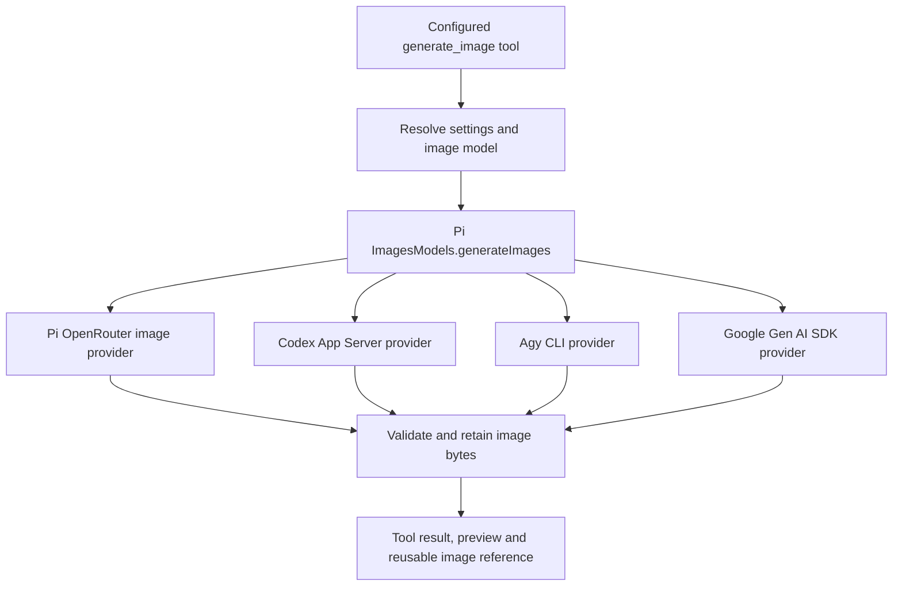

# Generate Image Tool

## Context

RunWield can inspect images using `see_image` and a configured vision fallback, but it does not provide a native
image-generation tool. The user wants generation and reference-image editing, with model and supported thinking-level
selection following the existing settings and preset pattern.

The user selected four routes: Pi's existing image provider, Agy, an official OpenAI integration instead of direct
undocumented backend requests, and Google's `@google/genai` library. This draft uses the official Codex App Server
subscription route for OpenAI. The separately billed OpenAI Image API is not a fifth provider in this scope.

Live generation and editing passed through Agy and Codex App Server. Pi/OpenRouter and Google lack API credentials in
the test environment and remain unverified. See [provider proof](../research/image-generation-provider-proof.md). This
Plan is a draft, not a claim that the user's condition of confirming all four routes has been met. Complete the
remaining live checks before marking the four-provider design ready for execution.

## Objective

Provide one `generate_image` Custom Tool and one Pi image-provider collection, available independently of the active
conversation model. Return real, retained image files and usable references for subsequent edits and `see_image`.
Support all four routes without replacing Pi or implementing another general model runtime.

Provider-specific work belongs behind Pi's `ImagesProvider` interface. OpenRouter retains Pi's implementation; Codex and
Agy delegate to their official local runtimes; Google calls its official SDK. Direct Codex backend HTTP calls are
excluded by the user's instruction. Adding a second general AI SDK/provider registry would duplicate Pi's existing image
abstraction and is not part of this design.

## Vertical Slice Findings



Observed behavior that the implementation must account for:

- Pi 0.84.2 already has `ImagesModels`, `createImagesProvider`, and `generateImages`. Image models have input and output
  modality metadata and are separate from chat models. Its only built-in image provider is OpenRouter.
- Pi's `ImagesOptions` has no first-class thinking, quality, or size fields. A settings field must not be added unless
  its adapter maps and verifies it; arbitrary metadata is not proof of provider support.
- Codex App Server supports ChatGPT login, image capability discovery, agent-model discovery, ephemeral threads,
  `turn/start` effort, and structured image results including `savedPath`. The native tool chooses the image model.
- Agy accepts `--model` and `--effort` for the supervising agent. Its native image generator is host-managed. A real
  failure still produced a successful final process result. Successful abbreviated tool events omitted image paths.
- `src/shared/session/image-attachments.js` already owns retained image references and safe reference resolution.
  Runtime tool-content blocks already support images. Reuse those contracts and verify replay.
- `artifact_written` and `SessionArtifactKind` currently describe Markdown documents. Generated images must not be
  registered as fake Markdown artifacts or expand that document lifecycle merely to display an image.
- The full Agy execution backend is on `feature/agy-cli-execution-backend`; current `main` contains the original spike.
  Verify the integrated source before extracting shared subprocess behavior. Do not switch or merge branches as a hidden
  prerequisite of this Plan.

## Settings and capability contract

Add the custom setting `imageGeneration` at global/project scope and inside model presets. Resolve effective values once
when building the tool, using project-over-global layering and active-preset overrides like the current vision fallback.
An absent configuration leaves the tool unavailable. Explicit `enabled: false` disables it even if inherited settings
contain a model. Invalid explicit configuration reports an error rather than silently selecting another route.

Proposed configuration examples:

```jsonc
{
    "imageGeneration": {
        "model": "codex-cli/gpt-image-2",
        "agentModel": "gpt-5.6-sol",
        "thinkingLevel": "low"
    },
    "modelPresets": {
        "google-images": {
            "imageGeneration": {
                "model": "google/gemini-3.1-flash-image",
                "thinkingLevel": "high"
            }
        }
    }
}
```

Proposed image-provider IDs are `openrouter`, `codex-cli`, `agy-cli`, and `google`. They live in the image collection;
registering one must not make its image models selectable as chat models. Use `agy-cli/default` for the host-managed
generator, rather than presenting an unverified selectable Nano Banana model ID. `agentModel` selects its supervising
agent when applicable. Provider changes must discard or reject inherited options belonging to a different route.

| Route            | `model` selects                                            | `thinkingLevel` controls                                   | Other controls                                                                |
| ---------------- | ---------------------------------------------------------- | ---------------------------------------------------------- | ----------------------------------------------------------------------------- |
| Pi/OpenRouter    | Pi image model                                             | Expose only after the selected model's mapping is verified | Only options actually supported by the installed Pi adapter                   |
| Codex App Server | Host image capability, currently documented as GPT Image 2 | Supervising agent effort, discovered from Codex            | Do not promise direct image quality, size, or image-model override            |
| Agy CLI          | Host-managed image capability                              | Supervising agent `--effort`: low, medium, high            | `agentModel` maps to `--model`; actual dimensions/format come from the result |
| Google SDK       | Gemini image model                                         | That image model's supported thinking setting              | Verified image dimensions/configuration supported by the selected model       |

The settings UI must label host effort as agent thinking. Rendering quality and reasoning are distinct. Unsupported
values must be rejected or unavailable, never silently ignored. Keep `visionFallback` behavior unchanged.

## Tool and output contract

The model-facing tool accepts `prompt`, optional `imageRefs`, and an optional project-relative `outputPath`.
Provider/model/effort come from user settings; the calling agent cannot silently switch provider or billing route. One
tool request produces one final image in the first release. Reference editing writes a new result by default.

The tool resolves inputs through `resolveImageRef`, validates selected-model image-input support and reference limits,
then calls the Pi image collection. A successful result requires at least one decodable supported raster image block.
Text-only replies, empty image lists, failed native tool events, and a completed agent turn without an image are errors.

Retain the result using RunWield's image-storage convention, return a stable image reference, actual MIME type and
dimensions, and a project-relative path when materialized into the project. Reuse `persistImageAttachment` where its
existing ownership contract fits. Explicit output paths must stay inside the execution project/worktree, preserve
existing files, and match the actual output format. Do not put JPEG bytes into a `.png` path. Host temporary files must
be copied into RunWield ownership before returning success; resuming must not depend on host history retention.

Image-capable primary models can receive the image block. Text-only models receive the retained image marker and text
metadata, with `see_image` available when a vision fallback is configured. The runtime/UI must still receive usable
output metadata and previews. Verify the current transcript and tool-result behavior before adding another image store
or duplicating large base64 payloads across records.

Inject the tool only when configured and permitted by effective Agent tool policy. Make it available to appropriate
artifact-producing Agents; do not universally give image-file writes to read-only reviewers. External execution hosts
already owning a native `generate_image` tool retain that tool. This work must not create a recursive Agy-to-Agy call or
register a conflicting MCP tool with the same native name.

## Provider implementation contracts

### Pi/OpenRouter and Google

Construct the image collection with the existing RunWield credential store and appropriate provider auth. Reuse the
OpenRouter image provider directly. Add Google through `createImagesProvider` with a direct, pinned `@google/genai`
dependency; do not import the SDK from Pi's private transitive dependency layout in production.

Complete the Google live check against the selected SDK version before fixing its request/response mapping. The SDK
supports multiple API surfaces; use one documented, verified image path, retain reference inputs, collect only final
image outputs, and handle image-free responses/refusals explicitly. Record usage when supplied; never fabricate costs.

### Official Codex App Server

Use stdio JSON-RPC through the installed `codex app-server` executable. Resolve login and capability through public
methods. A missing CLI/login is a setup error; do not extract tokens, call backend endpoints, or fall back to API
billing.

Use a temporary image-only working directory and an ephemeral thread. Choose a supported supervising model/effort from
the public model list. Send bounded instructions to call the native image tool, omit reference selectors for a new
image, and use only `referenced_image_paths` for local edits. Correlate completion to the current thread, turn, and
image item. Require a successful image item and verified bytes; prefer its structured `savedPath` over final assistant
prose.

On cancellation call the public turn-interrupt method, then dispose the owned process with the existing process-tree
owner if needed. Register completion listeners before starting the turn, drain completion events, handle process exits,
and never shut down or mutate an unrelated desktop thread. The helper's thread ID is implementation metadata, not a new
RunWield Session or workflow authority.

### Agy CLI

Use the existing direct-argv subprocess approach with `-p`, `--output-format stream-json`, explicit timeout, optional
`--model`, and supported `--effort`. Use cached host authentication. Do not install global agents/MCP servers simply to
generate an image, and do not add a dangerous permission-bypass flag. Reuse the already approved backend facilities
where applicable; prompting is a task boundary, not proof of a sandbox or a tool allowlist.

Track the current conversation's native `generate_image` tool steps, including `ERROR`, not just final `SUCCESS`.
Request a structured final path using the public output-schema facility and verify its real path, current-run ownership,
regular-file status, MIME type, and decoded bytes. The proof used a text final path, so schema-based extraction is a
remaining implementation verification step. Do not scan unrelated host conversations or rely on private transcript
formats. If the public output does not identify a verifiable image, fail clearly.

### Shared lifecycle

All adapters preserve caller cancellation, bounded timeouts, error details safe for display, and known usage. Network
and subprocess boundaries can use the existing genuine external seams. RunWield file ownership, persistence, and
registry behavior stay real in tests. Do not retry an image generation automatically after an ambiguous timeout or
silently change providers: a retry may create another image or spend quota again.

## Delivery sequence

1. **Live prerequisites are resolved.** OpenRouter/Pi and Google pass generation and reference editing with real
   credentials. Their supported settings and returned image formats are recorded in the proof document. Until then, this
   four-provider Plan remains draft.
2. **The Pi image collection and settings contract work.** One image registry owns the four providers without polluting
   chat selection. Layering, preset switches, explicit disable, supported option validation, and auth-source behavior
   are covered. Host-managed capability metadata distinguishes agent thinking from image thinking.
3. **The API providers return normalized images.** Pi/OpenRouter is reused and Google uses its official SDK. Focused
   network-boundary tests cover real request construction, reference inputs, final image decoding, no-image responses,
   cancellation and usage. No duplicate OpenRouter HTTP client is added.
4. **Official host adapters return owned images.** Codex and Agy generation/editing work through Pi with process cleanup
   and verified output files. Regression tests reproduce both false-success cases observed in the proof. Public Agy
   structured-path extraction is proven. No direct Codex backend requests exist in RunWield source.
5. **The tool produces reusable project/session outputs.** Effective Agent policy, default retained storage, explicit
   safe paths, reference editing, text-only model handling, cancellation and resume are verified through the actual
   tool/session integration. Provider credentials remain in the existing credential owners.
6. **Users can configure and inspect results.** Existing settings/preset surfaces expose appropriate model and thinking
   controls; TUI and Workspace show image results and errors using shared runtime events. Add a Surface Lab fixture and
   verify live/replayed previews with the current design system. Update settings/help/domain documentation in the same
   implementation change that makes the behavior true.

These are suggested independently reviewable child outcomes. The Epic is not directly executable; decompose them into
child Plans after the missing live prerequisites are resolved and the architecture is reviewed.

## Expected Change Surface

- New `src/tools/generate-image.ts` and focused tests — tool schema, reference resolution, persistence and results.
- New `src/shared/models/image-model-registry.ts` and `image-providers/` — Pi composition, capability metadata, official
  Codex/Agy adapters and Google SDK adapter.
- `src/shared/models/model-registry.ts` — reuse/expose the existing credential owner without duplicating secrets.
- `src/shared/settings.js`, its tests, and `src/cmd/settings/index.ts` — layered image-generation configuration.
- `src/shared/session/session.js`, image-attachment helpers and session-policy tests — correct injection and result
  handling for both image-capable and text-only models.
- Existing subprocess ownership modules and `backends/agy-cli/` — share necessary external process behavior without
  coupling generation to Plan lifecycle, Agent transitions or external backend conversation history.
- Runtime events, transcript projection, TUI rendering and Workspace session surfaces — retain and render image outputs
  consistently live and after replay. Extend existing image blocks before inventing new event variants.
- `deno.json` / lockfile — a direct Google SDK dependency if introduced; Pi remains the image abstraction.
- `docs/settings.md`, `docs/usage.md`, bundled settings help and `docs/domain-language.md` — describe implemented
  behavior. Follow `docs/design-system.md` and `src/ui/design-system/` for browser changes.

## Verification Plan

Future child Plans should provide focused file lists to the repository test runner. After integration:

```sh
deno run -A scripts/run-tests.js src/shared/models/image-model-registry.test.ts src/tools/generate-image.test.ts
deno run -A scripts/run-tests.js src/shared/settings.test.js src/shared/session/image-attachments.test.js src/shared/session/__tests__/session-tools-policy.test.js
deno task seams:check
deno task ci
```

Add provider tests to the focused command when those files exist. All automated tests use sandboxed home/temp files;
never call `deno test` directly, never invoke paid live providers in CI, and never read the developer's live credentials
from tests. Use fake executable fixtures and the permitted network boundary, not injection seams for owned machinery.

Manual acceptance: generate and edit through each of the four configured routes, inspect bytes and previews, cancel a
running request, resume the Session, resolve the output through `see_image`, switch presets, disable generation, and
confirm unsupported thinking controls are unavailable. Verify text-only primary models do not receive raw images. Use
`deno task workspace:dev` and the `/dev` Surface Lab for headed Workspace verification; use its printed URL.

### Outcome Evidence

- One configured tool works independently of the conversation provider, with all four routes returning verified,
  RunWield-owned image references. A stub returning a path or an agent success message cannot satisfy this outcome.
- An edit receives the exact referenced image, changes the requested content, and leaves the source file unchanged.
- Codex uses only the official runtime interface. Its request trace shows public App Server methods and subscription
  account mode, with no RunWield credential extraction or direct backend requests.
- Agy native tool failure plus final process success yields a RunWield tool error with no published image.
- Aborts/timeouts do not publish partial results or leave an owned helper process running.
- Preset/model changes do not carry unsupported options or silently change authentication/billing routes.
- Successful files and previews remain available after host-session disposal and RunWield resume.

Preserve existing `see_image` selection, direct image inputs, Agent tool policy, settings layering, existing external
execution backends and RunWield Plan lifecycle. New behavior replaces the need for agents to improvise image-provider
commands; it does not retire the external hosts' native tools.

## Edge Cases & Considerations

- API credentials are the current live-proof blocker. Do not mark their routes confirmed from SDK import or fixtures.
- Host model availability and CLI protocols change. Detect capabilities, test supported versions and explain missing
  capabilities; do not infer support from a version string alone.
- Agent tool argument errors are possible even when the host supports generation. Keep instructions precise and validate
  results. Do not claim deterministic success from a language-model wrapper.
- Actual MIME type, dimensions, reference limits and thinking options differ. Capability-driven validation and actual
  output metadata must survive normalization.
- No billing estimate is better than a fabricated one. Track supplied usage, and label host subscription use without
  attributing supervising-agent token usage as a complete image-cost measure.
- Host originals remain host-owned. Only dispose temporary files/processes created and owned by this request; never
  clean unrelated host data or overwrite user images as part of a generation call.
