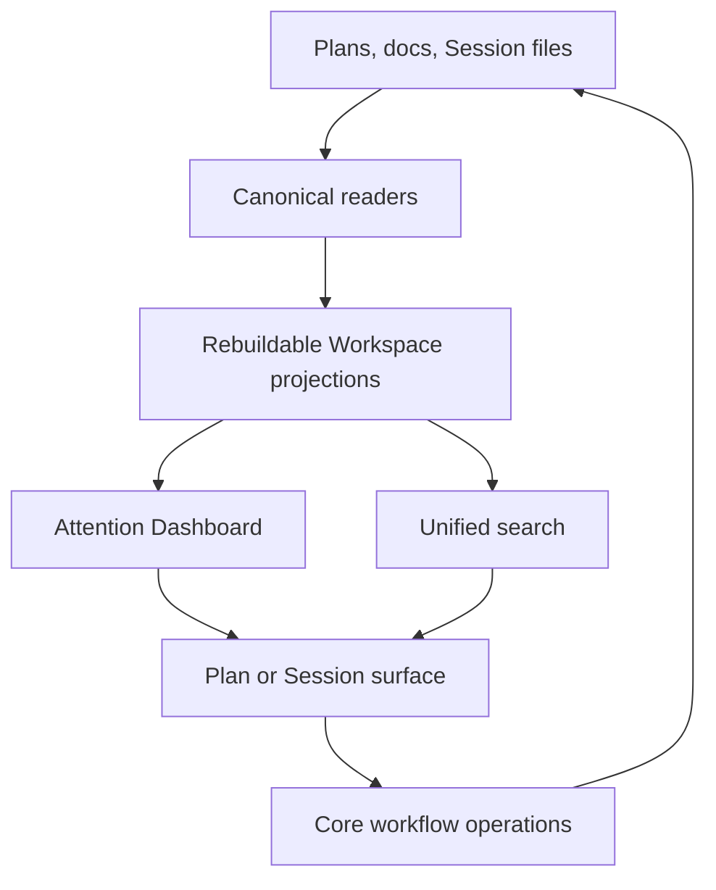

# Personal Remote Workspace v2

## Context

Personal Remote Workspace v1 delivered the owner browser loop: registered Projects, paired devices, durable Sessions,
Plan review, Feedback, approval, execution, and progress. Its Work Record records user-attested completion; RunWield
Workflow Validation did not independently establish that result. Real use now exposes a navigation and continuity
problem. The Workspace reopens the last Session, the sidebar treats Sessions as the main objects, and loading a saved
Plan continues in a new or current Session without finding the conversation that produced it. The owner can lose
planning rationale and must inspect Projects separately to find work that needs a decision.

The v2 outcome is a Plan-centered personal Workspace. Opening Workspace answers “what needs me now?”, open Plans lead
Project navigation, Plan-associated Sessions keep their conversation context, and one in-app search finds the durable
knowledge or Session entry point the owner needs.

This Epic is for one owner. Multi-user privacy, collaborator permissions, and organization search policy are later
Workspace concerns. Full Session Transcript search, source-code search, Cymbal federation, code-server, and another Code
Surface are not part of v2.

## Objective

Deliver four connected capabilities:

1. Make the Attention Dashboard the Workspace home. It groups Plan-centered work into **Needs You**, **Ready to
   Continue**, **In Progress**, and **Recently Finished**. Needs You includes Plan review, Workspace-hosted Agent
   questions, human review, recovery, failed validation, and damaged enabled Projects. Questions waiting inside a
   separate TUI or Agent Client Protocol process remain on that owning surface and use its notification. Ready to
   Continue includes approved Plans ready to run, approved Epics ready for decomposition, and interrupted workflows with
   a safe continuation. In Progress includes active Agents, execution, tests and CI, AI code review, repair, and
   delivery. Recently Finished includes verified or explicitly closed Plans from the last seven days, capped at ten
   across Workspace and five from any one Project. Deliberately On-Hold Plans and ordinary idle Sessions stay in
   navigation and search instead of appearing on the home.
2. Make Plan-to-Session continuity reliable. Open Plans appear before standalone Sessions in each Project. Loading a
   Plan resumes its one safe, idle planning Session by default when that relationship is known, and otherwise gives the
   owner an explicit choice or preserves the current fallback.
3. Provide one Spotlight-style Workspace search across Plans, PRDs, ADRs, Work Records, the RunWield Design System,
   applicable domain-language documents, Session Names, and the first user message when present. Design-system content
   means each registered Project's canonical `docs/design-system.md` when present; in this Project that file is the
   RunWield Design System. A visible global Search action and `Cmd+K` / `Ctrl+K` open a centered quick-search surface.
   Results use one flat order: exact document or Session Name matches first, then title and heading matches, then body
   and first-message matches; recency only breaks otherwise similar matches. Every result names its Project and content
   type. Focus controls narrow the same result set by Project or content type, and a **View all results** path opens the
   full search page without creating a second search system or regrouping the result set. Current Plans remain
   searchable while they are in the normal Plan store, including On-Hold and terminal Plans; Archived Plans are excluded
   because they are temporary staging and duplicate Work Record history. A Markdown file without a durable Plan ID is
   not yet a canonical RunWield Plan for Dashboard, association, or search purposes: listing stays read-only, the
   Project shows a repair diagnostic, and deliberate onboarding or `wld plans doctor --repair` makes it eligible. Quick
   search includes current approved Work Records but excludes Superseded and Archived Work Records. All PRDs, ADRs,
   cataloged Session Names, and available first user messages remain eligible. A later full-page historical filter can
   expose non-current Work Records if use proves it necessary.
4. Share the existing TUI notification content and applicable settings through Core, and add browser delivery for live
   `agentStopped` events available in Workspace. Each loaded Session tab handles its own events, suppresses its own
   alerts when focused and visible, and attempts to focus itself when its notification is clicked. Browser permission
   requires a user click. Alerts are best effort, with no persistence, replay, acknowledgement, or duplicate-tab
   guarantee. Separate TUI and Agent Client Protocol processes keep their existing notifications; cross-process browser
   delivery is outside this slice.

Workspace remains able to advance work. Session messages, Plan review decisions, approval, execution, and recovery use
the existing Core-owned operations and current evidence checks. The Dashboard is a springboard: each row opens the Plan,
review, Session interaction, or Project surface that owns the action instead of duplicating action controls on the home
screen. Search summaries likewise open the owning destination. These summaries help the owner find the right action;
they do not become a second copy of Plan, Session, or worktree state.

The main option not taken is separate Dashboard and search Epics. That would isolate delivery but duplicate the
cross-Project discovery, navigation, failure handling, and shell work. With code search and Code Surface scope removed,
one v2 Epic is coherent and remains suitable for later decomposition into a small number of executable Plans. The other
option not taken is code search without an actionable code workflow. It would stop at a file match and add indexing and
interface cost before the owner can inspect, edit, or deliberately send that code into a Session.

## Vertical Slice Findings

The shipped owner Workspace already has the canonical readers for much of the workflow evidence needed by the Dashboard:

```text
GET /api/owner/sidebar
  listOwnerProjects
  WorkspaceSessionContinuationService.listSessions
  FileSessionStore.listProjectSessions
```

Session files and verified transcript prefixes own Session identity, activation, and committed generations. The existing
server-side Plan workflow summary joins the authorities needed to explain executable planned work:

```text
loadOwnerPlanProgress
  findPlanEvidenceById
  findByPlanId
  load execution-worktree Plan when present
  load controller validation and delivery evidence
```

The new cross-Project view must compose these existing readers instead of copying lifecycle logic. The current workflow
summary excludes Epics and does not own Workspace-hosted questions, so the Dashboard must add those inputs without
forcing Epics through executable progress stages. Notification events do not create Dashboard state. Today the sidebar
uses one all-or-nothing `Promise.all`; one damaged Project can fail the full response. Dashboard and search must instead
return successful Project groups plus a visible failure for each Project that could not be read.

The separate `/projects/:projectId/plans/:planId/progress` page is implementation drift from the v1 design. The approved
v1 flow made the associated Session timeline the progress surface and called for workflow state beside that timeline; it
explicitly did not require a dedicated progress page. A shared three-tab Session context sidebar now presents workflow,
Session, and artifact information in Workspace and TUI, but its workflow tab still links to the standalone progress
page. V2 keeps that sidebar as the progress context, removes the standalone page and its links, and preserves the
server-side workflow summary as shared read data.

Current Plan continuation loses conversation context:

```text
wld load-plan <plan>
  start or use current Session
  read Plan
  send synthetic resume request to Planner or Architect
```

The Session records only a mutable `planName`; the Plan does not point back to a Session. A Plan can legitimately have
more than one Session, and a Session can relate to more than one Plan, so v2 must append durable `planId` associations
to committed Session evidence and derive the reverse lookup from Sessions. One Session Runtime operation owns this
write, reports the committed generation, and is used by production planning, review, execution, and recovery paths;
fail-open footer context cannot stand in for it. It must not add one owner Session field to Plan Front Matter or replace
history with one mutable association. Historical associations remain visible, but current segment kind, workflow state,
Plan Lifecycle evidence, and activation decide whether one is safe for automatic planning resume.

The target relationship and dependency direction are:



The index is disposable display and retrieval state. SQLite full-text search (FTS5) fits the existing local stack and
avoids another service, but it lives in a separate database file with its own schema version rather than in the owner
coordination database. Index loss, corruption, or a schema newer than the running binary quarantines that file and
starts an asynchronous rebuild without affecting Project registration, paired devices, Sessions, Plans, or workflow
state. Workspace startup never waits for indexing. Existing valid results remain available while a lightweight
background scan detects manual repository edits. A RunWield-owned Plan, Work Record, documentation, Session Name, or
first-message write commits canonical state first and then requests a best-effort incremental refresh; projection
failure cannot fail the canonical write. Search candidates are rechecked against canonical files before display or
navigation. One failed Project reports stale or unavailable search while healthy Projects continue, and the owner can
request a visible refresh.

Session Runtime already emits live `attention_requested` events, and the TUI turns them into terminal notifications.
Move reusable notification content and applicable settings into a browser-safe Core module. Keep terminal output in the
TUI adapter and deliver live `agentStopped` events through the existing Workspace operation stream to a browser adapter.
Each tab applies permission and its own focus checks. There is no attention journal, saved delivery history, resolution
lifecycle, cross-tab locking, or new cross-process transport. The Dashboard uses existing Plan/workflow evidence and
live Workspace interactions independently of browser alerts.

## Expected Change Surface

- `src/ui/workspace/layouts/WorkspaceLayout.astro` and `src/ui/workspace/static/workspace-shell.ts` — make Dashboard and
  Search stable top navigation actions, remove last-Session home redirection, register the global search shortcut, and
  render Plan-first Project navigation. Each Project initially shows at most five nonterminal Plans ordered by Needs
  You, Ready to Continue, In Progress, then latest update; muted On-Hold Plans follow active work. Each Plan shows at
  most two associated Sessions, standalone Sessions follow by latest activity, and **Show more** expands the lists in
  place. The Project sidebar does not use a Plan Board link as its overflow path.
- `src/ui/workspace/pages/`, `components/`, `islands/`, and `react/` — add the responsive Attention Dashboard and
  unified search experience using the RunWield Design System; adapt the existing read-only artifact surface so PRDs,
  ADRs, design-system documents, and domain-language documents have one consistent Workspace destination; remove the
  standalone Plan Progress page and links without removing the shared workflow-state data used elsewhere.
- `src/ui/workspace/server/`, `routes/owner-api.js`, and owner server composition — compose cross-Project attention,
  Plan-to-Session, and search results; isolate per-Project failures; route selected results to stable Plan, Session, or
  artifact views; reuse the existing authenticated operation stream for browser notification events; and enumerate only
  this server's live Workspace interactions rather than claiming visibility into process-local TUI or Agent Client
  Protocol questions.
- `src/shared/session/file-session-store.ts`, `session-runtime.js`, shared Agent-completion handling, runtime events,
  and transcript projection modules — add one application-owned, commit-confirming Plan-association operation separate
  from fail-open footer context; read append-only association purpose and segment evidence; and keep Session files
  authoritative rather than a Workspace database. Share notification content and settings from Core while keeping
  delivery in the TUI and Workspace adapters; notifications do not change the Session commit transaction.
- `src/shared/workflow/` and `src/ui/workspace/server/owner-plan-progress.ts` — reuse one server-side authority read and
  executable workflow interpretation for Dashboard categories and Session presentation rather than implementing another
  lifecycle mapping in the browser. Add Epic-appropriate classification from Plan Lifecycle evidence without routing an
  Epic through execution stages; this data service does not require a standalone Plan Progress page.
- `src/cmd/load-plan/`, TUI Session replacement, and Workspace navigation surfaces — use a two-stage flow: resolve the
  Plan and choose a verified associated Session first, then bind the Plan command to the adopted Session. Support safe
  resume-or-current-Session behavior across TUI and Workspace. An associated Session active elsewhere is opened or
  identified without takeover and without queuing a synthetic resume request.
- `src/plan-store.js` — provide canonical Plan identity and authority-aware hydration needed by navigation and search,
  including the execution-worktree Plan when it is authoritative.
- `src/shared/work-records/` and new focused artifact readers beside the owning modules — reuse canonical hydration for
  search candidates without turning the Work Record index adapter into a false general-purpose artifact service.
- `src/shared/owner-coordination/` and a separate rebuildable Workspace search database — expose registered Project
  scope to projections without mixing index state or schema version into registration, device, or operation-receipt
  authority; support non-blocking startup, quarantine and asynchronous rebuild, best-effort incremental refresh
  requests, bounded background change scans, per-Project freshness, and manual refresh.
- `docs/prd/runwield-workspace-prd.md` — move code search and Code Surface claims out of the personal v2 milestone and
  record the settled Plan-centered navigation and focused search scope.
- `docs/design-system.md` — document only reusable Dashboard, search, or nested Plan/Session navigation patterns that
  are not already covered by existing Workspace and review components.

## Reuse Opportunities

- `src/ui/workspace/server/owner-projects.js` — registered-root eligibility and browser-safe Project projection.
- `src/ui/workspace/server/session-continuation.js` and `src/shared/session/session-transcript-manifest.ts` — stable
  Session listing and verified committed transcript reads.
- `src/shared/session/session-transcript-projection.js#summarizeProjectedEntries` — existing workflow projection and
  append-only Plan association evidence, without creating a second Session summary format or notification persistence.
- `src/ui/workspace/server/owner-plan-progress.ts#loadOwnerPlanProgress` — reuse its joined Plan, controller, worktree,
  validation, delivery, and optional Session evidence for executable Plans. Reuse its authority selection for Dashboard
  classification, add Epic handling beside the execution-stage mapping, and do not preserve the separate page merely
  because this reader already exists.
- `src/ui/workspace/server/plan-adapter.js` and `src/plan-store.js` — canonical Plan listing, identity, and detail
  reads.
- `src/shared/work-records/search.js` — candidate selection followed by canonical Markdown hydration; reuse the rule,
  not the Work Record-specific adapter as a generic abstraction.
- `src/ui/workspace/react/ArtifactReadSurface.tsx` and its current Plan and Work Record routes — extend the existing
  read-only document presentation to the additional searchable documentation types rather than building type-specific
  viewers.
- `src/ui/tui/system-notifications.ts` and `RuntimeEventTypes.ATTENTION_REQUESTED` — reuse the existing `agentStopped`
  meaning and user-facing message while giving the browser its own delivery mechanism and permission behavior.
- `src/shared/session/session-sidebar.ts`, TUI sidebar rendering, and the Workspace Session context sidebar — retain the
  shared workflow, Session, and artifact projection as the live progress context after standalone Plan Progress removal.
- `src/ui/design-system/` and the current Session, Plan Review, and Code Review surfaces — shared tokens, compact rows,
  status labels, focus behavior, and responsive shell patterns.

## Verification Plan

- Automated integration: after all outcomes land, run
  `deno run -A scripts/run-tests.js src/ui/workspace/personal-remote-workspace-v2.acceptance.test.ts src/cmd/load-plan/plan-session-continuity.integration.test.ts`.
  The first suite must use real registered Project fixtures, canonical Plan/controller/worktree readers, file-backed
  Sessions, the rebuildable search store, and per-Project failure injection; fixture-only React ordering is
  insufficient. It must run each production planning, review, execution, and recovery association producer, then restart
  the readers and prove committed association without directly appending fixture entries. It must mutate canonical Plan,
  controller, worktree, and live Workspace interaction evidence after the first Dashboard read and prove the next loaded
  projection changes category without process restart or manual cache clearing. It must change an eligible documentation
  file externally and prove the background scan updates search without manual refresh. It must also quarantine a corrupt
  or newer-schema search database and prove owner coordination and canonical Session and Plan reads remain available
  while the index rebuilds.
- Automated browser behavior: verify the production Workspace event path and browser adapter with shared content and
  settings. Cover a new live stop, focused suppression, permission denial, click focus, repeated snapshots, initial
  history, and notification failures. No cross-process delivery, persistent replay, or duplicate-tab guarantee is
  required.
- Automated regression: run `deno task workspace:check`, `deno task seams:check`, and `deno task ci` at Epic
  integration.
- Manual browser: run `deno task workspace:dev` for visual and responsive fixtures, then verify the real paired owner
  server because the development catalog does not exercise registration, Session locks, or cross-Project filesystem
  reads.
- Manual journey: use at least two registered Projects containing same-named Plans, an active Plan, a Plan needing
  review, an approved Plan, a recently finished Plan, an On-Hold Plan, a standalone idle Session, a Workspace-hosted
  Agent question, a Project read failure, and searchable artifacts of every supported type. While the owner server stays
  running, change workflow evidence after the Dashboard first renders and verify its category updates. Mutate and remove
  indexed files externally, verify eligible edits appear within the default scan interval without manual refresh, then
  restart the server and verify stale candidates still cannot masquerade as current results.
- Manual continuity: leave a planning Session, load its Plan from a fresh empty Session and from a non-empty unrelated
  Session, and attempt the same while the original is active elsewhere. Verify stable Session identity, original
  context, user choice, and Session Writer Lock behavior rather than copied transcript display. The active-elsewhere
  case must not queue or later send a synthetic resume request.
- Expected result: the owner can open Workspace, identify the next required decision, return to its Plan and original
  planning context, advance work through existing Workspace actions, find known project knowledge without browsing each
  Project separately, and receive a browser notification when a Workspace turn stops in a loaded background Session tab.

### Outcome Evidence

- **Attention-first home** — `/` renders the Dashboard and no client code replaces it with the last Session route;
  direct Session URLs still open their Session.
- **Plan-centered Dashboard** — each Plan appears once in the highest applicable category, with precedence Needs You,
  Ready to Continue, In Progress, then Recently Finished. Integration fixtures prove expected categories from real Plan
  status, controller checkpoint, worktree/publication evidence, live Workspace interactions, and Session activation
  rather than agreement with another derived label. Recently Finished contains no item older than seven days, no more
  than ten items total, and no more than five from one Project. Age uses the immutable applicable terminal transition
  time: `verifiedAt`, `userVerifiedAt`, Epic done-enough evidence, or a new lifecycle-owned closed-without-verification
  timestamp. Legacy closed Plans without terminal-time evidence stay searchable but do not enter Recently Finished.
  Every Dashboard load validates projection source revisions against current evidence; a loaded Dashboard reflects a
  workflow or live Workspace interaction change within five seconds without restart or manual cache clearing. A Session
  with no proven Plan association appears only when it has a live Workspace question or is actively running; an ordinary
  idle Session is absent. Rows are navigation links to the owning Plan, review, Session interaction, or Project surface
  and expose no duplicate approval, run, resume, recovery, or message mutation endpoint.
- **Failure isolation** — a real unreadable root, invalid Plan identity, damaged Session projection, or failed Project
  index produces a Project-specific diagnostic tied to that failed reader while healthy Projects still render Dashboard,
  sidebar, and search results. A generic catch-all degraded card with no source evidence does not satisfy this outcome.
- **Plan-first Project navigation** — each enabled Project initially renders at most five nonterminal Plans before
  standalone Sessions, ordered by Needs You, Ready to Continue, In Progress, then latest update, with muted On-Hold
  Plans after active work. At most two associated Sessions nest under each Plan, uncertain associations are not guessed,
  terminal Plans do not fill the sidebar, and standalone Sessions sort by latest committed activity. **Show more**
  expands additional Plans or Sessions in place; no Plan Board link is used as sidebar overflow.
- **Durable Plan-to-Session continuity** — one Session Runtime operation commits association evidence containing durable
  `planId`, stable Session ID, association purpose, segment ID and kind, and committed generation context. Production
  planning, review, execution, and recovery paths all use it and surface persistence failure; the fail-open
  `runwield.workflow_context` writer cannot satisfy this outcome. Reverse lookup verifies that Plan ID inside the same
  registered Project and can return zero, one, or several Sessions. Historical evidence stays append-only, while the
  latest segment role and current workflow evidence can make an earlier planning association ineligible for automatic
  resume. Mutable `planName`, copied display metadata, or a Plan Front Matter owner-Session field cannot establish the
  relationship.
- **Safe Plan resume** — loading a Plan with exactly one idle associated planning Session keeps the original
  `runwieldSessionId` and restores its verified committed model context without taking the Writer Lock merely to view
  the Session. The first mutation acquires the existing Session Writer Lock through Session Runtime; no replacement
  Session or copied transcript becomes the context. Multiple matches require selection, an active match identifies or
  opens its current surface without takeover or queued synthetic work, and no match retains the current Plan-only
  continuation behavior. Loading from a non-empty unrelated Session does not replace it without a user choice.
- **Unified focused search** — quick and full search call the same search service with the same query and filter model;
  **View all results** preserves query, order, and filters. Adversarial ranking fixtures prove exact names outrank
  heading matches, headings outrank body or first-message matches, and recency cannot outrank a stronger text match.
  Project and content-type filters apply before ranking and pagination. One canonical source contributes at most one
  result, ranked by its strongest matching field, so heading and body matches cannot duplicate a document. Every result
  carries canonical Project ID, content type, source identity, and browser-safe destination. Current Plans in the normal
  Plan store are included even when On-Hold or terminal; Archived Plans are absent. Current approved Work Records are
  included; Superseded and Archived Work Records are absent. A Plan without a durable Plan ID is absent and produces a
  Project repair diagnostic instead of a read-side identity write. PRDs come only from the registered Project's
  `docs/prd/`, ADRs only from `docs/adr/`, design-system content only from that Project's `docs/design-system.md`,
  domain language only from the applicable canonical glossary, and Sessions only from the file-backed Project catalog.
  Full Session messages after the first user message, arbitrary Markdown, tool output, reasoning, source code, and
  Plan-worktree code are absent.
- **Canonical hydration and freshness** — each index row stores canonical source identity plus a source revision or
  fingerprint. Query hydration rechecks Project eligibility, accepted path, identity, and current source evidence before
  display or navigation; path existence alone is insufficient. Deleting and rebuilding the index preserves result
  identity from canonical sources. The index uses a database and schema version separate from owner coordination;
  unsupported or corrupt index state is quarantined and rebuilt asynchronously. Workspace startup and healthy Projects
  remain usable while an index builds or one Project fails. RunWield writes commit canonical state independently, then
  request best-effort refresh, and query hydration prevents a delayed or failed refresh from presenting stale authority.
  A background scan limited to eligible artifact paths detects manual edits without user action within one configured
  interval, whose default is at most 30 seconds; manual refresh forces an earlier scan. Freshness labels derive from
  stored versus observed evidence, not timers. PRD, ADR, design-system, and domain-language results open through
  type-aware canonical readers in the shared read-only artifact surface without being parsed as Plans or starting a
  Session.
- **Session-tab notification** — Core owns shared notification content and applicable settings. TUI preserves its
  existing delivery behavior; Workspace delivers live `agentStopped` events from its existing operation stream. A loaded
  background tab with permission notifies and attempts to focus itself on click. A focused visible tab suppresses its
  own notification. Repeated snapshots within that mounted tab do not repeat an alert, and initial history is ignored.
  Denial, unsupported delivery, or disconnects do not affect Session work. Duplicate tabs may both notify. Alerts create
  no saved state or Dashboard items, and separate TUI/ACP processes retain their own notifications.
- **No duplicate Plan Progress screen** — the `/projects/:projectId/plans/:planId/progress` route,
  `PlanProgressSurface`, and **Open progress** or **View progress** links no longer exist, and no renamed standalone
  route presents the same execution-stage list. The detailed stage sequence appears only in the Session context sidebar.
  Dashboard and Plan summaries are limited to the current state label, required owner action, evidence update time, and
  owning destination; they cannot reproduce the stage list. The associated Session is the destination for live execution
  and validation progress.
- **Workspace action authority preserved** — Dashboard and search APIs expose reads and destinations only. No Dashboard,
  search, index, notification, or association-projection endpoint can submit messages or lifecycle events. Destination
  flows continue through existing Session Runtime and Plan action paths, with regression coverage for Session Writer
  Lock, Plan revision/status, controller, worktree, review, approval, execution, and recovery checks.

Existing behavior that must remain protected: paired-device owner access, registered Project root checks, Session Writer
Lock enforcement, committed-generation synchronization, Session messaging, Plan review and Feedback, Approve for Later,
Approve & Run, execution and repair segment handoff, Plan Recovery, action-time Plan/worktree checks, local Plan Board
behavior, direct Plan or Session URLs, and Session composer `@` references to Project files.

Behavior expected to stop existing: automatic last-Session redirection from `/`; Session-only Project navigation; Plan
continuation that cannot discover a known original planning Session; Plan association based only on mutable `planName`;
all-or-nothing cross-Project sidebar failure; the standalone Plan Progress page and its links; and the old v2 promise to
add Cymbal search or code-server.

## Edge Cases & Considerations

- A Plan can have zero, one, or several associated Sessions. Association is historical committed evidence, not exclusive
  ownership and not permission to mutate the Plan.
- An associated Session active in another surface is expected to be rare. Workspace explains the active surface and does
  not create a competing writer.
- Planning, execution, repair, and follow-up can have different Session roles. Resuming planning context must not route
  a normal prompt to an execution worktree or execution Agent without current workflow evidence.
- Legacy Sessions contain only `planName` or no association. Name-only matches may be shown as uncertain migration hints
  but must not trigger automatic resume or nesting. Old clients safely ignore new custom association entries; no
  Session-file rewrite is required during rollout.
- A Session can produce more than one Plan. The association model must not require one Plan per Session or duplicate the
  same Session as if it had several independent histories. An old planning association remains historical after
  execution or repair starts, but current segment and workflow evidence must make it ineligible for automatic planning
  resume.
- Plans can move to execution worktrees after execution starts. Search and Dashboard must use the same authority choice
  as the server-side Plan workflow summary, while Session and documentation search remain rooted in registered Project
  evidence. Current Markdown without a Plan ID is not onboarded by a read: Workspace reports the existing repair path
  and does not assign identity as an indexing side effect.
- A Session started through Plan loading may have no original user message. Its searchable entry is the Session Name.
- Search indexing is rebuildable and bounded. Startup never waits for it. RunWield writes request incremental refresh. A
  lightweight scan of eligible artifact paths detects manual edits without user action within a configurable interval
  that defaults to at most 30 seconds; the visible refresh action forces an earlier scan. One changed or malformed
  Project produces freshness diagnostics without blocking normal Session and Plan operations or removing healthy Project
  results. Filters apply before ranking and limits, and results deduplicate by Project, content type, and canonical
  source identity before pagination.
- Recently Finished includes only the latest ten eligible Plans across Workspace and no more than five from one Project,
  all from the prior seven days according to immutable terminal transition evidence. A legacy closed Plan with no such
  evidence stays in search and Plan Board but does not become recent because its file was edited.
- The sidebar must stay compact on desktop and collapse to the established drawer behavior on narrow screens. Search
  remains discoverable through a visible action when keyboard shortcuts are unavailable. The Attention Dashboard and
  human gates remain phone-usable; dense Plan management and full search results can continue to use focused views.
- Archived Plans are temporary staging and do not enter search. Superseded and Archived Work Records stay out of quick
  search; a later full-page historical filter can expose them without changing the default result set.
- Browser permission follows a user click and remains local to that browser. Alerts are best effort and use the existing
  live Workspace operation stream. They do not persist, replay after reload, acknowledge work, or create Dashboard
  state.
- Browser delivery in this slice covers `agentStopped`. Workspace-hosted questions appear on the Dashboard from this
  server's live operation state. Separate TUI and Agent Client Protocol processes keep their own notifications.
- A closed or disconnected Session tab may miss alerts. Duplicate tabs may both notify. Cross-process browser delivery,
  service workers, Web Push, and cross-tab coordination are outside this slice.
- Multi-user privacy, collaborator search rules, source-code handoff, Cymbal federation, and a confined Code Surface
  need later product and architecture decisions rather than dormant provider seams in v2.
