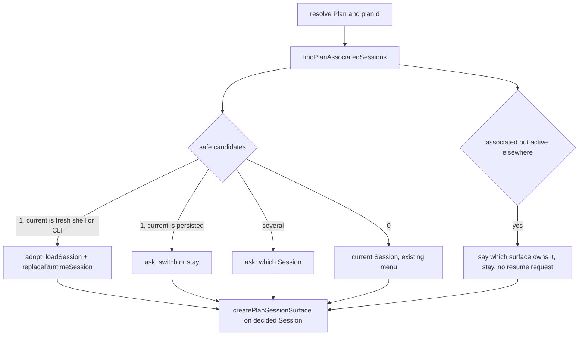

# Durable Plan-to-Session Continuity

## Context

The Workspace and `wld load-plan` can load a saved Plan without finding the Session that produced it. The owner can lose
the planning rationale and continue in a new or unrelated Session.

Today the only link from a Session to a Plan is the mutable `planName` inside the `runwield.workflow_context` transcript
entry. `recordNormalizedWorkflowContext` (`src/shared/session/workflow-context-session.js`) writes it fail-open: it
swallows errors and does not publish a Session generation. Nothing in Session evidence carries a `planId`. The Plan does
not point back to a Session. `wld load-plan` always works in the current Session; from the CLI it starts a brand-new
one. Workspace has no load-plan and no Plan → Sessions lookup; `owner-plan-progress.ts` checks a caller-supplied Session
by name match (`JSON.stringify(workflowContext).includes(planId)`).

A Plan can have zero, one, or several related Sessions, and a Session can relate to more than one Plan. The parent Epic
settled that the relationship is append-only Session evidence keyed by durable `planId`, written by one Session Runtime
operation, and read back from Sessions. It must not become one mutable owner field in Plan Front Matter.

## Objective

1. Every production path that plans, reviews, executes, or repairs a Plan in a Session commits one **Plan Association**
   entry: durable `planId`, `planName`, an **Association Purpose** (`planning`, `review`, `execution`, `recovery`), the
   current Session Transcript Segment ID and kind, and a timestamp. The entry is committed by a published Session
   generation, never fail-open.
2. One shared reverse lookup finds the Sessions associated with a `planId` inside one registered Project from committed
   Session evidence only, and says for each whether it is a **safe planning resume** candidate. It reads the per-Session
   manifest projection of that evidence, not the transcripts, so its cost is the manifest reads `listProjectSessions`
   already does.
3. `wld load-plan` resolves the Plan first (by name, path, or durable `planId`), then chooses the Session:
   - exactly one safe candidate and the current Session is a fresh unpersisted shell (or there is no current Session,
     CLI form) → adopt it automatically;
   - exactly one safe candidate and the current Session is persisted and unrelated → ask the owner to switch or stay;
   - several safe candidates → ask the owner which one;
   - the associated Session is active in another surface → say which surface owns it, stay in the current Session, and
     never send a synthetic resume request to it;
   - no proven association → the current behavior is unchanged. Legacy Sessions that carry only a `planName` are ignored
     (decision: no hints, no automatic resume).
4. Workspace exposes the same lookup as a browser-safe read
   (`GET /api/owner/projects/:projectId/plans/:planId/sessions`). No Workspace UI changes in this Plan; Plan 03 consumes
   the read (decision).
5. `docs/domain-language.md` defines Plan Association and Association Purpose and their relationships.

## Approach

Put the relationship where the history lives: the Session Transcript. Reuse the write primitive the runtime already has.

```text
plan_written tool / runPlanningAgent / execution start / repair follow-up
  hostedSession.recordPlanAssociation({ planId, planName, purpose })
    appends runwield.plan_association { planId, planName, purpose, segmentId, segmentKind, recordedAt }
    committed by the enclosing managed turn's published generation
  SessionRuntime.recordPlanAssociation(sessionId, entry)          <- out-of-turn callers
    #runManagedStandaloneMutation("workflow_operation", ...)      <- publishes its own generation
```

`#runManagedStandaloneMutation` (`session-runtime.js` L1229) already does the right thing in both situations: inside an
active managed operation it reuses the held capability and the turn's checkpoint commits the entry; outside one it opens
a managed operation, appends, fsyncs, and calls `publishGenerationAndRelease`. The `HostedSession` method must throw
when no writable root Session manager exists (that only happens outside a managed operation); it must not copy the
fail-open `try/catch` of `recordNormalizedWorkflowContext`.

Cache: the Session manifest. Each Session already has a small `manifest.json` that `listProjectSessions` reads, and the
store already keeps one append-only projection there under the held writer lock (`artifacts`, written by
`registerSessionArtifact`). `planAssociations` joins it. The transcript entry stays the authority; the manifest list is
a projection that is refreshed by the same atomic write that publishes the generation, so it can never be newer or older
than the committed transcript.

```text
write (under the held Session Writer Lock)
  hostedSession.recordPlanAssociation(entry)
    append runwield.plan_association to the transcript          <- authority
    store.stagePlanAssociation(proof, entry)                   <- manifest.planAssociations[], committedGeneration: null
  publishGenerationAndRelease(proof, evidence)
    pending entries get committedGeneration = evidence.generation, in the same manifest write
  releaseUnchangedActivation / markSessionUncertain
    pending entries are dropped

read
findPlanAssociatedSessions(sessionStore, { cwd, planId })
  Project record for cwd  ->  FileSessionStore.listProjectSessions(projectId)   (manifests only)
  for each manifest
    planAssociations.filter(planId, committedGeneration !== null)   append-only, newest last
    inspectSessionActivation(runwieldSessionId)
    getCurrentSessionSegment(runwieldSessionId).kind
  candidate = { session, associations, latestPurpose, activation, activeSurface, safePlanningResume, reason }

adopt (one Session only)
  projectAggregateTranscript(candidate)   verify the committed prefix before switching; degraded -> do not adopt
```

Refresh and rebuild: no scheduled refresh exists or is needed. The projection changes only when a generation commits.
When a manifest is restored from the transcript-adjacent recovery descriptor (`<transcript>.jsonl.runwield.json`), the
list comes with it. When a manifest is reconstructed from transcript lineage alone, the reconstruction derives the list
from `runwield.plan_association` entries in the committed prefix. Sessions from before this change have no association
entries, so a manifest without the field means "none"; nothing is backfilled.

`safePlanningResume` is true only when all of these hold: activation state is `idle` (after `inspectSessionActivation`
has run its dead-writer check), the current segment kind is `planning`, and the newest association for this `planId` in
that Session has purpose `planning` or `review`. Every other candidate is returned with a `reason` (`active_elsewhere`,
`execution_segment`, `uncertain`, ...), so the TUI can name the owning surface without a second read. The committed
prefix of the one Session chosen for adoption is verified right before the switch.

`wld load-plan` becomes two stages. Stage one needs only a project root: `getSessionSnapshot(sessionId).cwd` when a TUI
Session exists, `getCwd()` for the CLI form. It resolves the Plan, ensures its `planId`, runs the lookup, and decides
the Session. Stage two is the existing flow (`createPlanSessionSurface` and the action menu) bound to the decided
Session.



Adopting in the TUI uses the same calls `/resume` uses (`src/cmd/resume/index.ts` L199–225):
`sessionRuntime.loadSession({
cwd, sessionId: <piSessionId>, sessionPath: <transcriptPath> })`,
`options.replaceRuntimeSession(loaded.sessionId)`, `uiAPI.clearMessages()`, `sessionRuntime.replaySession(...)`. In the
CLI form the TUI is started with `sessionStartMode: "continue", resumeSessionId` instead of a new Session.

Options set aside for the cache: Plan Front Matter (Plan files are in git, so every association becomes repository diff
noise, the execution-worktree copy diverges from primary, and a Plan would claim Sessions it does not own; the Epic
rejected it) and a registry under `.wld/` (per-checkout, mutable across concurrent Sessions, would need its own lock;
the manifest is already locked and rewritten on every commit). Reading every transcript on each lookup was the first
draft; it is correct but pays a full digest verification per Session per lookup. Another option set aside: recording the
association in `load-plan` as a standalone mutation right before the planning turn. It would add one extra published
generation per resume and break the existing "resuming publishes exactly one Plan-named generation" test; recording
inside `runPlanningAgent` costs nothing extra.

## Expected Change Surface

The boundaries this change is expected to touch. This list is guidance, not an allowlist: verify the real footprint
during implementation and change whatever the Implementation Steps need, including files not named here. Stop and report
only when discovery changes approved intent — the change reaches another subsystem, public behavior or architecture
shifts, migration or compatibility risk grows, or the Verification Plan no longer proves the objective.

- `src/shared/session/plan-association.ts` (new) — owns the `runwield.plan_association` custom type constant, the
  `PlanAssociation` type, the `AssociationPurpose` union, `normalizePlanAssociation` (rejects malformed entries), and
  `readPlanAssociations(entries)` (append-only list in transcript order). One owner for the entry shape.
- `src/shared/session/session-transcript-projection.js` — `summarizeProjectedEntries` gains `planAssociations` (array,
  never mutated in place) beside `workflowContext`; `getCommittedTranscriptAuthorityFacts` passes it through.
- `src/shared/session/file-session-store-types.ts`, `file-session-control.ts`, `file-session-storage.ts` — manifest
  gains `planAssociations?: ManifestPlanAssociation[]` (entry fields plus `committedGeneration: number | null`);
  `stagePlanAssociation(proof, entry)` writes a pending entry under the held lock like `registerSessionArtifact`;
  `publishGenerationAndRelease` stamps pending entries with the published generation in the same manifest write;
  `releaseUnchangedActivation` and `markSessionUncertain` drop pending entries; lineage-only manifest reconstruction
  derives the list from committed transcript entries. `catalogedSession` (or a sibling read) exposes the committed list.
- `src/shared/session/hosted-session.js` — `recordPlanAssociation(entry)` appends the entry through the writable root
  Session manager with the current segment ID and kind, stages it in the manifest through the current
  `ManagedOperationCapability`, and throws when no writable manager exists.
- `src/shared/session/session-runtime.js` — `recordPlanAssociation(sessionId, entry)` standalone wrapper and
  `listPlanAssociatedSessions(cwd, planId)` read (same shape as `listResumableSessions`). Note: the working tree has an
  unrelated uncommitted sidebar-token change in this file; leave it alone.
- `src/shared/session/plan-session-lookup.ts` (new) — `findPlanAssociatedSessions` (manifests only) and the
  `safePlanningResume` rule, plus `verifyPlanAssociatedSession` (one committed-prefix verification for the Session about
  to be adopted). Shared by TUI and Workspace so both apply one rule.
- `src/shared/workflow/planning-agent.ts` — `runPlanningAgent` records `planning` or `review` (new `associationPurpose`
  option, default `planning`) when `planName` and `triageMeta.planId` are present. This covers load-plan resume,
  re-review, Epic continuation, `plans pull`, and `plan-executor`.
- `src/cmd/load-plan/plan-review-flow.ts` — passes `associationPurpose: "review"`.
- `src/tools/plan-written.ts` — records `planning` after the Plan has a durable `planId`; reports the failure in the
  tool result instead of swallowing it. Keeps `setWorkflowPlanName` for the footer.
- `src/shared/workflow/execution-start.ts` — records `execution` beside `setWorkflowExecutionContext` (both call sites).
- `src/shared/session/session-runtime.js#replaceSessionForExecutionFollowUp` and the semantic-repair segment handoff —
  record `execution` on the follow-up Session and `recovery` on the repair segment.
- `src/shared/workflow/workflow-slicer.ts` — records `planning` for the Epic being decomposed (it already knows
  `planName`; get the `planId` from the Epic attrs).
- `src/cmd/load-plan/index.ts` — two-stage flow described above; the `PlanSessionSurface` is created after the Session
  is decided.
- `src/cmd/load-plan/primary-plan-recovery.ts` — `resolvePlanWithPrimaryRecovery` accepts a durable `planId` argument
  (use `findPlanEvidenceById` or the private `resolveActivePlanNameOrId` pattern in `plan-store.js`).
- `src/cmd/registry.js` — usage string already says `<plan-name-or-id>`; make it true; `getArgumentCompletions.js` may
  stay name-only.
- `src/ui/workspace/server/owner-plan-sessions.ts` (new) and `src/ui/workspace/server.js` —
  `GET
  /api/owner/projects/:projectId/plans/:planId/sessions` composed from `findPlanAssociatedSessions`, browser-safe
  fields only (no transcript paths).
- `docs/domain-language.md` — adds **Plan Association**, **Association Purpose**, and relationships.

Deliberately left out: `owner-plan-progress.ts`'s name-match Session check and `SessionSurface.jsx`'s
`workflowContext.planId || planName` link. Plan 03 removes the standalone progress page; changing that check now would
only break links for old Sessions.

## Reuse Opportunities

Existing functions, modules, or patterns to reuse:

- `src/shared/session/session-runtime.js#\#runManagedStandaloneMutation` — commit-confirming write in both in-turn and
  standalone situations. Do not write a second lock or generation path.
- `src/shared/session/file-session-control.ts#registerSessionArtifact` — the exact pattern for a locked, proof-checked
  append-only manifest projection; `stagePlanAssociation` copies its shape without the `kind + path` dedupe.
- `src/shared/session/session-transcript-manifest.ts#projectAggregateTranscript` — verified committed read, used once
  for the Session about to be adopted.
- `src/shared/session/file-session-store.ts#listProjectSessions`, `#inspectSessionActivation`,
  `#getCurrentSessionSegment` — Session list, dead-writer-aware activation, segment kind.
- `src/shared/session/session-resume-list.ts` — shape and concurrency pattern (`mapWithConcurrency`) for the lookup.
- `src/cmd/resume/index.ts` — adoption sequence (`loadSession`, `replaceRuntimeSession`, `clearMessages`,
  `replaySession`, active-elsewhere notice via `buildConversationRestoredMessage`).
- `src/shared/session/workflow-context-session.js` — entry normalization style to follow; do not follow its fail-open
  behavior.
- `src/cmd/testing/runtime-command-fixture.ts#withRuntimeCommandFixture`, `src/testing/managed-session-fixture.ts`,
  `src/shared/git-test-fixture.ts` — real Session and repository fixtures. `index.integration.test.ts` shows how to
  script `promptSelect` with `makeUi(selections)`.

## Implementation Steps

- `src/shared/session/plan-association.ts` exports `PLAN_ASSOCIATION_CUSTOM_TYPE = "runwield.plan_association"`,
  `AssociationPurpose` (`"planning" | "review" | "execution" | "recovery"`), `PlanAssociation` (`planId`, `planName`,
  `purpose`, `segmentId`, `segmentKind`, `recordedAt`), `normalizePlanAssociation` returning `null` for any entry
  missing `planId`, `purpose`, or `segmentId`, and `readPlanAssociations(entries)` returning every valid entry in
  transcript order without deduplication.
- `summarizeProjectedEntries` returns `planAssociations: PlanAssociation[]` (empty array when none), and a transcript
  with only `runwield.workflow_context.planName` yields an empty array. `getCommittedTranscriptAuthorityFacts` includes
  it.
- `FileSessionStore.stagePlanAssociation(proof, entry)` requires the held lock and a matching proof, appends
  `{ ...entry, committedGeneration: null }` to `manifest.planAssociations`, and never deduplicates.
  `publishGenerationAndRelease` sets `committedGeneration` on every pending entry to the generation it publishes, in the
  same `manifests.write` call. `releaseUnchangedActivation` and `markSessionUncertain` remove pending entries. A
  manifest reconstructed from transcript lineage alone lists the associations found in the committed prefix with the
  generation established at reconstruction. `ManagedOperationCapability.stagePlanAssociation(entry)` forwards to the
  store with the held proof, like `registerArtifact`.
- `HostedSession.recordPlanAssociation({ planId, planName, purpose })` appends one `runwield.plan_association` entry
  with the current `currentSegmentId` and segment kind, stages the same entry through the current capability, and
  returns the recorded entry; when there is no writable root Session manager it throws `plan_association_not_writable`
  instead of returning silently.
- `SessionRuntime.recordPlanAssociation(sessionId, entry)` runs through
  `#runManagedStandaloneMutation(…,
  "workflow_operation", …)` and returns
  `{ ok: true, association, committedGeneration }` where `committedGeneration` is the published generation number when
  it ran standalone, or `null` with `operationId` when it ran inside the current managed operation. Failure returns
  `{ ok: false, error }`; it is not swallowed.
- `runPlanningAgent` records an association with `associationPurpose` (default `planning`) when `planName` and
  `triageMeta.planId` are present, inside the turn, before the model call. `plan-review-flow.ts` passes `"review"`.
  `plan_written` records `planning` once the Plan has a durable `planId` and appends a visible line to its tool result
  when recording fails. `execution-start.ts` records `execution` at both call sites.
  `replaceSessionForExecutionFollowUp` records `execution` on the new Session; the semantic-repair segment handoff
  records `recovery`. `workflow-slicer.ts` records `planning` for the Epic.
- `src/shared/session/plan-session-lookup.ts` exports `findPlanAssociatedSessions(sessionStore, { cwd, planId })`
  returning `PlanAssociatedSession[]` with `runwieldSessionId`, `displayName`, `piSessionId`, `transcriptPath`,
  `associations`, `latestPurpose`, `currentSegmentKind`, `activationState`, `activeSurface`, `safePlanningResume`, and
  `reason`. It reads associations only from manifest `planAssociations` entries whose `committedGeneration` is not
  `null` (never from a transcript file), calls `inspectSessionActivation` for state, and sets `safePlanningResume` true
  only when `activationState === "idle"`, `currentSegmentKind === "planning"`, and `latestPurpose` is `planning` or
  `review`. An execution segment returns `reason: "execution_segment"`; a live writer `reason: "active_elsewhere"`;
  `uncertain` or `reconcile_required` return their state as the reason. The lookup opens no transcript file.
  `verifyPlanAssociatedSession(sessionStore, candidate)` runs `projectAggregateTranscript` for one Session and returns
  `{ ok: true }` or `{ ok: false, reason: "degraded" }`; load-plan calls it for the Session it is about to adopt and
  refuses to adopt on `degraded`. `SessionRuntime.listPlanAssociatedSessions(cwd, planId)` wraps the lookup.
- `resolvePlanWithPrimaryRecovery(projectRoot, arg)` resolves a UUID `planId` argument to the same Plan that
  `findPlanEvidenceById` returns, and still resolves names and paths as today.
- `runLoadPlanCommand` resolves the Plan and runs the lookup before `createPlanSessionSurface`. With one safe candidate
  and a current Session that is an unpersisted shell (`getSessionSnapshot(...).managed === null`), or with no current
  Session (CLI form), it adopts that Session; with a persisted current Session it asks
  `Continue in "<name>" / Stay
  here`; with several safe candidates it asks which; when the only associated Session is
  active elsewhere it prints the owning surface kind and continues in the current Session. In every branch the
  `PlanSessionSurface` is bound to the decided Session ID and the existing action menu runs unchanged.
- `wld load-plan <plan>` from the CLI with one safe candidate starts the TUI with `sessionStartMode: "continue"` and
  that Session; with none it starts a new Session as today.
- `GET /api/owner/projects/:projectId/plans/:planId/sessions` returns `{ planId, sessions: [...] }` from
  `findPlanAssociatedSessions` for the registered Project, requires the same owner authentication as the sibling Plan
  routes, omits `transcriptPath`, and returns `404` for an unknown `planId`.
- `docs/domain-language.md` defines **Plan Association** (append-only Session evidence that one Session worked on one
  Plan for one purpose; _Avoid_: Plan owner Session, Session owner, planName link) and **Association Purpose**
  (`planning`, `review`, `execution`, `recovery`), and adds relationships: a Plan has zero or more Plan Associations
  across Sessions; a Session may hold Plan Associations for several Plans; a Plan Association is written under the
  Session Writer Lock and committed by a Session generation; the Session manifest carries a projection of committed Plan
  Associations and is never their authority; only a `planning` or `review` association on an idle planning segment makes
  a Session a safe planning resume.

## Verification Plan

- Automated: `deno run -A scripts/run-tests.js src/cmd/load-plan/plan-session-continuity.integration.test.ts` (new file
  named by the Epic) using `withRuntimeCommandFixture` and real Sessions:
  1. Run `runtime.runPlanningAgent` with a faux model against a Plan that has a `planId`. Restart the store/runtime and
     read `projectAggregateTranscript(...).snapshot.planAssociations`: one entry with `purpose: "planning"`,
     `segmentKind: "planning"`, the right `planId`. Fails if `recordPlanAssociation` is a no-op or writes only
     `workflow_context`.
  2. Run `runPlanningAgent` through `plan-review-flow` (or with `associationPurpose: "review"`) and prove the second
     entry has `purpose: "review"` and the first is still present (append-only).
  3. From a fresh unpersisted Session, `runLoadPlanCommand([planName])` with one safe candidate: `replaceRuntimeSession`
     is called with a Session whose `runwieldSessionId` equals the candidate and the planning runner receives that
     Session ID. Fails if the lookup always returns `[]`.
  4. From a persisted Session with one user message and no association: `promptSelect` offers switch/stay; `stay` keeps
     the Session ID and does not call `replaceRuntimeSession`; `switch` adopts.
  5. Two safe candidates: `promptSelect` lists both; the chosen one is adopted.
  6. Candidate held active by a second runtime (`makeManagedSessionFixture.openRuntime("tui", otherOwner)` or a direct
     `acquireSessionActivation` on the store): the notice names `tui`, `replaceRuntimeSession` is not called, and no
     planning request is sent to that Session (its committed generation is unchanged after the command).
  7. A Session with only `runwield.workflow_context.planName` matching the Plan: not offered, not adopted, behavior
     equals the no-association case.
  8. `runLoadPlanCommand([planId])` resolves the same Plan as `runLoadPlanCommand([planName])`.
  9. Lookup ignores an uncommitted tail: append one valid `runwield.plan_association` JSONL line directly to a persisted
     Session's current transcript file with `Deno.writeTextFile(..., { append: true })` without republishing the
     generation. `findPlanAssociatedSessions` returns `[]` for that `planId`, and `runLoadPlanCommand([planName])` from
     a fresh shell does not call `replaceRuntimeSession`. Fails if the lookup reads the raw transcript instead of the
     committed manifest projection.
  10. Degraded prefix: byte-modify the committed prefix of a Session that has a real committed association. The lookup
      still lists it (manifest is intact), but `runLoadPlanCommand([planName])` from a fresh shell reports the Session
      as damaged and does not call `replaceRuntimeSession`. Fails if adoption skips `verifyPlanAssociatedSession`. 10b.
      Lookup opens no transcript: make every transcript file in the Project unreadable (`chmod 000`, skipped on
      platforms where that is not enforceable) and assert `findPlanAssociatedSessions` still returns the committed
      candidate list from manifests. Fails if the lookup reads transcripts.
  11. Execution segment: after case 1, roll the same Session to an `execution` segment (`rollSessionTranscriptSegment`
      as `segment-rollover.test.js` does, or the "direct review from draft can approve and start execution" setup in
      `index.integration.test.ts`) and commit one turn. The candidate has `currentSegmentKind: "execution"`,
      `safePlanningResume: false`, `reason: "execution_segment"`, and load-plan from a fresh shell does not adopt it.
      Fails if `safePlanningResume` is only `activationState === "idle"`.
  12. Dead writer: rewrite the candidate's manifest `activation` on disk to `state: "active"` while no process holds the
      lock. The lookup returns `activationState: "idle", safePlanningResume: true` and load-plan adopts. Fails if the
      lookup reads manifest state instead of calling `inspectSessionActivation`.
  13. Identity, not name: rename the Plan file after the association is committed (new `planName`, same `planId`).
      `findPlanAssociatedSessions` for the `planId` still returns the Session; a second Plan created with the old name
      and a new `planId` returns `[]`. Fails if the lookup or load-plan matches on `planName`.
- Automated:
  `deno run -A scripts/run-tests.js src/shared/session/plan-association.test.ts
  src/shared/session/session-transcript-projection.test.js src/shared/session/hosted-session.test.js`
  — normalizer rejects malformed entries; projection exposes `planAssociations`; `HostedSession.recordPlanAssociation`
  throws without a writable manager.
- Automated: execution and recovery writes — extend the existing execution-start / follow-up tests (or add cases beside
  them) so that after `executePlan` the execution Session's committed projection has `purpose: "execution"`, and a
  semantic-repair handoff adds `purpose: "recovery"` on the repair segment. Assert the entry is inside the committed
  prefix (`projectAggregateTranscript(...).ok === true` and the entry appears in `snapshot.planAssociations`), not only
  in the raw file.
- Automated: `deno run -A scripts/run-tests.js src/shared/session/file-session-store.test.js` new cases: (a)
  `stagePlanAssociation` then `publishGenerationAndRelease` leaves one entry with `committedGeneration` equal to the
  published generation, visible after reopening the store; (b) `stagePlanAssociation` then `releaseUnchangedActivation`
  or `markSessionUncertain` leaves no entry; (c) a manifest deleted and restored from the recovery descriptor keeps the
  list; (d) a manifest reconstructed from transcript lineage alone (manifest and descriptor both removed, transcript has
  a committed `runwield.plan_association` entry) lists that association. Fails if the projection is only written at
  stage time or only at publish time, or if reconstruction ignores it.
- Automated: `SessionRuntime.recordPlanAssociation` standalone call on an idle persisted Session returns
  `committedGeneration` equal to `inspectSessionActivation(...).generation.generation` after the call and one greater
  than before; the same call made inside a running managed turn returns `committedGeneration: null` with the turn's
  `operationId`. Fails if the wrapper appends without publishing or publishes twice.
- Automated: Workspace route test beside `owner-workspace.test.js`: the endpoint returns the candidate list with
  `safePlanningResume` and `activeSurface`, omits transcript paths, excludes `planName`-only Sessions, returns `404` for
  an unknown `planId`, and returns `safePlanningResume: false, reason: "execution_segment"` for the execution-segment
  Session from case 11 so the route is proven to use the shared rule.
- Automated: `deno run -A scripts/run-tests.js src/cmd/load-plan/index.integration.test.ts` — all 36 existing cases must
  still pass. Protect specifically: "resuming publishes exactly one Plan-named generation" (association must ride inside
  the planning turn), "selecting/viewing then canceling leaves Session durable evidence untouched" (the lookup is
  read-only), "activateForPlan renames exactly once", and the follow-up Session replacement case. No existing behavior
  is expected to stop existing; the no-association path is byte-for-byte the current path.
- Automated: `deno task seams:check` still passes — no injection seam is added for the association write or lookup.
- Manual (TUI): in one terminal, plan something and let `plan_written` run. Quit. Run `wld load-plan <that-plan>` from
  the CLI: the TUI opens the original conversation and the Plan menu appears in it. Then `/new`, type one message, run
  `/load-plan <that-plan>`: you are asked to switch or stay.
- Manual (TUI, active elsewhere): keep the planning TUI open and, in a second terminal, run
  `wld load-plan
  <that-plan>`: the message names the TUI as the owning surface, a new Session is used, and the first
  TUI receives no message.
- Manual (Workspace): with `deno task workspace:dev`,
  `GET
  http://127.0.0.1:5173/api/owner/projects/<id>/plans/<planId>/sessions` lists the planning Session with
  `safePlanningResume: true` while idle and `activeSurface: "tui"` while the TUI is open.
- Glossary: confirm `docs/domain-language.md` describes only the implemented Plan Association behavior and does not
  promise Workspace UI that Plan 03 owns.

## Edge Cases & Considerations

- Execution Sessions created by follow-up live in the execution worktree cwd, so a lookup from the primary Project root
  does not list them. That is acceptable here: only planning Sessions are automatic resume targets. Plan 03 can widen
  the read when it needs them.
- One Session with associations to several Plans is one candidate per Plan, never duplicated; the lookup filters
  associations by `planId` per Session.
- A planning Session that later ran execution in a new segment has `currentSegmentKind: "execution"` and is returned
  with `safePlanningResume: false, reason: "execution_segment"`. Its history stays visible to Workspace.
- `inspectSessionActivation` may flip a dead writer's `active` to `idle` or `reconcile_required` during the lookup. That
  is existing store behavior and is what makes "idle" trustworthy; the lookup must call it rather than reading the
  manifest state directly.
- Listing and adopting never take the Session Writer Lock. The first mutation in the adopted Session acquires it through
  the existing Session Runtime path. If adoption races with another surface, `loadSession` reports `active_elsewhere`
  and the TUI shows the existing notice.
- `plan_written` inside an Agent turn cannot open a second managed operation; the `HostedSession` method appends under
  the held lock and the turn's checkpoint commits it. The tool must not call the standalone runtime wrapper.
- Lookup cost is the manifest reads `listProjectSessions` already performs plus one `inspectSessionActivation` per
  Session that has a matching association. No transcript is opened until one Session is chosen for adoption. The Plans
  03/04 search index does not need to duplicate this projection.
- A pending manifest entry (`committedGeneration: null`) can exist only while a writer holds the lock or after a crash
  before publish. Readers ignore it; the next `inspectSessionActivation` on a dead writer runs the existing recovery,
  and any later successful operation's `releaseUnchangedActivation`/`publishGenerationAndRelease` clears or stamps it.
  Recovery from a truncated transcript (`reconcile_required`) must also drop pending entries so a stamped entry is never
  older than the committed prefix it claims.
- Assumption: purpose vocabulary is exactly the four values above. Adding a value later is cheap; renaming one is not,
  because it is committed evidence.
- Assumption: a Plan file without a durable `planId` gets one through the existing `ensurePlanIdentity` path before any
  association is recorded; if identity cannot be ensured, no association is written and the caller reports it.
