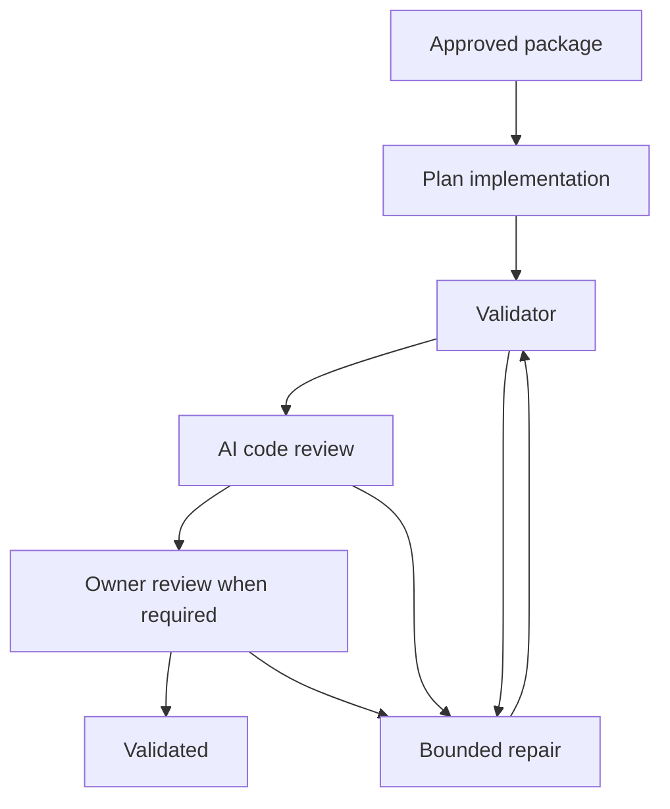
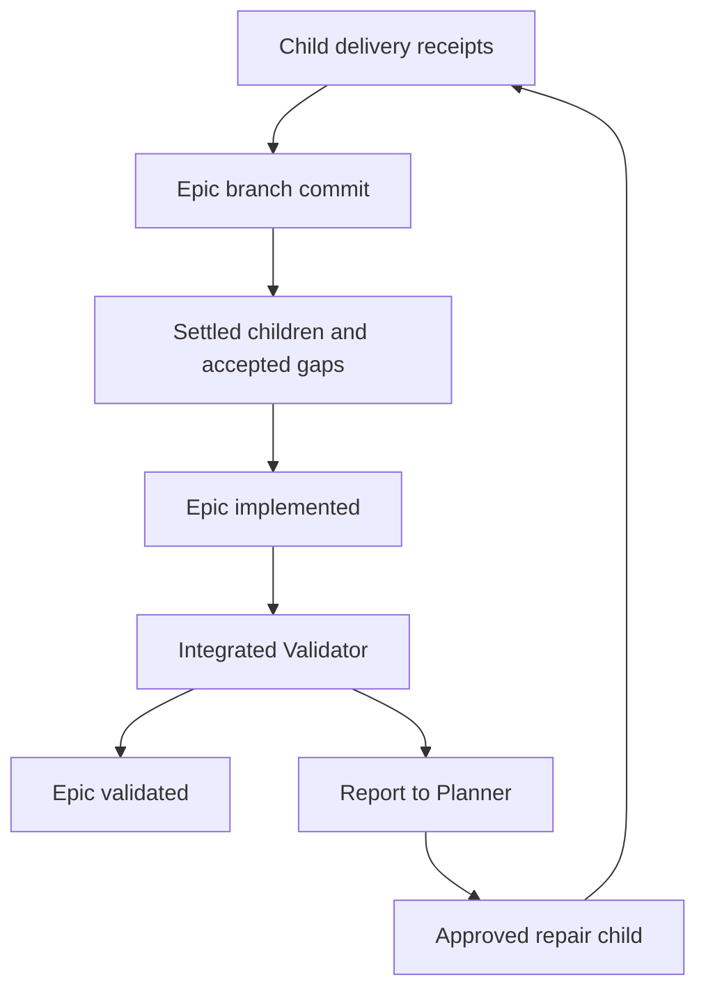
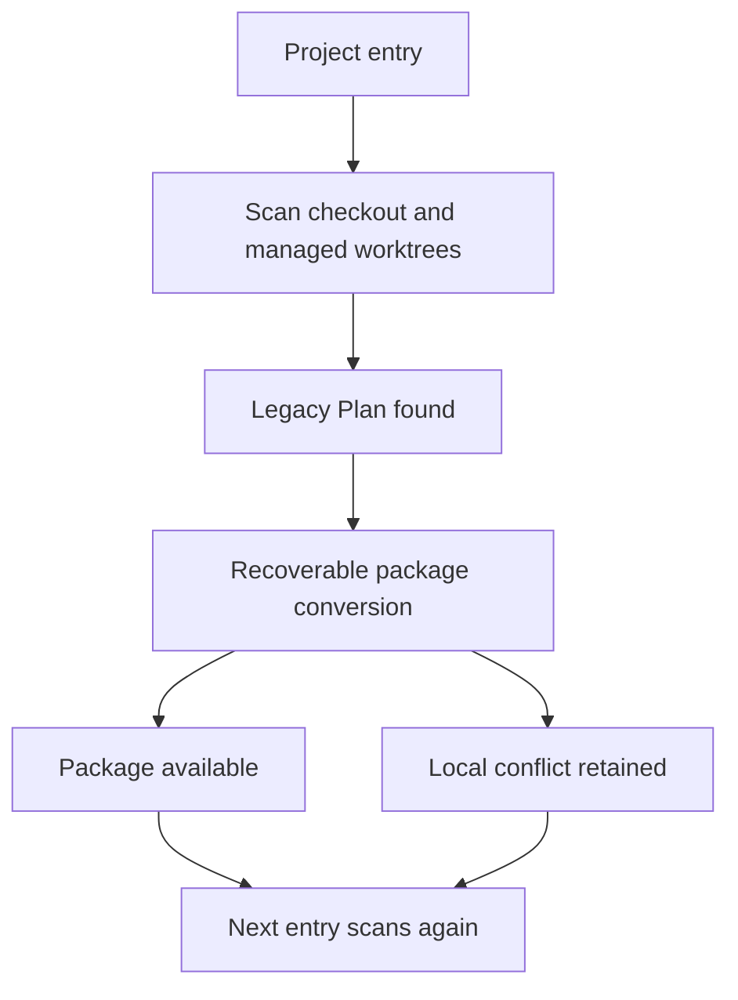

# Plan Packages and Independent Validation

## Context

RunWield stores each executable Plan as one Markdown file. Planner combines the requested outcome, implementation steps,
verification procedures, and manual QA expectations in that file. Plan Engineer or Frontend Engineer implements it and
is instructed to run the full Verification Plan and CI command. Workflow Validation then runs Mechanical Validation and
AI code review. This repeats work without giving the full approved acceptance contract an independent owner.

The same gap exists for Epics. Children publish to their recorded target branch. Without an Epic target, partial work
can reach the main branch before the capability is complete. Current automatic parent completion and `epic_done_enough`
do not run an integrated check of the assembled result. The Epic Manual QA aggregate is advisory, not executed proof.
Remote child publication already uses an isolated clone; the problem is the release destination, not necessarily a write
to the primary checkout.

This Epic separates specification, implementation, independent proof, user acceptance, and delivery. It also makes the
Epic branch the default destination for child work and validates the assembled Epic before declaring independent
success. Users retain the right to accept any result without waiting for successful checks.

The original prerequisites are present: the session-independent validation engine, controller-owned recovery, simpler
workflow messages, and Pair Execution for both Plan execution owners. They are foundations to reuse, not pending
prerequisite Plans. The validation-authority Work Record records user-attested verification rather than a successful
RunWield Workflow Validation run. Source and tests support the current ownership map below; this design session did not
run the test suite.

Two saved dependent Epics remain separate:

- `plan-package-frontend-experience-planning` adds user journeys, representative states, and reviewed prototypes.
- `epic-branch-publication-workflow` adds owner-triggered delivery of an Epic branch to the primary branch.

This Epic does not implement either dependent experience. Its interfaces must support them. No-plan QUICK_FIX behavior
remains unchanged.

## Objective

Replace single-file executable Plans with **Plan Packages** and give the approved validation contract an independent
Validator. A new execution-ready package has `plan.md` and `validation.md`. Generated `manual-qa.md` contains only the
remaining human work. Lightweight child drafts and historical migrated Plans can lack an approved validation contract;
they cannot start new execution until Planner supplies one and the user approves it.

The architecture must produce these outcomes:

- One approval covers the authored package, not whichever document a caller happened to read.
- Plan Engineer and Frontend Engineer implement the approved work, add required tests and fixtures, and use targeted
  checks during development. They do not own or claim the independent validation result.
- Validator executes the machine-executable and agent-executable contract. A separate Semantic Reviewer checks the
  validated candidate against the approved package where semantic diff review applies.
- Orchestration owns bounded repair, completion events, process recovery, and the return to full proof after code
  changes.
- The user can always accept an individual Plan or Epic through code review or directly as `user_validated`.
- `validated` means required independent checks passed. `user_validated` means the user accepted the result. Neither
  status is delivery evidence.
- An Epic has its own target branch by default. Children publish there. The assembled Epic receives integrated
  validation without becoming an executable Plan or owning a durable execution worktree.
- The binary migrates the current checkout and RunWield-managed worktrees, including unfinished attempts. Migration is
  repeatable, permits partial progress, and handles old-format Plans introduced by later merges.

The main option set aside is adding more instructions to the existing Plan and Engineer prompt. That retains duplicated
verification work and does not establish an independent owner of the approved proof. No new datastore, framework, or
service is needed: extend the current file store, controller, Git machinery, Agent tools, and review surfaces.

### Package shape and ownership

```text
docs/plans/<plan>/
  plan.md          identity, authored definition, lifecycle and human history
  validation.md    approved validation contract
  manual-qa.md     generated human checklist, when needed

docs/plans/<epic>/
  plan.md
  validation.md    integrated Epic contract
  manual-qa.md     advisory aggregate
  <child>/
    plan.md
    validation.md
```

Only a directory containing canonical `plan.md` is a Plan Package. Companion Markdown is not cataloged as a separate
Plan. `planId` remains durable identity; names remain human-facing locations. A parent package owns its documents and
child relationships, not every file below its directory.

| Fact                                                               | Owner                           | Caller rule                                                                                            |
| ------------------------------------------------------------------ | ------------------------------- | ------------------------------------------------------------------------------------------------------ |
| Plan definition and human lifecycle history                        | Authoritative package documents | Primary before execution; managed execution or retained document worktree afterward                    |
| Package membership, content revision, atomic saves and migration   | Plan store                      | Callers do not assemble package identity or independently write companions                             |
| Approval receipt and exact reviewed snapshot                       | Controller, keyed by `planId`   | Bind approval to the reviewed specification revision; never rebuild the review base from current files |
| Validation results, generations, repair receipts and review issues | Controller                      | Agent reports are inputs; only the current workflow owner advances state                               |
| Worktree identity and publication state                            | Worktree registry plus Git      | Preserve real commit, target, ancestry and publication evidence                                        |
| Session conversation and handoff history                           | File-backed Session machinery   | Keep one user-facing Session across role changes; transcript prose is not completion authority         |
| UI and Workspace metadata                                          | Projections of these owners     | No browser, database projection or Agent message can manufacture approval or proof                     |

Dependencies point from commands, tools, workflow, collaboration and UI to the Plan store's package interface.
Controller operations coordinate lifecycle writes through that interface. Validation depends on an approved package
snapshot and a candidate identity, not on a browser, a Session transcript, or a mutable primary Plan copy. Existing
external process, model and browser capabilities remain external; package transactions and lifecycle rules remain
RunWield-owned.

### Approval and document changes

The approved specification revision covers a versioned, ordered manifest of authored package paths and content:

- the body of `plan.md` and authored metadata, including classification, Work Kind, dependencies, relationships, and
  target policy;
- all of `validation.md`;
- any explicitly declared authored companion artifacts. This permits the dependent frontend Epic to add its artifacts
  without teaching every caller a different approval rule.

Exclude mutable lifecycle fields, timestamps, archive history, controller records, collaboration synchronization fields,
generated QA and reports, and child-package content. Preserve custom authored metadata rather than dropping unfamiliar
keys. Authored YAML values can be canonicalized so formatting-only YAML changes do not withdraw approval. File
additions, removals, renames, or authored-content changes change the specification revision. Status changes and
regenerated QA do not.

Keep the content revision separate from byte revisions used to prevent overwriting concurrent edits. A review decision
must carry the actual reviewed snapshot, its identity and revision, and expected workflow ownership. A validation-only
edit after review opens must reject the old approval, including in Workspace. Never use freshly loaded content as if it
were the content the user reviewed.

The Plan store stages and commits a complete package update under existing locks, with a durable journal that lets
readers resolve one committed file set. Sequential file replacement alone is not atomic package approval. Recovery may
finish or restore only writes it can prove it owns. External edits remain intact. Direct Markdown edits stay supported;
the next read detects changed authored content and requires review before further work under that revision.

Share, pull, push and conflict detection transfer the same authored file manifest as approval. A peer that supports only
one Plan body must receive a clear compatibility error, not a success that silently drops `validation.md`. Preserve
existing collaboration ownership and encryption rules. Migration of remote-canonical content cannot bypass those rules.

Archive, restore and prune act on explicitly selected package-owned artifacts. Archiving a parent does not implicitly
archive all child packages. Existing bulk archive actions can select the related children and report each result. An
unselected child's folder can remain below a container without an active parent `plan.md`. Never recursively delete a
parent directory as a substitute for determining which packages are owned by the action.

### Planning and validation contract

Planner authors `validation.md` for a Planned Change. Architect owns the Epic's integrated acceptance intent and its
validation contract; Slicer connects child scope to the Epic outcomes without claiming implementation or proof. Child
drafts remain lightweight until Planner prepares the selected child. The current Epic template and tool behavior must
change with this architecture so future Epics can carry an executed contract while remaining non-executable containers.

Each contract states stable outcome and check identifiers, required inputs, setup and cleanup, actions, observable
success, and whether the check is machine-executable, agent-executable, or genuinely human-only. An agent-executable
check is a procedure another Agent can perform and report; it is not a permission to replace evidence with a claim.
Commands resolved through project settings are identified with the relevant configuration so repair cannot silently
weaken the approved proof by changing what the command means.

The Verification Adversary challenges whether the draft contract can distinguish the requested result from a cheap
counterfeit before approval. Preserve this role; do not restore the removed Objective-Failing Checks mechanism. The
contract must cover promised outcomes as well as protected existing behavior, not simply require a green test suite.

Validator reports identify the package revision, candidate revision, attempt and generation, and each check's result,
with evidence references. Failed, blocked, unrun and genuinely human-only checks are distinct from passing checks.
Operational failure, such as an unavailable tool or crashed test service, is distinct from an implementation finding and
from a proposed Plan defect. No required check disappears because execution failed early.

Generated `manual-qa.md` is a projection of human-only contract items and their current disposition. It must not add a
new acceptance requirement after approval. Required human judgment remains visible until answered or explicitly accepted
without completion; optional QA remains advisory. The Epic aggregate keeps its advisory meaning beside the executed
integrated contract. Reports and checkboxes cannot change approved requirements.

### Implementation, proof and repair



The diagram is the independent path for a Planned Change. Non-Git semantic diff review retains its explicit
not-applicable behavior. An Epic runs the integrated Validator path without an Epic-level Engineer or Semantic Reviewer.

Implementation completion, validation completion, semantic review completion and repair completion have role-specific
contracts. Each accepted event carries its owner, attempt, generation and tool-call identity and is consumed once.
Implementation completion produces `implemented`; it cannot produce a validation report. Repair completion returns
control to orchestration; it cannot declare a Plan independently validated. Keep existing Workflow Tool Event ownership
and consume-once protections rather than replacing them with transcript parsing.

Validation Repair Engineer receives the approved package reference, candidate checkout, failing checks and evidence.
Review Repair Engineer receives the package, candidate and current review issues. Plan-Revision Repair Engineer receives
the approved revision difference and preserved candidate. These are bounded contexts, not a replay of the implementation
conversation. No repair role edits lifecycle metadata, approval receipts, counters or publication records.

Orchestration bounds repair using the existing convergence policy and durable counters. Exhaustion pauses with evidence
and user choices; it does not invent success. On restart, reconcile current files, controller state and Git facts before
choosing the next action. Do not replay a completed or interrupted Agent turn as recovery.

Any code repair invalidates proof for the earlier candidate. This includes validation repair, review repair, Code Review
chat repair and publication conflict repair. Independent success requires a fresh complete Validator run and applicable
AI review. A changed package also needs renewed approval. The user can instead accept the repaired result directly.

### Validation environment — proposed default for review

The recommended default is one controller-owned, disposable validation checkout per candidate, for both Planned Changes
and Epics. It is not a new execution attempt. The controller pins the approved package and exact candidate before giving
Validator access. The implementation worktree and approved documents remain unchanged by validation.

Tests can create build output, fixtures, browser profiles and temporary probes inside the disposable environment.
Evidence is retained outside the candidate and approved package. Validator cannot repair production code or amend the
contract. Source or contract changes in the validation environment invalidate its passing result; do not copy those
changes back. A changed live candidate also makes the report stale. Test commands need appropriate local permissions,
but running them in another directory is not an operating-system security sandbox. Preserve existing consent and
secret-handling rules; never claim arbitrary test commands are harmless merely because the Agent has no edit tool.

For Git candidates, use an exact commit and record any separately captured implementation inputs needed for correctness.
Do not silently omit required untracked files. For non-Git work, retain consent-based in-place implementation and
capture an explicit source snapshot and digest for validation. Record snapshot scope and omissions; do not invent Git
evidence. If a reliable snapshot cannot be established, report that limit. Direct user acceptance stays available.

The alternative is validation in the implementation worktree with change detection afterward. It is cheaper to prepare,
but test side effects can damage the candidate before detection. Disposable validation costs disk space and environment
setup; dependency caches may be reused only without changing candidate identity or coupling concurrent runs. The user
has not yet confirmed this default.

### Lifecycle, owner acceptance and Plan defects

| State                   | Meaning                                                                                                      |
| ----------------------- | ------------------------------------------------------------------------------------------------------------ |
| `implemented`           | Implementation finished, or Epic children and accepted gaps are settled; independent proof remains           |
| `validating`            | Validator owns the current independent attempt                                                               |
| `reviewing`             | Semantic Reviewer owns the current Planned Change review                                                     |
| `awaiting_owner_review` | Required owner review or human judgment remains                                                              |
| `validated`             | Required independent checks passed for the recorded package and candidate; required owner gates are resolved |
| `user_validated`        | The user accepted the result without requiring a successful independent path                                 |
| `defective`             | The user approved a structured Plan-defect return to planning                                                |

Detailed phases, repair kind, counters and paused state belong in the controller, not additional board statuses.
Delivery remains separately recorded. A Plan can be validated with publication pending. An Epic can be validated without
being delivered to the primary branch. Legacy `verified` and `user_verified` records retain historical meaning;
migration must not relabel an old attestation or automatic Epic completion as a new independent run.

The user can always accept a Planned Change or Epic through Local Human Code Review or directly as `user_validated`.
Neither route requires a successful Validator run, AI review, integrated Epic validation, or exhausted repairs. Code
review is optional. Failed, interrupted and unrun workflows must expose the action. Where all independent gates already
passed, ordinary owner review can retain the proof-backed `validated` outcome. Direct acceptance remains explicit.

Record the acceptance route, time, available package and candidate identity, and existing check results. Missing
candidate evidence is recorded as unavailable, not used to prohibit acceptance or fabricate proof. Acceptance ends
automatic work at a safe checkpoint. Delayed Agent completions cannot overwrite it or restart repairs. It does not
discard worktrees, claim failed checks passed, create delivery evidence, or automatically publish an Epic.

An implementation Agent, Validator or Reviewer can propose a Plan defect with evidence: contradictory requirements,
missing authority or information, or a contract that can pass while the objective fails. Only user approval creates
`defective` and returns the package to Planner. Preserve the candidate and attempt history. Planner produces a new
revision for review, followed by bounded revision repair when safe. Rejection of the proposal leaves the package
unchanged; the user chooses repair, pause or acceptance. Do not confuse a test failure with permission to rewrite scope.

### Epic assembly and integrated validation



Architect names a default Epic target branch in future Epic definitions. Children execute from and publish to that
branch. The user can change this through ordinary Plan feedback, including choosing per-child delivery to the primary
branch. A primary branch destination does not imply modifying the primary checkout. RunWield does not publish the Epic
branch to primary in this Epic.

Recommended branch rule: record both the Epic destination and its intended creation base. Resolve the base commit before
branch creation; do not silently create from hard-coded local `main`. Use the repository's intended target/upstream as
the proposal and ask when it is ambiguous. Existing targets must be inspected rather than reset. Explicit child
overrides remain explicit. Changed inherited targets can update drafts; approved children require review, and active
attempts retain their recorded target unless the user chooses recovery. Do not retrofit new target defaults onto
unfinished migrated attempts.

The controller owns each integrated validation attempt, including the temporary checkout, cleanup and durable report.
Its identity binds the Epic `planId`, approved package revision, declared assembly repository and ref, exact commit,
child-set revision, delivered child receipts, outcome claims, accepted gaps, and attempt generation. It is not an Epic
execution worktree record. An interrupted run can resume or rerun from those inputs without inventing an Engineer phase.

Automatic `implemented` requires each included child to be settled and its delivered candidate to be contained in the
assembled revision. `validated` or `user_validated` child status alone is insufficient; pending publication is not
delivery. Proven publication can settle before cleanup finishes. A closed or excluded child needs an explicit outcome
disposition and must not count as built merely because it left the board. Active, failed or repair-pending included
children prevent automatic completion. Reconcile after actual delivery and on reload, not only on child validation
events.

The user can mark the Epic done enough and record accepted gaps, or directly accept the current result as
`user_validated`. Done-enough is the independent path to `implemented`, not a synthetic passing result. An omitted
outcome is an accepted gap; an outcome claimed by a delivered child that fails is a validation failure. The Slicer and
child contracts must distinguish complete outcomes from partial contributions using stable Epic outcome identifiers.
Changing scope or adding children changes the assembly inputs and requires reconciliation.

Before accepting an integrated result, compare the current package revision, assembly head, child set and generation
with the attempt inputs. Changed inputs make the report stale; retain it as history, not proof of the current Epic.
Repeat these checks on resume and before later delivery. A branch watcher alone is insufficient. Reports and status
bookkeeping must not move the source commit being certified; any subsequent branch movement requires fresh integrated
proof before it is described as currently validated.

A failing integrated run returns its complete report and failed outcome identifiers to Planner. The repair is a child
Plan, not an unplanned Epic-level Engineer turn. That child's contract names the failures; after its delivery, rerun the
whole integrated contract. The user can choose acceptance instead at any point.

For explicit per-child delivery, pin integrated validation to the declared common assembly branch, normally primary. A
child delivered to another target counts only when its candidate is actually contained in that assembly; validation must
not silently merge mixed targets. Non-Git Epics use the defined source snapshot rather than a branch or fictitious
commit. This preserves non-Git execution without claiming branch isolation exists there.

### Repeatable migration and compatibility

Migration lives in the binary on project entry, not the installer. It converts legacy Plans in the current checkout and
RunWield-managed worktrees, including unfinished attempts and retained worktrees that own reopened Plans. A global
installation cannot enumerate every repository. Notices state that unmanaged branches and worktrees are not upgraded
automatically. The binary does not check out arbitrary branches. A checkout later opened with `wld` gets the same scan.



Keep conversion support for one whole version, with deprecation considered in a later release and announced explicitly.
A global migration marker must not suppress discovery: if a later merge introduces old-format Plans, the next `wld` run
converts them. Repeating a completed conversion makes no further changes. Mixed layouts can exist on disk during partial
progress; ordinary operations resolve the relevant package through the store, not through a second legacy execution
path.

Progress is per package and authoritative checkout. One conflict does not undo unrelated conversions. The journal
records input identity/content, intended paths and committed output so an interrupted package can finish or restore
without losing user edits. Readers must not see half a package. Coordinate conversion with current Plan, catalog,
controller and worktree owners. An unfinished attempt is supported; an old process actively writing those files must
stop or release ownership before they change. Do not treat a status alone as proof that a checkout is idle.

Each checkout converts its own content. A stale primary copy must never replace the authoritative execution-worktree
Plan. Preserve identity, names, relationships, archive membership, collaboration references, lifecycle history,
controller generations, repair receipts and worktree identity. Do not reset an attempt merely because its files moved.

When a legacy copy and package represent the same identity, reconcile only when content equivalence is proven. Different
content, another identity at the destination, or unresolved Git conflicts retain both inputs and produce a local report.
Never choose a winner from file shape, modification time or a directory-wide overwrite. Remote-canonical packages retain
the existing collaboration write restrictions; local migration cannot publish an unauthorized remote revision.

Migration extracts the existing Verification Plan into `validation.md` without rewriting requirements. Retain approval
only through explicit evidence connecting the old approved content to the new package. Old byte hashes remain historical
receipts, not the new content hash. Migration must not invent a Validator pass or silently strengthen acceptance
criteria.

If an unfinished Plan has no usable verification section, or extraction is ambiguous, convert its storage and return it
to Planner. Startup does not use an Agent to invent new criteria. Planner supplies the contract, and the user approves
it before implementation or validation resumes. Preserve code and attempt history. Record this migration return so
restart and delayed completions cannot bypass it. It is not an implementation failure or an Agent-declared `defective`
state. Direct `user_validated` remains available. Lightweight drafts follow their ordinary Planner path.

Completed and archived Plans keep their historical outcomes. Missing new contracts must not reopen them automatically or
fabricate integrated Epic proof. If later reopened for new execution, they need an approved validation contract. The
glossary changes ship with the implementation that makes each new concept true, not during this design session.

Publication migration requires explicit recovery handling. Existing receipts bind commits, artifact paths and target
ancestry. Do not change a historical seal, broaden an allowed-path list, or add a migration commit and assume old proof
still authorizes publication. Reconcile any existing remote/local effect first. Preserve historical publication evidence
and create new candidate/proof state where conversion changes what remains to be delivered. Restart must distinguish an
already delivered old candidate from an undelivered converted one and must never publish or clean up twice.

The options rejected are installer-time global migration and requiring every Plan to finish before upgrade. Neither
handles legacy files arriving through a later merge. The chosen approach costs temporary format and recovery support,
but permits unfinished work and delayed branch integration. Removing migration support is later work, not a hidden
timer.

## Vertical Slice Findings

The relevant current call paths and evidence are:

- `getStoredPlanPath` and `collectPlans` in `src/plan-store.js` resolve and discover Markdown files. Revisions currently
  include body, whole-document bytes and front matter. `plan-store.test.js` covers stale writes, archive selection and
  identity. A folder rename alone would catalog companion Markdown as Plans.
- `submitPlanForReview` -> `applySharedPlanReviewDecision` -> `runPlanReviewDecisionTransition` saves and approves one
  document. `validateApprovedPlanSnapshotForHandoff` rejects changed identity, revision, status and worktree evidence.
  The Workspace `answerInteraction` path supplies freshly loaded content alongside an earlier expected revision; package
  approval must retain the original reviewed snapshot rather than reconstructing that base.
- `resolveWorkflowPlanLocation` chooses the execution or retained document worktree and refuses to substitute a primary
  copy when that document is missing. `plan-document-authority.integration.test.ts` and
  `authority-continuation.integration.test.ts` protect that rule across edits, archive and recovery.
- `finalizePlanImplementation` -> `continueWorkflowValidation` -> `runValidationLoop` owns implementation checkpoints,
  Mechanical Validation, semantic review, repair and delivery. Controller generations and consume-once events already
  exist. `validation-repair-resume.integration.test.ts` covers rerunning checks after interruption rather than replaying
  repair turns. These mechanisms must serve the new Validator, not be replaced by prompt instructions.
- `materializeChildFeaturePlans` inherits `targetBranch`. `prepareTargetBranchRef` currently creates missing targets
  from local `main`; that is not an adequate implicit rule for named Epic branches. `recordPlanEvent` and
  `advanceParentEpicWhenAllChildrenVerified` can advance the parent before publication. Both need assembly evidence, not
  just terminal child statuses. Tests in `workflow-slicer.integration.test.ts`, `worktree-creation.test.js`, and
  `plan-lifecycle.test.js` expose these paths.
- `publishExecutionWorktreeIsolated` and the publication machine already protect target movement, isolated remote
  publication and retry. `artifactEvidence` expects a specific commit shape and recorded Plan paths. Migration must
  preserve actual proof rather than adapting only the filename. `isolated-publication.test.ts` and
  `publication-machine.e2e.test.ts` cover ancestry and crash recovery.
- `pushPlanRevision` currently transfers one encrypted body. `archivePlan` moves one Plan and registered Epic artifacts;
  bulk archive explicitly selects children. Package-wide sharing and explicit archive ownership must extend these
  behaviors. `collaboration-commands.integration.test.ts` and `epic-artifacts.test.ts` provide baseline coverage.

`docs/validation-authority.md` is the current ownership reference. `docs/domain-language.md` is the applicable glossary;
there is no domain-language map in this checkout. Some glossary and lifecycle prose still use legacy status names. The
approved target is `validated` and `user_validated`, separate from delivery. `FEATURE` is a legacy classification; new
executable Plans use `PLANNED_CHANGE`. Plan Engineer and Frontend Engineer are the current execution roles.

## Expected Change Surface

This is guidance, not an allowlist or child task list. Later planning must verify the real footprint. Changes to
approved intent, another subsystem, or greater migration risk return to the user.

- `src/plan-store.js`, `src/plan-front-matter.js` — package identity, authored membership, revisions, atomic saves,
  discovery, archive scope and conversion.
- `src/shared/workflow/` — approval snapshots, Validator attempts, role completion, bounded repair, lifecycle,
  Plan-defect and migration return, Epic assembly evidence, publication compatibility and recovery.
- `src/shared/worktree.js`, `src/shared/worktree-registry.js`, `src/shared/isolated-publication.ts` — declared branch
  bases, managed-worktree migration, exact candidate and target evidence. Existing publication safety stays owned here.
- `src/shared/session/` — continuous Session and isolated role histories; safe handoff and stale-event rejection.
- `src/shared/collaboration/` and `src/cmd/plans/` — package transfer, revision conflicts, locks, archive/restore and
  prune.
- `src/agent-definitions/`, their document formats, and `src/tools/` — package authoring, integrated Epic contracts,
  independent Validator, bounded role inputs and completion contracts. The future Architect default names an Epic
  target; this current PROJECT does not set an execution policy or target branch for itself.
- Binary project-entry paths and `src/cmd/load-plan/` — repeatable conversion, local conflict reports, retained-attempt
  planning return, and format support notices. `src/cmd/update/index.ts` and the installer do not own repository
  conversion.
- `src/shared/epic-artifacts.ts` — explicit authored versus generated artifact ownership and advisory QA aggregation.
- `src/ui/review/`, `src/ui/tui/`, `src/ui/workspace/` — package review and browsing, complete reviewed snapshots,
  lifecycle and delivery display, failed/unrun check evidence, and owner acceptance for both Plans and Epics. Browser
  work reuses shared Plan Review, Code Review and Plan Board bodies, Session-scoped interaction routes, and `--rw-*`
  design tokens. The user can inspect `plan.md` and `validation.md` within one review, and can distinguish authored
  requirements from generated reports. A stale package cannot be approved from an old tab. Closing a review is not
  acceptance.
- `docs/plan-lifecycle.md`, `docs/domain-language.md`, `docs/prd/runwield-core-prd.md`, release documentation — package,
  role, proof, acceptance, delivery and migration contracts. The implementation introducing each term updates the
  glossary in that same change. The dependent frontend and publication Epics need review against these settled contracts
  before their later planning; this Epic does not implement their scope.

## Reuse Opportunities

- `plan-store.js` atomic writes, identity and revision checks; `state-transition.ts` owned rollback and journaling.
- `controller-registry.ts`, `validation-supervisor.ts`, `validation-engine.ts` and existing checkpoint/repair
  generations.
- `plan-location.ts` authoritative document lookup; publication and worktree registries with real Git recovery checks.
- Existing Planner, Architect, Slicer, Verification Adversary, Semantic Reviewer, Pair checkpoints and bounded repairs.
- Existing Manual QA generation and Epic aggregate, without promoting generated content into approval authority.
- Existing collaboration encryption and write ownership, extended to the package manifest rather than replaced.
- Shared Workspace and standalone review surfaces; `docs/design-system.md` and `src/ui/design-system/` remain the
  browser baseline. Workspace stays a projection; no new database becomes necessary for Core operation.
- The session-independent engine remains available to other runtimes, including Connect. This Epic does not introduce a
  second validation authority or change model-host ownership.

## Verification Plan

This is an architectural acceptance contract, not an executable child Plan. Later Plans turn these outcomes into checks
that fail against the old architecture and pass against the new one. Automated integration uses real temporary Plan
projects, controller files and Git repositories, not injected substitutes for RunWield-owned transactions or locks.

Required project checks are `deno task seams:check` and `deno task ci`. Focused test files run through
`deno run -A scripts/run-tests.js <deno test args>`, never direct `deno test`. Browser changes require real-browser
checks through the project's approved acceptance tools and shared `/dev` surfaces.

Manual acceptance must cover one standalone Planned Change and a multi-child Epic: inspect both authored documents in
review, reject stale approval after a validation-only edit, follow implementation through failed validation and bounded
repair, accept a failing result with and without code review, distinguish acceptance from delivery, and reopen after
process loss. Migration acceptance includes unfinished managed-worktree work and a later Git merge of a legacy Plan.

### Outcome Evidence

- **Package identity is real** — ordinary Plan reads, writes, review, collaboration, archive and publication reach the
  package interface. `validation.md`, generated QA and report files never appear as separate Plans. Names and `planId`
  survive conversion; execution-ready Plans have approved contracts.
- **Approval covers the package** — a validation-only edit, authored companion addition/removal or changed target policy
  invalidates the old approval. Status/QA updates and child content changes do not. A stale Workspace review uses the
  original snapshot and cannot approve current unseen content. Interrupted saves expose one committed file set.
- **Collaboration and archive preserve scope** — validation-only changes transfer and conflict correctly; incompatible
  peers cannot silently drop them. Single-parent archive and prune do not move or delete unselected children.
- **Implementation cannot claim proof** — Plan Engineer/Frontend Engineer completion ends at `implemented`. Only a
  matching Validator report advances the independent path. `task_completed` is not a universal validation/repair event.
- **Every contract check is accounted for** — results bind to a package, candidate and generation and distinguish
  passed, failed, blocked, unrun and human-only work. A green generic CI command cannot stand in for omitted contract
  checks.
- **Validation does not repair its subject** — candidate or contract mutation prevents a passing result. Probes and test
  output cannot be copied into the implementation as a Validator repair. The chosen environment isolation rule must be
  exercised with a test command that writes files, not proved only through Agent tool lists.
- **Repairs invalidate old proof** — validation, review, Code Review chat and publication conflict repairs all need
  fresh full validation and applicable semantic review for independent success. Old completion events cannot settle a
  new run.
- **User acceptance always works** — both Plans and Epics can become `user_validated` through code review or direct
  action after failed, unrun or interrupted checks. No Agent approval is required. Reports stay unchanged, late events
  cannot restart work, and unavailable candidate evidence is not fabricated.
- **Plan-defect return has one owner** — an Agent proposal cannot set `defective`. User approval preserves the candidate
  and returns to Planner; a revised package needs review before bounded revision repair. Migration return has its own
  reason and cannot be mistaken for an approved Plan defect.
- **Lifecycle and delivery are distinct** — new independent success uses `validated`; owner acceptance uses
  `user_validated`. Pending publication remains visible independently. Legacy success is not rewritten as a new pass.
- **The Epic is the default release unit** — new children inherit the reviewed Epic destination, publish there rather
  than primary by default, and preserve explicit overrides. Branch creation uses a recorded intended base, not implicit
  `main`.
- **Child status does not prove assembly** — pending delivery prevents automatic Epic completion even if child status is
  `validated` or `user_validated`. Current delivered candidate containment and the current child set decide settlement.
- **Epic proof is exact and non-executable** — the controller runs the integrated contract against pinned inputs with no
  Epic Engineer or durable execution worktree. Advancing the branch, editing the contract or changing the child set
  makes an old report stale. Owner acceptance never creates integrated proof.
- **Done enough does not hide broken work** — unbuilt outcomes are recorded as gaps. Claimed outcomes that fail remain
  failures. A repair child names failed Epic outcome IDs, and its delivery leads to a full integrated rerun.
- **Migration is repeatable and partial** — the binary converts the current checkout and managed worktrees including
  unfinished attempts. A second run makes no changes. A later actual merge of old-format Plans triggers conversion
  again. One local conflict preserves both inputs without reversing other completed conversions. Unmanaged refs remain
  untouched.
- **Migration preserves authority and recovery** — differing primary/worktree content retains execution authority. Crash
  cases at each package write and publication transition preserve identity, attempt generations, real sealed evidence
  and user edits. Concurrent old writers cannot race a conversion. A receipt for old paths is not proof of a new
  candidate.
- **Missing contracts return to Planner** — format-only extraction can preserve approval with equivalence evidence.
  Missing or ambiguous verification in unfinished work preserves code but prevents automatic resumption until a new
  contract is approved. Direct acceptance remains possible; completed and archived work is not reopened automatically.
- **Existing behavior stays protected** — Plan sharing, review, Plan Board, dependency selection, worktree authority,
  non-Git consent, Pair Execution, Session continuity, bounded repair, recovery, archive/restore, publication ancestry
  checks and no-plan QUICK_FIX all retain their intended behavior through the new owners.
- **Old behavior stops** — no sole-filename Plan authority, single-body-only approval or synchronization, Engineer-owned
  independent proof, automatic Epic success from child statuses alone, implicit per-child primary delivery, or universal
  completion event. Manual QA is not an independent Validator substitute and AI review does not rewrite omitted intent.

## Edge Cases & Considerations

- **Validation checkout choice remains open.** Disposable validation for both Plans and Epics is the recommended default
  above. The alternative is in-place validation with change detection. Resolve this before final review.
- **Cost and retention.** Complete validation after every repair costs time; disposable environments add setup and disk
  use. Preserve bounded repair and cancellation. Retain reports and receipts needed for recovery, clean only owned
  temporary resources, and do not treat report-generation failure as passing a missing gate.
- **Direct edits and external processes.** File locks coordinate RunWield, not arbitrary editors or old binaries. Check
  expected content and preserve unexpected writes. Unsafe concurrent ownership pauses the affected operation without
  requiring every unfinished Plan in the project to finish first.
- **Publication during migration.** This is a high-risk compatibility boundary, not a filename refactor. Never
  manufacture replacement evidence for a candidate already published or overwrite current primary/target content from an
  old branch. Use existing journals, registry phases and real Git effects to distinguish recovery cases.
- **Human-only checks.** Optional QA stays advisory; required judgments remain visible. If the user accepts without
  completing required proof, record `user_validated`, not a made-up passing check. User acceptance is not constrained by
  the availability of a browser or a candidate checkout.
- **Stale reports and status display.** Historical validation remains evidence for its recorded inputs, not for whatever
  the branch contains today. Loaded views reconcile staleness with the controller; they do not erase reports or silently
  claim the new head passed. Status bookkeeping must not create an endless validate-and-change-the-same-commit loop.
- **Scope changes.** Parent approval excludes child file contents, but assembly proof includes the child set and outcome
  coverage. A new child must not retroactively disappear from integrated acceptance because an older worktree lacks it.
- **Epic delivery is later.** Validation proves the Epic assembly, not compatibility with future primary-branch content.
  The dependent publication Epic must recheck its merge candidate and support explicit owner acceptance without false
  proof. Its saved `verified` terminology must be aligned with `validated` before later planning.
- **Historical packages.** Completed Plans can retain legacy evidence and lack a newly approved contract. Reopening for
  execution requires review; browsing and archive must not invent validation requirements retroactively.
- **Technology horizon.** File packages increase transaction and collaboration complexity but retain Git-readable,
  portable artifacts and existing local operation. Keep conversion for the agreed version window, measure startup scans
  in large Plan catalogs, and remove the legacy converter only through an announced later release. No new service or
  permanent dual storage engine is justified by this change.
