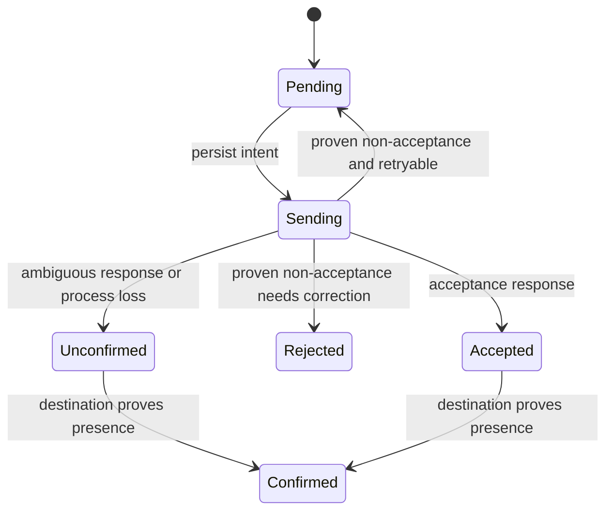

# Core Export Coordination and Delivery States

## Context

Child 06 made an approved exporter loadable. Nothing schedules it, authorizes what it may send, or records what
happened. The parent Epic puts all of that in Core: approved destinations and Projects, export start boundaries, safe
record construction, pending delivery, attempt state, retries, shutdown, and status. Plugin code receives one immutable
observation and a deadline — never the journal, a Session object, Plan contents, or write authority.

Export must run under the processes the owner already runs. The remote Shared Space retention worker is not the exporter
host, and no new daemon is introduced.

Owning PRD: the Core **Usage measurement and export** capability gains export lifecycle, consent, and delivery-state
requirements and scenarios.

## Objective

Eligible observations from approved Projects reach an approved exporter exactly when Core authorizes it, with intent
persisted before network I/O, ambiguous outcomes preserved as unconfirmed and never automatically resent, and exporter
failure unable to stop the Session or workflow process.

## Approach

```text
TUI start / owner Workspace start
  -> discover host-global Core grants + pending state   (not the current Project)
  -> per-destination OS lock
       -> control lock: re-read grant + history epochs, persist intent
       -> release control lock
       -> dispatch one immutable observation to a bounded worker with a deadline
       -> classify result
```



Eligibility uses a durable start watermark set at enablement:

```text
eligible(obs) = approvedDestination && obs.project in allowlist
                && obs.operation.startedAfter(watermark)
                && historyEpoch current && not deliveryFenced
```

Completing an old operation later does not export its earlier activity. Disabling invalidates the grant; re-enabling
sets a new watermark and does not sweep old pending work. Normal shutdown is not disabling.

Lock order is destination lock, then the short journal/control lock — never the reverse, and never hold the journal lock
across network I/O.

Set aside: SDK-owned automatic retries and global instrumentation. They would have shipped faster and handed delivery
policy and payload contents to the vendor, contradicting Core's ownership of both.

## Expected Change Surface

Boundaries with evidence, not an allowlist. Verify the real footprint during implementation.

- A Core export coordination module — grants, watermarks, allowlists, pending state, attempt records, safe record
  construction, retry classification, and status.
- `src/shared/settings.js` — destination approval, endpoint and external project identity, Project allowlist,
  host-secret references, HTTPS requirement with an explicit local-development exception.
- TUI lifecycle hooks under `src/cmd/` and owner Workspace lifecycle under `src/ui/workspace/server/` — the same
  scheduler hosted by either process.
- The child 04 clear path — extended to remove pending payloads, keep minimal non-content delivery fences, and discard
  delayed settlements from an older history epoch.
- A bounded worker boundary for plugin execution with enforced deadlines and sanitized returned status codes.
- `docs/prd/runwield-core-prd.md` — export lifecycle, consent, and delivery-state requirements and scenarios.
- `docs/domain-language.md` — add **Delivery unconfirmed**.

## Reuse Opportunities

- The child 06 approval record and resolved package identity — export binds to what approval already resolved.
- The child 01/04 epoch and lock discipline — the control lock re-reads epochs the same way appends do.
- Existing OS-lock and atomic-replacement conventions for pending and attempt state.
- Existing TUI and owner Workspace lifecycle hooks — no new service and no Session writer lock lifetime.
- `defineGitFixture` and `withProcessGlobalTestLock`; real subprocess and network boundaries stay genuine seams.

## Implementation Steps

- Uninstalled, installed-but-unapproved, and unconfigured states send nothing.
- A new grant exports only eligible operations started after its watermark, in approved Projects; opt-out intervals and
  legacy history are never eligible.
- Changing endpoint or external project identity requires a new approval and a fresh watermark; credential rotation for
  the same destination does not reset delivery state.
- New Projects are not automatically added to an allowlist.
- Configured endpoints use HTTPS except an explicit local development endpoint.
- Export identity defaults to an opaque host-local owner identifier plus opaque Project, Session, and Plan references;
  no email, repository name, or title is required, and browser-readable labels are resolved locally.
- Startup discovers work from host-global Core grants and pending state, so a TUI started in Project A exports approved
  pending Project B work even when B is not registered in Workspace.
- The scheduler needs no open browser, no Pi Session, and no remote Shared Space server; TUI measurement needs no
  Workspace SQLite.
- Export works under a CLI-backend TUI without Pi, and under the owner Workspace process after the TUI closes.
- Per-destination OS locks exclude simultaneous senders; lock order is destination then control, and no destination lock
  is acquired while holding the journal lock.
- Under the control lock the grant and history epochs are re-read and intent is persisted; the lock is released before
  waiting for network completion, and nothing is dispatched when persistence or authorization fails.
- Exporter results distinguish accepted, known non-acceptance, and uncertain acceptance; transient and permanent errors
  are classified only where the external contract supports it.
- An ambiguous response or a process loss with an in-flight attempt marks the item unconfirmed, never automatically
  resends it, and never blocks later records.
- Proven non-acceptance retries; a permanent rejection stays visible and a credential correction can resume a proven
  non-accepted item.
- Bounded read-back confirms presence by identity and relevant fields and cannot treat temporary absence as proof of
  rejection.
- No “retry everything” action bypasses these rules.
- Plugin execution runs in a bounded worker with an enforced deadline; a plugin throw, hang, or exit leaves the Session
  and workflow operational, and returned error and status codes are sanitized.
- Shutdown bounds outstanding work and releases locks without holding a Session writer lock.
- Clear and revoke remove pending payloads, keep only minimal non-content delivery fences, prevent later dispatch
  authorization, discard delayed settlements from an older history epoch, and state that already-dispatched requests
  cannot be recalled.
- Secrets are stored through host configuration, never in browser storage, response payloads, logs, or diagnostics.
- `docs/domain-language.md` defines **Delivery unconfirmed** as an exporter status only — not a Plan Status and not a
  workflow failure — with its relationships to accepted, confirmed, and rejected.
- `docs/prd/runwield-core-prd.md` names the export consent, lifecycle, and delivery-state requirements with acceptance
  scenarios, keeping local reporting independent of remote delivery.

## Verification Plan

- Automated: `deno run -A scripts/run-tests.js src/shared/workflow` plus focused export coordination tests; then
  `deno task seams:check` and `deno task ci`.
- Fake only the vendor network boundary and subprocess execution; grants, pending state, locks, and journals use real
  temporary files.
- Each of uninstalled, installed-unapproved, and unconfigured sends nothing.
- A new grant exports only post-watermark operations in allowlisted Projects; an old operation completing later is not
  exported, and legacy history never escapes.
- An endpoint change forces new consent and a new watermark; credential rotation does not reset delivery state.
- Starting TUI in Project A finds approved pending ACP-only Project B work without registering or opening B.
- Two simultaneous hosts do not send the same item.
- Persisted send intent precedes network I/O in every dispatch path.
- Simulating acceptance followed by a lost response marks the item unconfirmed, never resends it, and continues
  accepting new records.
- Restart does not repeat acknowledged or in-flight items.
- Read-back confirms matching observations and does not treat asynchronous absence as rejection.
- Plugin throw, hang past its deadline, and process exit each leave the host process operational.
- Pausing a second process before append and before export authorization, then clearing from the first and resuming,
  produces no stale records and no unauthorized sends; already-dispatched requests are distinguished.
- Captured request bodies and metadata contain no private text, and credentials appear only in required transport
  authentication.
- Existing protected behavior: child 01–06 recording, reporting, clear, and approval all still pass. Expected to stop
  existing: nothing; this is additive.
- Network and subprocess boundaries remain real seams; no conditional seam is introduced and `deno task seams:check`
  passes.

## Edge Cases & Considerations

- Local collection disablement creates no new export observations, but already-collected eligible records remain subject
  to the separate export control.
- A process crash with an in-flight attempt leaves it uncertain by design. The owner accepts possible remote gaps rather
  than inflated counts.
- Destination outage, quotas, authentication errors, and ambiguous acceptance are normal observable states. They create
  no user chore in the Plan workflow and do not stop local collection.
- Trusted exporter code is not sandboxed; the bounded worker is failure isolation only.
- Known commit links may remain local and are not required in the first export.
- Assume one destination per grant and one observation per attempt; Planner fixes record spelling and the read-back
  contract.
