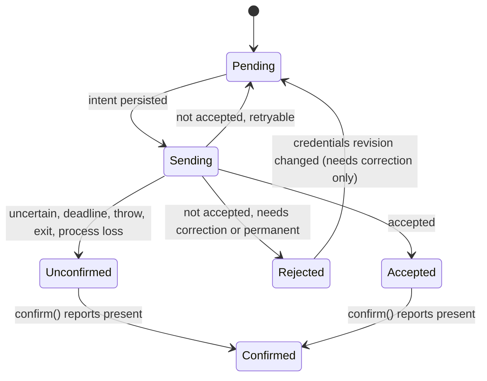

# Core Export Coordination and Delivery States

## Context

Child 06 made an approved exporter resolvable. Nothing runs it, decides what it may send, or records what happened. The
parent Epic puts all of that in Core. Plugin code receives one immutable observation and a deadline. It never receives
the journal, a Session object, Plan contents, or write authority.

What exists today:

```text
~/.wld/workflow-metrics/<encoded-primary-root>/
├── metrics.jsonl     # append-only v2 Usage observations (children 01–03)
├── state.json        # collection and history epoch checkpoint
├── .journal.guard    # OS lock shared by appends and clear
└── clear.json        # transient clear intent (child 04)

src/shared/extensions/metrics-exporter.ts   # lists exporters and approval; never imports code (child 06)
```

- Every execution writes `execution_started` before its other records. Those records carry the same `executionId`
  (`execution-metrics.ts::baseLinks`).
- `projectId` in reporting is a plain SHA-256 of the journal directory name (`usage-reporting.ts::projectIdentity`).
  Anyone who can guess the path can reverse it, so it is not safe to export.
- Global `settings.json` is not safe for secrets. Remote control sends its snapshot to remote hosts
  (`settings.js::readLaptopGlobalSettingsSnapshot`, `remote/control.ts`).
- Both host processes have a shutdown path: `disposables` in `ui/tui/chat-session.ts::startInteractiveSession`, and the
  `AbortController` in `cmd/workspace/serve.ts::runWorkspaceServeCommand`.

Owning PRD: [Core usage measurement and export](../../prd/runwield-core-prd.md#usage-measurement-and-export) gains the
export consent, lifecycle, and delivery-state requirements. In
[metrics exporter approval](../../prd/runwield-core-prd.md#metrics-exporter-approval), the line "Export delivery remains
target behavior" changes to point at the new requirements. Behavior that must survive: opt-in local recording, journal
locking and epochs, reporting, clear, and exporter approval.

### Decisions from planning

- **Exportable events (v1):** `model_usage`, `execution_finished`, `tool_call_finished`, `validation_attempt`,
  `repair_round_finished`, `publication_confirmed`, `workflow_abandoned`. Context snapshots, tool exposure, commands,
  latency samples, and all v1 legacy records are never exported.
- **Credentials:** a separate Core credentials file under `~/.wld` with owner-only (`0600`) permissions. Settings store
  no secret. Status reports only configured or not configured. Child 09 writes the file through an authenticated route.
- **Read-back:** this child defines an optional, bounded `confirm` call in the exporter contract and the Accepted or
  Unconfirmed → Confirmed state change. Child 08 implements it for Langfuse.

### Epic Scope Changes

- **08 Langfuse exporter package:** now implements this child's contract 1 (`deliver`, plus `confirm` for read-back)
  over `MetricsExportObservation`. The read-back query and its field checks moved to 08 explicitly.
- **09 Workspace export settings:** now owns the browser controls to create, update, and revoke grants and edit the
  allowlist through this child's Core functions. It writes credentials only to the Core credentials file and shows the
  Confirmed state.

## Objective

Core sends eligible observations from approved Projects to an approved exporter only when it authorizes the send. It
persists send intent before network I/O. It records an ambiguous outcome as unconfirmed and never resends it
automatically. An exporter failure cannot stop the Session or workflow process.

## Approach

### Who owns what

```text
src/shared/workflow/
├── metrics-export-grants.ts     # destination grants, Project start positions, credentials, host keys
├── metrics-export-record.ts     # builds the immutable MetricsExportObservation from a journal row
├── metrics-export-ledger.ts     # per-destination content-free delivery ledger and item state
├── metrics-export-scheduler.ts  # host scheduler: discovery, locks, authorization, dispatch, settlement, status
└── metrics-exporter-worker.ts   # worker entry that imports the approved package and calls it
```

Names are a starting point. The Engineer may merge files when a split adds no abstraction. These ownership lines stay:
grants decide permission, the record builder decides content, the ledger decides delivery state, and the scheduler is
the only caller of the worker.

### Storage

```text
~/.wld/settings.json  (global scope only)
  metricsExport.destinations[]   # grants; no secrets

~/.wld/metrics-export/                    (directory 0700)
├── host.json                             # host-local ownerRef + reference key, 0600
├── credentials.json                      # secrets per destinationId, 0600
└── destinations/<destinationId>/
    ├── .send.lock                        # per-destination OS lock
    ├── cursor.json                       # scan progress per Project
    └── ledger.jsonl                      # intents, settlements, confirmations
```

Pending work is **not a copied queue**. A pending item is an eligible journal row with no final ledger state. Clearing a
journal therefore removes pending payloads by itself. The ledger holds only identifiers, states, and sanitized codes,
and those entries are the minimal delivery fences.

> [!TIP]
> **Why there is no payload queue**
>
> A copied queue would need its own clear path, its own epoch checks, and a second copy of measurement content. Building
> the record from the journal at send time keeps one source of truth. Clear and the history epoch then cover export with
> no extra code.

### Grant shape

```ts
interface MetricsExportDestinationGrant {
    destinationId: string; // stable; survives credential rotation
    grantId: string; // new on approval, endpoint change, external project change, or re-enable
    exporterId: string; // child 06 identity this grant binds to
    exporterSource: string;
    endpoint: string; // https://, or http:// loopback only with allowInsecureLocalEndpoint
    allowInsecureLocalEndpoint: boolean;
    externalProject: string;
    projects: MetricsExportProjectStart[];
    grantedAt: string;
}

interface MetricsExportProjectStart {
    projectRoot: string; // canonical primary checkout root
    historyEpoch: string; // journal history epoch when the Project was added
    offset: number; // journal byte size when the Project was added
}
```

Revoking removes the grant. Re-enabling creates a new `grantId` and new start positions. Normal shutdown changes
nothing.

### Start boundary

The export start boundary is a journal position, not a clock time. "Operation" means one execution.

```text
eligible(row, grant, project) =
    grant exists and its exporter is still approved (child 06 identity)
    and row.event in EXPORTABLE_EVENTS and row.v == 2
    and (
        row.historyEpoch == project.historyEpoch
            ? row.executionId
                ? execution_started for row.executionId is at or after project.offset
                : row offset >= project.offset
            : the journal was cleared after the grant, so all of its current history is after the start
    )
```

`execution_started` is always written before its other records. So a scan from the start position sees each eligible
execution start before the records it owns. An old execution that finishes later has its start before the offset, and
its records are never exported. Disabled intervals write no rows, so they cannot leak. A Project added to an existing
grant gets its own start position at that time.

### Send cycle

```text
runMetricsExportCycle()
  for each grant in global settings (fresh read)
    tryLock destinations/<id>/.send.lock          (skip if another host holds it)
      mark every unsettled intent "unconfirmed: process_lost"
      scan each allowlisted Project from cursor -> candidate rows
      for each candidate (journal order; backoff items skipped, never blocking)
        with journal lock (.journal.guard, ~1 s budget)
          re-read grant + exporter approval + journal history epoch
          confirm the row is still in the current history
          append + fsync intent { eventId, attemptId, grantId, historyEpoch }
        release journal lock
        if authorization or persistence failed: do not dispatch
        build MetricsExportObservation; run worker deliver() with deadline
        append + fsync settlement
      bounded confirm() passes for accepted/unconfirmed items
    release send lock
```

Lock order is send lock, then journal lock. The journal lock is never held across network I/O. No send lock is taken
while the journal lock is held. Because the send lock excludes other senders, any intent without a settlement at lock
acquisition belongs to a dead holder. That intent becomes unconfirmed and is never resent.

`metrics-journal.ts` exposes the journal lock through one new function. It runs a short callback under the existing
guard and returns the current history epoch. `clearWorkflowMetricJournal` and appends keep using the same lock, so clear
and export authorization are serialized.

### Delivery states


```mermaid
stateDiagram-v2
    [*] --> Pending
    Pending --> Sending: intent persisted
    Sending --> Accepted: accepted
    Sending --> Pending: not accepted, retryable
    Sending --> Rejected: not accepted, needs correction or permanent
    Sending --> Unconfirmed: uncertain, deadline, throw, exit, process loss
    Rejected --> Pending: credentials revision changed (needs correction only)
    Unconfirmed --> Confirmed: confirm() reports present
    Accepted --> Confirmed: confirm() reports present
```

Retryable items get a capped backoff in the ledger (`nextAttemptAt`). Unconfirmed and backoff items never block later
records. There is no "retry everything" path.

### Exporter contract (contract 1)

The worker imports the approved package entry from child 06's `entryPath` and calls these exports:

```ts
interface MetricsExportContext {
    endpoint: string;
    externalProject: string;
    credentials: MetricsExportCredentials; // only for transport authentication
    deadline: number; // epoch ms
}

type MetricsExportDeliveryResult =
    | { outcome: "accepted"; code?: string }
    | { outcome: "not_accepted"; retry: "retryable" | "needs_correction" | "permanent"; code?: string }
    | { outcome: "uncertain"; code?: string };

type MetricsExportConfirmResult = { status: "present" } | { status: "not_found_yet" } | { status: "mismatch" };

// required
export function deliver(o: MetricsExportObservation, c: MetricsExportContext): Promise<MetricsExportDeliveryResult>;
// optional
export function confirm(o: MetricsExportObservation, c: MetricsExportContext): Promise<MetricsExportConfirmResult>;
```

`MetricsExportObservation` is built only by `metrics-export-record.ts`. It has `contract: 1`, a `kind` (one of the seven
exportable events), `observationId`, `occurredAt`, opaque references, and a per-kind field allowlist. The references are
`ownerRef`, `projectRef`, and, when present, `sessionRef`, `planRef`, `executionRef`, `parentExecutionRef`, and
`attemptRef`. Each reference is an HMAC-SHA-256 of the local ID under the host reference key, so it is stable across
retries and restarts. The record carries no path, name, title, email, or free text.

### Worker isolation

Each delivery runs in a Deno `Worker`. Core terminates it at the deadline. A throw, hang, or `Deno.exit` inside the
worker returns `uncertain` to Core and leaves the host running. This is failure isolation, not a security sandbox:
approved exporter code is trusted host code. Codes returned from the worker are reduced to `^[a-z0-9_]{1,64}$` or
`unrecognized`, and to an integer HTTP status when present.

Set aside: an SDK with automatic retries or global instrumentation, and a subprocess per delivery. The SDK would hand
delivery policy and payload contents to the vendor. A subprocess adds spawn cost and needs a hidden `wld` subcommand.
Switch to the subprocess only if the compiled-binary check below shows that a Worker cannot load the installed entry or
contain `Deno.exit`.

### Hosts

```diff
 startInteractiveSession (ui/tui/chat-session.ts)
+  startMetricsExportScheduler()  -> disposables.push(stop)
 runWorkspaceServeCommand (cmd/workspace/serve.ts, owner mode)
+  startMetricsExportScheduler({ signal: controller.signal })
```

The scheduler runs a cycle at startup and then at a fixed interval. With no grants, it does nothing beyond one settings
read. It needs no browser, no Pi Session, no Workspace SQLite, and no remote Shared Space server. It does not start when
remote personal resources are active (`remotePersonalResourcesActive()`). Stop waits a bounded time for in-flight work,
terminates the worker, and releases locks. An interrupted send stays unconfirmed by design.

## Expected Change Surface

This list is guidance, not an allowlist. Verify the real footprint during implementation and change whatever the
Implementation Steps need, including files not named here. Stop and report only when discovery changes approved intent —
the change reaches another subsystem, public behavior or architecture shifts, migration or compatibility risk grows, or
the Verification Plan no longer proves the objective.

- `src/shared/workflow/metrics-export-*.ts` and `metrics-exporter-worker.ts` (new) — grants, record construction,
  ledger, scheduler, and worker entry, with their tests.
- `src/shared/workflow/metrics-journal.ts` — one exported function that runs a short callback under the existing journal
  guard and returns the current history epoch. Append and clear behavior does not change.
- `src/shared/workflow/usage-reporting.ts` — the clear result reports whether a delivery for a cleared Project was
  already in flight, so callers can state that it cannot be recalled.
- `src/shared/settings.js` — read and write `metricsExport` in global scope only. Project scope cannot grant.
- `src/shared/extensions/metrics-exporter.ts` — reused to re-check the approved identity at authorization. Change it
  only if a missing accessor is needed.
- `src/ui/tui/chat-session.ts` and `src/cmd/workspace/serve.ts` — start and stop the scheduler.
- `src/cmd/package-smoke/` — proves the compiled `wld` runs a fixture exporter in the worker.
- `docs/prd/runwield-core-prd.md` — export requirements and scenarios. Update the maturity notes in
  `#usage-measurement-and-export` and `#metrics-exporter-approval`.
- `docs/domain-language.md` — add **Delivery unconfirmed** and **Export grant**. Update **Metrics exporter**.
- `src/skills/runwield/SETTINGS.md` — document the `metricsExport` key, global scope only, and that it holds no secrets.

Deliberately out of scope: browser controls and routes (child 09), the Langfuse mapping and `confirm` implementation
(child 08), and a command-line setup flow. Until child 09 ships, grants exist only through Core functions and tests.

## Reuse Opportunities

- `resolveApprovedMetricsExporters` and `InstalledMetricsExporter.entryPath` (`metrics-exporter.ts`) — the identity the
  grant binds to and the only entry the worker imports.
- `metrics-journal.ts` guard lock, `writeSynced`, and `replaceSynced` — the same OS-lock and atomic-replace conventions
  for `.send.lock`, `cursor.json`, and the ledger.
- `getWorkflowMetricsFilePath` and `resolvePrimaryCheckoutRoot` (`metrics.js`) — map a granted Project root to its
  journal.
- `withWorkflowMetricsFixture` (`src/testing/workflow-metrics-fixture.ts`), `withProcessGlobalTestLock`, and the
  subprocess pattern in `metrics-process-boundary.test.ts`.
- A local `Deno.serve` on `127.0.0.1` as the fake destination. The fixture exporter package makes real HTTP requests to
  it, so no injection seam is needed.

## Implementation Steps

### Grants, credentials, and identity

- `metrics-export-grants.ts` exports functions to grant, update, and revoke a destination, add and remove Projects, set
  and clear credentials, and read grants. Each write re-reads saved global settings and fails loudly if the write was
  not saved, like `approveMetricsExporter`.
- A grant requires an approved exporter whose child 06 identity (ID, source, installed path, version) matches. When that
  identity changes or approval is removed, the grant authorizes nothing until it is approved again.
- Granting, re-enabling, changing `endpoint`, or changing `externalProject` creates a new `grantId` and fresh Project
  start positions. Rotating credentials changes only a credentials revision and keeps `grantId`, start positions, and
  the ledger.
- Adding a Project records its current journal `historyEpoch` and byte size as its start position. Granting a
  destination never adds Projects implicitly, and a new Project is never added automatically.
- An `endpoint` that is not `https:` is refused, except an `http:` loopback host (`127.0.0.1`, `::1`, `localhost`) with
  `allowInsecureLocalEndpoint: true`.
- `metricsExport` in Project-scope settings is ignored.
- Credentials live only in `~/.wld/metrics-export/credentials.json`, created with mode `0600` in a `0700` directory.
  Status reports `configured: boolean` only. No secret appears in settings, logs, errors, status, or ledger.
- `host.json` holds a random host-local `ownerRef` and a reference key, created once with mode `0600`.

### Record construction

- `metrics-export-record.ts` turns one v2 journal row into a `MetricsExportObservation` with `contract: 1` for exactly
  the seven exportable events. It returns nothing for every other event and for every v1 row.
- Each kind copies only its allowlisted fields from the row (tokens, cost amount, currency and source, availability
  flags, aggregation basis, backend, provider, model, tool name, outcome and reason codes, counts, duration). The output
  never contains a path, a `cwdHash`, a Plan name, or free text.
- All identifiers are replaced by HMAC references under the host key. The same row always produces a byte-identical
  observation, including `observationId`.

### Ledger and eligibility

- `metrics-export-ledger.ts` appends and fsyncs intent, settlement, and confirmation records. The current state of an
  item comes from its latest records. A torn final line is ignored, and earlier records stay valid.
- Each row's eligibility follows the start-boundary rule in Approach. A test with an execution started before the offset
  and finished after it exports none of that execution's records.
- `cursor.json` stores, per Project, the scanned offset, the history epoch, and the set of eligible executions that are
  still open. Restart continues from the cursor without rescanning from the start position. When the history epoch
  changes, the cursor restarts at offset 0 of the new history.

### Scheduling and dispatch

- `runMetricsExportCycle` discovers work only from global grants and their allowlisted Project journals. It does not use
  the current working directory or Workspace registrations.
- Each destination is processed only while holding `destinations/<id>/.send.lock` through a non-blocking OS lock. A
  second host that cannot get the lock skips that destination for the cycle.
- On getting the send lock, every intent without a settlement is settled as `unconfirmed` with code `process_lost`.
- Authorization runs under the journal lock: it re-reads the grant, exporter approval, and journal history epoch, checks
  that the row is in the current history, and appends and fsyncs the intent. Only after the journal lock is released
  does dispatch begin. If any step fails, nothing is dispatched.
- Worker results map to states: `accepted` → Accepted; `not_accepted/retryable` → Pending with a capped `nextAttemptAt`;
  `not_accepted/needs_correction` and `permanent` → Rejected; `uncertain`, throw, deadline, worker exit, or a malformed
  result → Unconfirmed.
- An Unconfirmed item is never dispatched again by any path. A Rejected `needs_correction` item returns to Pending only
  after the credentials revision changes. A `permanent` rejection stays Rejected.
- When the exporter exports `confirm`, the scheduler calls it for Accepted and Unconfirmed items at most three times per
  item over successive cycles. `present` → Confirmed. `not_found_yet` and `mismatch` never change the state to Rejected
  or Pending.

### Worker and hosts

- `metrics-exporter-worker.ts` imports only the approved `entryPath`. It receives the observation, context, and deadline
  by message and returns a result. Core terminates the worker at the deadline and sanitizes every returned code.
- The TUI and `wld workspace serve` (owner mode) start the scheduler and stop it on shutdown. Stop is bounded (about 2
  s), releases the send lock, and holds no Session writer lock. It does not start when remote personal resources are
  active.

### Clear, revoke, and status

- Clear (`clearUsageHistory`) leaves the ledgers in place as fences. An intent persisted before the clear may settle
  later. Its settlement adds only a fence and never restores measurements or pending work. After the clear, no row from
  the old history epoch can be authorized. The clear result says whether a cleared Project had a delivery in flight.
- Revoke returns whether a delivery was in flight. After revoke, nothing more is authorized, and re-enabling never
  sweeps earlier pending rows into the new grant.
- `readMetricsExportStatus()` returns, per destination: endpoint, external project, allowlisted Projects, credentials
  configured, exporter approval state, counts of pending, accepted, confirmed, unconfirmed, and rejected for the current
  grant and history epochs, the latest sanitized codes, and the last attempt time. It contains no secret and no
  observation content.

### Documents

- `docs/prd/runwield-core-prd.md#usage-measurement-and-export` names requirements for export consent (grant, allowlist,
  start boundary, HTTPS), the delivery lifecycle, delivery states, failure isolation, clear and revoke, and credential
  handling. Each has acceptance scenarios. Local reporting stays independent of remote delivery. The maturity note says
  Core export coordination is current, and Workspace controls and the Langfuse destination are still target. The
  `#metrics-exporter-approval` line links to the new requirements.
- `docs/domain-language.md` defines **Delivery unconfirmed**. It is an exporter delivery state where acceptance is
  unknown and Core never resends automatically. It is not a Plan Status and not a workflow failure, and the entry links
  to accepted, confirmed, and rejected. The glossary also defines **Export grant** and removes "Export delivery remains
  target behavior" from **Metrics exporter**.
- `src/skills/runwield/SETTINGS.md` documents `metricsExport`.

## Verification Plan

- Automated: `deno run -A scripts/run-tests.js src/shared/workflow/metrics-export` plus the journal, reporting, and
  exporter tests
  (`deno run -A scripts/run-tests.js src/shared/workflow/metrics-journal.test.js
  src/shared/workflow/usage-reporting.test.ts src/shared/extensions/metrics-exporter.test.ts`),
  then `deno task seams:check`.
- Test environment: real temporary `HOME`, real journals written through `recordWorkflowMetric`, and real grants,
  ledgers, and locks. Use a real fixture exporter package approved through child 06. The fake vendor is a local
  `Deno.serve` that records requests. Behaviors are selected by endpoint path: accept, reject 400, reject 401, return
  503, accept and then drop the connection, hang, throw, and `Deno.exit`.
- **Nothing sends** when the exporter is not installed, installed but not approved, approved without a grant, granted
  with an empty allowlist, or approved under a changed identity. The server records zero requests in each case.
- **Start boundary:** records written before the grant, an execution started before and finished after the grant, and
  rows from a disabled interval are never sent. A new execution in an allowlisted Project is sent. An execution in a
  Project that is not allowlisted is not sent.
- **Grant changes:** changing the endpoint creates a new `grantId` and new start positions, and old pending rows are not
  sent. Rotating credentials keeps the `grantId` and the ledger, and a `needs_correction` rejection resumes.
- **Cross-Project discovery:** a cycle started from Project A's working directory sends approved pending rows from
  Project B, which has no Workspace registration and is not open.
- **Intent before I/O:** for every sent request, the matching intent is already fsynced in the ledger when the server
  handler runs. The handler reads the ledger file to check this.
- **Lost response:** accept-then-drop marks the item Unconfirmed. Later cycles and a restart never send it again, and
  the next eligible rows are still sent.
- **Process loss:** a subprocess cycle killed during a hanging request leaves an unsettled intent. The next cycle marks
  it `unconfirmed/process_lost` and sends no duplicate.
- **Two hosts:** two subprocesses run cycles at the same time against the same `HOME`. Each eligible `observationId`
  reaches the server exactly once.
- **Retry policy:** a 503 result returns the item to Pending with `nextAttemptAt` and does not block other items. A 400
  stays Rejected. A 401 stays Rejected until credentials change.
- **Read-back:** a fixture `confirm` returning `present` moves Accepted and Unconfirmed items to Confirmed.
  `not_found_yet` leaves the state unchanged after three checks.
- **Isolation:** a throw, a hang past the deadline, and `Deno.exit` in the exporter each leave the test host process
  running and able to record a new observation. Each item is Unconfirmed with a sanitized code.
- **Clear ordering:** a clear committed before authorization leads to zero requests for the cleared rows. A request held
  open at the server during a clear is reported as in flight by the clear result. Its later settlement adds a ledger
  fence only, and reporting shows no restored rows.
- **Privacy:** captured request bodies and worker messages contain no project path, `cwdHash`, Plan name, prompt text,
  or raw local IDs. Credentials appear only in the context passed to the exporter. Status, ledger, and settings contain
  no credential value. `credentials.json` and `host.json` have mode `0600`.
- **Counterfeit check:** a scheduler that never takes the journal lock fails the clear-ordering test. A worker that runs
  the plugin in-process fails the `Deno.exit` isolation test. A record builder that copies the row fails the privacy
  test.
- **Compiled binary:** `src/cmd/package-smoke` runs a cycle from the compiled `wld` with an installed fixture exporter.
  One request reaches a local server, and an exporter `Deno.exit` does not end `wld`.
- **Protected behavior:** the existing tests for children 01–06 (recording, epochs, repair, reporting, clear, and
  exporter approval) still pass with no change to their assertions. Nothing is expected to stop existing.
- **Documents:** the Core PRD and glossary describe export coordination as current. Workspace controls and Langfuse stay
  target. **Delivery unconfirmed** appears only as an exporter state.

## Edge Cases & Considerations

- **Accepted gaps:** a crash or shutdown during a send leaves the item Unconfirmed. The owner accepts possible remote
  gaps rather than inflated counts.
- **Normal states:** destination outage, quotas, authentication errors, and ambiguous acceptance are normal visible
  states. They create no Plan workflow chore and do not stop local collection.
- **Collection off:** turning local collection off writes no new rows. Rows already collected and eligible are still
  governed by the separate export grant.
- **Ledger growth:** the ledger grows with each delivered item. For one developer this stays small. Compaction can come
  later and must keep fences.
- **Assumption — fixed intervals:** the cycle interval is 60 s, retry backoff is capped at 1 h, and the deadline per
  delivery is 30 s. These are reviewable constants, not settings.
- **Assumption — one observation per attempt:** each attempt sends one observation to one destination per grant, as the
  Epic sets out.
- **Assumption — no setup command:** this child adds no command-line setup. Child 09 provides the owner controls.
- **Commit links stay local:** known commit links are not exported in this version.
