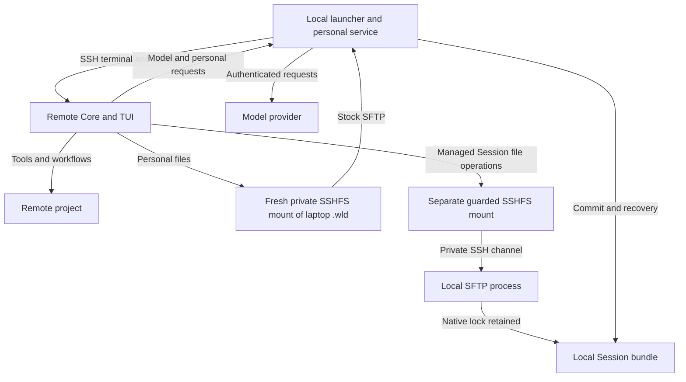
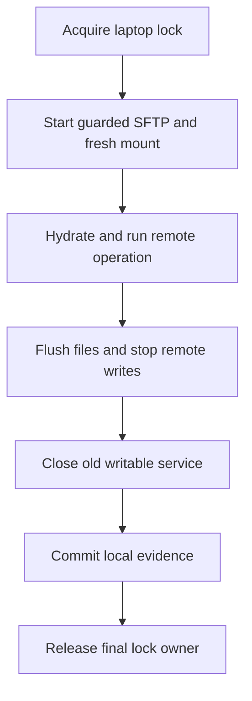
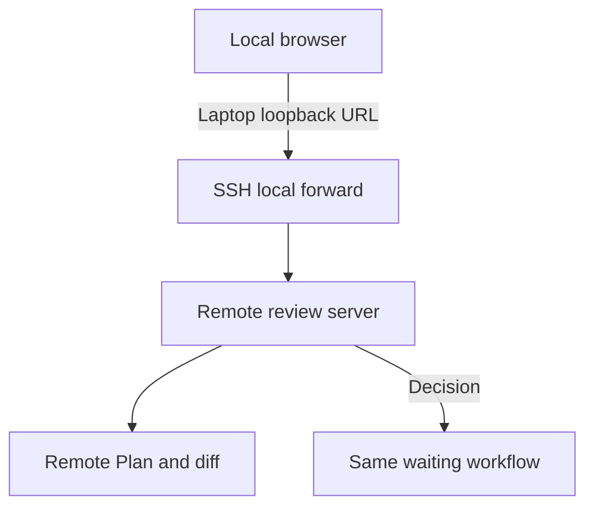

# Remote SSH Development

## Context

Enable normal RunWield work on a project that exists only on a remote server. The user keeps one personal environment
and saved conversation history on the laptop. The remote server keeps the project and does the project work.

```sh
wld remote sct:~/my-awesome-project
wld remote sct
```

The first command opens an existing remote directory. The second opens the remote user's home. Both respect the user's
SSH configuration and host verification. No laptop checkout or source synchronization is required.

**Status:** A connection-only development subset resolves the remote location, mounts the laptop's full `~/.wld` through
stock SFTP/SSHFS on the approved Linux `sct` pilot, and opens a dormant TUI. Direct bidirectional personal Skill file
access is verified; the project `.wld` stays remote. An optional bounded native Pi proof on built macOS and Linux `sct`
used a synthetic HTTP provider: two requests, a remote-only sentinel in the second, upstream closure on cancellation,
and two reconnects. Earlier prototypes also examined model transport, mounted access, and guarded writer lifetime. None
establishes ordinary remote turns, saved Sessions, workflows, or a release platform matrix.

### Agreed scope

- Remote terminal user interface (TUI), Pi Agent, project tools, and delivery workflows.
- Remote Linux x86-64 (Intel/AMD) and ARM64. Remote macOS and Windows are excluded.
- Pi-backed providers first. Claude CLI and Antigravity CLI are deferred; no silent provider/model substitution.
- Local personal settings, Agents, prompts, skills, model authentication, memories, and authoritative Session history.
- Direct SSHFS access to the laptop’s full `~/.wld` at a fresh private remote path. No personal resource copy, sync, or
  special resource-save operation. Other enabled personal roots can be mounted separately. RunWield core must work;
  machine-specific custom Skill dependencies are best effort.
- The remote project, including its `.wld`, remains on the server. Guarded operation-scoped SSHFS Session writer access
  is separate from the connection-wide personal mount; native writer locks remain on the laptop.
- Trusted remote hosts may access files allowed by the laptop account. Use a clear notice and Agent instructions, not a
  filesystem sandbox. Do not add a custom SFTP server for confinement.
- Local browser Plan Review and Code Review. Connected-only execution and saved continuation after reconnect.

**Out of scope:** Unattended work, source sync, required local clones, hostile-server isolation, multi-user
collaboration, hosted Workspace registration, remote ACP clients, moving an existing local Session to another checkout,
and automatic installation of arbitrary project/custom-skill dependencies. Browser close alone does not disconnect work.

### Product ownership

The transient [Remote SSH PRD](../prd/remote-ssh-prd.md) owns the detailed proposal scenarios. Core is the lasting
owner. This Epic records later owner decisions where the older proposal still describes compatibility checks or
undecided platforms. These decisions do not mark capabilities delivered.

| Proposed capability                               | Owning proposal                                                                                 | Lasting Core requirements                                                                                                                               |
| ------------------------------------------------- | ----------------------------------------------------------------------------------------------- | ------------------------------------------------------------------------------------------------------------------------------------------------------- |
| Connect and prepare the intended remote directory | [Remote connection and setup](../prd/remote-ssh-prd.md#remote-connection-and-setup)             | [Installation](../prd/runwield-core-prd.md#installation-and-updates), [project context](../prd/runwield-core-prd.md#project-context-and-initialization) |
| Use the local personal environment                | [Local personal environment](../prd/remote-ssh-prd.md#local-personal-environment)               | [Customization](../prd/runwield-core-prd.md#agent-and-skill-customization), [models](../prd/runwield-core-prd.md#models-and-providers)                  |
| Save and resume with correct memories             | [Local memories and saved Sessions](../prd/remote-ssh-prd.md#local-memories-and-saved-sessions) | [Session continuity](../prd/runwield-core-prd.md#session-continuity), [project context](../prd/runwield-core-prd.md#project-context-and-initialization) |
| Deliver and review remote changes                 | [Remote workflows and local review](../prd/remote-ssh-prd.md#remote-workflows-and-local-review) | [Plan Review](../prd/runwield-core-prd.md#plan-review), [delivery and recovery](../prd/runwield-core-prd.md#execution-validation-and-recovery)          |
| Stop safely on loss and recover truthfully        | [Disconnect and recovery](../prd/remote-ssh-prd.md#disconnect-and-recovery)                     | [Recovery](../prd/runwield-core-prd.md#execution-validation-and-recovery)                                                                               |

## Objective

Separate where work runs from where personal data is owned. Reuse Core's tools, workflow rules, Pi transcript format,
and browser review surfaces rather than build a reduced remote product.

The durable choice and alternatives are recorded in proposed
[ADR-018](../adr/018-remote-ssh-local-personal-authority.md). Existing
[ADR-015](../adr/015-file-authoritative-session-bundles.md) still owns file-authoritative Sessions and native writer
locking. No new Session database, writer lease, permanent daemon, or hosted service is introduced.

### System shape and ownership



| Module responsibility     | Owner and contract                                                                                                                                                                                                               |
| ------------------------- | -------------------------------------------------------------------------------------------------------------------------------------------------------------------------------------------------------------------------------- |
| Connection launcher       | Laptop. Resolve SSH configuration, prepare matching remote runtime, establish channels, open local browser URLs, and coordinate shutdown.                                                                                        |
| Project runtime           | Remote Core. Own project files, settings, instructions, Git, worktrees, Plans, Work Records, Project Runtime State, validation, repair, and publication.                                                                         |
| Personal service          | Laptop, connection-scoped. Own structured settings changes, model runtime, Memory operations, and local Session control. Personal files are accessed directly through SSHFS, not copied or saved through a special resource API. |
| Mounted transcript access | Remote Pi uses its file interface; standard laptop SFTP performs file operations. The serving process retains the existing native lock. The mount is transport, not authority.                                                   |
| Session store             | Laptop Core. Own stable identity, manifests, generations, recovery, attachments, catalog coordination, and lock admission. Remote state and UI are projections.                                                                  |
| Review                    | Remote server owns artifacts and pending decisions. Laptop launcher supplies a loopback forward and browser opening.                                                                                                             |
| Connection supervision    | Independent of a potentially blocked Agent. Stop owned work and revoke old connections on loss; never grant writer ownership from a timeout.                                                                                     |

Module names describe responsibilities, not required new classes or folder layout. Shared Core behavior must not acquire
remote-mode branches throughout every tool. Establish location-aware setup at Session creation and genuine external
boundaries; keep owned lifecycle and persistence rules inside their current owners.

### Startup and version compatibility

The launcher uses installed OpenSSH and its normal user/key/port/jump-host checks. Host/path inputs are data, never
shell fragments. Resolve `~`, symlinks, permissions, and Git relationships on the remote host. A missing folder fails
without creating it or choosing another directory. Non-Git locations retain Core's supported behavior.

Use versioned user-writable remote runtime storage, separate from the user's personal profile and package-managed
installation. Match the laptop release/build and bridge protocol; do not run an arbitrary `wld` from remote PATH. Reuse
verified release artifacts and privately supplied helpers. Downloads have pinned identity/checksums, install atomically,
and recover interrupted preparation automatically. Never run the ordinary personal installer unchanged if it edits
profiles, chooses unpinned helpers, or installs personal Memory storage remotely.

The remote runtime includes the compiled review UI and core project tools. Supply compatible SSHFS and its required
user-space dependencies without replacing system packages. FUSE kernel access and permission to mount are real host
prerequisites; no automatic root escalation. Report them clearly when unavailable. Standard Linux means the supported
GNU/Linux runtime matrix for the shipped binaries, not every libc, kernel, or 32-bit ARM environment.

Released builds use matching Linux x64/ARM64 assets. A development build requires a matching remote build artifact; no
silent downgrade to a different release. Cache runtime binaries independently from the fresh connection-owned personal
mount. Failed setup must not leave an active Agent, writable mount, or overwritten profile.

### Local services and model requests

Use SSH-protected connection-scoped channels. Model streaming can use the proven reverse-loopback HTTP arrangement;
control calls carry an unpredictable connection credential plus project, Session, and operation identity where relevant.
Private pipe channels remain preferable for SFTP. Bind any listener to loopback, do not expose it publicly, and do not
log bearer credentials. A different local user reaching remote loopback must not gain model or personal-service access.
The accepted broad SFTP trust does not make these service endpoints unauthenticated.

The personal service exposes named capabilities: safe model catalog/auth status, model streaming/cancel, structured
settings changes, Memory operations, Session open/acquire/commit/release, and browser-forward requests. Personal
resource files are accessed directly through the mount, not through a special copy or save API. Mutation
acknowledgements mean the local owner completed the write. Retried control mutations need request identity and
saved-result reconciliation; retrying transport must not repeat workflow decisions or external effects.

`createRunWieldModelRuntime` remains on the laptop. Provider endpoint URLs, headers, auth refresh, and provider
callbacks execute there. A laptop `localhost` model endpoint still means the laptop. Return model metadata without
credentials. Remote model selection and validation use this catalog/status service; do not expose `getAuth` as a
secret-returning remote API or fall back to a remote credential store.

Preserve the full supported Pi model contract: stream ordering, terminal events and `.result()`, tool calls, usage,
reasoning, images, errors, supported options, retry/timeout semantics, summarization, and cancellation. A cancelled
remote request must cancel its local provider request. Provider-specific functions/callbacks execute on their owning
side; do not serialize functions or silently omit options. Pi's current `streamProxy` is a starting point, not a
complete contract. Unsupported CLI selections fail before the affected turn with no model or billing substitution. This
also covers saved Session models, Agent presets, delegated/repair Agents, and Guided Review. An unavailable saved CLI
model must not disappear from lookup and fall through to a Pi default. Refusal occurs before a provider request; the
user can explicitly select a supported model.

All Core-created child Sessions, execution/repair Agents, delegated work, and Guided Review inherit remote connection
context. Each obtains the proper local Session ownership; none creates an independent remote personal profile or escapes
connected-only supervision.

### Mounted storage and native locks

The connection-wide mount presents the laptop’s full `~/.wld` at a fresh private remote path. It is **not** a sandbox:
standard SFTP can access other files allowed by the laptop account. The owner accepts this. Show the broad trust notice;
mounted `.wld` can include credential files. Setup does not copy credentials or keys. Project work and project `.wld`
remain remote. Managed Session writes use separate guarded operation-scoped access, never the connection-wide personal
mount.

Keep Pi entries and synchronous file operations. Use synchronous SSHFS writes with the tested conservative cache policy;
verify actual file-sync and atomic-rename support. Do not claim that a cached write or successful remote directory fsync
proves a local durable commit. No second saved remote transcript, debug transcript, or exit-time history synchronization
is allowed.

**Only the laptop acquires authoritative Session and catalog locks.** Do not use mounted `tryLockSync` to grant
cross-machine ownership. The local coordinator acquires the real lock, starts the SFTP process with retained native lock
ownership, and retains its own ownership through settlement. Descriptor retention must be verified for the actual stock
server and launcher on each supported laptop platform. A wrapper holding the only lock while a child can outlive it is
not valid. If retention fails, remote mode cannot proceed with an unlocked fallback.

Retaining a descriptor is not sufficient if another holder explicitly unlocks the shared native lock. All release paths,
including errors, store disposal, and rollover, must preserve ownership until writable service access has ended. Current
`releaseHeldLock` calls `unlockSync`; `markSessionUncertain`, `publishGenerationAndRelease`, and
`commitSegmentRolloverAndPublish` can release ownership. They cannot become remote service handlers unchanged. Normal
cleanup is subject to the same exclusion rule as crashes. A rollover that keeps the operation active must retain its
native ownership; if it ends ownership, old writable access must end before admission of another operation.



Each managed operation gets fresh writable channels and mount identity. Protect the underlying remote mount directory
before announcing readiness, so ordinary writes fail after unmount. Never re-enable an old operation's path for its
successor. Idle terminals remain dormant readers and do not retain the writer lock. Empty starts do not create saved
Sessions before the first user message.

Normal settlement is an explicit exchange, not simply killing SFTP. The remote runtime finishes pending writes and
flushes, detaches its writable manager, and asks for settlement. The laptop ends old writable access and waits for its
actual termination while retaining the lock. It then syncs local files/directories, computes evidence from local bytes,
commits the manifest and recovery descriptors, and releases ownership. The completion acknowledgement follows this
commit. A lost acknowledgement is reconciled from existing evidence, not by replaying work.

Segment rollover is still a Session-store transaction under the same ownership: finish predecessor writes, prepare
successor lineage, commit local segment/generation evidence, then authorize use of the successor. Attachments use local
Session-owned storage with explicit transfer when selected on the laptop or produced remotely. Stable references must
not contain a temporary mountpoint. Generation commits, manifests, catalog locks, and recovery stay laptop-owned even
though Pi transcript writes use SFTP.

Early live UI events are not saved-success evidence. A storage failure blocks further dependent work and completion,
even when an intermediate caller catches the error. Preserve saved entries across interrupted generation publication;
mark uncertain remote effects for reconciliation. An edit or accepted publication can finish before its result reaches
the laptop. No cross-machine transaction or automatic replay can make that uncertainty disappear.

### Personal resources, integrations, and Memory

Merge bundled defaults, local personal settings/resources, and remote project overrides with current Core precedence. Do
not substitute the remote user's personal profile. Structured personal settings mutations save through the laptop owner;
direct personal resource file edits use the mount; project mutations save in the remote primary checkout. Successful
saves are visible before disconnect.

Mount full laptop personal Skill trees directly, including scripts and sibling files. Preserve resource-relative paths
and project overrides in both RunWield and Pi skill loading. Other enabled personal roots outside `~/.wld` can use
explicit mounts. No resource copies, reconnect refresh, copy-back merge, or special resource-save path is required: file
edits through the mount change laptop files. Custom absolute paths, native binaries, missing CLIs, and dependency setup
remain the user's responsibility. Fail visibly without falling back to laptop project execution or blocking unrelated
core work. Cleanup removes connection-owned mounts, not personal files; do not promise forensic erasure from a trusted
host.

Core file/shell/Git/Cymbal/build/test tools operate remotely. Personal Mnemoteca operations operate locally.
Network-only personal integrations can run locally when they need laptop configuration; they must not turn into laptop
project filesystem tools. Work Record retrieval reads canonical remote records. Team Memory still derives from trusted
remote project evidence; local personal storage does not bypass trust or make raw transcripts shared knowledge.

**Reviewable integration default:** Personal MCP servers run on the laptop with their existing credentials; their tool
calls/results are forwarded. Project-defined servers run remotely. Project override/disable rules still apply, and each
effective server's execution location is visible. Do not copy credential-bearing MCP environments or rewrite arbitrary
path arguments. A server needing both laptop credentials and remote project files is best effort and may need user
configuration. No general transparent MCP portability promise is made. This is an architecture default, not a newly
agreed guarantee that all personal integrations work unchanged.

Separate three facts: remote project identity, current execution cwd/worktree, and selected personal Memory collection.
Resolve project roots and worktree relationships remotely. Store an explicit remote locator with host identity and
canonical project path; never run laptop `stat`, `realPath`, or directory creation against it. Keep execution cwd
separate so isolated worktrees retain their parent project.

Keep the SSH connection recipe separate from host identity. A local host record can match effective SSH hostname, user,
port, and verified host evidence after an alias rename. Neither alias spelling nor a host-key fingerprint alone is
sufficient. Ambiguous equivalence requires confirmation, not automatic history merging.

New unrelated remote projects get separate local Memory collections. Deliberate mapping to an existing collection by
name does not require a local checkout and does not merge Sessions. Ask once when the intended mapping is ambiguous,
then retain it. Core injection, explicit recall/store/delete, and `/sleep` all use that same resolved mapping. Backups
stay local. Existing local project IDs, collection names, and saved Sessions remain unchanged.

### Browser review and connection lifetime



Keep existing review servers on remote loopback. The remote browser-opening capability asks the launcher to forward the
whole HTTP origin and open a laptop URL with the original path/query/token. APIs, assets, polling, images, and uploads
then reach the existing remote server. Keep the mapping across conversation revisions and show laptop URLs in reopen
links. Existing review tokens and live-operation checks remain required. Never replay an uncertain review decision.

The browser is visual and interactive, but no new review layout or design system is required. File expansion and images
must show actual remote content. Browser close preserves the connected wait; SSH loss stops the owned review server and
jobs. Guided Review inherits the same remote-mode execution context and local personal authority.

A connection supervisor must remain responsive when the TUI, Agent, or synchronous mounted I/O is blocked. Track owned
processes and mounts explicitly; do not use broad process-name kills. Remote detection must work without a final message
from the laptop. Local shutdown stops model streams, revokes channels, and ends serving processes; remote shutdown stops
the Agent, owned tools/helpers/review jobs, then unmounts and cleans up its own resources. Retain remote edits, project
state, installed runtime cache, and committed local history.

**Reviewable timing defaults:** Application/control health every 5 seconds; loss after 3 missed replies; owned-process
termination starts immediately with a 5-second grace period before forced termination. A separate 30-second deadline for
an outstanding storage request detects a stuck SFTP service even when SSH is healthy. These are proposed testable
operating defaults, not prototype measurements or a writer lease. An uninterruptible OS I/O operation can exceed them;
never release/reassign a still-held lock to satisfy a timer. Stop dependent work and retain truthful recovery state.

If the launcher dies but SFTP survives, the serving process must retain the lock. Independent supervision and later
startup recovery remove the orphan safely; a new writer waits until the actual owner is gone. A watchdog may terminate
owned processes, but cannot declare a held lock expired. Remote project mutation admission also remains tied to the live
connection: loss stops new effects and owned work. No arbitrary daemon launched outside RunWield's ownership or already
accepted external action can be rolled back by closing SSH.

Reconnect creates fresh channels and runtime context, reads saved local history, and inspects remote workflow evidence
before continuation. It does not resume a frozen stack or automatically replay tool calls. A failed attempt, lost
connection, retry limit, or internal inconsistency is recoverable. Delivery ends only with confirmed publication or
deliberate user abandonment.

### Alternatives and costs

- **Per-entry network saves:** Avoid FUSE but require adapting synchronous Pi persistence and every metadata path. Not
  selected. The mount preserves the file API; it still needs local ownership and settlement.
- **Custom confined SFTP:** The fixed-file proof was useful, but not a server to ship. The owner chose standard SFTP and
  trusted-host access, avoiding a new protocol implementation or confinement dependency.
- **Plain SSH/profile copying:** Fails local personal authority and sign-in requirements. The full personal mount is
  direct access, not a copied profile.
- **Local Agent with forwarded tools:** Conflicts with the agreed remote TUI/Agent placement and shifts adaptation to
  project tools. Not selected.
- **Remote history plus exit-time sync or timeout takeover:** Violates save and single-writer requirements. Excluded.

Over six to twelve months, maintain a tested OpenSSH/SSHFS/Pi compatibility matrix and pinned helper packages. SSHFS is
widely distributed but has limited maintainer capacity. Reuse separate executables rather than own SFTP; include
required licenses/source notices when distributing helpers. The exit path is a different storage transport behind the
same Session owner, not a new transcript format. Any evidence requiring a different architecture returns to the owner
rather than becoming an unreviewed fallback.

## Vertical Slice Findings

### Existing call paths

```text
buildExecutionSession
  Pi -> buildAgentSession -> createAgentSession -> ModelRuntime -> provider
                           -> Agent tool loop -> project tools
                           -> synchronous SessionManager writes
  Claude/agy -> separate CLI process and native tools
```

`session.js` currently combines one cwd with settings, prompt resources, tools, model runtime, and persistence.
`root-session.js:installDenoSessionPersistence` intercepts synchronous Pi writes. Ordinary transcript appends bypass
`file-session-store`, which owns manifests, locks, and generations. Changing `streamSimple` or the store alone cannot
produce the requested split. Pi Session event listeners also run before persistence; they are not save acknowledgements.

`session-runtime.js:#runManagedOperation` owns acquire/hydrate/run/checkpoint/release. `segment-rollover.ts` performs
filesystem changes and lineage publication. These paths must preserve local authority and operation-scoped locking
across mounted access. The existing same-machine live-session socket is not a cross-host protocol.

`file-session-storage.ts:ensureProject`, root locators, and resume lists require local paths today. Explicit Memory
tools use a Git-aware basename, Core injection leaves collection choice implicit, and `/sleep` uses cwd basename. Remote
support needs explicit project and Memory identity across all three, not just renamed directories.

`session.js:listSkills` and Pi's `DefaultResourceLoader` both discover skills. `named-invocation.ts` resolves sibling
resources from the skill directory. MCP definitions merge personal then project; `mcp/pool.ts` currently starts local
stdio subprocesses. Moving text alone does not move resource files or preserve integration location.

`review-launcher.ts` calls `BrowserPort.open`; the review server binds loopback and resolves an in-process pending
promise. Frontend URLs are same-origin. `review-agent-handlers.js` starts Guided Review as another `wld` process. Whole
origin forwarding and inherited remote context fit the existing design; hosted Workspace is not required.

Release packaging already creates Linux x64 and ARM64 binaries. The ordinary installer can mutate profiles and install
unpinned helpers, so it is not a ready remote bootstrap. Existing private helper packaging provides a pattern, not proof
that SSHFS/FUSE works on every supported host.

### Live Pi model-path evidence

The 2026-09-20 run on `sct` completed the real remote Pi tool loop through locally authenticated
`openai-codex/gpt-5.6-luna`. A remote-only sentinel affected the second model request and streamed reply. Cancellation,
killed-tunnel settlement, and a fresh connection passed. This is narrow Pi transport evidence, not a full Session or
all-provider compatibility result.

### Prototype evidence and limits

| Proof                             | Observed                                                                                                                                                                                                         | Not established                                                                                                                                                                   |
| --------------------------------- | ---------------------------------------------------------------------------------------------------------------------------------------------------------------------------------------------------------------- | --------------------------------------------------------------------------------------------------------------------------------------------------------------------------------- |
| Pi model path, 2026-09-20         | Remote Pi 0.85.1 on `sct`; locally authenticated `openai-codex/gpt-5.6-luna`; remote sentinel tool; second model request; streamed reply; cancellation; killed-tunnel settlement; fresh connection.              | Full RunWield Session, all Pi options/providers, CLI backends, durable resume, whole-process cleanup.                                                                             |
| Stock SSHFS file path, 2026-09-20 | Remote writes reached laptop bytes; Pi append/reopen; file fsync and POSIX rename; fresh remount.                                                                                                                | Mounted locks failed cross-machine exclusion. Directory fsync did not reach laptop. Service stalls blocked; after unmount, unprotected directory accepted remote fallback writes. |
| Guarded lock proof, 2026-09-20    | One Deno process held native lock and served a fixed file. Competitors blocked; launcher/owner deaths behaved safely; stale handles did not alter successor bytes; 0500 underlying directories blocked fallback. | The server was a tiny custom subset, not stock SFTP or a full Session implementation. No rename/directory API or full workflow.                                                   |
| Stock Apple SFTP lock test        | Native server retained an inherited lock after INIT; killing it released ownership.                                                                                                                              | No combined mounted stock-server guarded-lifetime test and no other laptop-platform proof.                                                                                        |

In the guarded test, normal close drained an admitted write, but a later remote fsync failed after revocation.
Production therefore needs explicit operation settlement. An injected service delay failed after two seconds; an
actually stopped server needed external termination after four seconds. Neither is a universal disk-stall or
network-partition result.

All proof mounts, temporary remote packages/directories, and tracked processes were removed. Only ignored local
prototype code, evidence, and synthetic data remain:

- `prototypes/remote-ssh-model-proof/evidence.json`
- `prototypes/remote-ssh-session-mount-proof/NOTES.md` and `evidence/20260920-011625/`
- `prototypes/remote-ssh-session-lock-proof/NOTES.md` and `evidence/20260920-132201-04b394/`

These ignored paths are checkout-local evidence, not shipped dependencies or portable repository links. The mounted Pi
trial used Node 20 despite Pi's Node >=22.19 declaration; it is not supported-runtime evidence. No ARM64, true network
partition, power-loss, complete browser-review, or complete remote delivery proof was performed.

External references: [SSHFS manual](https://github.com/libfuse/sshfs/blob/master/sshfs.rst),
[SSHFS maintenance](https://github.com/libfuse/sshfs#readme), and [OpenSSH](https://man.openbsd.org/ssh). These
establish capabilities and limits, not RunWield acceptance.

## Expected Change Surface

These are evidence-based boundaries, not an implementation checklist or an allowlist. A change to approved intent,
platform scope, trust, persistence ownership, or dependency strategy returns for review.

- `src/cli.ts`, `src/cmd/registry.js` — remote entry, arguments, launch context, visible host/directory.
- `src/shared/settings.js`, `src/shared/session/agents.js`, `agent-assets.js`, `named-invocation.ts`, and `session.js` —
  local personal authority, remote project precedence, mounted resource paths, both skill loaders, child context.
- `src/shared/models/model-registry.ts`, `src/shared/session/backends/` — local model runtime, remote catalog/stream
  contract, supported-backend checks, refresh and cancellation.
- `src/shared/session/root-session.js`, `file-session-*.ts`, `session-runtime.js`, `segment-rollover.ts`,
  `session-resume-list.ts`, and `image-attachments.js` — explicit remote identity, mounted Pi files, local
  locks/commits, settlement, rollover, attachments, offline history and resume.
- `src/extensions/mnemoteca/`, `src/cmd/sleep/`, and Work Record indexing — one explicit personal Memory mapping and
  remote canonical records. Other extensions retain the correct execution location.
- `src/shared/mcp/`, `src/shared/foreground-process.ts`, and runtime child-process creation — origin-aware custom
  integrations, connection-owned processes, cancellation outside blocked Agent execution.
- `src/shared/workflow/` — preserve project-owned workflow truth, remote validation/publication, and evidence-based
  recovery while Session history is local.
- `src/shared/browser-port.ts`, `src/ui/review/`, TUI review integration, and `src/ui/workspace/server.js` — automatic
  local forwarding, local reopen URLs, remote review content and Guided Review. No visual redesign.
- `scripts/compile.js`, release/helper packaging and runtime resource handling — matched Linux builds, verified private
  dependencies, compiled UI, licensing, and non-destructive bootstrap.
- Product, glossary, and ADR documents — synchronize delivered behavior and acceptance scenarios with their owners.

## Reuse Opportunities

- OpenSSH configuration, authentication, host checks, terminal allocation, and forwarding; standard SFTP and SSHFS.
- `createRunWieldModelRuntime` and `RunWieldCredentialStore` as local model/auth owners. Reuse Pi stream shapes without
  assuming its existing proxy is complete.
- Core's existing remote-executed tools and workflow state machines; no parallel shell-only delivery implementation.
- File Session bundles, native locks, generation evidence, atomic manifests, recovery descriptors, and segment lineage.
- Existing review frontend/server and browser-opening capability; same live decision semantics through a forward.
- Existing foreground process ownership and verified release/private helper packaging, extended rather than bypassed.

## Verification Plan

This Epic defines architectural evidence; executable child Plans provide the concrete tests. Passing existing CI does
not prove a remote user journey.

**Automated foundations:** `deno task doc-links:check`, `deno task seams:check`, and `deno task ci`. Use
`deno task test` or `deno run -A scripts/run-tests.js <arguments>` for isolated tests, never direct `deno test`. Use
sandboxed home/Memory storage and real Git fixtures. Do not add injection seams for owned storage, locks, Plan writes,
or lifecycle rules. External subprocess, transport, model, and clock behavior can use genuine external boundaries.

**Live acceptance:** Use synthetic projects on both supported remote CPU architectures, with a same-named but different
laptop file tree. Run the actual built remote runtime, stock file server, native Deno locks, and supported provider.
Exercise a complete change: connection/bootstrap → planning → local browser review → isolated remote execution →
validation/AI review → Code Review where selected → confirmed publication → disconnect → saved continuation. Also test
remote home outside Git. Core tools and custom missing-dependency behavior must both be visible.

**Failure evidence:** Test normal exit, Stop, browser close, transport kill, a real blocked network path, launcher
death, file-serving owner death, service stall, interrupted setup, and loss during
write/sync/rollover/commit/publication. Competing laptop and remote processes must use the actual lock file.
Continuously probe lock acquisition while error cleanup, store disposal, and segment rollover occur with stock SFTP
still able to write; no explicit unlock may admit a successor early. Launcher-death testing alone does not cover this.
Retry only requests whose effects can be determined. Measure detection and cleanup deadlines; assert unrelated processes
survive. A killed tunnel is not a partition test.

### Outcome Evidence

| Outcome                                 | Observable evidence                                                                                                                                                                                                      | Owning proposal                                               |
| --------------------------------------- | ------------------------------------------------------------------------------------------------------------------------------------------------------------------------------------------------------------------------ | ------------------------------------------------------------- |
| Correct connection and setup            | Both command forms resolve remotely; missing paths fail; SSH verification remains active; core runtime prepares on clean x64/ARM64 hosts without changing existing profiles/installations.                               | Remote connection and setup                                   |
| Correct personal authority              | Personal settings and Memory saves are visible locally before exit; project overrides save remotely; no normal setup copies provider keys or imports a remote personal profile.                                          | Local personal environment; Local memories and saved Sessions |
| Complete skill resources, honest limits | Nested personal files are read directly through the mount; edits reach laptop files without copy-back. Relative reads work; missing custom CLIs report failure while core works.                                         | Local personal environment                                    |
| Local model execution                   | Actual remote tool result reaches a second locally authenticated request; stream/result/options match; renewal stays local; cancellation stops upstream; unsupported CLI choice fails without substitution.              | Local personal environment                                    |
| One Session writer                      | Stock serving process retains native lock after launcher death; competitors cannot write; successor starts only after old writable access ends; stale handles cannot change successor bytes.                             | Local memories and saved Sessions                             |
| Local saved history                     | Completed saves and generations survive loss; local store computes evidence and syncs directories; protected mountpoint cannot accept fallback writes; no remote personal transcript remains.                            | Local memories and saved Sessions; Disconnect and recovery    |
| Correct identity and Memory             | Unrelated same-name folders remain distinct; worktrees preserve project identity; known alias changes reuse it; deliberate Memory sharing does not merge Sessions; injection/tools/sleep use the same binding.           | Local memories and saved Sessions                             |
| Complete remote delivery                | File/shell/search/build/test/Git/worktree/validation/repair/publication all act on the remote-only project; laptop sentinel tree stays unchanged; child Agents retain remote context.                                    | Remote workflows and local review                             |
| Local usable review                     | Browser displays remote Plan/diff/files/images; feedback reaches the same pending interaction; revisions/reopen/Guided Review work; browser close alone preserves the wait.                                              | Remote workflows and local review                             |
| Connected-only recovery                 | Loss without a final client message stops new work and owned processes within tested bounds; storage stalls are detected separately; unrelated processes survive; reconnect reconciles uncertain effects without replay. | Disconnect and recovery                                       |
| Honest trust and compatibility          | Notice states the full laptop `.wld` is mounted and standard SFTP allows broad account-level access; no sandbox claim; build/provider claims reflect tested artifacts.                                                   | Local personal environment; Remote connection and setup       |

**Protected behavior:** Ordinary local TUI, ACP, and Workspace; settings precedence; Agent/model selection; private
transcripts and dormant resume; operation-scoped native locks; Memory scopes; trusted Team Memory; Plan approval;
validation, AI review, Code Review, worktree protection, and confirmed publication. Browser-only Workspace disconnect
behavior does not change. Existing local Session directories/IDs and Memory collections are not migrated.

**Behavior excluded from the new remote path:** Separate remote personal setup/history, exit-only personal sync,
accidental laptop project operations, missing-folder fallback, silent model substitution, custom-skill portability
gates, copied personal resource trees, unguarded mounted writer locks, writes beneath a lost mount, and unattended
continuation after detected loss. These are target prohibitions; ordinary local capabilities are not being removed.

**Required document outcomes:** Each eventual implementation change updates its owning Core capability and scenarios
with delivered behavior, not merely this Epic's intent. Update the transient PRD's platform/provider scope, direct
personal mounts, best-effort custom skills, trusted broad SFTP notice, local-save and disconnect scenarios as those
changes become true. Keep current and target behavior distinct. Shared behavior has one PRD owner. The end-to-end remote
delivery and reconnect journeys need combined evidence across child boundaries.

After preserving both delivered and unresolved requirements in Core, fix references and retire the transient proposal
under project policy. The implementation that establishes remote connections updates `docs/domain-language.md` with
proposed **Remote SSH connection** and the changed Core/Session/Project Runtime State relationships. It remains an
ordinary Session, not a new Session type. Accept/update ADR-018 and align ADR-015's local-path/writer descriptions with
the implemented extension without reintroducing leases. Actual decomposition is left to Slicer.

## Edge Cases & Considerations

### Reviewable assumptions and release gates

- **Laptop scope:** Use currently documented macOS/Linux x64/ARM64 support for the launcher. Windows remote hosts are
  excluded by owner decision; Windows laptop support is not claimed by these proofs or this first-release assumption.
- **Linux prerequisites:** Use the existing GNU/Linux binary baseline plus usable FUSE. The exact distro/library matrix
  belongs to release validation. Do not label every Linux host supported because one Fedora x64 test passed.
- **MCP placement and timing:** The origin-based integration defaults and explicit detection deadlines above are
  proposed operating choices for review, not additional owner decisions already made.
- **Stock ownership:** Combined stock SFTP mounting, descriptor retention, settlement, and recovery remain a release
  gate on each advertised laptop build. The custom proof cannot satisfy it. Unsupported semantics require an explicit
  error and repair or a reviewed design change, not an unlocked run.
- **Complete bridge semantics:** Pi proxy option/event gaps remain integration work. General Pi support cannot be
  claimed from one successful Codex model. Publish only tested support; keep the intended Pi contract as the target.

### Migration, rollout, and reversibility

Add remote locators and runtime context alongside existing local behavior. Missing remote metadata continues to mean a
local Session. Do not reinterpret old cwd strings or silently remap collections. Local history remains readable without
SSH; continuing a remote Session requires its validated remote target.

Roll out through an owner pilot on real supported hosts, then advertise the verified matrix only after the full journey
and failure evidence pass. The connection-only development view is not a shipped full remote feature. Startup checks run
before personal mount activation and writable Session access where possible. Repair interrupted setup and stale owned
resources automatically. Uninstallation removes only private runtime/cache resources, never project edits or saved local
history.

Existing remote Git credentials and project build tools remain genuine external prerequisites. Broad SFTP trust does not
authorize RunWield to copy laptop Git credentials automatically. The full personal mount can expose credentials in
`~/.wld`; there is no secret-detection or confinement promise. Redact service credentials and provider auth from normal
logs/errors.

Storage, model, and process failures remain recoverable intermediate conditions. Preserve evidence, stop dependent work,
and let normal recovery re-establish a safe operation. A busy or uninterruptible serving process is not permission to
break its lock or make the user repair internal metadata. Already accepted external effects may complete after loss;
report proven outcomes and uncertainty without inventing rollback or success.
