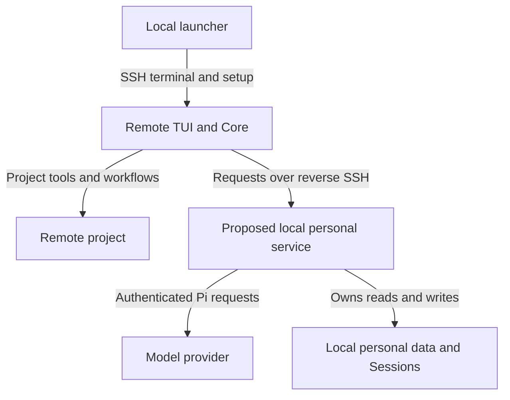
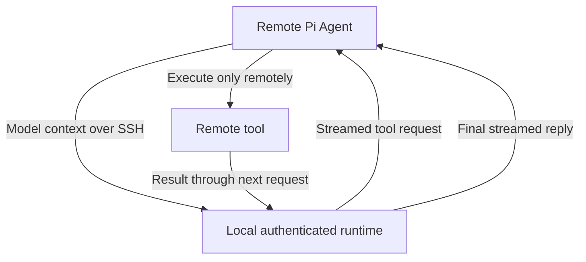

# Remote SSH Development — Early Epic Draft

## Context

**Continuity draft only. Not approved, complete, ready for decomposition, or proof of delivered support.** The owner
requested this file before restarting the conversation. No production code or prototype was written. No ADR was adopted.

**Resume here:** Read this draft, the [PRD](../prd/remote-ssh-prd.md), and the
[feasibility report](../research/remote-ssh-feasibility.md). Complete the live model-path proof below before settling
the architecture or submitting the Epic. Do not repeat the product interview or treat a working SSH tunnel as a working
remote RunWield Session.

The owner chose a full Epic rather than a limited connection-only Plan. Their next instruction was: “prove the reverse
channel thing before doing anything else.” This early document is an explicit exception to preserve context, not
permission to skip that proof. A throwaway prototype was proposed but has not been authorized through an implementation
handoff or created. The Architect session did source inspection and a live transport test only.

### Agreed product requirements

```sh
wld remote sct:~/my-awesome-project
wld remote sct
```

- Use an SSH alias or hostname. Respect existing SSH authentication, host checks, port, user, and jump-host settings.
- Resolve the folder on the remote machine. No folder means the remote user's home. No local checkout or source sync.
- Open the terminal user interface (TUI) remotely. Show the host and folder. Missing folders fail; do not create them or
  silently select another folder. Non-Git locations remain usable where Core already supports them.
- Prepare compatible RunWield tools automatically on supported hosts. Do not overwrite an existing remote personal
  profile or package-managed installation. Do not install arbitrary project dependencies as part of this promise.
- Use the local personal environment: settings, Agents, skills, prompts, model configuration, credentials, memories, and
  authoritative Session history, including Session attachments.
- Keep project files, project settings/instructions, Git, worktrees, Plans, Work Records, and Project Runtime State
  remote. Remote project overrides retain their normal precedence over personal settings.
- Run all project reads, edits, commands, code search, builds, tests, validation, repair, and publication remotely.
- Open Plan Review and Code Review in the local browser without manual tunnels or a public review server. Browser close
  alone does not cancel a connected Session. “AI review” remains the name for automated Semantic Review.
- Support connected development only. Disconnect stops owned work after loss is detected; no detached Agent continues.
  Preserve remote edits and saved local history. Disconnect is neither publication nor deliberate abandonment.
- Resume saved history against the same remote project without replaying unfinished effects automatically.
- Never copy provider credentials, private SSH keys, the whole local environment, or `~/.wld` to solve compatibility. Do
  not silently change provider, model, or billing method.
- Claude CLI and Antigravity CLI remain compatibility targets. A limited release excluding them needs an explicit owner
  decision. Their support is not proven by Pi support.

The reference is [VS Code Remote SSH](https://code.visualstudio.com/docs/remote/ssh): connected work on remote files
with little setup. Its internal design is not a requirement or proof of RunWield feasibility.

**Out of scope:** Unattended work, source synchronization, required local clones, multi-user collaboration, hosted
Workspace registration, remote ACP clients, moving an existing local Session to another checkout, and isolation from a
hostile server. Local ownership does not prevent a trusted server from seeing supplied instructions and memories.

### Product ownership and document status

This is a proposed Core addition. The feature proposal owns the detailed target scenarios:

- [Remote connection and setup](../prd/remote-ssh-prd.md#remote-connection-and-setup)
- [Local personal environment](../prd/remote-ssh-prd.md#local-personal-environment)
- [Local memories and saved Sessions](../prd/remote-ssh-prd.md#local-memories-and-saved-sessions)
- [Remote workflows and local review](../prd/remote-ssh-prd.md#remote-workflows-and-local-review)
- [Disconnect and recovery](../prd/remote-ssh-prd.md#disconnect-and-recovery)

Core remains the lasting owner through its existing capabilities for
[customization](../prd/runwield-core-prd.md#agent-and-skill-customization),
[models](../prd/runwield-core-prd.md#models-and-providers),
[project context](../prd/runwield-core-prd.md#project-context-and-initialization),
[Session continuity](../prd/runwield-core-prd.md#session-continuity),
[Plan review](../prd/runwield-core-prd.md#plan-review), and
[execution, validation, and recovery](../prd/runwield-core-prd.md#execution-validation-and-recovery).

The PRD's statement that no Epic exists and its Planner handoff predate this draft. The research report's statement that
no live SSH test was run also predates the transport test below. Neither document is evidence that the model path works.
Only this draft is changed in this checkpoint; reconcile those references when the architecture is ready.

## Objective

Enable normal RunWield work on a remote-only project while the laptop remains the authority for personal data.

The proposed division is below. Module names describe responsibilities, not approved classes, protocols, or file layout.
The remote TUI and remote project execution are agreed; the local service design still needs proof and discussion.



Browser review forwarding is a separate open design question. Do not assume it uses the same connection direction as
model requests just because both use SSH.

### Candidate responsibilities and constraints

| Area                   | Required authority or behavior                                                                                 | Still unresolved                                                                                 |
| ---------------------- | -------------------------------------------------------------------------------------------------------------- | ------------------------------------------------------------------------------------------------ |
| Local launcher         | Establish SSH, prepare the remote runtime, connect the terminal, coordinate shutdown                           | Bootstrap location, platform support, version compatibility, startup recovery                    |
| Remote Core            | Own project operations and existing workflow rules against the remote folder                                   | How it consumes local resources without a copied personal profile                                |
| Local personal service | If adopted, mediate only required personal capabilities; keep credentials and successful personal writes local | Request API, authorization, request lifetime, resource access, concurrency                       |
| Model access           | Laptop makes authenticated Pi requests; remote tools consume responses and return results                      | Full runtime contract, callbacks, cancellation, errors, CLI backends                             |
| Session persistence    | One authoritative local bundle and writer; remote state is not a second saved history                          | Remote event ordering, save acknowledgement, SDK persistence integration, remote project locator |
| Project Memory         | Local Mnemoteca storage with explicit project scope                                                            | Safe mapping of remote projects to existing or new local collections                             |
| Browser review         | Local browser displays actual remote work; decisions reach the correct pending interaction                     | Server placement, forwarding, review authentication and reconnect                                |
| Connection lifetime    | Loss detection stops new work and cancels owned processes, without killing unrelated processes                 | Detection policy, process ownership, cleanup across helpers and CLI backends                     |

Local save success must mean local persistence, not a promise to sync on exit. Do not expose a general laptop filesystem
or shell service simply to make remote paths work. Exact access controls remain undesigned.

### Alternatives and corrections

- **Plain `ssh host wld` or profile copying:** Does not meet local personal ownership, existing local sign-in, or local
  history. Rejected as the complete solution.
- **Run everything locally and forward project tools:** Could reduce changes to personal storage, but conflicts with the
  agreed remote TUI and touches many project operations. Not selected. Revisit only with the owner if the proof shows
  that the proposed division is not practical.
- **One `streamSimple` replacement supports all providers:** Incorrect. Pi needs more runtime functions, and the CLI
  backends bypass this path. Do not reuse this earlier claim.
- **31 personal modules versus 127 filesystem modules means four times less work:** An earlier conversation used these
  counts. They are not a verified effort estimate or sufficient architectural evidence. Coupling and lifecycle matter
  more than import counts.

No new library, datastore, permanent daemon, protocol, or lease system has been selected. Favor existing SSH and Pi
capabilities, but assess their maintenance and upgrade costs before committing.

## Vertical Slice Findings

### Current Session creation and provider boundaries

Source inspection traced:

```text
buildExecutionSession
  backend pi -> buildAgentSession
    createRunWieldModelRuntime -> local credential/model configuration
    createAgentSession -> ModelRuntime.streamSimple -> provider
    Agent loop -> project tool -> next model request
  backend claude-cli -> ClaudeCliExecutionSession -> claude process
  backend agy-cli -> AgyCliExecutionSession -> agy process
```

Evidence: `src/shared/session/session.js`, `src/shared/models/model-registry.ts`, and the backend directories.
`buildAgentSession` combines settings, prompt resources, extensions, tools, model runtime, and persistence around one
`cwd`. Passing a remote path or changing `HOME` does not split these responsibilities safely.

The installed Pi coding-agent package reported version **0.85.1** during inspection. Relevant installed sources are
`node_modules/@earendil-works/pi-coding-agent/dist/core/sdk.js`, `dist/core/agent-session.js`, and
`node_modules/@earendil-works/pi-agent-core/dist/agent-loop.js` and `dist/proxy.js`. Recheck against the installed
version on restart; these are dependency internals, not a stable RunWield API promise.

- `ModelRuntime.streamSimple` returns an `AssistantMessageEventStream`. Callers use async iteration and `.result()`.
  Terminal `done` or `error` events must settle the result; premature stream termination must not hang.
- Model selection and Session behavior also use runtime methods such as `getModel`, `getAvailableSnapshot`,
  `hasConfiguredAuth`, `checkAuth`, `getAuth`, and `isUsingOAuth`. Provider registration and summarization need
  attention. A local-only credential requirement must also cover these paths, not only the first model request.
- SDK hooks include request, response, and header callbacks. Functions and abort signals are not directly transferable
  as JSON. Their placement and semantics need an explicit design.
- Pi's existing `streamProxy` client POSTs to `/api/stream` and reads server-sent events. It reconstructs partial text
  and tool calls and handles premature close as an error. No matching server or ready reverse-SSH proof was found.
- That proxy forwards only a subset of request options. Inspection found omitted callbacks, timeout/retry-count options,
  `toolChoice`, and deferred options; its event representation does not preserve all current response fields. It is a
  reuse candidate, not an accepted drop-in solution.
- Cancelling its fetch does not establish that the local service cancels the provider request.
- The Pi SSH extension example forwards tools from a local Agent. It does not prove the requested
  remote-Agent/local-model arrangement.
- OpenAI Codex through Pi is an OAuth provider path, not a separate Codex CLI backend. Current backends are `pi`,
  `claude-cli`, and `agy-cli`. Claude and agy use their own sign-in and native project tools in the subprocess
  directory.

### Personal data, persistence, and review

- `getSettingsDir` and merged settings in `src/shared/settings.js` use global `~/.wld` plus project `.wld` settings.
  Project values win; linked worktrees resolve primary-checkout settings.
- Skills and prompt resources can contain local absolute paths or scripts. Portability cannot be inferred from copying
  their text. MCP configuration is separate; servers can require local credentials or remote files.
- `resolveProjectCollectionName` in `src/extensions/mnemoteca/tools.ts` uses a primary-repository directory basename,
  with a cwd basename fallback. Names can collide or split one project across clones. Explicit recall is not the only
  path: Core Memory injection in `session.js` and `/sleep` also need correct scope.
- Recall combines project and global memories with project precedence. Writes default to project scope. Global writes
  remain deliberate. Work Record retrieval must read canonical records from the remote project.
- Team Memory rules still apply: no committed Mnemoteca database/index; accepted reviewable text is canonical, with
  derived Team records activated from Trusted Branch state. Remote personal access must not bypass that trust boundary.
- [ADR-015](../adr/015-file-authoritative-session-bundles.md) owns local transcript bundles, atomic manifests, recovery
  descriptors, and operation-scoped OS writer locks. Do not introduce a competing remote history or timeout takeover.
- `root-session.js` and `file-session-store.ts` currently assume local project paths. Remote project identity must
  distinguish remote targets without requiring those folders to exist locally. Host/alias canonicalization is open.
- `live-session-connection.ts` is a temporary same-user, same-machine socket, not an existing cross-host protocol.
- Review servers bind to loopback. Remote loopback is not laptop loopback. Browser decisions must reach the same live
  interaction; a historical Session association does not grant permission to act on a workflow.
- `foreground-process.ts` can terminate process trees. This alone does not prove cleanup on SSH loss; helpers, MCP, and
  CLI subprocesses need coverage.

### Live reverse-channel evidence

**Observed on 2026-09-19 EDT, using the existing `sct` SSH alias:**

- Noninteractive SSH with strict host checking succeeded. Remote OS reported Linux. Remote `curl`, `node`, `python3`,
  `ss`, and `timeout` were on the tested command path. `deno` and `wld` were not found on that noninteractive path; this
  does not establish that they are absent from all login environments.
- A temporary laptop `nc` listener served dummy HTTP data on local loopback.
- `ssh -R 127.0.0.1:<remote-port>:127.0.0.1:<local-port>` created the return path, with `ExitOnForwardFailure=yes`.
- Remote `ss` showed the listener bound to `127.0.0.1`, not a public address.
- Remote `curl` received `first` and then `second` as separate chunks about 4.5 seconds apart. The request reached the
  local listener. The remote endpoint was unavailable before the tunnel opened and after SSH closed normally.
- The local listener was cleaned up. No credentials or project contents were sent. Nothing was installed remotely.

**Proven:** This host permits loopback reverse SSH forwarding and live HTTP streaming from laptop to remote caller.

**Not proven:** Real model calls, Pi Agent integration, remote tool loops, credential refresh, cancellation of upstream
requests, abrupt network-loss cleanup, local Session persistence, or CLI support. Normal SSH exit is not a simulated
network partition. No automated tests or live provider requests were run for this proof.

## Expected Change Surface

These are evidence-based areas, not an approved implementation checklist or a complete change list.

- `src/cli.ts`, `src/cmd/registry.js` — new remote entry point; no such command was found during discovery.
- `src/shared/settings.js` and resource loading in `src/shared/session/session.js` — separate personal and project
  ownership while preserving override rules and Agent behavior.
- `src/shared/models/model-registry.ts` and `src/shared/session/backends/` — local model authority and explicit backend
  compatibility. Remote model metadata must not expose provider secrets embedded in configuration or headers.
- `src/shared/session/root-session.js`, `file-session-store.ts`, and related Session machinery — remote project locators
  with local authoritative history and existing writer guarantees.
- `src/extensions/mnemoteca/tools.ts`, Core injection, and `src/cmd/sleep/index.ts` — local memory operations with one
  consistent remote-project mapping. No silent migration of current local collection names.
- `src/shared/mcp/`, helper execution, and foreground processes — correct execution location and owned-process cleanup.
- `src/shared/workflow/` — preserve remote project authority, worktree behavior, validation, recovery, and publication.
- `src/ui/review/` and `src/ui/workspace/server.js` — local-browser access to remote reviews. No Workspace lifecycle
  redesign or new browser design system is implied.
- PRD and domain-language documents — same-change updates only when behavior becomes real. Existing terminology remains
  current truth; “Remote SSH connection” is proposed language, not a new durable Session type.

## Reuse Opportunities

- OpenSSH configuration, authentication, strict host checking, terminal allocation, and forwarding. Do not invent a
  separate SSH credential store or bypass host verification.
- `createRunWieldModelRuntime` and `RunWieldCredentialStore` — existing local provider auth/configuration authority.
- Pi's Agent tool loop and stream types; `streamProxy` only after testing its option/event limitations.
- Existing Core project tools and workflows on the remote host, rather than a parallel reduced workflow implementation.
- ADR-015 Session bundles, committed evidence, writer locking, and recovery. Reuse contracts without assuming current
  local-path implementations already work across machines.
- Existing review servers and foreground-process management, once forwarding and loss behavior are proven.

## Verification Plan

### Immediate proof required before architectural convergence

A throwaway implementation must exercise the real installed Pi path, not only `curl` or fabricated model events:



Evidence must show:

- A real provider request uses local authentication. The remote process has no provider credentials and cannot silently
  fall back to direct provider access.
- Text arrives before completion. Final events and `.result()` agree, including usage and tool-call content.
- A tool operates on a remote-only sentinel resource; a distinct local resource is untouched. Its result reaches a
  second model request and affects the reply. No local checkout is required.
- User cancellation stops the local upstream request. Tunnel loss settles the remote call without hanging or continuing
  autonomous tool work. Check both ends; a closed fetch alone is insufficient evidence.
- A new connection can complete a fresh request. Do not mistake this for durable Session resume, which needs separate
  verification.
- Failures and omissions are recorded honestly. A Pi proof does not close the Claude/agy compatibility question.

Use a trusted host, synthetic prompt/files, and a selected locally configured model. Do not transmit project contents or
credentials just to prove transport. Temporary installation needs and provider choice remain to be settled for the
prototype. The proof must not mutate real personal settings or Session history as test fixtures.

### Later verification expectations

These commands are future checks, not claims of current success:

- `deno task doc-links:check` for tracked documentation; directly call the existing checker for this untracked draft.
- `deno task seams:check` and `deno task ci` as implementation evolves.
- Use `deno task test` or `deno run -A scripts/run-tests.js <test arguments>` for automated tests, never direct
  `deno test`. Use sandboxed HOME and memory storage. Do not add injection seams for owned workflow or storage rules.
- Run the complete PRD journey on a remote-only project: setup, plan, local browser review, remote execution,
  validation, AI review, Code Review where selected, confirmed publication, disconnect, and saved continuation.
- Distinguish normal exit, explicit Stop, laptop process death, network loss, remote process failure, and browser close.
  Verify no unrelated process is killed and uncertain external actions are not repeated blindly.

### Outcome Evidence

| Proposed outcome              | Observable evidence                                                                                                                                                 | Owning proposal scenarios                                     |
| ----------------------------- | ------------------------------------------------------------------------------------------------------------------------------------------------------------------- | ------------------------------------------------------------- |
| Correct remote setup          | Both command forms open the intended remote directory; absent folder fails; existing remote profile and install remain unchanged                                    | Remote connection and setup                                   |
| Local personal authority      | A personal setting/memory save is visible locally before disconnect; project settings change only remotely; credentials and renewal remain local                    | Local personal environment; Local memories and saved Sessions |
| Real remote execution         | All project tools and the full delivery journey act on remote-only files, with distinct local files unchanged                                                       | Remote workflows and local review                             |
| Correct project scope         | Two unrelated same-name folders cannot share history or memories accidentally; deliberate memory mapping survives reconnect                                         | Local memories and saved Sessions                             |
| Local authoritative history   | Saved conversation stays readable locally after loss; remote Session resume restores saved Agent/model/context without replay; no competing remote personal history | Local memories and saved Sessions                             |
| Usable local review           | Laptop browser shows actual remote Plan/diff; feedback reaches the live Session; browser close alone leaves the connected wait intact                               | Remote workflows and local review                             |
| Connected-only work           | On detected loss, owned Agent/tool processes stop without a final client message; unrelated processes survive; uncertain effects are reconciled                     | Disconnect and recovery                                       |
| Honest provider compatibility | Each advertised backend passes its own real remote-tool/local-auth journey; unsupported paths fail before the turn without substitution                             | Local personal environment                                    |

**Protected behavior:** Ordinary local TUI/ACP/Workspace use, settings precedence, Agent/model selection, Session writer
rules, private transcripts, Memory scopes, trusted Team Memory activation, Plan approval, validation/AI review/Code
Review, worktree protection, and confirmed publication. Workspace browser disconnect behavior stays unchanged.

**Behavior to remove from the new remote path:** Dependence on a separate remote personal setup, exit-only personal
sync, accidental laptop project operations, wrong-folder fallback, and continued autonomous work after detected loss.
These are target prohibitions, not claims that a remote implementation already exists. No ordinary local capability is
selected for removal.

Eventual child outcomes must update their owning Core requirements and scenarios with the behavior they deliver. The
cross-capability remote-only delivery and reconnect journeys need combined evidence; a set of passing isolated tests is
not enough. Fold lasting requirements into Core and retire the transient PRD only after preserving delivered and unmet
scope and fixing references. Update the glossary in the implementation change that makes each proposed relationship
true. Actual decomposition remains for Slicer after approval, not this draft.

## Edge Cases & Considerations

### Decisions and evidence still needed

1. **Full reverse model path:** First unresolved dependency. Does the real Pi Session work with local auth, complete
   stream semantics, remote tools, cancellation, and loss? Do not finalize the API before this result.
2. **CLI compatibility:** How can Claude/agy keep local sign-in while native tools operate remotely? Inspect native
   tools, MCP, subprocesses, temporary resources, and CLI-owned history. A browser SSH login is not local-only auth.
3. **Personal-service permissions:** Which operations may the remote process request? How are they tied to one
   connection, project, and active operation? A loopback listener can still be reached by other users on a shared host;
   SSH encryption alone is not application authorization.
4. **Session persistence:** How will remote Session machinery obtain locally committed save evidence while preserving
   one local writer? Local history and remote side effects cannot form one atomic filesystem transaction.
5. **Remote project identity and Memory:** Handle alias changes, canonical remote paths, symlinks/worktrees, same-name
   projects, and intentional sharing. Ask once when existing memory mapping is ambiguous; do not infer it from basename.
6. **Resources and integrations:** Define treatment of skill files, sibling resources, scripts, environment references,
   MCP, custom endpoints, attachments, and local `localhost` URLs. Do not pretend every local executable is portable.
7. **Bootstrap and compatibility:** Supported remote OS/architectures, install permissions, required helper versions,
   partial setup, cache location, and behavior when the laptop and remote runtime versions differ remain open.
8. **Review and shutdown:** Prove local-browser forwarding plus the difference between browser close and SSH loss.
   Choose a measurable loss-detection policy and verify cleanup across every supported backend; no latency target has
   been agreed.

### Failure, migration, and maintenance constraints

- Network loss is not instantly detectable. Cancelling processes cannot undo remote edits, already accepted external
  requests, or completed publication. Output never received locally is not saved history.
- Connection-loss detection is not a Session writer lease. ADR-015 rejects time-based takeover; preserve that
  distinction.
- Reconnect must not merge a stale remote personal profile over newer local data or repeat uncertain publication.
- Remote project credentials, including Git publication access, remain real prerequisites. Connecting does not silently
  grant access to laptop Git credentials.
- Existing local Sessions and memory names must keep working. There is no approved global migration or remote profile
  import. Bootstrap/runtime removal must not delete the user's project or personal data.
- A trusted server sees data supplied to it. Do not promise forensic deletion of all temporary bytes or secrecy from
  that server. Keep credentials out of logs, model metadata, protocol errors, and copied configuration.
- Over the next six to twelve months, Pi API changes, provider event formats, CLI releases, platform binaries, and
  paired runtime compatibility are the main maintenance risks. Version negotiation and compatibility policy need design;
  do not adopt an incomplete proxy unchanged merely because it already exists.
- No sibling-product dependency is required by the current scope. Workspace and ACP behavior must stay compatible; their
  presence must not become a prerequisite for this command.

**Next conversation starting point:** The transport is proven on `sct`; the model path is not. Complete the bounded
prototype proof, then use its results to settle the open boundaries with the owner. This document is the checkpoint, not
an approved architecture or an implementation plan.
