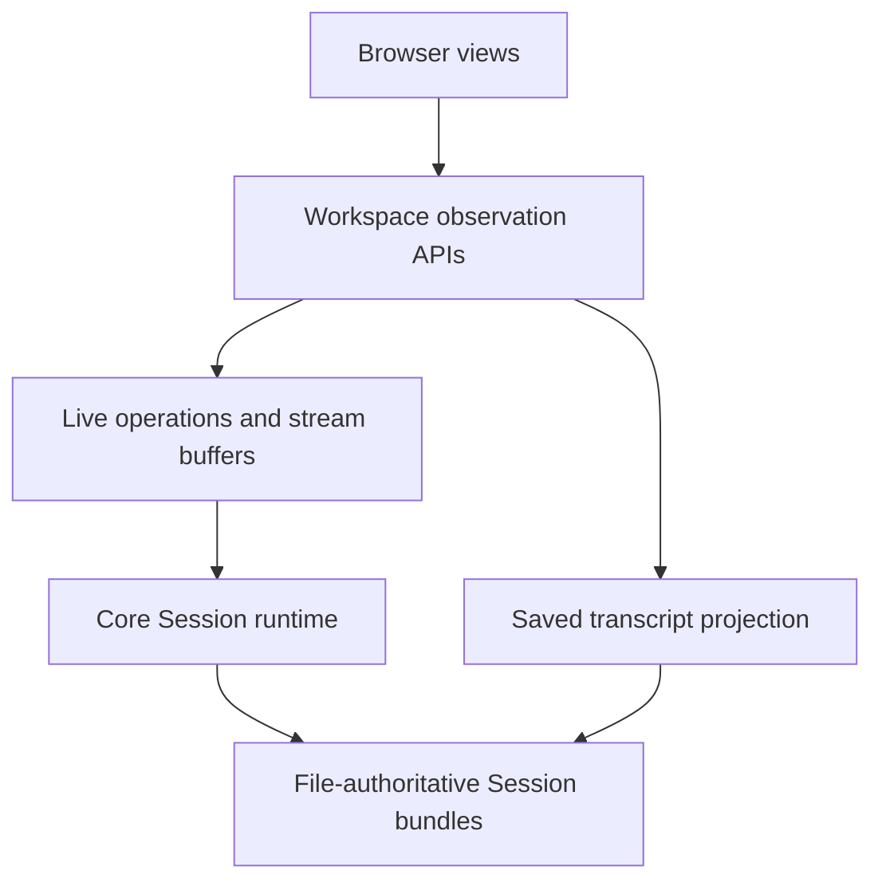

# Workspace Memory Footprint

## Context

**Two implementation Plans, reviewed together and executed in order.** The owner requested a Sequence rather than an
Epic after investigation identified specific server defects.

The owner observed more than 3 GB in macOS Activity Monitor after normal Workspace use: starting and switching Sessions,
Plan Review, and Code Review. The exact historical process and workload trace are unavailable. The owner also considers
the current idle footprint too large.

Reduce memory retained after use and large temporary allocations. Keep saved history, review decisions, retries, and
background work intact. Do not make the owner restart Workspace to reclaim memory.

Existing behavior belongs to:

- [Browser Sessions](../prd/runwield-workspace-prd.md#browser-sessions): conversation, drafts, images, live
  interactions, and background work.
- [TUI and phone continuity](../prd/runwield-workspace-prd.md#tui-and-phone-continuity): one conversation across
  surfaces.
- [Browser Plan review and workflow](../prd/runwield-workspace-prd.md#browser-plan-review-and-workflow): review and
  continuation.
- [Core Session continuity](../prd/runwield-core-prd.md#session-continuity): runtime and background-task lifetime.

**Keep repeated browser use memory-stable** is a proposed addition to Browser Sessions, not a delivered capability.
Slice 1 covers page navigation; slice 2 covers completed payloads and slow observation. Existing acceptance scenarios
remain required. No universal memory ceiling or complete elimination of all allocation growth is promised.



A browser view, an observation connection, an operation, and a saved Session have different lifetimes. Closing one must
not wrongly dispose another.

## Objective

Remove the three confirmed server retention mechanisms: repeated renderer imports, finished-operation payloads, and
redundant queued snapshots. Preserve the existing single-process Workspace and file-authoritative Core model. No runtime
replacement, new service, or datastore is selected.

1. [Reuse the Workspace Page Renderer](workspace-memory-footprint/01-reuse-workspace-renderer.md) — remove the largest
   measured navigation leak and establish repeatable source/compiled memory checks.
2. [Release Finished Operation Payloads and Bound Observation Streams](workspace-memory-footprint/02-release-operation-payloads-and-bound-streams.md)
   — compact completed results, deliver snapshots on reader demand, and preserve reconnect/retry/background behavior.
   Reuse and extend slice 1's measurements.

Each child is owned by Engineer and is specified for autonomous execution. The second depends on the first so navigation
retention does not hide operation measurements. The children carry complete steps and verification; no Slicer
decomposition is needed.

The renderer defect is now the strongest measured explanation for growth during page navigation. Reuse a stable module
identity and share its loading promise across callers. Do not replace the timestamp with another ever-changing import
URL. **Reviewable assumption:** a running packaged server keeps its renderer until process restart; the existing
separate Astro development server keeps its normal hot reload. Missing-build recovery must not poison the cache with a
permanent failure.

A process-per-Session design could reclaim memory on exit, but adds process coordination and can lose process-local
background work. It also does not fix repeated snapshot encoding or browser retention. Prefer direct ownership and
allocation fixes unless measurement later shows that an external runtime cannot release its memory safely.

The second slice keeps the existing snapshot protocol and bounds pending delivery to one encoded snapshot plus a
dirty/version marker per observer. Settlement retains only an explicit compact result. Saved history remains accessible
through the current timeline.

> [!NOTE]
> **Preserve retries; bound payload retention first**
>
> Compact create-request/result metadata remains process-local and may grow by request count. No retry expiry or receipt
> migration is introduced. One active snapshot can still be large. This Sequence removes accumulated full payloads and
> duplicate queued snapshots, not every lifetime allocation.

Deferred, not prerequisites for these fixes: whole-history projection optimization, browser history virtualization,
absolute active-event byte limits, token-review/guide cleanup, and baseline dependency/bundle reductions. Source
concerns below remain investigation evidence, not instructions to implement those changes.

## Vertical Slice Findings

### Live process observation

On 2026-09-29, six samples at ten-second intervals of local `wld workspace serve`, PID 57608, reported RSS in KiB:

`686176, 686896, 1434736, 529616, 493536, 494160`.

The process was about five hours old. The peak was 1.37 GiB and the last sample was 483 MiB. This is uncontrolled
observation, not a reproduced 3 GB incident. RSS measures resident process memory, not only reachable JavaScript
objects. A drop does not rule out other retained objects.

### Repeated renderer imports: proved in isolation

```text
owner page / Plan Review / Code Review / question page
  loadAstroHandle
    read complete entry to check importability
    import(entryUrl + "?mtime=" + Date.now())
      new ES module identity and initialized renderer for each distinct URL
```

`src/ui/workspace/server.js:647–674` creates a new import URL for each request. A compiled runtime prefers the bundled
renderer. `scripts/build-workspace-runtime.js:342–374` produces that single-file module.

Disposable proof: `/tmp/runwield-workspace-import-proof-litBlO/README.md`. An immutable copy of the actual
24,806,787-byte runtime bundle was tested in separate isolated processes. SHA-256:
`71fc14ca0d5ec7f54774b571579b1a382bb6e0fdf441fe58ae62c5923197b00d`.

| Import mode          | Post-GC heap after import 1 | After import 2 | After import 3 | After import 5 |
| -------------------- | --------------------------: | -------------: | -------------: | -------------: |
| Unique URL each time |                  63.032 MiB |    118.796 MiB |    174.608 MiB |        Not run |
| Stable URL           |                  63.031 MiB |     63.064 MiB |     63.064 MiB |     63.067 MiB |

Unique imports added **55.764 and 55.812 MiB of reachable heap per import**, despite dropping strong script references
and collecting garbage three times. Stable imports reused the same exported function and added only 37,432 bytes across
imports 2–5. A whole-file-read-only control did not show that retained growth.

The safety guard stopped unique import 4 near 600 MiB RSS. No 3 GB stress run was attempted. The experimental check
derived a conservative 1 MiB/reimport allowance from stable/read controls.
`python3 /tmp/runwield-workspace-import-proof-litBlO/check.py --candidate unique` exited 1; the stable control exited 0.
Partial results can fail this check but cannot pass it.

Limits: this evaluates the packaged module, not `handle()` or a complete navigation flow. Source-entry cost and
production default-flag absolute memory remain unmeasured. Deno/V8 flags constrained memory for the proof. The source
entry changed during unrelated concurrent builds; the tested copy did not. These findings establish the import-retention
mechanism, not exact historical incident attribution.

### Completed operations and stream amplification: proved in isolation

```text
WorkspaceSessionContinuationService.appendOperationEvent
  appendLiveSessionEvent                     # count cap, no byte cap
  notifyOperation
    getOperation                            # full retained event snapshot
    ownerSessionOperationStreamApi listener
      JSON.stringify -> encode -> enqueue   # every event; no queue bound

operation completes
  setOperation({...previous, status: completed})
    previous events remain in operations Map
```

Disposable proof: `/tmp/runwield-workspace-memory-proof-0NNeqi/README.md`. Scripts and raw JSON are alongside it. Only
scratch files were created. HOME, database, and fixtures were isolated; no models or live Workspace requests ran.

- **Finished records:** 20 completed operations retained 2,000 events and 2,048,000 message bytes. No live runtime,
  background task, or observer required them. Records also remained after closing the still-reachable service.
- **Unread stream:** 500 events containing 512,000 message bytes queued 133,696,601 encoded bytes across 502 snapshots.
  The corresponding no-subscriber case did not allocate those buffers.
- **Release:** draining or canceling returned external memory to its 1,851,774-byte baseline. RSS did not immediately
  return to baseline.
- **Disconnect distinction:** aborting the supplied Request did not unsubscribe in the route-level proof; canceling its
  body did. Actual HTTP disconnect behavior remains unverified.
- **Existing cap:** 1,100 appended events retained 1,000 events. That limit does not bound payload bytes, operation
  count, or downstream stream queues.

Reproduction of the deliberate experimental retention-budget failure:

```sh
bash /tmp/runwield-workspace-memory-proof-0NNeqi/run.sh operations 300 --expect-bounded
```

Observed exit 1: expected at most five settled records / 524,288 message bytes; actual 20 records / 2,048,000 bytes.
These experimental thresholds are not agreed product limits.

The proof used real fixture/store/service/route methods with synthetic records and events. Completion used the real
remote-operation settlement path. It did not execute a local model turn or prove that the historical incident used this
mechanism.

### Saved history: source finding, not yet measured

`timeline -> projectAggregateTranscript -> captureTranscriptEvidence` loads committed segment bytes, decodes and parses
complete entries, creates complete replay events, builds summaries, then selects the requested page. Pagination bounds
the response, not projection memory. The shared projection also serves Core reads, synchronization, and Plan progress;
changing it must preserve integrity checks and all callers.

### Browser lifetime: source findings, not confirmed leaks

Astro unmounts non-persistent Session islands. EventSource, timers, ResizeObserver, and several document listeners have
cleanup. This argues against declaring every navigation a leak without browser measurements.

Loaded Session history grows without eviction and is fully mounted. Closed activity groups still mount their children.
Several fetch loops suppress late results but do not abort requests. These can increase memory or temporary work; their
contribution is unmeasured.

### Review lifetime: source findings

Owner Workspace reviews and token-based local reviews have different owners. Owner Code Review does not create Guided
Review job maps; do not attribute those maps to every review visit.

Normal token-review decisions delete their pending promise, and normal review completion stops the server.
Conversational feedback deliberately retains a server for another review round. `validation-human-review.ts` creates a
Code Review conversation per invocation; after feedback repair it can return without a matching conversation close. This
needs a real feedback/repair/review lifecycle check before claiming it leaks.

Within a live token review, guide jobs and their results accumulate across regeneration. Some retention is required for
result retrieval, reviewed flags, and widget URLs. Review cleanup must respect those lifetimes; immediate deletion of
completed guide jobs is not an acceptable blanket fix.

No browser heap or real review-round retention proof has run yet. The renderer-import defect affects these pages
independently of their review state.

## Expected Change Surface

The boundaries this Sequence is expected to touch. This list is guidance, not an allowlist: each child Plan verifies the
real footprint during implementation and changes whatever its Implementation Steps need. Discovery that changes approved
intent — another subsystem joins the Sequence, public behavior or architecture shifts, migration risk grows — comes back
to the user, not to the file list.

- `src/ui/workspace/server.js` — stable renderer loading shared by all page types, startup failure/retry behavior, and
  no repeated full-bundle importability read per request.
- `src/ui/workspace/server/session-continuation.js` — operation payload ownership, settled metadata, request
  deduplication, and remote observation cleanup.
- `src/ui/workspace/routes/owner-session-api.js` — bounded stream delivery, completion, disconnect, and abort handling.
- `src/ui/workspace/server/owner-connections.js` — existing device-revocation integration for operation observation.
- `scripts/workspace-memory-check.ts` (new) — isolated source/compiled renderer, operation, and combined measurements.
- `src/ui/workspace/islands/SessionSurface.jsx` — observation contract and request cancellation, without cancelling
  agent work.
- Existing Workspace/Core tests — reproduce retention and protect reconnect, retry, interaction, and task behavior.
- Owning PRD capabilities — add long-use acceptance evidence with the implementing behavior, not in advance.

Transcript projection, browser-rendering optimization, review conversation lifetime, and guide-job retention are outside
the two slices. Current uncommitted dashboard/catalog changes in `file-session-store*`, `owner-api.js`,
`owner-dashboard.ts`, and Session listing are separate work; do not overwrite or claim them as these fixes.

## Reuse Opportunities

- Existing file bundles and transcript pagination remain the source for saved conversation.
- Existing Workspace operation receipts can return compact results after live payload release. Create requests currently
  use a separate in-memory map; eviction must not turn a retry into a second Session.
- `releaseRetainedIfDrained` already protects running operations, background tasks, pending results, and opening
  continuations. Preserve this owner; do not tie runtime disposal to browser closure.
- `owner-dashboard` already shares an in-flight read and clears it at settlement. Reuse the bounded-lifetime principle
  where applicable, not an unbounded transcript cache.
- `makeManagedSessionFixture` provides real saved history and ownership without model calls.

## Verification Plan

The children specify exact focused test/build commands and a repository-owned `scripts/workspace-memory-check.ts`. Use
the isolated test runner, never direct `deno test`. Temporary discovery scripts are supporting evidence, not
implementation dependencies.

Slice 1 verifies real rendering through source and compiled owner/local/review handlers. Slice 2 adds real service
settlement, loopback HTTP streams, browser teardown, and the combined navigation/operation workload. The compiled
fixture must run with `Deno.build.standalone === true`; the remote Shared Space server is not a substitute.

After route warm-up, compare two batches of ten fixed fixture cycles. The compiled renderer test allows at most 10 MiB
additional retained heap; the combined test allows 10 MiB heap and 4 MiB external-buffer growth. The unread 500-event
stream test allows less than 4 MiB external-buffer growth. These are regression allowances for controlled fixtures, not
product-wide memory limits. A 1 GiB RSS safety guard and timeout fail incomplete runs. Deterministic content,
module-initialization, payload-retention, and listener tests remain required even when memory totals pass.

### Outcome Evidence

The Sequence is complete only when both child outcomes and their combined journey are proved:

- **One renderer per process:** repeated and concurrent successful owner/local/review/question requests reuse the same
  loaded renderer. Production requests create no time-derived module identities and do not reread the complete bundle
  for importability. A missing build or failed preflight can recover after a valid build becomes available; an actual
  cached module-evaluation failure may require restart, as specified in slice 1. A built-runtime request-loop test, not
  a loader-name change, proves the steady post-warm-up heap slope is gone.
- **Released completed-operation payloads:** settled records and pending terminal responses contain no transcript
  payload. Only one previously queued encoded snapshot may remain for a stalled reader until drain/cancel. Compact retry
  metadata is allowed; operation status and duplicate-request results remain correct.
- **Bounded slow-client memory:** an unread or throttled connection cannot accumulate one encoded full-history snapshot
  per event. Cancellation removes its observer without stopping the Session or its tasks.
- **Truthful reconnect:** reconnect after operation completion or observer disconnect loads the committed conversation
  and current state without duplicate messages, missed pending interaction, or false interruption. Active tasks survive
  zero observers.
- **Lower navigation/observation allocation:** the same controlled workload passes after the fixes and fails on the old
  mechanisms. Source and compiled results are reported separately; a source fallback page cannot stand in for the real
  runtime renderer.
- **Long-use behavior:** the fixed create/continue/switch/review/settle/reconnect workload meets the child memory
  allowances, with no accumulating transcript payloads or listeners. Evidence separates retained heap, external buffers,
  RSS, allowed compact metadata, payload size, and sampling method.

Protected behavior: complete saved history, current workflow reports, draft/image recovery, duplicate-submit protection,
pending reviews and questions, background results after browser closure, and TUI/browser continuity.

Behavior expected to stop: per-page renderer instantiation through unique import URLs, indefinite storage of finished
live-event payloads, and unlimited queuing of redundant observation snapshots. No user conversation is designated for
deletion.

The eventual changes must update the owning Workspace capability scenarios and link shared Core guarantees. A
cross-child long-use journey must prove that the combined result works; isolated unit checks do not establish it.

## Edge Cases & Considerations

- Observation buffers are projections, never authority for approval, workflow completion, or saved history.
- Active interactions and process-local background work outlive browser connections. Memory pressure must not cancel
  them silently.
- Stream coalescing can lose intermediate alerts or terminal state unless the contract separates current state, durable
  history, and notification delivery.
- Create-request map removal can permit duplicate Sessions. Preserve its correctness before adding a cap.
- Releasing objects does not guarantee immediate RSS return to the operating system. Prove object/buffer release and
  measure workload peaks separately.
- Whole-history caching would trade repeated allocation for retained memory. Do not adopt it as the default
  optimization.
- This planning work changes only the Sequence and its two child Plans. Discovery used isolated scratch proofs;
  unrelated source edits already present in the checkout are not part of this work.
- No new domain language or architectural authority is introduced. ADR-015 and the current glossary remain applicable;
  no new ADR or glossary rewrite is needed.
