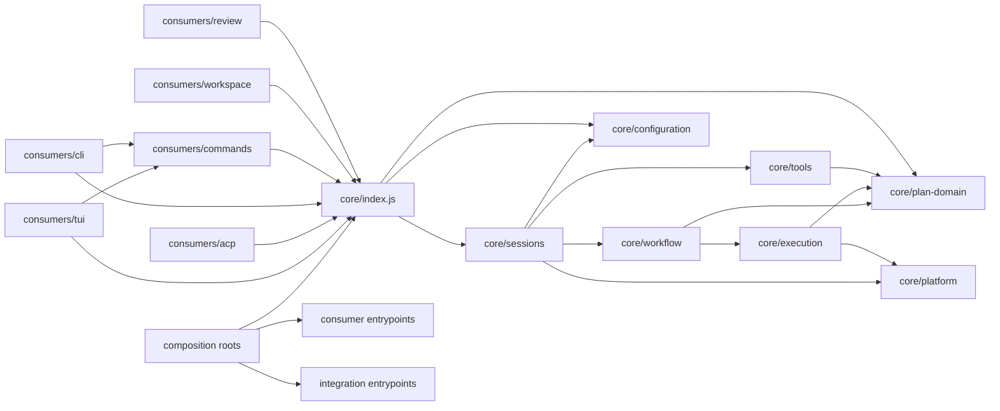

# Reorganize the Source Tree into Deep Semantic Modules

## Context

The live-session boundary is now behaviorally clean: `SessionRuntime` owns live sessions and publishes semantic events,
while the TUI and ACP consume the public Runtime surface. The physical source tree does not yet communicate that
architecture clearly enough.

The main problem is `src/shared/`. It contains public application boundaries, private session machinery, workflow
orchestration, persistence, configuration, Git helpers, collaboration code, and unrelated utilities. In particular,
`src/shared/session/` places `SessionRuntime` beside `HostedSession`, `SessionHost`, Pi construction, agent switching,
prompt assembly, and persistence internals. A human browsing the tree can reasonably mistake these files for peer APIs
and import across a boundary that exists only in documentation and tests.

Likewise, the consumers are split between `src/ui/tui/`, `src/acp/`, and `src/cmd/`. Their architectural relationship to
Core is not visible from their common parent. Browser review is under `src/ui/review/`, while the Workspace and design
system share the same broad `ui` folder despite having different responsibilities.

Folder placement is not a substitute for dependency checks, but it is part of the architecture. The tree should make the
intended dependency direction obvious before a contributor reads `architecture.md` or a boundary test.

The repository-root `plans/` directory remains reserved for RunWield Markdown Plan artifacts. No source-code module will
be named `plans`. Code that owns Plan persistence and lifecycle will use the singular, explicit name `plan-domain/`.

## Objective

Create a source layout in which:

- `src/core/` is visibly the consumer-neutral RunWield engine.
- `src/consumers/` contains TUI, ACP, CLI, command, Workspace, and review consumers.
- `src/composition/` is the only place allowed to assemble Core with concrete consumers and process entrypoints.
- each semantic module has a small `index.js` entrypoint and hides implementation files below its own directory;
- code outside `src/core/` imports Core only through `src/core/index.js`;
- sibling Core modules import one another only through their module `index.js` entrypoints;
- no module reaches into another module's `internal/` directory;
- the old paths are deleted in the same change that updates their importers;
- no compatibility re-export, forwarding module, duplicate implementation, or old/new path fallback is retained;
- resource discovery, release compilation, tests, and documentation use the new canonical paths.

## Non-goals

- Do not change Runtime behavior, Plan lifecycle behavior, routing policy, validation semantics, or TUI appearance
  merely because files move.
- Do not rename the repository-root `plans/` directory.
- Do not introduce TypeScript outside `src/consumers/workspace/`.
- Do not create a generic `common/`, `shared/`, `utils/`, or `misc/` replacement. A module must have a domain name.
- Do not retain the old tree to make the migration incremental at runtime. Git history provides the migration record.
- Do not create package-level abstractions that have only one caller unless they establish a real ownership boundary.

## Resolved decisions

### 1. Top-level source categories

The target top-level layout is:

```text
src/
  core/          consumer-neutral engine and public application APIs
  consumers/     TUI, ACP, CLI, command, Workspace, and review implementations
  composition/   executable assembly roots and dependency wiring
  integrations/  optional external-tool integrations and extension packages
  resources/     bundled non-code assets such as agent definitions
```

`src/shared/`, `src/ui/`, `src/acp/`, `src/cmd/`, and the root `src/tools/` cease to be canonical source locations.

### 2. Core has one outside entrypoint

`src/core/index.js` is the only Core import path available to consumers, scripts, and composition roots. It exports the
supported application surfaces, including:

- `SessionRuntime`;
- Runtime event constants and JSDoc contracts;
- Runtime interaction contracts;
- immutable session snapshot contracts;
- public Plan-domain operations needed by Workspace and commands;
- public settings, catalog, and package-resource operations that are intentionally application APIs.

It does not export `HostedSession`, `SessionHost`, Pi `AgentSession`, Pi `SessionManager`, root-session persistence
objects, agent handlers, event publishers, or workflow implementation objects.

Core submodules also have `index.js` files. Those are internal Core-to-Core boundaries; they allow a sibling Core module
to consume another domain without importing its implementation files.

### 3. The Plan code module is `plan-domain/`

The code folder is `src/core/plan-domain/`, not `plans/` or `src/plans/`. This keeps the source module distinct from the
repository-root `plans/` artifact store while retaining the established domain term “Plan.”

### 4. Consumers are named as consumers

TUI and ACP are sibling consumers under one parent. CLI commands and browser review are also consumers, not Core
services. Their shared parent communicates that they may depend on Core but Core may never depend on them.

### 5. No compatibility tree

Every physical move is breaking and atomic at the module level:

1. move the implementation and its tests;
2. update every importer, resource path, compile include, and documentation link;
3. delete the old path;
4. run the boundary scan and relevant tests before moving the next module.

There will be no file at an old path that re-exports the new module. There will be no `try old path, then new path`
loader. There will be no duplicate source file left behind for callers not yet migrated.

## Target directory structure

dont assume this is final lets discuss some of the folders under consumers primarily.

```text
src/
  core/
    index.js
    architecture-boundary.test.js

    sessions/
      index.js
      session-runtime.js
      events.js
      interactions.js
      snapshots.js
      internal/
        hosted-session.js
        session-host.js
        session-turn.js
        queue-state.js
        cancellation.js
        agent-runtime/
          agent-session-factory.js
          agent-event-bridge.js
          agent-handler.js
          agent-switching.js
          prompt-assembly.js
          model-assembly.js
          agent-assets.js
        persistence/
          root-session.js
          session-catalog.js
          workflow-context.js
          replay-events.js
        attachments/
          image-attachments.js
      *.test.js
      internal/**/*.test.js

    workflow/
      index.js
      orchestrator.js
      decisions.js
      routing-ceremonies.js
      workflow-messages.js
      prompts.js
      slicing.js
      internal/
        workflow-results.js
        workflow-state.js
      *.test.js

    plan-domain/
      index.js
      plan-store.js
      lifecycle.js
      hierarchy.js
      dependencies.js
      collaboration-lock.js
      *.test.js

    execution/
      index.js
      execution-service.js
      validation.js
      validation-modes.js
      task-scheduling.js
      git-snapshot.js
      worktrees/
        worktree-service.js
        registry.js
        merge-back.js
        recovery.js
      *.test.js
      worktrees/*.test.js

    configuration/
      index.js
      settings.js
      agents.js
      models/
        index.js
        registry.js
        validation.js
      catalogs/
        prompts.js
        skills.js
        context-files.js
        extensions.js
      package-resources.js
      *.test.js

    tools/
      index.js
      registry.js
      policy.js
      definitions/
        bash.js
        grep.js
        edit.js
        plan-written.js
        return-to-router.js
        review-complete.js
        task-completed.js
        triage-report.js
        user-interview.js
      *.test.js
      definitions/*.test.js

    collaboration/
      index.js
      protocol.js
      crypto.js
      capabilities.js
      lock.js
      secrets.js
      urls.js
      *.test.js

    platform/
      index.js
      git.js
      process.js
      project-state.js
      runtime-preflight.js
      metrics.js
      snip-filters.js
      *.test.js

  consumers/
    tui/
      index.js
      chat-session.js
      runtime-event-renderer.js
      runtime-interaction-adapter.js
      keybindings.js
      prompts.js
      blocks.js
      bash-input.js
      state/
      *.test.js

    acp/
      index.js
      server.js
      session-map.js
      runtime-event-mapper.js
      runtime-interaction-mapper.js
      protocol-smoke.test.js
      *.test.js

    commands/
      index.js
      registry.js
      definitions/
        agents/
        compact/
        copy/
        export/
        init/
        load-plan/
        name/
        new/
        reload/
        resume/
        router/
        session/
        settings/
        share/
        sleep/
      *.test.js
      definitions/**/*.test.js

    cli/
      index.js
      argument-parser.js
      command-runner.js
      output.js
      *.test.js

    review/
      index.js
      plan-review.js
      code-review.js
      review-launcher.js
      *.test.js

    workspace/
      ...existing Astro/React workspace tree...

    presentation-system/
      theme/
      design-system/

  composition/
    cli-entry.js
    acp-entry.js
    tui-entry.js
    runtime-factory.js
    dependency-factory.js

  integrations/
    extensions/
      cymbal/
      mnemosyne/
      snip/

  resources/
    agent-definitions/
    prompt-templates/
    skills/
```

The exact leaf filenames may change during implementation when one existing file is split, but the ownership and allowed
dependency direction must not change without updating this Plan and `architecture.md` first.

## Module relationships



Forbidden relationships:

- Core → any consumer.
- Core → composition.
- consumer → `src/core/**` except `src/core/index.js`.
- one Core submodule → another Core submodule's leaf file or `internal/` directory.
- ACP → TUI, TUI → ACP, Workspace → TUI, or review → TUI.
- command definitions → Hosted Session, Pi session, Runtime event publisher, or transcript manager internals.
- integration → consumer unless the integration is explicitly a consumer plugin and lives under that consumer.
- any new `shared/`, `common/`, `misc/`, or catch-all `utils/` folder.

## Current-to-target mapping

| Current location                                                     | Target owner                                                                                                            |
| -------------------------------------------------------------------- | ----------------------------------------------------------------------------------------------------------------------- |
| `src/shared/session/session-runtime*.js`                             | `src/core/sessions/` public Runtime files                                                                               |
| `src/shared/session/hosted-session.js`, `session-host.js`            | `src/core/sessions/internal/`                                                                                           |
| `src/shared/session/session.js`                                      | split across `sessions/internal/agent-runtime/` by construction, prompt/model assembly, and event bridge responsibility |
| `src/shared/session/agent-handler.js`, `agent-switching.js`          | `src/core/sessions/internal/agent-runtime/`                                                                             |
| `src/shared/session/root-session.js`, session catalog/context files  | `src/core/sessions/internal/persistence/`                                                                               |
| `src/shared/workflow/orchestrator.js`, decisions, prompts, slicer    | `src/core/workflow/`                                                                                                    |
| `src/shared/workflow/workflow.js`, validation, scheduling, snapshots | `src/core/execution/`                                                                                                   |
| `src/shared/worktree.js`, `worktree-registry.js`                     | `src/core/execution/worktrees/`                                                                                         |
| `src/plan-store.js`, `src/shared/workflow/plan-lifecycle.js`         | `src/core/plan-domain/`                                                                                                 |
| `src/shared/settings.js`, models, session agent catalogs             | `src/core/configuration/`                                                                                               |
| `src/tools/`                                                         | `src/core/tools/definitions/` plus the Core tool registry/policy                                                        |
| `src/shared/collaboration/`                                          | `src/core/collaboration/`                                                                                               |
| Git, project state, preflight, metrics, Snip filters                 | `src/core/platform/`                                                                                                    |
| `src/ui/tui/`                                                        | `src/consumers/tui/`                                                                                                    |
| `src/acp/`                                                           | `src/consumers/acp/`                                                                                                    |
| `src/cmd/`                                                           | `src/consumers/commands/`; process-only CLI parsing moves to `src/consumers/cli/`                                       |
| `src/ui/review/`                                                     | `src/consumers/review/`                                                                                                 |
| `src/ui/workspace/`                                                  | `src/consumers/workspace/`                                                                                              |
| `src/ui/theme/`, `src/ui/design-system/`                             | `src/consumers/presentation-system/`                                                                                    |
| `src/extensions/`                                                    | `src/integrations/extensions/`                                                                                          |
| `src/agent-definitions/` and other bundled Markdown assets           | `src/resources/` by asset kind                                                                                          |
| executable entry files and dependency assembly                       | `src/composition/`                                                                                                      |

## Import contracts

### Outside Core

Production files outside `src/core/` may import Core only as:

```js
import { RuntimeEventTypes, SessionRuntime } from "../../core/index.js";
```

The relative depth will vary, but the resolved target must be `src/core/index.js`. Consumers do not import
`core/sessions/index.js` or any deeper path.

### Inside Core

A Core module may import its own leaf files. When it imports a sibling Core module, it uses the sibling's `index.js`:

```js
import { loadPlan, recordLifecycleEvent } from "../plan-domain/index.js";
```

It may not import `../plan-domain/plan-store.js` or any `../plan-domain/internal/*` path.

### Composition

Only `src/composition/` may import both Core and concrete consumer/integration entrypoints to construct an executable
application. Core factories accept dependencies; they do not discover TUI, ACP, Workspace, or review implementations.

## Implementation sequence

### Phase 1: Establish executable boundaries

1. Add the target directory skeleton and empty module entrypoints only where an immediate move will populate them.
2. Expand the architecture boundary test before moving code:
   - forbid production imports of old canonical paths once each module moves;
   - forbid any outside-Core import except `src/core/index.js`;
   - forbid cross-Core deep imports and all imports containing another module's `/internal/` segment;
   - forbid Core imports containing `/consumers/`, `/composition/`, or consumer vocabulary;
   - forbid re-export modules at the old paths;
   - forbid new `shared`, `common`, `misc`, and catch-all `utils` directories.
3. Add a source-tree test that asserts the expected semantic module roots and fails if deprecated roots remain after
   migration.
4. Document the target graph in `architecture.md` before changing imports.

### Phase 2: Move the session engine first

1. Move Runtime events, interactions, snapshots, and `SessionRuntime` into `src/core/sessions/`.
2. Move `HostedSession`, `SessionHost`, turn/queue state, Pi construction, event translation, prompt/model assembly,
   agent switching, persistence, and image attachment code into `sessions/internal/` subdomains.
3. Split the current broad `session.js` by responsibility. Do not rename the same broad file into the new tree.
4. Create `src/core/sessions/index.js` and export only the Runtime-facing contract to `src/core/index.js`.
5. Update every consumer, script, test, and Core sibling import in the same phase.
6. Delete `src/shared/session/` after the final importer is migrated. Do not leave forwarding modules.
7. Run session, TUI, ACP, command, boundary, compile-graph, and release-binary tests.

### Phase 3: Separate workflow, Plan domain, and execution

1. Move routing ceremonies, orchestration decisions, messages, prompts, and slicing into `src/core/workflow/`.
2. Move Plan persistence, lifecycle, hierarchy, dependency checks, and lock semantics into `src/core/plan-domain/`.
3. Move execution orchestration, validation modes, Git snapshots, task scheduling, worktree ownership, merge-back, and
   recovery into `src/core/execution/`.
4. Remove workflow-to-session-internal dependencies. Workflow receives semantic event/interaction capabilities through
   explicit parameters owned by the calling Runtime; it never receives `HostedSession`.
5. Make workflow and execution consume Plan operations only through `plan-domain/index.js`.
6. Delete the migrated files from `src/shared/workflow/`, the root `src/plan-store.js`, and root worktree helpers.
7. Run routing, lifecycle, execution, validation, worktree, and Workspace suites after each module move.

### Phase 4: Move configuration, tools, collaboration, and platform services

1. Consolidate settings, models, agent catalogs, prompt/skill/context discovery, and package resources under
   `src/core/configuration/`.
2. Move tool definitions, registry, and protection policy under `src/core/tools/` while preserving the semantic Runtime
   event path.
3. Move collaboration protocol/crypto/lock code under `src/core/collaboration/`.
4. Move Git, preflight, project state, metrics, process, and filter services under `src/core/platform/`.
5. Replace every remaining `src/shared/` import with a semantic module entrypoint.
6. Delete `src/shared/` entirely. If a file has no clear target owner, stop and resolve its domain instead of creating a
   catch-all replacement.

### Phase 5: Co-locate consumers

1. Move TUI to `src/consumers/tui/` without changing its rendering behavior.
2. Move ACP to `src/consumers/acp/` and keep it a sibling of TUI.
3. Split `src/cmd/` into reusable command consumers and process-only CLI code.
4. Move browser review, Workspace, theme, and design-system code into their named consumer modules.
5. Ensure consumer-to-consumer imports follow the explicit allowed graph. Shared presentation primitives live only in
   `presentation-system/`; protocol or engine state never does.
6. Delete `src/ui/`, `src/acp/`, and `src/cmd/` after all importers and build paths are migrated.

### Phase 6: Composition, integrations, and resources

1. Move executable construction and dependency wiring into `src/composition/`.
2. Move extension implementations into `src/integrations/extensions/`.
3. Move bundled non-code assets into `src/resources/` without introducing a code folder named `plans`.
4. Update resource discovery, `import.meta.url` resolution, Deno compile `--include` arguments, package-resource tests,
   release scripts, and compiled-binary smoke tests.
5. Remove every deprecated source root and add explicit absence assertions.

### Phase 7: Documentation and final audit

1. Rewrite the source guide and dependency diagrams in `architecture.md` to match the final tree.
2. Search documentation, scripts, tests, and comments for every old source prefix.
3. Search consumer production code for deep Core imports.
4. Search Core modules for consumer imports or vocabulary.
5. Search sibling Core modules for imports bypassing another module's `index.js`.
6. Confirm that Git contains moves/deletions, not duplicate old/new implementations.
7. Run the complete CI and release verification.

## Acceptance criteria

- `src/shared/` no longer exists.
- `src/ui/`, `src/acp/`, `src/cmd/`, and root `src/tools/` no longer exist as canonical source roots.
- the repository-root `plans/` directory remains the Plan artifact store;
- no code module or compatibility directory named `plans` is introduced;
- `src/core/index.js` is the only Core import target used outside Core;
- every Core semantic module has an `index.js` and tests colocated with the owner;
- no production import reaches into another module's `internal/` directory;
- no consumer imports Hosted Session, Session Host, Pi session, transcript manager, handler, or event-publisher guts;
- no Core file imports or names TUI, ACP, Workspace, browser review, or presentation APIs;
- TUI and ACP remain sibling consumers of identical Runtime events/interactions;
- command consumers call public Core operations and do not become an alternate session boundary;
- all old-path imports return no results;
- all old implementation paths are absent rather than forwarding;
- `architecture-boundary.test.js` enforces path shape as well as vocabulary;
- `deno task ci` passes;
- release compilation and the binary smoke test pass.

## Verification commands

```sh
deno task check
deno lint
deno fmt --check
deno test --allow-all src/core/architecture-boundary.test.js
deno task test
deno task release:check
deno task ci
```

Required structural searches:

```sh
rg -n "src/shared|src/ui|src/acp|src/cmd|src/tools" src scripts architecture.md
rg -n "core/.+/(internal|session-runtime|hosted-session|session-host)" src/consumers src/composition scripts
rg -n "consumers/|uiAPI|UiAPI|SessionUiPort|\\bTUI\\b|\\bACP\\b" src/core
rg --pcre2 -n "from .*core/(?!index\\.js)" src/consumers src/composition scripts
```

The exact searches implemented in tests should parse imports rather than depend exclusively on regular expressions, but
these commands provide a final human-readable audit.

## Risks and mitigations

| Risk                                                      | Mitigation                                                                                          |
| --------------------------------------------------------- | --------------------------------------------------------------------------------------------------- |
| large move obscures behavioral changes                    | keep this project behavior-preserving; isolate necessary behavior fixes and test them explicitly    |
| stale dynamic import/resource path survives type checking | compile release binary and run package-resource plus binary smoke tests after resource moves        |
| broad `index.js` recreates a grab bag                     | export only documented application APIs; keep an explicit export allowlist test                     |
| Core sibling modules bypass each other's entrypoints      | import-graph test rejects cross-module leaf and `internal/` imports                                 |
| old paths return as “temporary” compatibility             | absence tests plus boundary patterns; no forwarding modules allowed                                 |
| `src/consumers/commands/` becomes hidden Core logic       | commands may parse/present/dispatch, but durable session/workflow state remains in Core APIs        |
| generic helpers accumulate outside ownership              | no catch-all folder; place helpers with their owning semantic module or stop and name a real module |
| Plan source module is confused with artifact storage      | use `plan-domain/` for code and reserve repository-root `plans/` for Markdown artifacts             |

## Completion evidence

When implemented, verification notes must record:

- the final source tree;
- the public export list of `src/core/index.js`;
- zero-result old-path and forbidden-import searches;
- boundary test output;
- focused session/workflow/execution/consumer test results;
- full CI test count;
- release binary version and smoke-test result;
- confirmation that no compatibility re-exports or duplicate implementations remain.
