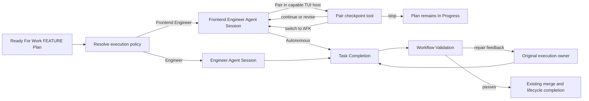

# Frontend Engineer and Pair Execution

## Context

RunWield already has the low-level pieces needed for browser-first frontend work: layered Agent Definitions with
independent model bindings, Skills for convention-aware frontend implementation and headed `agent-browser` inspection,
FEATURE worktree execution, an adapter-neutral interaction broker, Task Completion, Workflow Validation, and opt-in
content-safe workflow metrics. The current shape nevertheless routes every executable FEATURE Plan to Engineer and uses
one `frontend` boolean for several unrelated concerns.

The approved product direction in `docs/prd/frontend-engineer-pair-execution-prd.md` separates those concerns. A
first-class **Frontend Engineer** should own materially visual or interactive web UI/UX Plans. The Planner recommends
**Pair Execution** or autonomous work, but the user chooses when execution starts. Pair Execution deliberately blocks
after coherent visible increments without turning a checkpoint into Task Completion, a Plan Status, or validation.

Architectural discovery also established an important scope boundary. Browser work can provide a shared live surface
through a worktree dev server, HMR where available, and a headed browser. RunWield's TUI cannot update its own running
process from implementation changes in another worktree and has no PTY-backed preview broker. TUI implementation
therefore remains Engineer-owned and outside Pair Execution. In the first complete product, the local TUI hosts Pair
choices and checkpoints while the headed browser is the shared implementation surface. ACP and Headless Mode execute
Frontend Engineer autonomously; a future frontend Pair UI or ACP visual-surface integration is separate work.

This Epic itself uses the current canonical `frontend: false` Front Matter field because that field has not yet been
retired in the repository's Plan format. The target architecture removes `frontend` from all new Plan writes and from
active nonterminal Plans.

## Objective

Establish Frontend Engineer and Pair Execution as coherent extensions of the existing FEATURE workflow while preserving
RunWield's lifecycle, worktree, validation, and host boundaries.

The resulting architecture must preserve these invariants:

- Executable FEATURE Plans represent ownership with `executionAgent: engineer | frontend-engineer`. New materially
  visual or interactive web UI/UX Plans select `frontend-engineer`; ordinary code and TUI Plans select `engineer`.
- Frontend-owned FEATURE Plans represent Planner guidance separately with
  `collaborationRecommendation: pair | autonomous`. The recommendation never fixes the user's runtime choice.
- Frontend Engineer always performs real-browser verification unless an external capability makes it genuinely
  impossible. The Plan's Verification Plan defines the exact routes, states, viewports, accessibility checks,
  diagnostics, and deterministic tests, so no redundant `browserVerification` Front Matter field is introduced.
- `frontend` is retired from new Plan formats and serializers. Legacy executable FEATURE Plans with `frontend: true`
  resolve to Frontend Engineer plus autonomous execution; `frontend: false` has no effect. Legacy PROJECT Epics remain
  non-executable and use the old value only as a Slicer hint about browser-oriented child work.
- Pair/AFK selection is runtime workflow state, not Plan Status or mutable Plan Front Matter. If runtime context is
  lost, recovery resolves the owner from the Plan and asks the user to choose again.
- Pair checkpoints remain inside the same Frontend Engineer Agent Session and active execution workflow. They do not
  emit Task Completion, run Workflow Validation, or mark execution failed.
- Task Completion remains the only implementation-to-validation boundary. Every validation or code-review repair returns
  to the original execution Agent, including Frontend Engineer.
- Pair Execution is offered only by a host that explicitly supports blocking interaction and the shared local browser
  experience. TUI supports it first; ACP and Headless Mode fall back to autonomous execution without simulated
  checkpoints.
- Existing browser-test frameworks are followed when present. Pair Execution does not install Playwright, create visual
  snapshots, or convert exploratory browser actions into tests unless an approved Plan explicitly requires that work.

## Vertical Slice Findings

The current control path is:

1. Planner approval or `wld load-plan` reaches `executePlan()` with a Ready For Work FEATURE Plan.
2. `executePlan()` loads the Plan, creates or reuses the execution worktree, and unconditionally runs Engineer through
   `runActiveAgentTurn()`.
3. `HostedSession.activeExecutionWorkflow` owns the Plan/worktree context needed for continued turns and validation.
4. `task_completed` ends the implementation turn; the Agent Handler or direct execution path records
   `implementation_finished` and starts Workflow Validation.
5. `runValidationLoop()` sends CI, semantic-review, human-review, and merge repairs back to hard-coded Engineer calls.
6. `requestHostedSessionInteraction()` already supports non-terminal `select` and `text` prompts. The TUI adapter can
   render both; ACP can elicit forms but cannot guarantee a shared local browser; sessions without an adapter report the
   interaction unsupported.

The architectural change should deepen these existing seams rather than create a parallel frontend workflow:

The existing broker can support checkpoints without ending the model turn. A Pair-specific workflow Custom Tool should
present the increment summary and browser evidence, offer continue/revise/switch-to-AFK/stop, collect revision text when
needed, and return the structured decision to Frontend Engineer. Because it is supplied only to Pair execution, the base
Frontend Engineer Agent Definition remains independently usable in autonomous workflows and does not advertise an
unavailable checkpoint capability.

The active execution context must become the source of truth for `executionAgent` and selected collaboration style.
Dispatch, Task Completion authorization, paused execution, recovery rehydration, validation repair, status messages, and
metrics should consume that context rather than each defaulting independently to Engineer.

## Files to Modify

- `src/constants.js` — add the canonical `frontend-engineer` Agent Name without changing the Routing Intent taxonomy or
  QUICK_FIX ownership.
- `src/agent-definitions/frontend-engineer.md` — define the first-class browser-first execution identity, independently
  configurable model/tool policy, autonomous behavior, design-system discovery, repair-first preflight, bounded visual
  increments, content/responsive/accessibility checks, and Task Completion discipline.
- `src/agent-definitions/engineer.md` — return Engineer to a general execution policy, retain concise legacy safety
  where required, and keep TUI work Engineer-owned without duplicating the full browser-specialist contract.
- `src/agent-definitions/planner.md`, `architect.md`, and `workflow-prompts/slicer-prompt.md` — make ownership decisions
  based on the primary product outcome, require browser design-basis discovery, distinguish Pair recommendations from
  browser verification details, and preserve the contract through Epic decomposition.
- `src/agent-definitions/document-formats/planner-plan-format.md` and `architect-plan-format.md` — retire `frontend`,
  add the executable FEATURE ownership/recommendation contract where applicable, and explain that Epics describe which
  browser-oriented child areas need Frontend Engineer without assigning an Agent to the Epic itself.
- `src/plan-front-matter.js`, `src/plan-store.js`, and focused tests — parse, normalize, order, serialize, round-trip,
  and validate `executionAgent` and `collaborationRecommendation`; stop emitting `frontend`; retain class-aware legacy
  read compatibility; and carry the new fields through Slicer child descriptors.
- `src/shared/workflow/workflow.js`, `workflow-prompts.js`, `decisions.js`, and tests — resolve the execution owner from
  the loaded Plan, ask the collaboration choice before recording execution start, dispatch the selected Agent through
  the existing worktree path, and report paused/stopped frontend execution without failure semantics.
- `src/shared/session/hosted-session.js`, `agent-handler.js`, `agent-switching.js`, and tests — extend the active
  execution context with owner and collaboration style, authorize Task Completion by the active owner, preserve the same
  root Frontend Engineer session across checkpoints, and rehydrate recovery using Plan ownership while re-asking style
  after context loss.
- `src/tools/pair-checkpoint.js`, tool registration/session wiring, titles, and tests — add the Pair-only workflow
  Custom Tool over the existing interaction broker, with structured decisions, optional revision feedback,
  evidence-oriented prompts, non-terminal behavior, and no Plan lifecycle mutation.
- `src/shared/workflow/validation.js` and tests — replace hard-coded Engineer repair routing and display strings with
  the original execution owner for CI, semantic, human-review, visual, and merge repair paths while preserving Reviewer,
  merge-back, and lifecycle semantics.
- `src/shared/session/session-runtime-interactions.js` and the host adapters — expose the minimum host capability needed
  to offer Pair Execution without introducing a new Plan Status or terminal workflow event. TUI advertises Pair support;
  ACP does not in this Epic; no adapter means autonomous fallback.
- `src/ui/tui/runtime-interaction-adapter.js` and tests — render style selection and Pair checkpoints through existing
  select/text interaction patterns, including revision collection, switch-to-AFK, and intentional stop.
- `src/acp/interaction-mapper.js` and tests — preserve ordinary elicitation behavior while ensuring frontend FEATURE
  execution remains autonomous and never attempts Pair checkpoints in ACP.
- `src/shared/workflow/metrics.js`, `src/tools/task-completed.js`, and tests — recognize Frontend Engineer as an
  execution Agent and record only opt-in, coarse Pair facts such as recommendation, selection, checkpoint
  count/decision, completion, elapsed time, and browser preflight outcome.
- `src/skills/front-end-framework-use/` and `src/skills/agent-browser-use/` — remain reusable technique packages under
  Frontend Engineer; align cleanup/evidence guidance with a persistent Pair loop without making the Skills the work
  owner or introducing a browser-test framework.
- Active nonterminal files under `plans/` — remove both `frontend: true` and `frontend: false`; add explicit ownership
  and autonomous recommendation only where an executable browser UI FEATURE requires them; update active body text that
  instructs future children to emit the retired flag. Preserve all lifecycle/worktree/user-authored metadata and do not
  rewrite verified or archived history.
- `docs/prd/frontend-engineer-pair-execution-prd.md` and `docs/workflows.md` — record the settled Front Matter contract,
  TUI-first Pair host boundary, legacy interpretation, active-Plan migration, autonomous ACP/Headless behavior, and the
  continued separation between checkpoints and Workflow Validation.

## Reuse Opportunities

- `src/shared/session/agents.js#loadAgentDef` — existing bundled/home/project Agent Definition layering provides the
  independent Frontend Engineer model, prompt, and tool configuration without a new settings subsystem.
- `src/shared/session/agent-switching.js#runActiveAgentTurn` — existing atomic Agent switch and root-session reuse path
  keeps Agent identity, handler, cwd, and model state aligned.
- `src/shared/session/hosted-session.js#ActiveExecutionWorkflow` — existing per-session worktree and continuation owner
  is the correct place for ephemeral collaboration choice and execution owner.
- `src/shared/session/session-runtime-interactions.js#requestHostedSessionInteraction` — existing adapter-neutral,
  cancellable, non-terminal broker supports checkpoint selection and revision text.
- `src/tools/user-interview.js` — interaction sequencing and broker failure normalization can inform the Pair tool,
  while Pair keeps a separate domain contract and metrics identity.
- `src/shared/workflow/workflow.js#startActiveExecutionWorkflow` — existing worktree creation/reuse and Plan Event path
  remains the single execution start boundary.
- `src/shared/workflow/validation.js#runCompletionGatedRepair` — existing same-session, Task-Completion-gated repair
  loop can become owner-parameterized rather than duplicated.
- `src/shared/workflow/metrics.js#sanitizeMetricDetails` — existing opt-in local metrics and content/path redaction
  satisfy the PRD's privacy boundary when checkpoint text and browser payloads are never passed as metric details.
- `src/skills/front-end-framework-use/` and `src/skills/agent-browser-use/` — existing design-system discovery, headed
  shared browser, screenshot, accessibility, console, and network techniques remain the browser implementation basis.

## Verification Plan

- Automated: run focused Plan store/front-matter tests proving new FEATURE metadata round-trips, new serializers and
  canonical formats never emit `frontend`, legacy true/false inputs resolve correctly by Plan Classification, and Slicer
  child descriptors preserve explicit owner/recommendation fields.
- Automated: exercise execution-policy tests for Engineer, Frontend Engineer autonomous, Frontend Engineer Pair,
  unsupported-host fallback, canceled pre-execution choice, and runtime-loss recovery that asks again without changing
  Plan Status.
- Automated: exercise at least two continue/revise checkpoints in one Frontend Engineer Agent Session and assert stable
  Agent identity, worktree, active workflow, checkpoint tool availability, and absence of Task Completion or validation
  before the final completion signal.
- Automated: verify switch-to-AFK disables later required checkpoints, intentional stop leaves the Plan In Progress, and
  a later user turn can complete from the same active execution context.
- Automated: verify CI, semantic-review, human-review, and merge repair all dispatch to the recorded execution owner;
  non-frontend FEATURE and QUICK_FIX behavior remains Engineer-owned.
- Automated: verify TUI advertises Pair support while ACP and sessions without a Pair-capable adapter select autonomous
  execution without extra interaction ceremony.
- Automated: verify Pair metrics remain opt-in and content-free; revision text, screenshots, source, URLs, browser
  payloads, and secret-bearing paths never enter metric records.
- Automated: run `deno task ci` after implementation and fix all failures, including architecture-boundary, agent-tool,
  Plan lifecycle, TUI adapter, ACP, and workflow tests.
- Manual: execute a representative browser UI FEATURE from local TUI, choose Pair, keep the exact target route open in a
  headed named browser session, revise two visible increments, switch the remainder to AFK, and confirm the same Agent
  Session, worktree, dev server, and browser state continue until Task Completion.
- Manual: repeat the same FEATURE autonomously and confirm Frontend Engineer still performs final headed-browser checks,
  reports the URL/viewports/diagnostics/evidence, and does not create Playwright or visual-snapshot files unless the
  Plan explicitly requested them.
- Manual: stop at a Pair checkpoint and confirm the Plan remains In Progress without failure or validation; resume while
  context remains and then simulate lost runtime context to confirm ownership is recovered from the Plan and style is
  asked again.
- Manual: load a legacy FEATURE Plan with `frontend: true` and confirm Frontend Engineer autonomous behavior; load a
  legacy Epic with the same field and confirm it remains non-executable; load `frontend: false` and confirm normal
  Engineer behavior.
- Manual: invoke the same frontend-owned Plan through ACP and Headless Mode and confirm autonomous execution occurs with
  no Pair prompt or fake checkpoint while normal Runtime events and Task Completion remain consumer-ready.
- Expected: Pair approval is never displayed as browser verification or Workflow Validation evidence, and every
  completed execution still follows the existing validation, optional review, merge-back, and Plan lifecycle path.

## Edge Cases & Considerations

- **Legacy migration:** At discovery time, active nonterminal Plans include both true and false legacy markers, and some
  are already In Progress or contain user modifications. Migration must be a narrow Front Matter/body-language rewrite,
  preserve status/worktree/collaboration metadata exactly, respect dirty-path safeguards, and avoid verified/archived
  historical churn.
- **Epic compatibility:** PROJECT Epics cannot have an execution Agent. A legacy true marker is only a decomposition
  hint; executable child FEATURE Plans make their own owner and recommendation explicit.
- **Owner validation:** `executionAgent` must be restricted to supported execution Agent Names. Unknown values should
  fail readiness or execution with a clear recovery path rather than silently running a different Agent.
- **Recommendation defaults:** Absence of `collaborationRecommendation` defaults to autonomous. A Pair recommendation
  never blocks non-interactive execution and never overrides the user's runtime choice.
- **Host capability loss:** If Pair was selected but the interaction adapter becomes unavailable before a checkpoint,
  report the capability loss and fall back to autonomous execution rather than fabricating approval. Explicit user stop
  remains distinct from adapter cancellation or whole-turn abort.
- **Scope drift:** Spacing, hierarchy, composition, motion, and other treatment refinements may remain inside an
  approved Plan. Capability, information-architecture, security, or material scope changes return to planning.
- **Checkpoint fatigue:** Frontend Engineer must checkpoint only after coherent visible increments and always offer
  switch-to-AFK. Checkpoint counts are not implementation progress percentages.
- **Browser lifecycle:** Use a stable named browser session and the normal worktree dev server throughout active Pair
  increments. Reconnect or restart during repair when needed; clean up best-effort at terminal workflow completion.
  External credentials, unavailable services, or display restrictions are blockers only after repair paths are
  exhausted.
- **Validation repair:** A visible repair in active Pair style may use another checkpoint when user judgment is
  material; mechanical or invisible repairs should not create checkpoint ceremony. All repairs still require Task
  Completion before validation resumes.
- **Prompt drift:** Shared execution invariants should remain concise and synchronized, but Frontend Engineer must own
  browser-specific work style. Engineer should not retain a competing full browser workflow merely for legacy Plans,
  because legacy true Plans now resolve to Frontend Engineer.
- **Model capability:** Frontend Engineer can be independently configured with a vision-capable model. Vision Fallback
  remains available when configured, but user judgment is authoritative and model vision is not a prerequisite for
  deterministic browser evidence collection.
- **No new browser framework:** `agent-browser` remains the exploratory/shared visual surface. Existing project test
  frameworks remain authoritative for deterministic behavior; introducing Playwright or another framework is separate,
  explicitly planned scope.
- **Out of scope:** Frontend QUICK_FIX routing, TUI Pair Execution, a PTY preview broker, ACP Pair support, a Workspace
  or dedicated Frontend Engineer Pair UI, screenshot annotation/canvas collaboration, Figma synchronization, automatic
  browser-test generation, and changes to the Routing Intent taxonomy are not part of this Epic.
