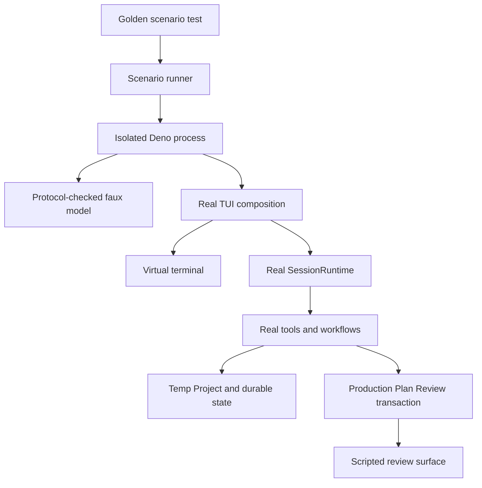
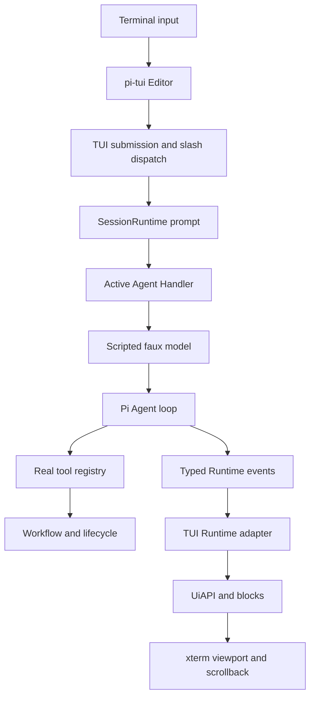

# Golden TUI Scenario Testing

## Context

RunWield has strong unit and adapter coverage for TUI blocks, keybindings, Runtime event projection, workflow lifecycle,
and Plan review, but no test currently launches the composed `pi-tui` application, sends terminal input, observes the
rendered screen, and follows a real multi-Agent workflow to its durable outcome. Regressions can therefore survive
across otherwise well-tested seams: startup ordering, focus restoration, cancellation, tool rendering, Plan Review
handoff, Session replacement, worktree delivery, and Epic completion.

The requested outcome is a Playwright-like terminal test capability built on hand-authored **Golden TUI Scenarios**. A
scenario must drive the real TUI and `SessionRuntime`, use a deterministic model to emit stored text, thinking, and tool
calls, execute the real tools and workflow transitions, and verify both user-visible terminal state and canonical
durable state. Raw Session Transcript JSONL is not a scenario format: it contains unstable runtime details and would
replay past state instead of exercising current behavior.

This Epic is deliberately narrower than the proposed End-to-End Benchmark Harness in
`docs/prd/end-to-end-benchmark-harness-prd.md`. Golden TUI Scenarios are deterministic regression tests for TUI and
workflow behavior. They do not introduce live-model evaluation, repetitions, scorecards, baseline comparison, external
benchmarks, or benchmark reporting. Their scenario/result seam should remain reusable by that future harness rather than
creating an incompatible second definition of fixture isolation, deterministic interactions, or semantic outcomes.

The Epic must decompose into exactly two dependent FEATURE Plans:

1. establish the reusable machinery and prove it with one Router-to-Guide inquiry plus focused Escape and slash-command
   examples;
2. consume that stable machinery to add the remaining role, FEATURE, PROJECT, block, terminal, and recovery coverage.

The second stage depends on the first. Slicer may refine scope inside those seams but must not collapse them into one
high-risk delivery or split them into unrelated infrastructure fragments without an explicit scope decision.

## Objective

Create a deep Golden TUI Scenario module whose small test-facing interface hides terminal emulation, process isolation,
model scripting, interaction decisions, Runtime observation, cleanup, normalization, and failure diagnostics. Tests
should describe user actions, expected Agent/workflow turns, deterministic model responses and tool calls, declared
interaction decisions, and semantic assertions; they should not coordinate TUI internals directly.

The architecture must preserve these invariants:

- Production CLI startup continues to use `ProcessTerminal`; tests supply a virtual implementation of `pi-tui`'s
  existing Terminal interface backed by `@xterm/headless`.
- User input enters through the terminal input callback and real `pi-tui` focus handling, not by calling Editor or
  command handlers directly.
- `SessionRuntime`, Agent Definitions, model resolution, Pi's Agent loop, protected-tool policy, real tool execution,
  workflow orchestration, Plan Lifecycle, worktrees, validation, Session replacement, and enabled post-verification
  handoffs remain authoritative.
- Pi's faux-provider capability supplies deterministic text, thinking, tool calls, and response factories, but a
  RunWield-owned scenario actor validates the expected Agent, workflow phase, available tools, interaction sequence, and
  remaining responses. Unexpected, ambiguous, missing, or unused scripted turns fail closed with useful diagnostics.
- Concurrent isolated Agents and post-verification handoffs dispatch scripted responses by declared Agent/phase
  identity, not a process-global FIFO whose order can race.
- Complete Golden TUI Scenarios run in one fresh Deno subprocess each. The child environment establishes temporary HOME,
  Project, Git, session, model, settings, worktree, and registry state before importing RunWield modules, and does not
  inherit real provider credentials. Focused block and terminal-adapter tests may remain in-process.
- Plan Review remains a real `submitPlanForReview` transaction. The fixture replaces only the browser review surface
  with a scripted surface/decision, so reviewed content plus `review_feedback` and `review_approved` events are
  persisted before `plan_written` routes execution or decomposition. Playwright remains responsible for browser UI
  behavior.
- Assertions lead with normalized screen text, Runtime events, workflow outcomes, filesystem/Git facts, and Plan
  metadata. Sparse screen snapshots may protect stable layouts but cannot be the sole workflow oracle.
- A disposable TUI session composition handle owns readiness, idle settlement, Runtime/TUI access needed by the harness,
  and idempotent cleanup of adapters, subscriptions, sessions, timers, intervals, prompts, theme listeners, managed
  sync, boot animation, UI animation, and terminal state. Production wrappers retain process-exit policy outside this
  handle.
- No Golden fixture or expected answer is copied into the temporary Project where an Agent's normal tools can discover
  it.
- The test-only xterm and faux-provider integrations remain centralized adapters. Their versions track the `pi-tui` and
  `pi-ai` versions RunWield pins, limiting upgrade fallout to the harness rather than every scenario.

The initial vertical scenario must prove the whole path rather than only render a component: a User Request reaches
Router, Router emits a real `triage_report` for `INQUIRY`, Runtime switches atomically to Guide, Guide may make a real
read-only tool call, and the answer appears through normal thinking/tool/assistant blocks without mutating the fixture
Project. Focused examples must also show that Escape cancels active work and returns to a usable Editor, and that a
representative non-destructive slash command such as `/help` traverses real input and command dispatch.

The portfolio stage must use the same public harness interface for:

- Guide/`INQUIRY`, Ideator/`IDEATION` with a real interview and requested PRD synthesis, Operator/`OPERATION`, and
  Engineer/`QUICK_FIX` with Mechanical Validation;
- a FEATURE journey with Plan Review feedback, Planner revision and resubmission, approval and execution, Reviewer
  rejection, Engineer repair, final approval, Workflow Validation, delivery, and terminal lifecycle state;
- a clean two-child PROJECT journey with Architect approval, real Slicer child materialization, explicit launch of the
  first child, both child FEATURE lifecycles, `session_replaced` continuation into the second child, and final Epic
  terminal state;
- suite-wide semantic coverage of user, thinking, assistant, tool, system/error, review result, validation handoff,
  select, text, spinner, keyboard-help, managed-sync, queued steering, and image presentation states, including tool
  failure and recovery;
- focused terminal behavior including Ctrl+C, slash commands and autocomplete, resize, prompts and focus restoration,
  queueing, and genuine Session replay/hydration.

The portfolio may distribute those states across realistic goldens and focused terminal tests. It must not force every
block into one artificial mega-scenario. Scenario metadata may declare coverage capabilities, but each capability must
be backed by a behavioral or screen assertion; a coverage meta-test should fail when a supported block/behavior has no
owning scenario.

## Vertical Slice Findings

The current architecture already contains most of the required seams, but they stop one level below a complete
interactive session:

- `src/ui/tui/tui-manager.js:createTuiManager` injects terminal and TUI constructors, proving that ProcessTerminal can
  vary. Current tests replace both sides with fakes and therefore do not exercise real `pi-tui` rendering or input.
- `@earendil-works/pi-tui` defines a small Terminal interface and uses `@xterm/headless` 5.5.0 in its own test
  environment. RunWield can use the same emulator pattern without introducing a PTY or native dependency.
- `src/ui/tui/chat-session.js:startInteractiveSession` is currently both process wrapper and composition root. It
  constructs owner coordination, `SessionRuntime`, the TUI singleton, Editor, containers, adapters, polling, focus, and
  submission behavior, then returns only `uiAPI`. It starts resources that have no shared disposer, and an initial
  request may still be active when the function returns. The reusable seam must separate session composition from
  process ownership without changing CLI behavior.
- `src/ui/tui/api.js:createUiApi` and `src/ui/tui/runtime-adapter.js:attachTuiRuntimeAdapter` already keep presentation
  downstream of typed Runtime events. Golden tests should observe this path, not import Runtime normalizers or directly
  manufacture blocks.
- `src/ui/tui/runtime-interaction-adapter.js:createTuiInteractionAdapter` already accepts Plan and code review
  dependencies, but `attachTuiRuntimeAdapter` currently constructs it without forwarding dependencies. Passing
  composition-owned interaction adapters through this seam preserves the shared Runtime contract.
- Current shutdown stops terminal painting but does not collectively dispose clipboard polling, managed-session sync,
  Runtime telemetry, the active Runtime adapter, theme listeners, boot blinking, busy animation, tool timers, prompts,
  and sessions. Reliable in-process composition requires one owner and an idempotent disposal contract.

The control and data path that the goldens must preserve is:

Pi 0.80.5 already exposes faux-provider response factories plus explicit text, thinking, tool-call, response-ID,
timestamp, and pending-response controls. The Golden actor should wrap this supported capability rather than implement
another LLM wire protocol. Agent-specific temporary model references and Runtime snapshots/events provide stable
identity; prompt-text parsing is not an acceptable source of Agent or phase truth. Tool calls still pass through Pi's
real schema validation and execution, and real `toolResult` messages continue to drive `triage_report`, `plan_written`,
`task_completed`, `review_complete`, and handoff behavior.

Subprocess isolation is an architectural requirement, not merely a test optimization. `src/constants.js` captures CWD
and HOME-derived state at import, while settings, TUI, provider registration, review surfaces, timers, and some test
helpers use process-global state. Setting the environment before module import in a fresh child is more reliable than
expanding the existing global lock across long multi-Agent scenarios. The parent runner must enforce deadlines,
terminate failed children, and retain a normalized last screen, Runtime/event summary, unmet expectation, remaining
scripted turns, and temp artifact location long enough for diagnosis.

Plan Review has two distinct responsibilities. The browser surface gathers a decision; `submitPlanForReview`
canonicalizes reviewed content and execution policy and records Plan Lifecycle events. Golden scenarios replace the
first responsibility only. Returning `{ approved: true }` directly from a fake Runtime interaction would bypass
production persistence and is not sufficient.

FEATURE and PROJECT goldens must verify durable outcomes, not only conversational completion:

- FEATURE execution creates and later publishes a real worktree/branch, stages verified Plan and Delivery Evidence,
  verifies merge ancestry, cleans registry/worktree state when policy requires, and runs enabled post-verification
  handoffs.
- PROJECT approval leads to decomposition, not Epic execution. Slicer materializes child FEATURE Plans under the parent;
  the scenario explicitly starts the first child. Successful first-child validation produces typed Epic continuation,
  Runtime creates a fresh Session, TUI rebinds on `session_replaced`, and final-child delivery advances the parent and
  generates the terminal Epic evidence/Work Record behavior that is enabled for the fixture.

The existing `makeRepo`, Plan Lifecycle, validation, Runtime-event, interaction-adapter, and TUI block harnesses provide
useful fixture primitives, but no existing helper owns this cross-cutting lifecycle. The Golden harness should absorb
that complexity behind one interface rather than require every scenario to combine those helpers independently.

## Files to Modify

- `src/ui/tui/chat-session.js` — separate disposable interactive-session composition from the process-owned startup
  wrapper, expose deterministic readiness/idle lifecycle, accept established adapters, and preserve current startup,
  replay, submission, handoff, and replacement behavior.
- `src/ui/tui/tui.js` and `src/ui/tui/tui-manager.js` — preserve the production singleton while allowing composition to
  use an explicit Terminal/TUI pair and ensuring partial initialization and repeated disposal cannot leave stale state.
- `src/ui/tui/api.js` — make UI-owned animation, prompt, and tool resources participate in explicit composition cleanup
  without exposing block internals as the Golden test interface.
- `src/ui/tui/runtime-adapter.js` and `src/ui/tui/runtime-interaction-adapter.js` — forward explicit interaction
  dependencies so scripted review surfaces can pass through the real Plan Review transaction while Runtime/TUI ownership
  remains intact.
- `src/ui/tui/boot-logo.js` and `src/ui/tui/managed-session-sync.js` — integrate existing long-lived resources with the
  composition disposer rather than relying on process exit.
- `src/ui/tui/testing/` — add test-only virtual-terminal, subprocess runner/child protocol, isolated project
  environment, protocol-checked model actor, scripted review surface, normalization, semantic assertion, timeout,
  cleanup, and failure artifact modules written in JavaScript with JSDoc.
- `src/ui/tui/golden-scenarios/` — add hand-authored scenario definitions, fixture projects, explicit interaction
  policies, coverage declarations, and their behavioral/durable assertions; keep expected material outside
  Agent-readable fixture roots.
- `deno.json` and `deno.lock` — add the xterm test dependency aligned with pinned `pi-tui`, expose focused/full Golden
  test tasks, and integrate the measured gate without changing runtime dependencies.
- `scripts/release-check.js` and `.github/workflows/release.yml` — only if measured runtime requires an extensive
  pre-release tier; keep the critical deterministic subset in the ordinary quality gate and make full-suite execution
  explicit rather than silently omitted.
- `docs/contributing.md` — document how to run, author, diagnose, and deliberately update Golden TUI Scenarios,
  including the distinction from Session replay, browser Playwright coverage, live-model benchmarks, and future PTY
  smoke tests.

Workflow, lifecycle, worktree, review, SessionRuntime, and Agent modules are systems under test, not intended alternate
implementations. If a Golden scenario exposes a real defect, repair it in the owning module without weakening scenario
expectations or adding a bypass path.

## Reuse Opportunities

- `src/ui/tui/tui-manager.js:createTuiManager` — existing constructor seam for real versus virtual terminal adapters.
- `src/ui/tui/api.js:createUiApi` and `src/ui/tui/blocks.js` — retain current presentation ownership and render
  contracts.
- `src/ui/tui/runtime-adapter.js:attachTuiRuntimeAdapter` — canonical Runtime-event-to-TUI projection and Session
  replacement behavior.
- `src/ui/tui/runtime-interaction-adapter.js:createTuiInteractionAdapter` — existing typed interaction mapping and
  review dependency seam.
- `src/ui/review/plan-review.js:submitPlanForReview` — production reviewed-content, execution-policy, feedback,
  approval, and lifecycle transaction; inject only its surface adapter.
- `src/shared/session/session-runtime.js:SessionRuntime` — authoritative Session lifecycle, events, interactions,
  cancellation settlement, and Epic continuation.
- `src/shared/session/session.js:buildAgentSession` and Pi's faux provider — normal Agent Definition/model/tool
  construction plus supported deterministic assistant and tool-call streams.
- `src/shared/session/session-runtime-events.js` — normalized semantic event contract; Golden output should consume it
  rather than reconstruct raw Pi events.
- `src/shared/worktree-test-helpers.js:makeRepo` — real temporary Git repository and identity setup.
- `src/shared/workflow/plan-lifecycle.js`, `validation.js`, and `epic-continuation.js` — canonical durable-state and
  continuation outcomes to assert, never parallel Golden-only state machines.
- `src/testing/process-global-lock.js` — continue protecting focused in-process tests; complete scenarios use stronger
  subprocess isolation.
- Existing `blocks.test.js`, `api.test.js`, `runtime-adapter.test.js`, `runtime-interaction-adapter.test.js`,
  `keybindings.test.js`, workflow tests, and review tests — reuse assertion vocabulary and fixtures while adding the
  missing composed vertical path.
- `docs/prd/end-to-end-benchmark-harness-prd.md` and `docs/prd/agent-behavior-evaluation-prd.md` — align fixture
  isolation, explicit interaction policy, semantic outcomes, failure classification, and future reuse without importing
  benchmark scope into this Epic.

## Verification Plan

- Automated foundation gate: run the new `deno task test:golden-tui` task and prove the Router-to-Guide inquiry,
  active-work Escape cancellation with restored Editor usability, and a real `/help`-style slash-command path through
  the virtual terminal.
- Automated actor contract: deliberately cover expected Agent/phase/tool matching, unavailable tool calls, unexpected or
  ambiguous model requests, missing and unused responses, unexpected interactions, timeouts, child crashes, and complete
  cleanup. Failures must report the last normalized screen, semantic activity, active Agent/workflow state, and
  remaining script without exposing secrets.
- Automated Plan Review contract: prove scripted feedback and approval decisions pass through `submitPlanForReview`,
  persist edited content and `review_feedback`/`review_approved`, display the review URL/waiting state, and only then
  permit readiness/execution or decomposition outcomes.
- Automated portfolio gate: run the Guide, Ideator, Operator, QUICK_FIX, FEATURE recovery, and two-child PROJECT
  scenarios through the same public harness; assert their terminal behavior plus final Plans, files, Git ancestry,
  worktree registry, Session replacement, validation, Work Record/evidence, and cleanup semantics.
- Automated coverage gate: maintain a required capability inventory for supported TUI blocks and terminal behaviors;
  fail when no scenario both declares and asserts a capability.
- Automated stability gate: run `for i in 1 2 3; do deno task test:golden-tui; done`, enforce per-scenario deadlines,
  and confirm no leaked child processes, worktrees, branches, registry entries, review surfaces, temporary settings, or
  HOME state after success, failure, cancellation, and timeout.
- Automated repository gate: run `deno task ci`. If measured full-suite time remains only a few seconds and repeated
  runs are stable, include all Golden scenarios in this gate. Otherwise keep critical happy paths in `deno task ci` and
  run the extensive recovery portfolio through an explicit task in `deno task release:check` and the release workflow.
  Record the measured decision in contributing documentation rather than relying on an undocumented omission.
- Manual diagnostic check: intentionally break one scripted expectation and verify the retained failure artifact
  explains what the scenario expected, what Agent/phase/tools were active, what appeared on screen, and what durable
  state existed.
- Manual review check: inspect sparse snapshot baselines, if any, at narrow and wide terminal sizes; updates must be
  explicit and reviewed instead of auto-blessed.
- No headed browser verification is required for these child FEATURE Plans. Browser Plan Review behavior remains covered
  by the existing Workspace/Playwright path; Goldens verify only the TUI handoff and production review transaction.

## Edge Cases & Considerations

- **Process-global contamination:** HOME/CWD are captured during imports and multiple subsystems use global registries
  or singletons. Complete scenarios must set a minimal environment before import in a dedicated subprocess; in-process
  global locking is insufficient for the multi-Agent portfolio.
- **Secret and network isolation:** child processes must not inherit provider API keys or user model/auth files. The
  scripted provider requires no network. Preserve only explicit executable paths and deterministic helper configuration
  needed by the fixture.
- **External helper dependencies:** Cymbal and Mnemosyne preflight/extension behavior must use an explicit deterministic
  test profile or validated CI stubs. Goldens must not accidentally consume a developer's real memory/index state, but
  they also must not bypass SessionRuntime, Agent Definitions, or tool policy.
- **Asynchronous output:** xterm writes and `pi-tui` rendering are scheduled. Driver expectations must poll
  semantic/screen conditions with deadlines and explicit flush/stability detection; fixed sleeps and spinner-frame
  snapshots will flake.
- **Nondeterministic values:** UUIDs, timestamps, ports, worktree suffixes, commit hashes, measured durations, terminal
  animation frames, and temp paths should be normalized only at the comparison/reporting edge. Durable assertions should
  check semantic relationships such as ancestry, status, and cleanup rather than hard-coded generated values.
- **Concurrent Agent calls:** Manual QA, Recorder, delegated work, or post-verification activity may overlap. Scenario
  dispatch must be keyed and reject ambiguity; a single FIFO response queue is not deterministic enough.
- **Review fidelity:** faking the complete Runtime interaction result would skip reviewed-content writes and lifecycle
  events. Script only the review surface decision behind production `submitPlanForReview`.
- **Tool fidelity and safety:** hand-authored calls execute real tools against the temporary Project. Scenario
  definitions must use bounded commands and path assertions, and the runner must prove writes cannot escape the isolated
  root.
- **PROJECT semantics:** decomposition does not automatically launch the first child. The Golden user flow must
  explicitly select/load it, then verify typed continuation into the second child and final parent advancement rather
  than treating the Epic itself as executable.
- **Session replacement:** the old Session closes after `session_replaced`, the interaction adapter transfers, the TUI
  clears and rebinds, and a fresh transcript owns the next child. Assertions must cover identity and visible transition
  without assuming one continuous model context.
- **Fixture discoverability:** expected responses, tool calls, labels, and assertions remain outside the Agent's
  temporary project root and normal read/search scope.
- **Version coupling:** `@xterm/headless` and Pi faux-provider interfaces are test-only but version-sensitive.
  Centralize them behind adapters and align upgrades with RunWield's pinned `@earendil-works/pi-*` release.
- **Failure artifacts:** retain enough temporary state to diagnose a failure, then clean it according to an explicit
  policy; successful runs must leave no artifacts or dirty the developer's checkout.
- **Snapshot brittleness:** text and semantic assertions are primary. Snapshot only stable layout decisions and avoid
  costs, timers, random IDs, full scrollback, and animation frames.
- **Deferred PTY scope:** virtual-terminal tests do not verify OS raw mode, signals, compiled packaging, or terminal
  restoration across a real PTY. A later thin PTY smoke layer remains explicitly out of scope for both child FEATURE
  Plans.
- **Sibling harness scope:** do not absorb live-model scoring, retries for sampling variance, external benchmark
  adapters, ACP parity, baselines, or reports from the future End-to-End Benchmark Harness. Preserve compatible
  scenario/result concepts so that future work can reuse Golden isolation and deterministic interaction modules where
  appropriate.
