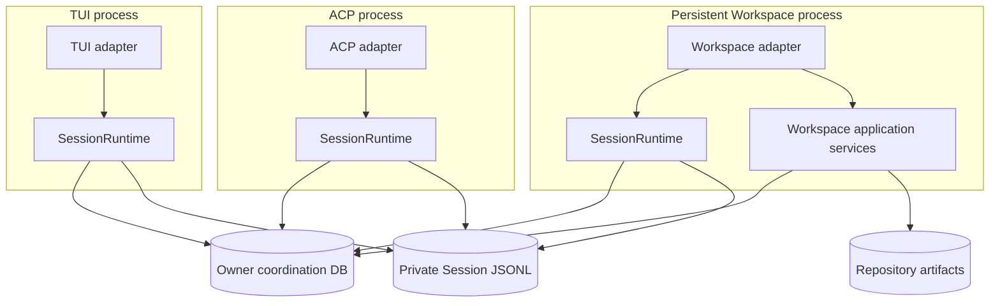
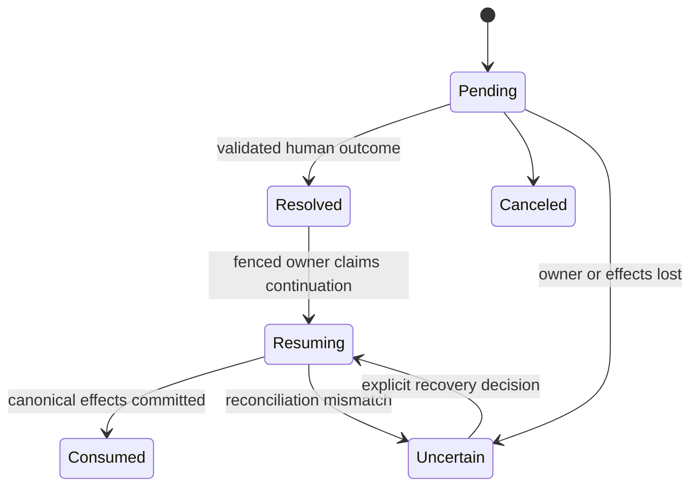

# Personal Remote Workspace v1

## Context

RunWield's current browser Workspace is a strong single-checkout Plan surface, but it is not yet the persistent browser
environment described by [`docs/prd/runwield-workspace-PRD.md`](../docs/prd/runwield-workspace-PRD.md). The owner cannot
register multiple trusted Projects, continue one durable Session across TUI, Workspace, and ACP, see attention across
Projects, or search eligible artifacts and source code from one remote interface.

The existing runtime provides useful foundations:

- `SessionHost` isolates several `HostedSession` instances in one process.
- `SessionRuntime` exposes adapter-neutral operations, semantic events, interactions, snapshots, replay, cancellation,
  and workflow actions.
- TUI and ACP are sibling consumers of that Runtime contract.
- Pi Session Manager JSONL files preserve Session history, active-Agent markers, and RunWield workflow context.
- Plan markdown, Plan Lifecycle, worktree registry metadata, and Work Records preserve recoverable workflow evidence.
- Workspace already provides Astro/React Plan and Epic surfaces, lifecycle-safe Plan actions, Plannotator review, Shared
  Plan collaboration, and RunWield Design System integration.
- Mnemosyne-backed Work Record retrieval and Cymbal code intelligence already use derived indexes over canonical local
  sources.

The missing architecture is cross-process coordination. Today each TUI or ACP process constructs an independent
`SessionRuntime`. Loading the same Pi Session twice produces separate in-memory leaves over one append-only JSONL file,
with no cross-process writer lock. Plan Lifecycle mutations likewise identify worktree state but not the Session
entitled to drive the Plan. Active interactions and many continuation decisions are represented by in-memory promises
and call stacks, so they cannot safely move between surfaces or survive process loss.

Product discovery rejected a central Runtime proxy as unnecessary for the intended experience. TUI, Workspace, and ACP
remain sibling Runtime consumers. Cross-surface continuity instead uses exclusive Session activation, durable workflow
checkpoints, automatic read synchronization, and a separate Session-owned Plan Workflow Lease, as accepted in
[`ADR-011`](../docs/adr/011-exclusive-session-activation-and-durable-workflow-checkpoints.md).

The first deployment serves one trusted developer on their own machine over Tailscale, WireGuard, or an equivalent
private network. Browser devices require owner-approved pairing in addition to network access. The Workspace process may
host several browser-owned Sessions and logical Project Runtimes in one process, but it is not the central authority
over TUI- or ACP-owned Runtime instances; the shared SQLite lease and checkpoint state is the cross-process authority.
Per-Project OS processes and SaaS containers are deferred behind explicit seams.

## Objective

Deliver Personal Remote Workspace v1 as the next RunWield product milestone before OpenAB/Telegram completion.

The resulting system must let the owner:

- register and safely operate across several local Projects;
- use the Attention Dashboard to find running, waiting, ready, failed, and recently completed work;
- start or continue one stable RunWield Session from TUI, Workspace, or ACP without concurrent transcript writers;
- review a TUI-created Plan from a phone, submit Feedback or approval, authorize immediate or later execution, and
  return to an automatically synchronized TUI;
- continue an idle ideation or planning conversation in Workspace and later continue it in an already-open TUI without
  manual Session reopening;
- preserve one Session's Plan workflow ownership while its active process changes;
- continue browser-owned work after browser disconnection through completion or the next durable human gate;
- recover conservatively from process, transcript, worktree, or coordination failures without replaying uncertain side
  effects;
- search eligible durable artifacts across Projects and perform explicitly scoped, human-only Cymbal code search;
- inspect or manually edit a Project's main checkout through a subordinate code-server Code Surface;
- preserve existing local QUICK_FIX, non-Git, Shared Plan, TUI, ACP, Plan Lifecycle, validation, and worktree behavior
  where it does not violate the new ownership invariants.

ADR-011 is the controlling architecture decision for cross-process Session activation, checkpoints, and automatic TUI
synchronization. ADR-008 continues to control Shared Space ciphertext and capability semantics, while ADR-010 continues
to control sibling adapter dependency direction.

## Vertical Slice Findings

### Runtime and identity

`src/ui/tui/chat-session.js` and `src/acp/server.js` each construct their own `SessionRuntime`. `SessionHost` is an
in-memory registry, while `HostedSession` owns active turns, interactions, Agent state, and execution workflow. Creating
or loading a Session currently generates a new Runtime UUID even though Pi exposes a separate persistent Session Manager
ID.

Personal Workspace therefore needs a stable RunWield Session ID above both identities. An owner-only SQLite database
under `~/.wld/` maps that ID to one registered Project and Pi transcript locator. It also owns Project registration,
device pairing, Session generations, activation leases, durable checkpoints, Session-to-Plan associations, Plan Workflow
Leases, attention projections, and owner-local process metadata. It must not become a second canonical store for Plans,
PRDs, ADRs, Work Records, source code, or transcript content.

The three adapter families remain siblings:

No adapter imports another adapter, and no broad Workspace application interface becomes a prerequisite for TUI or ACP.
Every writable Runtime hydration path must, however, use the shared coordination modules below `SessionRuntime`.

### Session activation and automatic synchronization

Pi `SessionManager.open()` reads the append-only tree and current leaf into memory. Two processes may otherwise append
from stale leaves or encounter a concurrent rewrite. A Session Activation Lease must therefore be acquired before any
writable manager is opened or used.

The lease is a fenced, durable claim for one stable Session. It is held during mutable turns, execution, validation,
compaction, cancellation settlement, pending live interactions, and checkpoint publication. It is released at a safe
idle checkpoint. Heartbeat age is evidence, not permission to replay or steal uncertain effects.

An idle TUI may stay open without owning activation. Every committed checkpoint advances the Session generation only
after transcript state is durable. When Workspace or ACP advances the generation, the TUI uses a non-mutating transcript
reader to project unseen entries through stable replay IDs, refreshes Agent/Plan/attention summaries, and preserves its
unsent editor draft. It creates a writable `SessionManager` only after winning the next activation transaction.

The two-store commit order must fail safely because JSONL and SQLite cannot participate in one transaction:

1. commit canonical transcript or repository effects;
2. publish the checkpoint and new generation in SQLite with the current fencing token;
3. reconcile a transcript-ahead/database-behind crash by inspecting stable entry and artifact revisions;
4. never publish database state that claims an effect is durable before its canonical source is written.

### Durable workflow checkpoints and interactions

The current interaction path emits semantic events but keeps request records and awaiting promises in `HostedSession`.
The current Plan workflows also continue through nested in-memory calls. These are valid within one process but cannot
support phone review, process handoff, or crash-safe continuation.

A durable checkpoint is a typed state transition, not a serialized function. It binds a Session, optional Plan, expected
Session/Plan/lease generations, pending decision, outcome, and known continuation policy. Resolution and consumption use
compare-and-set transitions so retries and stale owners cannot apply an outcome twice.

The durable checkpoint seam covers at least Plan review, Feedback, **Approve & Run**, **Approve for Later**, Plan
Recovery, human code review, and cross-surface structured interactions. If the original Runtime is alive, it consumes
the outcome and continues. If it is gone, a later owner validates the checkpoint and executes its typed continuation
policy. An arbitrary interrupted model request, command, tool, or filesystem effect is never transparently replayed;
generic Agent continuation restarts as an explicit turn or recovery path.

### Plan workflow ownership

`recordPlanEvent()` writes canonical Plan front matter and is called from CLI workflows, validation, and Workspace Plan
handlers. The worktree registry lock serializes registry file access but carries no Session identity. Lease enforcement
must therefore sit below all adapters and above consequential lifecycle/worktree effects, rather than only in Workspace
routes.

A Plan Workflow Lease is keyed by Project and durable Plan ID, owned by a stable RunWield Session ID, and fenced by a
lease generation. The process holding Session activation may change while the Plan owner remains the same Session. A
different Session is rejected until the workflow ends, is intentionally held or released, or passes explicit takeover or
Plan Recovery. Manual Plan actions may proceed only when compatible with the active lease and must not bypass the same
coordinator.

Canonical Plan and worktree writes remain outside SQLite. Checkpoints record expected Plan status/revision and worktree
evidence so reconciliation can distinguish a committed transition, a safe retry, and uncertain work requiring operator
judgment.

### Workspace application and trust seams

The existing `wld plans ui` path launches a one-checkout token-protected server. Personal Workspace expands this into a
persistent owner application while preserving the existing Astro/React and Plannotator foundations.

Workspace application services own:

- registered Project lifecycle and canonical-root authorization;
- paired browser devices, revocation, HTTP/WebSocket authorization, CSRF, and Origin policy;
- Project health and logical Project Runtime activation/dormancy;
- Attention Dashboard projections and notification destinations;
- Project and Workspace artifact search;
- explicitly scoped Cymbal fan-out and index health;
- code-server process health and safe main-checkout routing.

Device pairing uses short-lived, locally approved bootstrap material and revocable hashed device credentials. The owner
surface is private-network-first and requires TLS at the browser boundary; deployment may rely on a documented trusted
TLS terminator rather than making certificate issuance a RunWield responsibility. Direct plaintext non-loopback exposure
must not be the safe default.

The owner database and owner HTTP surface remain separate from Shared Space storage and public capability routes. Shared
Plan collaboration is one Workspace product subsystem, but the public ciphertext/capability service has a smaller trust
grant than the owner execution surface. The existing standalone Plan Server remains deployable, while future SaaS may
compose both subsystems behind one product with separate storage credentials and exposure policy.

### Search and knowledge

Project and Workspace Intelligence search must hydrate results from canonical eligible artifacts, following the current
Work Record pattern: an index selects candidates, but repository parsing and access policy determine what can be shown.
Registered Projects contribute durable artifacts by default unless opted out. Session Transcripts remain owner-private,
human-searchable, excluded from Workspace Intelligence, unavailable to cross-Session Agent retrieval, and unavailable to
collaborators.

Human cross-Project code search fans bounded Cymbal JSON queries across explicitly selected registered Project main
checkouts. Results carry Project identity and relative paths, degrade to visible partial results, and do not invent one
global call graph or comparable score where Cymbal exposes none. Plan worktrees are excluded from global search and stay
within Plan review. Existing Agent code tools remain current-Project scoped. Sourcebot remains optional and deferred.

### Code Surface

code-server is a subordinate process and trust seam, not the Workspace shell. It opens only a registered Project's main
checkout, has visible health and lifecycle, and cannot claim RunWield worktrees or Plan workflow ownership. Search deep
links target main-checkout content only when the result corresponds to that checkout. Manual edits retain their current
local ownership and may make a Plan stale or create merge conflicts that normal RunWield checks must surface.

### Migration and coexistence

The owner database requires explicit schema migration and backup semantics. Existing Projects and Pi Session JSONL files
must remain usable. Registration can catalog existing transcripts lazily and assign stable RunWield Session IDs without
rewriting transcript bodies. Existing Plan IDs and Work Record IDs remain canonical.

During rollout, all current Runtime construction paths—including TUI, ACP, initialization, Plan loading, and Workspace—
must converge on activation enforcement before cross-surface continuation is enabled. Running an older binary that does
not understand leases concurrently with the new version is unsupported and should be detected or warned where possible.

A missing or damaged owner database is reconstructed from explicitly re-registered Projects, transcript catalogs, Plan
files, and worktree evidence. Any workflow whose exclusive ownership cannot be proven enters recovery; reconstruction
never guesses that execution is safe to repeat.

The existing one-checkout Plan UI, Shared Plan links, and ACP session loading require compatibility transitions rather
than flag-day artifact migration. The Workspace, Core, and ACP PRDs must be aligned with ADR-011: continuity means
exclusive activation, durable checkpoints, and automatic synchronization—not simultaneous writable attachment to one
shared Runtime object.

## Files to Modify

- `docs/prd/runwield-workspace-PRD.md` — replace the central authoritative-live-Host assumption with exclusive Session
  activation, durable checkpoint handoff, and automatic idle-client synchronization while preserving the Personal
  Workspace product journey.
- `docs/prd/runwield-core-prd.md` — update the Core runtime roadmap from its partially stale future Session Host
  language to the implemented sibling Runtime foundation and the new cross-process coordination requirements.
- `docs/prd/runwield-acp-session-host-PRD.md` — make durable ACP load/continuation participate in activation and
  checkpoint ownership without making ACP a Workspace child.
- `docs/adr/011-exclusive-session-activation-and-durable-workflow-checkpoints.md` — source of truth for the accepted
  cross-process Session and continuation architecture; amend only if later review changes a hard-to-reverse decision.
- `src/shared/session/` — stable Session catalog integration, activation enforcement, read-only transcript projection,
  committed generations, interaction persistence, and Runtime checkpoint seams while preserving adapter-neutral events.
- `src/shared/workflow/` and `src/cmd/load-plan/` — durable workflow checkpoints, continuation dispatch, Plan Workflow
  Lease enforcement, and recovery reconciliation around existing Plan Lifecycle, execution, and validation.
- `src/plan-store.js` and `src/shared/worktree-registry.js` — expose canonical Plan/worktree revisions and evidence
  needed by fenced workflow coordination without moving artifact ownership into SQLite.
- `src/ui/tui/` — activation-aware prompting, automatic read synchronization, replay deduplication, ownership status,
  draft preservation, and existing semantic Runtime rendering.
- `src/acp/` and `src/cmd/acp/` — stable Session mapping, activation/checkpoint participation, and safe rejection or
  continuation when another surface owns mutation.
- `src/ui/workspace/server.js`, `src/ui/workspace/server/`, and `src/ui/workspace/routes/` — compose owner Workspace
  persistence, registration, device authorization, Session/checkpoint APIs, attention, search, and Code Surface
  supervision without merging the public Shared Space trust grant.
- `src/ui/workspace/pages/`, `src/ui/workspace/components/`, `src/ui/workspace/islands/`, and `src/ui/workspace/react/`
  — Attention Dashboard, Project and Session navigation, semantic Session timeline, unified Plan workflow,
  pairing/device management, search, and Code Surface experiences using the RunWield Design System.
- `src/shared/work-records/` and related artifact readers — generalize canonical hydration and access-policy patterns
  for Project Knowledge and Workspace Intelligence without broadening Agent retrieval.
- `src/extensions/cymbal/` or a new shared search coordinator beside it — bounded, explicitly scoped human federation
  over registered Project indexes while preserving current Agent tool behavior.
- `src/cmd/` and command registration — persistent Workspace lifecycle, Project registration, local pairing approval,
  compatibility entry points, and coordinated Session startup without prescribing a browser-only workflow.
- `deno.json`, packaging, and deployment documentation where required — Workspace launch, build, verification, private
  network/TLS guidance, code-server prerequisites, and owner database backup/recovery.

## Reuse Opportunities

Existing functions, modules, or patterns to reuse:

- `src/shared/session/session-runtime.js` — preserve the adapter-neutral Runtime operation and semantic event seam
  instead of creating a Workspace-specific Agent engine.
- `src/shared/session/session-runtime-events.js` — retain stable semantic message, thinking, tool, interaction,
  workflow, usage, and attention events for owning-surface rendering and committed replay.
- `src/shared/session/root-session.js` — retain Project-scoped transcript discovery and hydration, while adding a truly
  non-mutating read path for non-owning auto-reload.
- `src/shared/session/active-agent-session.js` and `workflow-context-session.js` — reuse persisted custom Session
  entries as rehydration evidence.
- `src/shared/workflow/plan-lifecycle.js` — keep the canonical state machine and put workflow authorization around its
  consequential use rather than duplicating status logic in Workspace.
- `src/shared/worktree-registry.js`, `src/shared/workflow/workflow.js`, and `validation.js` — preserve RunWield
  worktree, validation, merge, and recovery ownership while adding Session/lease evidence.
- `src/ui/workspace/server/remote-db.js` and `remote-schema.js` — reuse the repository's SQLite migration, WAL,
  transaction, and schema-versioning conventions for a separate owner database; do not reuse the Shared Space database
  itself.
- `src/shared/collaboration/` and `src/ui/workspace/server/remote-adapter.js` — retain encrypted Shared Space protocol
  and capability semantics as a trust-separated Workspace subsystem.
- `src/shared/work-records/search.js` and `index-adapter.js` — reuse candidate-index plus canonical-hydration behavior
  for broader artifact search.
- `src/extensions/cymbal/index.js` — reuse the installed Cymbal CLI and JSON contract rather than embedding a new code
  index or requiring Sourcebot.
- `src/ui/tui/runtime-adapter.js` and `src/ui/tui/system-notifications.js` — preserve semantic rendering and existing
  attention notification behavior while changing ownership and destination projection.
- `src/ui/workspace/server/plan-adapter.js`, existing Plan/Epic components, and Plannotator React surfaces — extend the
  proven canonical Plan and review UI rather than rebuilding lifecycle or review behavior.
- `src/ui/design-system/` and `docs/design-system.md` — required visual and interaction baseline for all new browser
  surfaces.

## Verification Plan

- Automated: run `deno task ci` after every executable slice and at Epic integration; all existing TUI, ACP, Workspace,
  Plan Lifecycle, worktree, validation, Shared Space, and Work Record suites must remain green.
- Automated: use multi-process integration tests to prove that only one process can hydrate or mutate a stable Session,
  fencing rejects stale owners, an idle owner can hand off safely, and unrelated Sessions/Projects remain concurrent.
- Automated: exercise crash points after transcript/artifact commit but before SQLite publication, after checkpoint
  resolution but before consumption, during activation heartbeat loss, and during Plan/worktree transitions. Expected
  outcomes are deterministic reconciliation or explicit recovery, never duplicated continuation.
- Automated: prove Plan Workflow Lease ownership persists when the same Session moves from TUI to Workspace, rejects a
  different Session, and cannot be bypassed through CLI, Workspace lifecycle handlers, ACP, validation, or recovery.
- Automated: prove duplicate browser interaction submissions, reconnect retries, stale fencing tokens, and process
  restart cannot consume one checkpoint twice.
- Automated: prove an idle TUI notices a browser/ACP Session generation change, reads without writable
  `SessionManager.open()`, replays only unseen entries, refreshes summaries, and preserves unsent editor content.
- Automated: verify owner database migrations, lazy legacy Session cataloging, Project move/disable/remove behavior,
  reconstruction, and newer-schema refusal.
- Automated: verify device pairing expiry, hashed credential storage, revocation of active browser connections, CSRF and
  Origin enforcement, registered-root containment, sanitized path output, and separate Shared Plan capabilities.
- Automated: verify artifact contribution opt-out, owner-only Transcript search exclusion from Agent retrieval, and
  canonical hydration of stale or missing index candidates.
- Automated: verify Cymbal fan-out queries only selected registered Projects, excludes sibling Plan worktree federation,
  caps concurrency and results, labels duplicates, sanitizes paths, and returns partial results when an index fails.
- Automated: verify code-server can only target a registered main checkout, failed/stopped processes are visible, and no
  route resolves a RunWield Plan worktree as the Code Surface.
- Manual headed browser verification is required for the later frontend child slices covering device pairing/revocation,
  Attention Dashboard, responsive Project/Session navigation, semantic Session timelines, durable interactions, unified
  Plan review/execution/recovery, artifact/code search, notifications, and Code Surface routing.
- Manual cross-surface journey: start planning in TUI, produce a Plan, review it from a paired phone-sized browser, send
  Feedback, approve with **Approve & Run**, observe continued execution, and return to the still-open TUI. The TUI must
  synchronize automatically, preserve any draft text, and show the implementation/review outcome without manual reload.
- Manual cross-surface journey: finish an Ideator turn in TUI, continue from Workspace, return to TUI, and continue
  again. Each turn has one writer, history remains linear and complete, and ownership transitions are visible but
  unobtrusive.
- Manual resilience journey: disconnect the phone during a pending interaction and during browser-owned execution. Work
  continues or waits durably, reconnection restores the correct checkpoint, and no outcome is submitted twice.
- Manual security journey: revoke the phone while connected, attempt access from an unpaired device, and verify Shared
  Plan capability links neither grant owner Workspace access nor inherit owner device authorization.

## Edge Cases & Considerations

- **Lease fencing versus side effects:** SQLite fencing protects coordination writes but cannot undo a command already
  issued. Activation takeover is never automatic during a live operation, and uncertain Plan effects route to recovery.
- **Transcript ahead of database:** canonical JSONL may contain a committed entry whose generation publication was lost.
  Reconciliation must use stable entry IDs and never rewrite or duplicate that entry merely to repair the projection.
- **Database ahead of canonical state:** publication ordering must prevent this state where possible; if detected, mark
  the checkpoint uncertain rather than presenting an outcome that is absent from canonical evidence.
- **Read-only really means non-mutating:** Pi `SessionManager.open()` may migrate or rewrite a file. Auto-reload readers
  need a separate parser/projection path and must not obtain writable managers speculatively.
- **Open idle clients:** TUI and browser may both remain open. They can synchronize committed state, but the first
  activation transaction wins the next mutation. Losing clients must refresh rather than queue an unseen competing turn.
- **Draft preservation:** automatic transcript refresh must not discard unsent TUI or browser drafts, pasted images, or
  local review annotations.
- **Pending interactions:** a live owner may wait for a Workspace response without transferring Runtime ownership. If
  the owner dies, typed checkpoint policy determines explicit continuation; arbitrary tool stacks are not recreated.
- **Approve & Run authorization:** execution authorization is scoped to one checkpoint, Session, Plan, and lease
  generation. It cannot become ambient authorization for another Session or a changed Plan revision.
- **Plan review and Shared Plan review:** owner Workspace review checkpoints and public Shared Space capabilities are
  distinct authorization paths even when they reuse Plannotator UI.
- **Manual Plan edits:** direct repository edits cannot be prevented by the owner database. Expected Plan
  revision/status checks must detect them before consuming a checkpoint or executing.
- **Legacy and older binaries:** an older process does not honor activation. Coexistence is unsafe; startup/version
  policy must make this limitation visible during rollout.
- **Project identity:** canonical real paths, symlinks, moved roots, duplicate registration, removable volumes, and
  non-Git Projects require deterministic health and repair behavior without deleting repository data.
- **SQLite contention and damage:** use bounded transactions, WAL, schema versioning, backups, and visible degraded
  mode. The owner database is coordination-critical but remains reconstructible from canonical sources where possible.
- **Resource pressure:** multiple browser-owned Sessions, Cymbal refreshes, validation commands, and code-server may
  compete for one laptop. Project Runtime dormancy, concurrency limits, cancellation, and health must avoid global
  starvation.
- **Private-network assumptions:** pairing is authorization, not encryption. Browser access still requires a secure TLS
  boundary; forwarded host, Origin, and cookie behavior must be documented and tested for supported proxies.
- **Device loss:** revocation must terminate or invalidate active connections and pending browser control without
  canceling an unrelated running workflow.
- **Browser disconnect:** disconnect never implies cancellation or checkpoint resolution. Durable attention remains
  until the owner acts or explicitly cancels.
- **ACP identity:** transport-facing ACP IDs map to stable RunWield Session IDs without exposing owner database details
  or allowing two ACP processes to load one Session concurrently.
- **Search privacy:** Workspace Intelligence opt-out and explicit code Project selection apply before subprocess launch,
  not only when filtering returned results.
- **Cymbal ranking:** independent Project result sets do not expose a comparable numeric score. Group by Project or
  apply transparent exact/prefix rules rather than implying one semantic global ranking.
- **Code Surface isolation:** code-server has terminal and filesystem power within its configured environment. Treat its
  authentication, proxying, process lifecycle, and root selection as a separate high-trust integration.
- **Shared Space evolution:** future SaaS presents Shared Plans as one product capability but retains separate public
  exposure, capability authorization, ciphertext data access, and blast radius from owner Project Runtimes.
- **SaaS exit seam:** the v1 logical Project Runtime must not rely on process globals that prevent later container
  isolation, but no remote Project Runtime protocol or per-Project worker should be invented before a second deployment
  implementation exists.
- **Frontend quality:** all new Workspace UX follows `docs/design-system.md`, existing Workspace patterns, semantic
  `--rw-*` tokens, Plannotator integration conventions, accessible focus/keyboard behavior, and responsive phone use.
