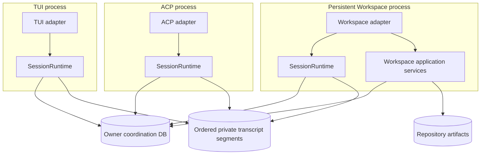
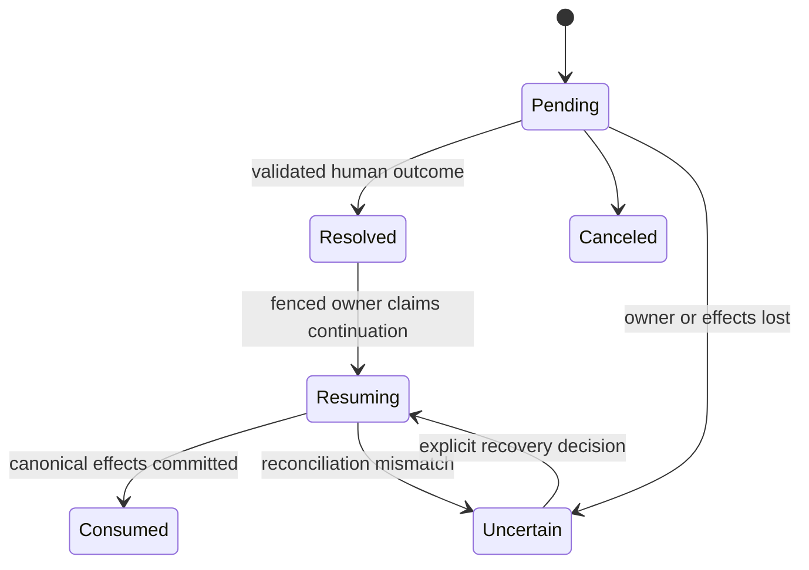
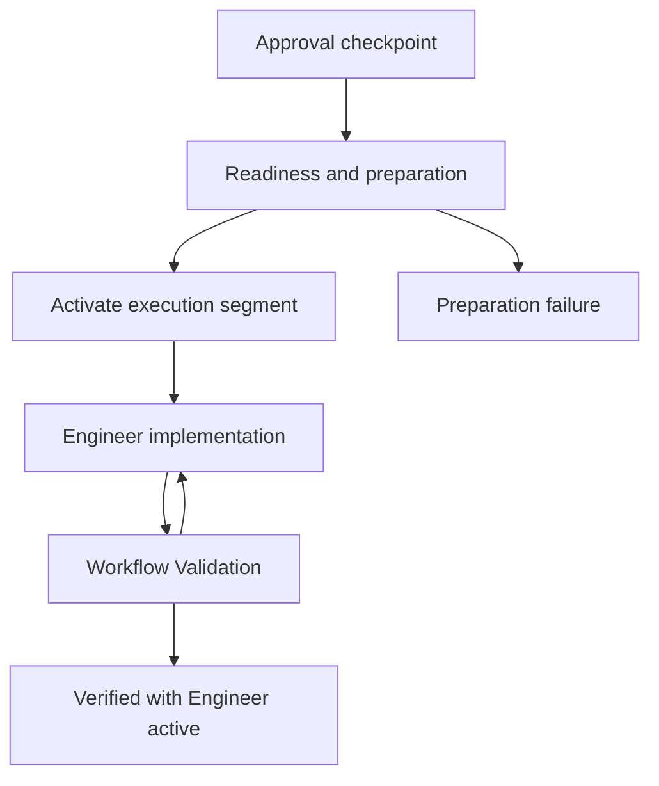

# Personal Remote Workspace v1

## Context

RunWield's current browser Workspace is a strong single-checkout Plan surface, but it is not yet the persistent browser
environment described by [`docs/prd/runwield-workspace-PRD.md`](../docs/prd/runwield-workspace-PRD.md). The owner cannot
register multiple trusted Projects, continue one durable Session across TUI, Workspace, and ACP, see attention across
Projects, or search eligible artifacts and source code from one remote interface.

The existing runtime provides useful foundations:

- `SessionHost` isolates several `HostedSession` instances in one process.
- `SessionRuntime` exposes adapter-neutral operations, semantic events, interactions, snapshots, replay, cancellation,
  and workflow actions.
- TUI and ACP are sibling consumers of that Runtime contract.
- Pi Session Manager JSONL files preserve model history, active-Agent markers, and RunWield workflow context, while
  ADR-012 establishes that one user-visible Session may aggregate multiple ordered transcript segments.
- Plan markdown, Plan Lifecycle, worktree registry metadata, and Work Records preserve recoverable workflow evidence.
- Workspace already provides Astro/React Plan and Epic surfaces, lifecycle-safe Plan actions, Plannotator review, Shared
  Plan collaboration, and RunWield Design System integration.
- Mnemosyne-backed Work Record retrieval and Cymbal code intelligence already use derived indexes over canonical local
  sources.

The missing architecture is cross-process coordination plus a durable separation between user-visible Session history
and active model context. Today each TUI or ACP process constructs an independent `SessionRuntime`. Loading the same Pi
Session twice produces separate in-memory leaves over one append-only JSONL file, with no cross-process writer lock. The
owner catalog, committed-generation evidence, managed Runtime metadata, Workspace timeline, and ACP loading also assume
one stable RunWield Session maps to exactly one Pi ID and transcript path. Reusing that same JSONL across planning and
execution exposes exploratory Planner history to the Engineer and consumes the context budget needed for implementation.
Plan Lifecycle mutations likewise identify worktree state but not the Session entitled to drive the Plan. Active
interactions and many continuation decisions are represented by in-memory promises and call stacks, so they cannot
safely move between surfaces or survive process loss.

Product discovery rejected a central Runtime proxy as unnecessary for the intended experience. TUI, Workspace, and ACP
remain sibling Runtime consumers. Cross-surface continuity instead uses exclusive Session activation, durable workflow
checkpoints, automatic read synchronization, and a separate Session-owned Plan Workflow Lease, as accepted in
[`ADR-011`](../docs/adr/011-exclusive-session-activation-and-durable-workflow-checkpoints.md). The planning-to-execution
handoff follows [`ADR-012`](../docs/adr/012-segment-session-transcripts-at-execution-handoff.md): one stable Session
owns ordered transcript segments that project as continuous scrollback, while only the current segment supplies model
context.

The first deployment serves one trusted developer on their own machine over Tailscale, WireGuard, or an equivalent
private network. Browser devices require owner-approved pairing in addition to network access. The Workspace process may
host several browser-owned Sessions and logical Project Runtimes in one process, but it is not the central authority
over TUI- or ACP-owned Runtime instances; the shared SQLite lease and checkpoint state is the cross-process authority.
Per-Project OS processes and SaaS containers are deferred behind explicit seams.

## Objective

Deliver Personal Remote Workspace v1 as the next RunWield product milestone before OpenAB/Telegram completion.

The resulting system must let the owner:

- register and safely operate across several local Projects;
- use the Attention Dashboard to find running, waiting, ready, failed, and recently completed work;
- start or continue one stable RunWield Session from TUI, Workspace, or ACP without concurrent transcript writers, even
  when that Session contains multiple ordered JSONL transcript segments;
- review a TUI-created Plan from a phone, submit Feedback or approval, authorize immediate or later execution, and
  return to an automatically synchronized TUI;
- continue an idle ideation or planning conversation in Workspace and later continue it in an already-open TUI without
  manual Session reopening;
- preserve one Session's Plan workflow ownership while its active process or current transcript segment changes;
- keep the Planner conversation visible to the owner while starting Engineer from a fresh execution segment containing
  only the approved Plan, approval annotations and images, and current execution state;
- continue browser-owned work after browser disconnection through completion or the next durable human gate;
- recover conservatively from process, transcript, worktree, or coordination failures without replaying uncertain side
  effects;
- search eligible durable artifacts across Projects and perform explicitly scoped, human-only Cymbal code search;
- inspect or manually edit a Project's main checkout through a subordinate code-server Code Surface;
- preserve existing local QUICK_FIX, non-Git, Shared Plan, TUI, ACP, Plan Lifecycle, validation, and worktree behavior
  where it does not violate the new ownership invariants.

ADR-011 is the controlling architecture decision for cross-process Session activation, checkpoints, and automatic TUI
synchronization. ADR-012 controls transcript segmentation and the planning-to-execution context boundary. ADR-008
continues to control Shared Space ciphertext and capability semantics, while ADR-010 continues to control sibling
adapter dependency direction.

## Vertical Slice Findings

### Runtime and identity

`src/ui/tui/chat-session.js` and `src/acp/server.js` each construct their own `SessionRuntime`. `SessionHost` is an
in-memory registry, while `HostedSession` owns active turns, interactions, Agent state, and execution workflow. Creating
or loading a Session currently generates a new Runtime UUID even though Pi exposes a separate persistent Session Manager
ID.

Personal Workspace therefore needs a stable RunWield Session ID above both identities. An owner-only SQLite database
under `~/.wld/` maps that ID to one registered Project and an ordered transcript-segment manifest. Every segment has its
own Pi ID and guarded path, exactly one segment is current and writable, and prior segments are sealed. The database
also owns Project registration, device pairing, Session generations, activation leases, durable checkpoints,
Session-to-Plan associations, Plan Workflow Leases, attention projections, and owner-local process metadata. It must not
become a second canonical store for Plans, PRDs, ADRs, Work Records, source code, or transcript content.

Each newly created segment carries minimal private RunWield lineage metadata sufficient to reconstruct its stable
Session, segment identity/kind, and predecessor ordering after owner-database loss. This metadata contains no copied
conversation or Planner summary. A legacy one-JSONL Session remains a valid initial segment; before it can gain a
successor, a fenced managed operation appends equivalent minimal lineage without rewriting historical messages. Database
loss before that upgrade may assign the lone legacy JSONL a replacement stable Session ID and must mark any unprovable
prior workflow association for recovery, but it cannot create an ambiguous multi-segment grouping.

The three adapter families remain siblings:

```mermaid
flowchart TB
    DB[(Owner coordination DB)]
    ART[(Repository artifacts)]
    TRANS[(Ordered private transcript segments)]

    subgraph TUIProcess["TUI process"]
        TUI[TUI adapter] --> TR[SessionRuntime]
    end

    subgraph WorkspaceProcess["Persistent Workspace process"]
        WEB[Workspace adapter] --> WR[SessionRuntime]
        WEB --> APP[Workspace application services]
    end

    subgraph ACPProcess["ACP process"]
        ACP[ACP adapter] --> AR[SessionRuntime]
    end

    TR --> DB
    WR --> DB
    AR --> DB
    TR --> TRANS
    WR --> TRANS
    AR --> TRANS
    APP --> DB
    APP --> ART
```

No adapter imports another adapter, and no broad Workspace application interface becomes a prerequisite for TUI or ACP.
Every writable Runtime hydration path must, however, use the shared coordination modules below `SessionRuntime` and
resolve the stable Session's fenced current segment rather than accepting a caller-supplied Pi path as authority.

### Session activation and automatic synchronization

Pi `SessionManager.open()` reads the append-only tree and current leaf into memory. Two processes may otherwise append
from stale leaves or encounter a concurrent rewrite. A Session Activation Lease must therefore be acquired before any
writable manager is opened or used.

The lease is a fenced, durable claim for one stable Session, not for an individual JSONL. It is held during mutable
turns, execution, validation, compaction, cancellation settlement, pending live interactions, segment rollover, and
checkpoint publication. A writable operation must prove both the expected Session generation and expected current
segment before it may hydrate or mutate a Pi manager. The lease is released at a safe idle checkpoint. Heartbeat age is
evidence, not permission to replay or steal uncertain effects. Separate segment-level leases are forbidden because they
would allow two surfaces to mutate different portions of one user-visible Session concurrently.

An idle TUI, Workspace client, or ACP client may observe the Session without owning activation. Each published
Session-wide generation identifies an immutable manifest revision, the current segment, complete evidence for every
included sealed segment, and the committed prefix of the current segment. Rollover publishes the predecessor's final
sealed evidence, new segment record/current pointer, resulting generation, and typed pending continuation in one fenced
SQLite transaction after the new JSONL and lineage are synchronized. Aggregate event and cursor identities are
namespaced by segment so identical Pi entry IDs in different files cannot collide. Readers validate the complete
aggregate evidence before emitting any part of a generation; a missing or mutated sealed segment fails closed rather
than rendering partial scrollback. Compaction, context reporting, and writable Pi hydration operate only on the current
segment.

When Workspace or ACP advances the generation, the TUI uses a non-mutating aggregate transcript reader to project unseen
entries, refreshes Agent/Plan/attention summaries, and preserves its unsent editor draft and attachments. Segment
rollover is not a `session_replaced` event: TUI, Workspace, and ACP keep the same stable Session identity and append the
new segment to the existing timeline. A writable `SessionManager` is created only after the surface wins activation and
is bound to the current segment recorded by that proof.

The two-store commit order must fail safely because JSONL files and SQLite cannot participate in one transaction:

1. commit and synchronize canonical transcript, lineage, or repository effects;
2. publish the segment manifest/current pointer, checkpoint, and new Session generation in SQLite with the current
   fencing token and expected prior segment;
3. reconcile a transcript-ahead/database-behind crash by inspecting segment lineage, stable entry IDs, and artifact
   revisions;
4. never publish database state that claims an effect or current-segment switch is durable before its canonical source
   is written.

Cross-surface authority is uniform:

| Surface action                                | Required authority                                                          | Durable effect                                                                                |
| --------------------------------------------- | --------------------------------------------------------------------------- | --------------------------------------------------------------------------------------------- |
| Observe or reconnect                          | Project authorization only                                                  | Read and validate the latest aggregate generation; never hydrate a writer                     |
| Submit a User Request or mutate Session state | Session Control plus fenced Session Activation                              | Append only to the proven current segment and publish a new Session generation                |
| Resolve a pending human checkpoint            | Session Control plus authenticated checkpoint CAS                           | Record the decision without opening a transcript writer or advancing Session generation       |
| Consume a resolved checkpoint                 | Fenced Session Activation plus expected checkpoint, generation, and segment | Commit canonical effects, then publish the resulting Session generation                       |
| Lose an activation or generation race         | No mutation authority                                                       | Refresh aggregate state, preserve local drafts/attachments, and require explicit resubmission |

A live owner waiting for a human answer may retain activation while Workspace supplies only the narrow checkpoint
resolution. Resolution advances checkpoint state, not Session transcript generation; the waiting owner observes the CAS
outcome and consumes it under its existing proof. If that owner is gone, a later owner must acquire Session Activation
before claiming the typed continuation. This keeps Session Control distinct from both Session Activation and Plan
Workflow Lease ownership.

### Durable workflow checkpoints and interactions

The current interaction path emits semantic events but keeps request records and awaiting promises in `HostedSession`.
The current Plan workflows also continue through nested in-memory calls. These are valid within one process but cannot
support phone review, process handoff, or crash-safe continuation.

A durable checkpoint is a typed state transition, not a serialized function. It binds a Session, optional Plan, expected
Session/Plan/lease generations, pending decision, outcome, and known continuation policy. Resolution and consumption use
compare-and-set transitions so retries and stale owners cannot apply an outcome twice.

```mermaid
stateDiagram-v2
    [*] --> Pending
    Pending --> Resolved: validated human outcome
    Pending --> Canceled
    Pending --> Uncertain: owner or effects lost
    Resolved --> Resuming: fenced owner claims continuation
    Resuming --> Consumed: canonical effects committed
    Resuming --> Uncertain: reconciliation mismatch
    Uncertain --> Resuming: explicit recovery decision
```

The durable checkpoint seam covers at least Plan review, Feedback, **Approve & Run**, **Approve for Later**, Plan
Recovery, human code review, and cross-surface structured interactions. Checkpoints bind the expected Session generation
and current segment identity in addition to Plan and lease evidence. If the original Runtime is alive, it consumes the
outcome and continues. If it is gone, a later owner validates the checkpoint and executes its typed continuation policy.
An arbitrary interrupted model request, command, tool, or filesystem effect is never transparently replayed; generic
Agent continuation restarts as an explicit turn or recovery path.

### Planning-to-execution context boundary

**Approve & Run** does not switch transcript context at the approval click. The owning Session first passes the
Readiness Gate and completes execution preparation, including worktree selection and any collaboration-style decision.
While still holding fenced Session activation and the same Plan Workflow Lease, RunWield then creates and synchronizes a
fresh execution JSONL with private segment lineage, atomically makes it current in the segment manifest, publishes the
new Session generation, and starts the Engineer's first turn. **Approve for Later** creates no execution segment.

```mermaid
graph TD
    A[Approval checkpoint]
    R[Readiness and preparation]
    X[Activate execution segment]
    E[Engineer implementation]
    V[Workflow Validation]
    C[Verified with Engineer active]
    F[Preparation failure]

    A --> R
    R --> X
    R --> F
    X --> E
    E --> V
    V --> E
    V --> C
```

The execution segment is seeded only with the approved Plan, approval annotations and images, current lifecycle and
worktree state, and execution ownership. It neither copies Planner messages nor generates a summary of how the Plan was
made. Approval images must resolve across the segment transition without granting Engineer access to the planning
segment's model history.

The execution segment remains current through implementation, isolated Reviewer passes, CI and semantic/human review
repairs, merge recovery, interruption, and successful Workflow Validation. Reviewer work uses disposable isolated Agent
Sessions and never replaces the root segment. Successful validation leaves Engineer as the active Agent; only a later
new User Request invokes Router for fresh Triage. A crash after segment activation but before Engineer's first turn
resumes the typed pending Engineer continuation exactly once, while a crash after uncertain model, tool, command, or
filesystem effects routes to recovery in the same execution segment.

### Plan workflow ownership

`recordPlanEvent()` writes canonical Plan front matter and is called from CLI workflows, validation, and Workspace Plan
handlers. The worktree registry lock serializes registry file access but carries no Session identity. Lease enforcement
must therefore sit below all adapters and above consequential lifecycle/worktree effects, rather than only in Workspace
routes.

A Plan Workflow Lease is keyed by Project and durable Plan ID, owned by a stable RunWield Session ID, and fenced by a
lease generation. The process holding Session activation and the Session's current transcript segment may change while
the Plan owner remains the same Session. Segment rollover neither transfers nor duplicates Plan ownership. A different
Session is rejected until the workflow ends, is intentionally held or released, or passes explicit takeover or Plan
Recovery. Manual Plan actions may proceed only when compatible with the active lease and must not bypass the same
coordinator.

Before the Plan Workflow Lease child area is finalized, its policy must map acquisition, retention, hold, release,
transfer, and recovery to canonical Plan Events and statuses. The safe default is retention by the same Session across
nonterminal states—including Approve for Later and on-hold—until a terminal outcome or explicit user-authorized
release/transfer. PROJECT parent and executable child Plans have distinct Plan IDs and therefore distinct leases;
automatic child continuation may acquire the next child lease for the same Session but cannot treat the parent lease as
ambient ownership of every child.

Canonical Plan and worktree writes remain outside SQLite. Checkpoints record expected Plan status/revision and worktree
evidence so reconciliation can distinguish a committed transition, a safe retry, and uncertain work requiring operator
judgment.

### Workspace application and trust seams

The existing `wld plans ui` path launches a one-checkout token-protected server. Personal Workspace expands this into a
persistent owner application while preserving the existing Astro/React and Plannotator foundations.

Workspace application services own:

- registered Project lifecycle and canonical-root authorization;
- paired browser devices, revocation, HTTP/WebSocket authorization, CSRF, and Origin policy;
- Project health and logical Project Runtime activation/dormancy;
- Attention Dashboard projections and notification destinations;
- Project and Workspace artifact search;
- explicitly scoped Cymbal fan-out and index health;
- code-server process health and safe main-checkout routing.

Device pairing uses short-lived, locally approved bootstrap material and revocable hashed device credentials. The owner
surface is private-network-first and requires TLS at the browser boundary; deployment may rely on a documented trusted
TLS terminator rather than making certificate issuance a RunWield responsibility. Direct plaintext non-loopback exposure
must not be the safe default.

The owner database and owner HTTP surface remain separate from Shared Space storage and public capability routes. Shared
Plan collaboration is one Workspace product subsystem, but the public ciphertext/capability service has a smaller trust
grant than the owner execution surface. The existing standalone Plan Server remains deployable, while future SaaS may
compose both subsystems behind one product with separate storage credentials and exposure policy.

### Search and knowledge

Project and Workspace Intelligence search must hydrate results from canonical eligible artifacts, following the current
Work Record pattern: an index selects candidates, but repository parsing and access policy determine what can be shown.
Registered Projects contribute durable artifacts by default unless opted out. Session Transcripts remain owner-private,
human-searchable, excluded from Workspace Intelligence, unavailable to cross-Session Agent retrieval, and unavailable to
collaborators.

Human cross-Project code search fans bounded Cymbal JSON queries across explicitly selected registered Project main
checkouts. Results carry Project identity and relative paths, degrade to visible partial results, and do not invent one
global call graph or comparable score where Cymbal exposes none. Plan worktrees are excluded from global search and stay
within Plan review. Existing Agent code tools remain current-Project scoped. Sourcebot remains optional and deferred.

### Code Surface

code-server is a subordinate process and trust seam, not the Workspace shell. It opens only a registered Project's main
checkout, has visible health and lifecycle, and cannot claim RunWield worktrees or Plan workflow ownership. Search deep
links target main-checkout content only when the result corresponds to that checkout. Manual edits retain their current
local ownership and may make a Plan stale or create merge conflicts that normal RunWield checks must surface.

### Migration and coexistence

The owner database requires explicit schema migration and backup semantics. Existing Projects and Pi Session JSONL files
must remain usable. Each existing one-locator Session migrates to a one-segment manifest at ordinal zero without
rewriting conversation bodies. Newly created segments embed minimal private lineage so later catalog reconstruction can
regroup and order them deterministically. Existing Plan IDs and Work Record IDs remain canonical.

During rollout, all current Runtime construction paths—including TUI, ACP, initialization, Plan loading, and Workspace—
must converge on activation enforcement and current-segment resolution before cross-surface continuation is enabled. The
activation protocol/schema gate must advance so every upgraded managed entry point refuses an obsolete one-locator
protocol before mutation. A genuinely older or direct Pi binary is unaware of owner coordination and cannot be fenced by
SQLite; concurrent use of such a writer remains operationally unsupported and must be prevented through rollout
guidance, process/version diagnostics where observable, and explicit recovery if conflicting evidence appears.

A missing or damaged owner database is reconstructed from explicitly re-registered Projects, transcript catalogs,
embedded segment lineage, Plan files, and worktree evidence. A newly created but unattached segment is an orphaned
reconciliation candidate, not a new user-visible Session. Any workflow whose segment order, current pointer, or
exclusive ownership cannot be proven enters recovery; reconstruction never guesses that execution is safe to repeat.

The existing one-checkout Plan UI, Shared Plan links, and ACP session loading require compatibility transitions rather
than flag-day artifact migration. The Workspace, Core, and ACP PRDs must be aligned with ADR-011 and ADR-012: continuity
means exclusive Session activation, durable checkpoints, ordered transcript-segment projection, and automatic
synchronization—not simultaneous writable attachment to one shared Runtime object or one ever-growing model context.

### Impact on existing Epic decomposition

Verified owner-catalog, activation, and read-projection foundations remain valid but their one-locator contracts are
superseded at the stable Session seam. The in-progress activation-hardening slice is the immediate integration risk: its
operation capability, evidence checks, and hydration must bind the expected current segment and must not finalize an
"entire guarded transcript" abstraction that assumes one file forever. Existing work should be preserved rather than
reimplemented.

Remaining durable-checkpoint, Plan Workflow Lease, Session timeline, and Workspace Approve & Run areas must consume the
segment-aware Session contract. Later decomposition should introduce or revise a foundational executable FEATURE for the
segment catalog, aggregate projection, migration, and transactional rollover before browser approval depends on it.
Frontend child Plans that expose aggregate Session timelines or Approve & Run require Frontend Engineer ownership and
headed browser verification; core persistence, fencing, projection, and ACP behavior remain Engineer-owned concerns.

## Files to Modify

- `docs/prd/runwield-workspace-PRD.md` — replace the central authoritative-live-Host assumption with exclusive Session
  activation, durable checkpoint handoff, and automatic idle-client synchronization while preserving the Personal
  Workspace product journey.
- `docs/prd/runwield-core-prd.md` — update the Core runtime roadmap from its partially stale future Session Host and
  one-transcript-locator language to the implemented sibling Runtime foundation, segment aggregate, and cross-process
  coordination requirements.
- `docs/prd/runwield-acp-session-host-PRD.md` — make durable ACP load/continuation participate in activation and
  checkpoint ownership without making ACP a Workspace child.
- `docs/adr/011-exclusive-session-activation-and-durable-workflow-checkpoints.md` — source of truth for the accepted
  cross-process Session and continuation architecture, as narrowed by ADR-012's one-to-many transcript mapping.
- `docs/adr/012-segment-session-transcripts-at-execution-handoff.md` — source of truth for ordered Session Transcript
  Segments, clean Engineer context, rollover timing, and execution-segment ownership through validation.
- `src/shared/owner-coordination/` — migrate the singular locator catalog to an ordered segment manifest, bind committed
  generation evidence and activation proofs to the current segment, preserve Session-scoped leases, and reconstruct from
  private lineage without ingesting transcript content.
- `src/shared/session/` — segment-aware managed metadata and hydration, lineage creation, aggregate non-mutating
  projection, namespaced cursors/events, current-segment context/compaction, cross-segment images, committed
  generations, interaction persistence, and Runtime checkpoint seams while preserving adapter-neutral events.
- `src/shared/workflow/` and `src/cmd/load-plan/` — durable workflow checkpoints, readiness/preparation-gated segment
  rollover, Engineer-first-turn continuation, Plan Workflow Lease enforcement, validation ownership, and recovery
  reconciliation around existing Plan Lifecycle, execution, and validation.
- `src/plan-store.js` and `src/shared/worktree-registry.js` — expose canonical Plan/worktree revisions and evidence
  needed by fenced workflow coordination without moving artifact ownership into SQLite.
- `src/ui/tui/` — activation-aware prompting, continuous aggregate scrollback, automatic read synchronization across
  rollover, replay deduplication, ownership status, draft/attachment preservation, and existing semantic Runtime
  rendering without clearing the TUI or replacing the Session.
- `src/acp/` and `src/cmd/acp/` — stable RunWield Session mapping independent of Pi segment IDs, aggregate load/replay,
  activation/checkpoint participation, and safe rejection or continuation when another surface owns mutation.
- `src/ui/workspace/server.js`, `src/ui/workspace/server/`, and `src/ui/workspace/routes/` — compose owner Workspace
  persistence, registration, device authorization, Session/checkpoint APIs, attention, search, and Code Surface
  supervision without merging the public Shared Space trust grant.
- `src/ui/workspace/pages/`, `src/ui/workspace/components/`, `src/ui/workspace/islands/`, and `src/ui/workspace/react/`
  — Attention Dashboard, Project and Session navigation, segment-aggregated semantic Session timeline, unified Plan
  workflow, pairing/device management, search, and Code Surface experiences using the RunWield Design System.
- `src/shared/work-records/` and related artifact readers — generalize canonical hydration and access-policy patterns
  for Project Knowledge and Workspace Intelligence without broadening Agent retrieval.
- `src/extensions/cymbal/` or a new shared search coordinator beside it — bounded, explicitly scoped human federation
  over registered Project indexes while preserving current Agent tool behavior.
- `src/cmd/` and command registration — persistent Workspace lifecycle, Project registration, local pairing approval,
  compatibility entry points, and coordinated Session startup without prescribing a browser-only workflow.
- `deno.json`, packaging, and deployment documentation where required — Workspace launch, build, verification, private
  network/TLS guidance, code-server prerequisites, and owner database backup/recovery.

## Reuse Opportunities

Existing functions, modules, or patterns to reuse:

- `src/shared/session/session-runtime.js` — preserve the adapter-neutral Runtime operation and semantic event seam
  instead of creating a Workspace-specific Agent engine.
- `src/shared/session/session-runtime-events.js` — retain stable semantic message, thinking, tool, interaction,
  workflow, usage, and attention events for owning-surface rendering and committed replay.
- `src/shared/session/root-session.js` and `session-transcript-projection.js` — retain Project-scoped locator
  validation, exact-prefix evidence, non-mutating projection, and stable cursor behavior while lifting them from one
  JSONL to a branch-aware ordered segment aggregate.
- `src/shared/owner-coordination/session-activations.js` — preserve Session-scoped fenced activation and monotonic
  generations while adding expected-current-segment checks instead of creating segment-level locks.
- `src/shared/session/active-agent-session.js` and `workflow-context-session.js` — reuse persisted custom Session
  entries as current-segment rehydration evidence and as the pattern for minimal private segment-lineage entries.
- `src/shared/workflow/plan-lifecycle.js` — keep the canonical state machine and put workflow authorization around its
  consequential use rather than duplicating status logic in Workspace.
- `src/shared/worktree-registry.js`, `src/shared/workflow/workflow.js`, and `validation.js` — preserve RunWield
  worktree, validation, merge, and recovery ownership while adding Session/lease/current-segment evidence and retaining
  Engineer ownership after successful validation.
- `src/ui/workspace/server/remote-db.js` and `remote-schema.js` — reuse the repository's SQLite migration, WAL,
  transaction, and schema-versioning conventions for a separate owner database; do not reuse the Shared Space database
  itself.
- `src/shared/collaboration/` and `src/ui/workspace/server/remote-adapter.js` — retain encrypted Shared Space protocol
  and capability semantics as a trust-separated Workspace subsystem.
- `src/shared/work-records/search.js` and `index-adapter.js` — reuse candidate-index plus canonical-hydration behavior
  for broader artifact search.
- `src/extensions/cymbal/index.js` — reuse the installed Cymbal CLI and JSON contract rather than embedding a new code
  index or requiring Sourcebot.
- `src/ui/tui/runtime-adapter.js` and `src/ui/tui/system-notifications.js` — preserve semantic rendering and existing
  attention notification behavior while changing ownership and destination projection.
- `src/ui/workspace/server/plan-adapter.js`, existing Plan/Epic components, and Plannotator React surfaces — extend the
  proven canonical Plan and review UI rather than rebuilding lifecycle or review behavior.
- `src/ui/design-system/` and `docs/design-system.md` — required visual and interaction baseline for all new browser
  surfaces.

## Verification Plan

- Automated: run `deno task ci` after every executable slice and at Epic integration; all existing TUI, ACP, Workspace,
  Plan Lifecycle, worktree, validation, Shared Space, and Work Record suites must remain green.
- Automated: use multi-process integration tests to prove that only one process can hydrate or mutate a stable Session,
  fencing rejects stale owners and wrong-current-segment proofs, an idle owner can hand off safely, and unrelated
  Sessions/Projects remain concurrent.
- Automated: migrate legacy one-locator catalog rows to ordinal-zero segments, reconstruct linked segments from embedded
  private lineage after owner-database loss, reject ambiguous or cyclic lineage, and prevent lazy cataloging from
  exposing an orphaned execution JSONL as a separate user-visible Session.
- Automated: project sealed planning plus current execution segments as one ordered transcript with segment-namespaced
  event IDs and cursor continuity across rollover; duplicate Pi entry IDs, missing/mutated sealed segments, branch
  ambiguity, and partial evidence must fail before any events are emitted.
- Automated: prove context estimation, compaction, writable hydration, model/thinking changes, and Engineer prompts use
  only the current execution segment even while transcript search/export and owner-visible timelines include all
  segments.
- Automated: exercise crash points after transcript/artifact commit but before SQLite publication, after checkpoint
  resolution but before consumption, during activation heartbeat loss, and during Plan/worktree transitions. Expected
  outcomes are deterministic reconciliation or explicit recovery, never duplicated continuation.
- Automated: prove Plan Workflow Lease ownership persists when the same Session moves from TUI to Workspace, rejects a
  different Session, and cannot be bypassed through CLI, Workspace lifecycle handlers, ACP, validation, or recovery.
- Automated: prove duplicate browser interaction submissions, reconnect retries, stale fencing tokens, and process
  restart cannot consume one checkpoint or activate one execution segment twice.
- Automated: exercise Approve & Run crash points before readiness, after the execution JSONL is created, after lineage
  is synchronized, after the manifest pointer changes, before Engineer's first turn, during validation repair, and after
  successful validation. Expected outcomes are no segment, removable/recoverable orphan, exact-once Engineer
  continuation, or same-segment recovery—never Planner-context leakage or duplicate execution.
- Automated: prove **Approve for Later** creates no execution segment, approval annotations/images cross the handoff,
  isolated Reviewer work never changes the current root segment, validation repairs resume Engineer, and successful
  validation persists Engineer rather than switching back to Planner.
- Automated: prove an idle TUI notices a browser/ACP Session generation or segment change, reads the aggregate without
  writable `SessionManager.open()`, replays only unseen namespaced events, refreshes summaries, and preserves unsent
  editor content and attachments without a `session_replaced` transition.
- Automated: prove Workspace and ACP keep stable RunWield Session identities across segment rollover; neither transport
  exposes separate segment Sessions, derives identity from the current Pi ID, nor bypasses Session activation by loading
  a segment path directly.
- Automated: verify owner database migrations, lazy legacy Session cataloging, Project move/disable/remove behavior,
  reconstruction, and newer-schema refusal.
- Automated: verify device pairing expiry, hashed credential storage, revocation of active browser connections, CSRF and
  Origin enforcement, registered-root containment, sanitized path output, and separate Shared Plan capabilities.
- Automated: verify artifact contribution opt-out, owner-only Transcript search exclusion from Agent retrieval, and
  canonical hydration of stale or missing index candidates.
- Automated: verify Cymbal fan-out queries only selected registered Projects, excludes sibling Plan worktree federation,
  caps concurrency and results, labels duplicates, sanitizes paths, and returns partial results when an index fails.
- Automated: verify code-server can only target a registered main checkout, failed/stopped processes are visible, and no
  route resolves a RunWield Plan worktree as the Code Surface.
- Manual headed browser verification is required for the later frontend child slices covering device pairing/revocation,
  Attention Dashboard, responsive Project/Session navigation, semantic Session timelines, durable interactions, unified
  Plan review/execution/recovery, artifact/code search, notifications, and Code Surface routing.
- Manual cross-surface journey: start planning in TUI, produce a Plan, review it from a paired phone-sized browser, send
  Feedback, approve with **Approve & Run**, observe continued execution, and return to the still-open TUI. The TUI must
  retain all planning scrollback, append the Engineer execution timeline without clearing or replacing the Session,
  preserve any draft text/attachments, and show implementation/validation outcomes without manual reload; context
  diagnostics must show that Engineer's active model history begins at the execution segment.
- Manual cross-surface journey: finish an Ideator turn in TUI, continue from Workspace, return to TUI, and continue
  again. Each turn has one writer, history remains linear and complete, and ownership transitions are visible but
  unobtrusive.
- Manual resilience journey: disconnect the phone during a pending interaction and during browser-owned execution. Work
  continues or waits durably, reconnection restores the correct checkpoint, and no outcome is submitted twice.
- Manual security journey: revoke the phone while connected, attempt access from an unpaired device, and verify Shared
  Plan capability links neither grant owner Workspace access nor inherit owner device authorization.

## Edge Cases & Considerations

- **Lease fencing versus side effects:** SQLite fencing protects coordination writes but cannot undo a command already
  issued. Activation takeover is never automatic during a live operation, and uncertain Plan effects route to recovery.
- **Transcript ahead of database:** a current JSONL may contain a committed entry, or a new segment may exist with valid
  lineage, whose generation/manifest publication was lost. Reconciliation uses segment lineage and stable entry
  evidence; it never duplicates the entry, guesses that the segment is current, or catalogs the orphan as another
  Session.
- **Database ahead of canonical state:** publication ordering must prevent a manifest/current pointer or generation from
  naming an unsynchronized segment. If detected, block aggregate projection and mutation and mark the checkpoint
  uncertain rather than presenting an outcome absent from canonical evidence.
- **Sealed-segment integrity:** sealed planning segments are immutable evidence. Missing, truncated, rewritten, moved
  outside an authorized Project history, or branch-ambiguous segments block complete replay and require explicit
  recovery; the system must not silently hide history or inject a best-effort subset into Engineer context.
- **Segment identity collisions:** Pi entry IDs are only file-local. Runtime event IDs, cursors, image references, and
  deduplication keys include stable segment identity while consumer-facing navigation continues to expose one Session.
- **Read-only really means non-mutating:** Pi `SessionManager.open()` may migrate or rewrite a file. Auto-reload readers
  need a separate parser/projection path and must not obtain writable managers speculatively.
- **Open idle clients:** TUI and browser may both remain open. They can synchronize committed state, but the first
  activation transaction wins the next mutation. Losing clients must refresh rather than queue an unseen competing turn.
- **Draft preservation:** automatic transcript refresh must not discard unsent TUI or browser drafts, pasted images, or
  local review annotations.
- **Pending interactions:** a live owner may wait for a Workspace response without transferring Runtime ownership. If
  the owner dies, typed checkpoint policy determines explicit continuation; arbitrary tool stacks are not recreated.
- **Approve & Run authorization:** execution authorization is scoped to one checkpoint, Session, Plan, Plan revision,
  Plan Workflow Lease generation, Session generation, and expected planning segment. It cannot become ambient
  authorization for another Session or changed Plan, and segment rollover occurs only after readiness/preparation
  succeeds.
- **Rollover interruption:** failure before the manifest switch leaves planning current; failure after a fenced switch
  but before Engineer starts leaves an exact-once typed continuation. Any uncertain model/tool/filesystem effect retains
  the execution segment and routes to recovery rather than recreating it.
- **Approve for Later:** approval without immediate execution does not create or preallocate an execution JSONL. A later
  explicit Run action performs readiness/preparation and activates its own fresh execution segment.
- **Plan review and Shared Plan review:** owner Workspace review checkpoints and public Shared Space capabilities are
  distinct authorization paths even when they reuse Plannotator UI.
- **Manual Plan edits:** direct repository edits cannot be prevented by the owner database. Expected Plan
  revision/status checks must detect them before consuming a checkpoint or executing.
- **Legacy and older binaries:** an older or direct Pi process does not honor activation or segment manifests and cannot
  be fenced retroactively by SQLite. Upgraded TUI, Workspace, ACP, and command paths refuse obsolete protocol state, but
  mixed-version/direct-writer coexistence remains unsupported; detected conflicting evidence blocks mutation and routes
  to recovery rather than claiming the lease prevented it.
- **Project identity:** canonical real paths, symlinks, moved roots, duplicate registration, removable volumes, and
  non-Git Projects require deterministic health and repair behavior without deleting repository data.
- **SQLite contention and damage:** use bounded transactions, WAL, schema versioning, backups, and visible degraded
  mode. The owner database is coordination-critical but remains reconstructible from canonical sources where possible.
- **Resource pressure:** multiple browser-owned Sessions, Cymbal refreshes, validation commands, and code-server may
  compete for one laptop. Project Runtime dormancy, concurrency limits, cancellation, and health must avoid global
  starvation.
- **Private-network assumptions:** pairing is authorization, not encryption. Browser access still requires a secure TLS
  boundary; forwarded host, Origin, and cookie behavior must be documented and tested for supported proxies.
- **Device loss:** revocation must terminate or invalidate active connections and pending browser control without
  canceling an unrelated running workflow.
- **Browser disconnect:** disconnect never implies cancellation or checkpoint resolution. Durable attention remains
  until the owner acts or explicitly cancels.
- **ACP identity:** transport-facing ACP IDs map to stable RunWield Session IDs, never current Pi segment IDs, without
  exposing owner database details or allowing two ACP processes to load different segments of one Session concurrently.
- **Search privacy:** Workspace Intelligence opt-out and explicit code Project selection apply before subprocess launch,
  not only when filtering returned results.
- **Cymbal ranking:** independent Project result sets do not expose a comparable numeric score. Group by Project or
  apply transparent exact/prefix rules rather than implying one semantic global ranking.
- **Code Surface isolation:** code-server has terminal and filesystem power within its configured environment. Treat its
  authentication, proxying, process lifecycle, and root selection as a separate high-trust integration.
- **Shared Space evolution:** future SaaS presents Shared Plans as one product capability but retains separate public
  exposure, capability authorization, ciphertext data access, and blast radius from owner Project Runtimes.
- **SaaS exit seam:** the v1 logical Project Runtime must not rely on process globals that prevent later container
  isolation, but no remote Project Runtime protocol or per-Project worker should be invented before a second deployment
  implementation exists.
- **Frontend quality:** all new Workspace UX follows `docs/design-system.md`, existing Workspace patterns, semantic
  `--rw-*` tokens, Plannotator integration conventions, accessible focus/keyboard behavior, and responsive phone use.
